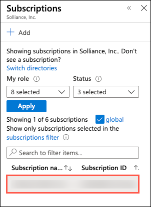
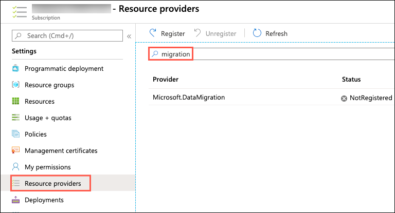
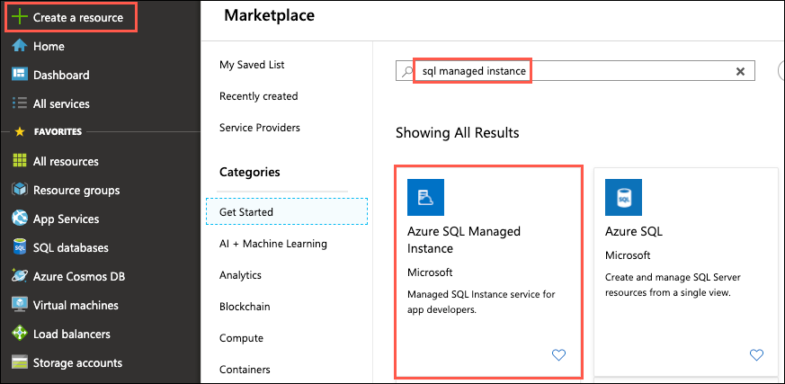

Migrating SQL databases to Azure

Before the hands-on lab setup guide

June 2020

Information in this document, including URL and other Internet Web site references, is subject to change without notice. Unless otherwise noted, the example companies, organizations, products, domain names, e-mail addresses, logos, people, places, and events depicted herein are fictitious, and no association with any real company, organization, product, domain name, e-mail address, logo, person, place or event is intended or should be inferred. Complying with all applicable copyright laws is the responsibility of the user. Without limiting the rights under copyright, no part of this document may be reproduced, stored in or introduced into a retrieval system, or transmitted in any form or by any means (electronic, mechanical, photocopying, recording, or otherwise), or for any purpose, without the express written permission of Microsoft Corporation.

Microsoft may have patents, patent applications, trademarks, copyrights, or other intellectual property rights covering subject matter in this document. Except as expressly provided in any written license agreement from Microsoft, the furnishing of this document does not give you any license to these patents, trademarks, copyrights, or other intellectual property.

The names of manufacturers, products, or URLs are provided for informational purposes only and Microsoft makes no representations and warranties, either expressed, implied, or statutory, regarding these manufacturers or the use of the products with any Microsoft technologies. The inclusion of a manufacturer or product does not imply endorsement of Microsoft of the manufacturer or product. Links may be provided to third party sites. Such sites are not under the control of Microsoft and Microsoft is not responsible for the contents of any linked site or any link contained in a linked site, or any changes or updates to such sites. Microsoft is not responsible for webcasting or any other form of transmission received from any linked site. Microsoft is providing these links to you only as a convenience, and the inclusion of any link does not imply endorsement of Microsoft of the site or the products contained therein.

© 2020 Microsoft Corporation. All rights reserved.

Microsoft and the trademarks listed at <https://www.microsoft.com/en-us/legal/intellectualproperty/Trademarks/Usage/General.aspx> are trademarks of the Microsoft group of companies. All other trademarks are property of their respective owners.

**Contents**

<!-- TOC -->

- [Migrating SQL databases to Azure before the hands-on lab setup guide](#migrating-sql-databases-to-azure-before-the-hands-on-lab-setup-guide)
  - [Requirements](#requirements)
  - [Before the hands-on lab](#before-the-hands-on-lab)
    - [Task 1: Create a resource group](#task-1-create-a-resource-group)
    - [Task 2: Register the Microsoft DataMigration resource provider](#task-2-register-the-microsoft-datamigration-resource-provider)
    - [Task 3: Run ARM template to provision lab resources](#task-3-run-arm-template-to-provision-lab-resources)

<!-- /TOC -->

# Migrating SQL databases to Azure before the hands-on lab setup guide

## Requirements

- Microsoft Azure subscription must be pay-as-you-go or MSDN.
  - Trial subscriptions will _not_ work.

> **Important**: You must have sufficient rights within your Azure AD tenant to create an Azure Active Directory application and service principal and assign roles on your subscription to complete this hands-on lab.

## Before the hands-on lab

Duration: 15 minutes

In this exercise, you set up your environment for use in the rest of the hands-on lab. You should follow all steps provided _before_ attending the Hands-on lab.

> **Important**: Many Azure resources require globally unique names. Throughout these steps, the word "SUFFIX" appears as part of resource names. You should replace this with your Microsoft alias, initials, or another value to ensure resources are uniquely named.

### Task 1: Create a resource group

1. In the [Azure portal](https://portal.azure.com), select **Resource groups** from the Azure services list.

   

2. On the Resource groups blade, select **+Add**.

   

3. On the Create a resource group **Basics** tab, enter the following:

   - **Subscription**: Select the subscription you are using for this hands-on lab.
   - **Resource group**: Enter `hands-on-lab-SUFFIX` as the name of the new resource group.
   - **Region**: Select the region you are using for this hands-on lab.

   

4. Select **Review + Create**.

5. On the **Review + create** tab, ensure the Validation passed message is displayed and then select **Create**.

### Task 2: Register the Microsoft DataMigration resource provider

In this task, you register the `Microsoft.DataMigration` resource provider with your Azure subscription. Registration of this resource provider is necessary to allow the creation of an Azure Database Migration Service within your subscription.

1. In the [Azure portal](https://portal.azure.com), select **Subscriptions** from the Azure services list.

   

2. Select the subscription you are using for this hands-on lab from the list.

   

3. On the Subscription blade, select **Resource providers** from the left-hand menu and then enter "migration" into the filter box.

   

4. If the status of the `Microsoft.DataMigration` provider is `NotRegistered`, select **Register** in the toolbar.

   

5. It can take a couple of minutes for the registration to complete. Make sure you see the status set to **Registered** before moving on. You may need to select **Refresh** on the toolbar to see the updated status.

   

### Task 3: Run ARM template to provision lab resources

In this task, you run an Azure Resource Manager (ARM) template to create the resources required for this hands-on lab. The components are deployed inside a new virtual network (VNet) to facilitate communication between the VMs and SQL MI. The ARM template also adds inbound and outbound security rules to the network security groups associated with SQL MI and the VMs, including opening port 3389 to allow RDP connections to the JumpBox. In addition to creating resources, the ARM template also executes PowerShell scripts on each of the VMs to install software and configure the servers. The resources created by the ARM template include:

- A virtual network with three subnets, ManagedInstance, Management, and a Gateway subnet.
- A virtual network gateway, associated with the Gateway subnet.
- A route table.
- Azure SQL Managed Instance (SQL MI), added to the ManagedInstance subnet.
- A JumpBox with Visual Studio 2019 Community Edition and SQL Server Management Studio (SSMS installed, added to the Management subnet).
- A SQL Server 2008 R2 VM with the Data Migration Assistant (DMA) installed, added to the Management subnet.
- Azure Database Migration Service (DMS).
- Azure App Service Plan and App Service (Web App).
- Azure Blob Storage account.

> **Note**: You can review the steps to manually provision and configure the lab resources in the [Manual resource setup guide](./Manual-resource-setup.md).

1. In the [Azure portal](https://portal.azure.com/), select the **Show portal menu** icon and then select **+Create a resource** from the menu.

   

2. Before running the ARM template, it is beneficial to quickly verify that you can provision SQL MI in your subscription. In the [Azure portal](https://portal.azure.com), select **+Create a resource**, enter "sql managed instance" into the Search the Marketplace box, and then select **Azure SQL Managed Instance** from the results.

   

3. Select **Create** on the Azure SQL Managed Instance blade.

   

4. On the SQL managed instance blade, look for a message stating that "Managed instance creation is not available for the chosen subscription type...", which will be displayed near the bottom of the SQL managed instance blade.

   

   > **Note**: If you see the message stating that Managed Instance creation is not available for the chosen subscription type, follow the instructions for [obtaining a larger quota for SQL Managed Instance](https://docs.microsoft.com/azure/sql-database/sql-database-managed-instance-resource-limits#obtaining-a-larger-quota-for-sql-managed-instance) before proceeding with the following steps.

5. You are now ready to begin the ARM template deployment. To open a custom deployment screen in the Azure portal, select the Deploy to Azure button below:

   

   > **Note**: Running the ARM template occasionally results in a `ResourceDeploymentFailure` error, with a code of `VnetSubnetConflictedWithIntendedPolicy`. This error is not caused by an issue with the ARM template and appears to be the result of backend resource deployment issues in Azure. At this time, the workaround is first to try the deployment in a different region. If that does not work, try going through the [Manual resource setup guide](./Manual-resource-setup.md) to create the SQL MI database.

6. On the custom deployment screen in the Azure portal, enter the following:

   - **Subscription**: Select the subscription you are using for this hands-on lab.
   - **Resource group**: Select the hands-on-lab-SUFFIX resource group from the dropdown list.
   - **Location**: Select the location you used for the hands-on-lab-SUFFIX resource group.
   - **Managed Instance Name**: Accept the default value, **sqlmi**. The actual name must be globally unique, so a unique string is generated from your Resource Group and appended to the name during provisioning.
   - **Admin Username**: Accept the default value, **sqlmiuser**.
   - **Admin Password**: Accept the default value, **Password.1234567890**.
   - **V Cores**: Accept the default value, **16**.
   - **Storage Size in GB**: Accept the default value, **32**.
   - Check the box to agree to the Azure Marketplace terms and conditions.

   

7. Select **Purchase** to start provisioning the JumpBox VM and SQL Managed Instance.

   > **Note**: The deployment of the custom ARM template can take over 6 hours due to the inclusion of SQL MI. However, the deployment of most of the resources completes within a few minutes. The JumpBox and SQL Server 2008 R2 VMs should finish in about 15 minutes.

8. You can monitor the progress of the deployment by navigating to the hands-on-lab-SUFFIX resource group in the Azure portal, and then selecting **Deployments** from the left-hand menu. The deployment is named **Microsoft.Template**. Select that to view the progress of each item in the template.

   

> Check back in a few hours to monitor the progress of your SQL MI provisioning. If the provisioning goes on for longer than 7 hours, you may need to issue a support ticket in the Azure portal to request the provisioning process be unblocked by Microsoft support.

You should follow all steps provided _before_ attending the Hands-on lab.
