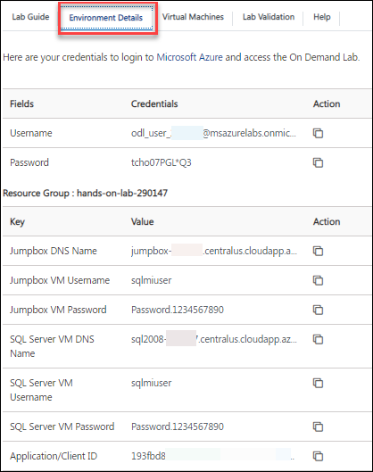

# **Getting Started with Your Migrating SQL Databases to Azure Workshop**
 
Welcome to your Migrating SQL Databases to Azure workshop! We've prepared a seamless environment for you to explore and learn about Azure services. Let's begin by making the most of this experience:
 
## **Accessing Your Lab Environment**
 
Once you're ready to dive in, your virtual machine and **Lab Guide** will be right at your fingertips within your web browser.

   

### **Virtual Machine & Lab Guide**
 
Your virtual machine is your workhorse throughout the workshop. The lab guide is your roadmap to success.
 
## **Exploring Your Lab Resources**
 
To get a better understanding of your lab resources and credentials, navigate to the **Environment Details** tab.

   
 
## **Utilizing the Split Window Feature**
 
For convenience, you can open the lab guide in a separate window by selecting the **Split Window** button from the Top right corner.
 
   
 
## **Managing Your Virtual Machine**
 
Feel free to start, stop, or restart your virtual machine as needed from the **Resources** tab. Your experience is in your hands!
 
  

## **Lab Guide Zoom In/Zoom Out**
 
To adjust the zoom level for the environment page, click the **A↕ : 100%** icon located next to the timer in the lab environment.

   
 
## **Let's Get Started with Azure Portal**
 
1. On your virtual machine, click on the Azure Portal icon as shown below:
 
    
 
2. You'll see the **Sign into Microsoft Azure** tab. Here, enter your credentials:
 
   - **Email/Username:** <inject key="AzureAdUserEmail"></inject>
 
      
 
3. Next, provide your password: 
 
   - **Password:** <inject key="AzureAdUserPassword"></inject>
 
      

4. If **Action Required** pop-up window appears, click on **Ask later**.

   
 
5. If you see the pop-up **Stay Signed in?**, click **No**.

   

6. If you see the pop-up **You have free Azure Advisor recommendations!**, close the window to continue the lab.

7. If a **Welcome to Microsoft Azure** popup window appears, click **Maybe Later** to skip the tour.
   
8. Now, click on the **Next** from the lower right corner to move to the next page.

   
 
Now you're all set to explore the powerful world of technology. Feel free to reach out if you have any questions along the way. Enjoy your workshop!
