<div class="MCWHeader1">
Migrating SQL databases to Azure
</div>

<div class="MCWHeader2">
Hands-on lab step-by-step guide
</div>

<div class="MCWHeader3">
June 2020
</div>

Information in this document, including URL and other Internet Web site references, is subject to change without notice. Unless otherwise noted, the example companies, organizations, products, domain names, e-mail addresses, logos, people, places, and events depicted herein are fictitious, and no association with any real company, organization, product, domain name, e-mail address, logo, person, place or event is intended or should be inferred. Complying with all applicable copyright laws is the responsibility of the user. Without limiting the rights under copyright, no part of this document may be reproduced, stored in or introduced into a retrieval system, or transmitted in any form or by any means (electronic, mechanical, photocopying, recording, or otherwise), or for any purpose, without the express written permission of Microsoft Corporation.

Microsoft may have patents, patent applications, trademarks, copyrights, or other intellectual property rights covering subject matter in this document. Except as expressly provided in any written license agreement from Microsoft, the furnishing of this document does not give you any license to these patents, trademarks, copyrights, or other intellectual property.

The names of manufacturers, products, or URLs are provided for informational purposes only and Microsoft makes no representations and warranties, either expressed, implied, or statutory, regarding these manufacturers or the use of the products with any Microsoft technologies. The inclusion of a manufacturer or product does not imply endorsement of Microsoft of the manufacturer or product. Links may be provided to third party sites. Such sites are not under the control of Microsoft and Microsoft is not responsible for the contents of any linked site or any link contained in a linked site, or any changes or updates to such sites. Microsoft is not responsible for webcasting or any other form of transmission received from any linked site. Microsoft is providing these links to you only as a convenience, and the inclusion of any link does not imply endorsement of Microsoft of the site or the products contained therein.

© 2020 Microsoft Corporation. All rights reserved.

Microsoft and the trademarks listed at <https://www.microsoft.com/en-us/legal/intellectualproperty/Trademarks/Usage/General.aspx> are trademarks of the Microsoft group of companies. All other trademarks are property of their respective owners.

**Contents**

- [Migrating SQL databases to Azure hands-on lab step-by-step](#migrating-sql-databases-to-azure-hands-on-lab-step-by-step)
  - [Abstract and learning objectives](#abstract-and-learning-objectives)
  - [Overview](#overview)
  - [Solution architecture](#solution-architecture)
  - [Requirements](#requirements)
  - [Exercise 1: Perform database assessments](#exercise-1-perform-database-assessments)
    - [Task 1: Configure the WWI TailspinToys database on the SqlServer2008 VM](#task-1-configure-the-wwi-tailspintoys-database-on-the-sqlserver2008-vm)
    - [Task 2: Perform assessment for migration to Azure SQL Database](#task-2-perform-assessment-for-migration-to-azure-sql-database)
    - [Task 3: Perform assessment for migration to Azure SQL Managed Instance](#task-3-perform-assessment-for-migration-to-azure-sql-managed-instance)
  - [Exercise 2: Migrate the database to SQL MI](#exercise-2-migrate-the-database-to-sql-mi)
    - [Task 1: Create an SMB network share on the SqlServer2008 VM](#task-1-create-an-smb-network-share-on-the-sqlserver2008-vm)
    - [Task 2: Change MSSQLSERVER service to run under sqlmiuser account](#task-2-change-mssqlserver-service-to-run-under-sqlmiuser-account)
    - [Task 3: Create a backup of WWI TailspinToys database](#task-3-create-a-backup-of-wwi-tailspintoys-database)
    - [Task 4: Retrieve SQL MI and SQL Server 2008 VM connection information](#task-4-retrieve-sql-mi-and-sql-server-2008-vm-connection-information)
    - [Task 5: Create a service principal](#task-5-create-a-service-principal)
    - [Task 6: Create and run an online data migration project](#task-6-create-and-run-an-online-data-migration-project)
    - [Task 7: Perform migration cutover](#task-7-perform-migration-cutover)
    - [Task 8: Verify database and transaction log migration](#task-8-verify-database-and-transaction-log-migration)
  - [Exercise 3: Update the web application to use the new SQL MI database](#exercise-3-update-the-web-application-to-use-the-new-sql-mi-database)
    - [Task 1: Deploy the web app to Azure](#task-1-deploy-the-web-app-to-azure)
    - [Task 2: Update App Service configuration](#task-2-update-app-service-configuration)
  - [Exercise 4: Integrate App Service with the virtual network](#exercise-4-integrate-app-service-with-the-virtual-network)
    - [Task 1: Set point-to-site addresses](#task-1-set-point-to-site-addresses)
    - [Task 2: Configure VNet integration with App Services](#task-2-configure-vnet-integration-with-app-services)
    - [Task 3: Open the web application](#task-3-open-the-web-application)
  - [Exercise 5: Improve database security posture with Advanced Data Security](#exercise-5-improve-database-security-posture-with-advanced-data-security)
    - [Task 1: Enable Advanced Data Security](#task-1-enable-advanced-data-security)
    - [Task 2: Configure SQL Data Discovery and Classification](#task-2-configure-sql-data-discovery-and-classification)
    - [Task 3: Review an Advanced Data Security Vulnerability Assessment](#task-3-review-an-advanced-data-security-vulnerability-assessment)
  - [Exercise 6: Enable Dynamic Data Masking](#exercise-6-enable-dynamic-data-masking)
    - [Task 1: Enable DDM on credit card numbers](#task-1-enable-ddm-on-credit-card-numbers)
    - [Task 2: Apply DDM to email addresses](#task-2-apply-ddm-to-email-addresses)
  - [Exercise 7: Use online secondary for read-only queries](#exercise-7-use-online-secondary-for-read-only-queries)
    - [Task 1: View Leaderboard report in the WWI Tailspin Toys web application](#task-1-view-leaderboard-report-in-the-wwi-tailspin-toys-web-application)
    - [Task 2: Update read-only connection string](#task-2-update-read-only-connection-string)
    - [Task 3: Reload Leaderboard report in the Tailspin Toys web app](#task-3-reload-leaderboard-report-in-the-tailspin-toys-web-app)
  - [After the hands-on lab](#after-the-hands-on-lab)
    - [Task 1: Delete Azure resource groups](#task-1-delete-azure-resource-groups)
    - [Task 2: Delete the wide-world-importers service principal](#task-2-delete-the-wide-world-importers-service-principal)

# Migrating SQL databases to Azure hands-on lab step-by-step

## Abstract and learning objectives

In this hands-on lab, you implement a proof-of-concept (PoC) for migrating an on-premises SQL Server 2008 R2 database into Azure SQL Managed Instance (SQL MI). You perform assessments to reveal any feature parity and compatibility issues between the on-premises SQL Server 2008 R2 database and the managed database offerings in Azure. You then migrate the customer's on-premises gamer information web application and database into Azure, with minimal to no down-time. Finally, you enable some of the advanced SQL features available in SQL MI to improve security and performance in the customer's application.

At the end of this hands-on lab, you will be better able to implement a cloud migration solution for business-critical applications and databases.

## Overview

Tailspin Toys, a subsidiary of Wide World Importers (WWI), is the developer of several popular online video games. Founded in 2010, the company has experienced exponential growth since releasing the first installment of their most popular game franchise to include online multiplayer gameplay. They have since built upon this success by adding online capabilities to the majority of their game portfolio.

Adding online gameplay has dramatically increased the popularity of their games, but the rapid increase in demand for their services has made supporting the current setup problematic. To facilitate online gameplay, they host gaming services on-premises using rented hardware. For each game, their gaming services setup consists of three virtual machines running the gaming software and five game databases hosted on a single SQL Server 2008 R2 instance. In addition to the dedicated gaming VMs and databases, they also host shared authentication and gateway VMs and databases. At its foundation, Tailspin Toys is a game development company, made up primarily of software developers. The few dedicated database and infrastructure resources they do have are struggling to keep up with their ever-increasing workload.

WWI is hoping that migrating their services from on-premises to the cloud can help to alleviate some of their infrastructure management issues, while simultaneously helping them to refocus their efforts on delivering business value by releasing new and improved games. They are looking for a proof-of-concept (PoC) for migrating their gamer information web application and database into the cloud. They maintain their gamer information database, `TailspinToys`, on an on-premises SQL Server 2008 R2 database. This system is used by gamers to update their profiles, view leader boards, purchase game add-ons, and more. Since this system helps to drive revenue, it is considered a business-critical application and needs to be highly-available. They are aware that SQL Server 2008 R2 is approaching the end of support, and are looking at options for migrating this database into Azure. They have read about some of the advanced security and performance tuning options that are available only in Azure and would prefer to migrate the database into a platform-as-a-service (PaaS) offering, if possible. WWI is using the Service Broker feature of SQL Server for messaging within the WWI `TailspinToys` database. This functionality enables several critical processes, and they cannot afford to lose these capabilities when migrating their operations database to the cloud. They have also stated that, at this time, they do not have the resources to rearchitect the solution to use an alternative message broker.

## Solution architecture

Below is a diagram of the solution architecture you implement in this lab. Please study this carefully, so you understand the whole of the solution as you are working on the various components.

![This solution diagram includes a virtual network containing SQL MI in an isolated subnet, along with a JumpBox VM and Database Migration Service in a management subnet. The MI Subnet displays both the primary managed instance, along with a read-only replica, which is accessed by reports from the web app. The web app connects to SQL MI via a subnet gateway and point-to-site VPN. The web app is published to App Services using Visual Studio 2019. Online data migration is conducted from the on-premises SQL Server to SQL MI using the Azure Database Migration Service, which reads backup files from an SMB network share.](./media/preferred-solution-architecture.png "Preferred Solution diagram")

The solution begins with using the Microsoft Data Migration Assistant (DMA) to perform assessments of feature parity and compatibility of the on-premises SQL Server 2008 R2 database. Assessments are performed against both Azure SQL Database (Azure SQL DB) and Azure SQL Managed Instance (SQL MI). The goal is to migrate the `TailspinToys` database into an Azure PaaS offering with minimal or no changes. After completing the assessments and reviewing the findings, the SQL Server 2008 R2 database is migrated into SQL MI using the Azure Database Migration Service's online data migration option. Online data migration allows the database to be migrated with little to no downtime by using a backup and transaction logs stored in an SMB network share.

The web app is deployed to an Azure App Service Web App using Visual Studio 2019. Once the database has been migrated and cutover, the `TailspinToysWeb` application is configured to talk to the SQL MI VNet through a virtual network gateway using point-to-site VPN, and its connection strings are updated to point to the new SQL MI database.

In SQL MI, several features of Azure SQL Database are examined. Advanced Data Security (ADS) is enabled, and Data Discovery and Classification is used to better understand the data and potential compliance issues with data in the database. The ADS Vulnerability Assessment is used to identify potential security vulnerabilities and issues in the database, and those finding are used to mitigate one finding by enabling Transparent Data Encryption in the database. Dynamic Data Masking (DDM) is used to prevent sensitive data from appearing when querying the database. Finally, Read Scale-out is used to point reports on WWI's Tailspin Toys web app to a read-only secondary, allowing reporting to occur without impacting the performance of the primary database.

## Requirements

- Microsoft Azure subscription must be pay-as-you-go or MSDN.
  - Trial subscriptions will not work.
- A virtual machine configured with Visual Studio Community 2019 or higher (setup in the Before the hands-on lab exercises).
- **Important**: You must have sufficient rights within your Azure AD tenant to create an Azure Active Directory application and service principal and assign roles on your subscription to complete this hands-on lab.

## Exercise 1: Perform database assessments

Duration: 20 minutes

In this exercise, you use the Microsoft Data Migration Assistant (DMA) to perform assessments on the `TailspinToys` database. You create two assessments, one for a migration to Azure SQL Database, and then a second for SQL MI. These assessments provide reports about any feature parity, and compatibility issues between the on-premises database and the Azure managed SQL database service options.

> DMA helps you upgrade to a modern data platform by detecting compatibility issues that can impact database functionality in your new version of SQL Server or Azure SQL Database. DMA recommends performance and reliability improvements for your target environment and allows you to move your schema, data, and uncontained objects from your source server to your target server. To learn more, read the [Data Migration Assistant documentation](https://docs.microsoft.com/sql/dma/dma-overview?view=azuresqldb-mi-current).

### Task 1: Configure the WWI TailspinToys database on the SqlServer2008 VM

In this task, you do some configuration the WWI `TailspinToys` database on the SQL Server 2008 R2 instance to prepare it for migration.

1. Navigate to the [Azure portal](https://portal.azure.com) and select **Resource groups** from the Azure services list.

   

2. Select the hands-on-lab-SUFFIX resource group from the list.

   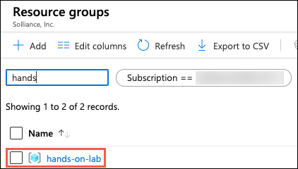

3. In the list of resources for your resource group, select the SqlServer2008 VM.

   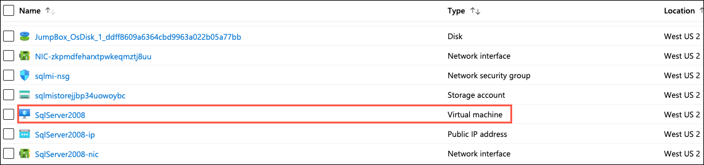

4. On the SqlServer2008 VM blade in the Azure portal, select **Overview** from the left-hand menu, and then select **Connect** and **RDP** on the top menu, as you've done previously.

   

5. On the Connect with RDP blade, select **Download RDP File**, then open the downloaded RDP file.

6. Select **Connect** on the Remote Desktop Connection dialog.

   

7. Enter the following credentials when prompted, and then select **OK**:

   - **User name**: `sqlmiuser`
   - **Password**: `Password.1234567890`

   

8. Select **Yes** to connect, if prompted that the identity of the remote computer cannot be verified.

   

9. Once logged in, open **Microsoft SQL Server Management Studio 17** (SSMS) by entering "sql server" into the search bar in the Windows Start menu and selecting **Microsoft SQL Server Management Studio 17** from the search results.

   

10. In the SSMS **Connect to Server** dialog, enter **SQLSERVER2008** into the Server name box, ensure **Windows Authentication** is selected, and then select **Connect**.

    

11. Once connected, verify you see the `TailspinToys` database listed under databases. If you don't see it, the configuration script may have failed during the VM setup. You can manually add restore the database by following the step under Task 12 of the [Manual-resource-setup guide](./Manual-resource-setup.md).

12. Select **New Query** from the SSMS toolbar.

    

13. Next, copy and paste the SQL script below into the new query window. This script enables Service broker and changes the database recovery model to FULL.

    ```sql
    USE master;
    GO

    -- Update the recovery model of the database to FULL and enable Service Broker
    ALTER DATABASE TailspinToys SET
    RECOVERY FULL,
    ENABLE_BROKER WITH ROLLBACK IMMEDIATE;
    GO
    ```

14. To run the script, select **Execute** from the SSMS toolbar.

    

### Task 2: Perform assessment for migration to Azure SQL Database

In this task, you use the Microsoft Data Migration Assistant (DMA) to assess WWI's `TailspinToys` database against Azure SQL Database (Azure SQL DB). The assessment provides a report about any feature parity and compatibility issues between the on-premises database and the Azure SQL DB service.

1. On the SqlSever2008 VM, launch DMA from the Windows Start menu by typing "data migration" into the search bar, and then selecting **Microsoft Data Migration Assistant** in the search results.

   

2. In the DMA dialog, select **+** from the left-hand menu to create a new project.

   

3. In the New project pane, set the following:

   - **Project type**: Select **Assessment**.
   - **Project name**: Enter `ToAzureSqlDb`
   - **Assessment type**: Select **Database Engine**.
   - **Source server type**: Select **SQL Server**.
   - **Target server type**: Select **Azure SQL Database**.

   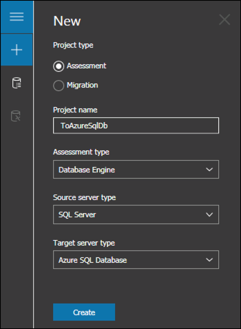

4. Select **Create**.

5. On the **Options** screen, ensure **Check database compatibility** and **Check feature parity** are both checked, and then select **Next**.

   

6. On the **Sources** screen, enter the following into the **Connect to a server** dialog that appears on the right-hand side:

   - **Server name**: Select **SQLSERVER2008**.
   - **Authentication type**: Select **SQL Server Authentication**.
   - **Username**: Enter `WorkshopUser`
   - **Password**: Enter `Password.1234567890`
   - **Encrypt connection**: Check this box.
   - **Trust server certificate**: Check this box.

   

7. Select **Connect**.

8. On the **Add sources** dialog that appears next, check the box for **TailspinToys** and select **Add**.

   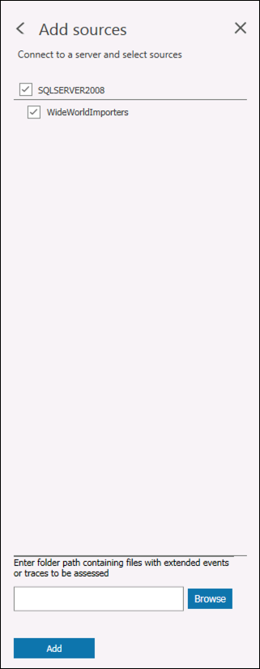

9. Select **Start Assessment**.

   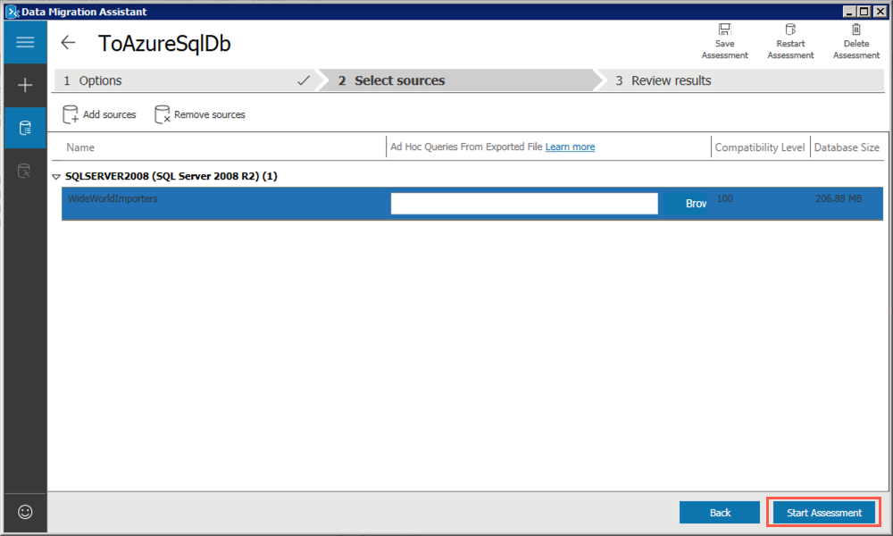

10. Review the migration assessment to determine the possibility of migrating to Azure SQL DB.

    

    > The DMA assessment for migrating WWI's `TailspinToys` database to a target platform of Azure SQL DB reveals features in use that are not supported. These features, including Service broker, prevent WWI from being able to migrate to the Azure SQL DB PaaS offering without first making changes to their database.

### Task 3: Perform assessment for migration to Azure SQL Managed Instance

With one PaaS offering ruled out due to feature parity, perform a second DMA assessment against Azure SQL Managed Instance (SQL MI). The assessment provides a report about any feature parity and compatibility issues between the on-premises database and the SQL MI service.

1. To get started, select **+** on the left-hand menu in DMA to create another new project.

   

2. In the New project pane, set the following:

   - **Project type**: Select **Assessment**.
   - **Project name**: Enter `ToSqlMi`
   - **Assessment type**: Select **Database Engine**.
   - **Source server type**: Select **SQL Server**.
   - **Target server type**: Select **Azure SQL Database Managed Instance**.

   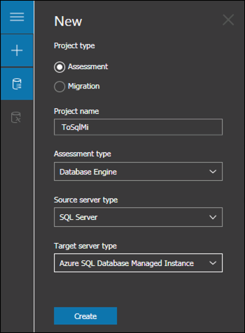

3. Select **Create**.

4. On the **Options** screen, ensure **Check database compatibility** and **Check feature parity** are both checked, and then select **Next**.

   

5. On the **Sources** screen, enter the following into the **Connect to a server** dialog that appears on the right-hand side:

   - **Server name**: Select **SQLSERVER2008**.
   - **Authentication type**: Select **SQL Server Authentication**.
   - **Username**: Enter `WorkshopUser`
   - **Password**: Enter `Password.1234567890`
   - **Encrypt connection**: Check this box.
   - **Trust server certificate**: Check this box.

   

6. Select **Connect**.

7. On the **Add sources** dialog that appears next, check the box for **TailspinToys** and select **Add**.

   

8. Select **Start Assessment**.

   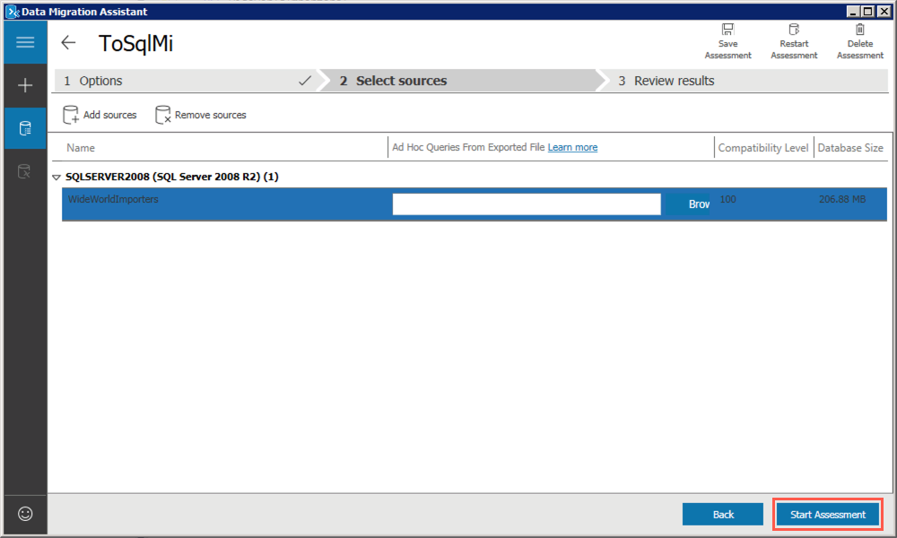

9. Review the SQL Server feature parity and Compatibility issues options of the migration assessment to determine the possibility of migrating to Azure SQL Managed Instance.

   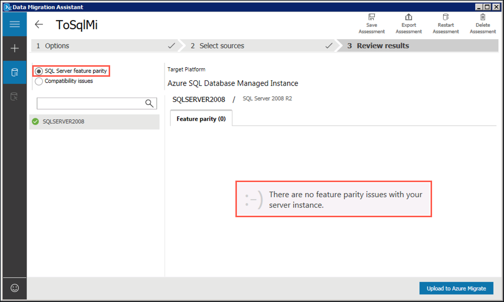

   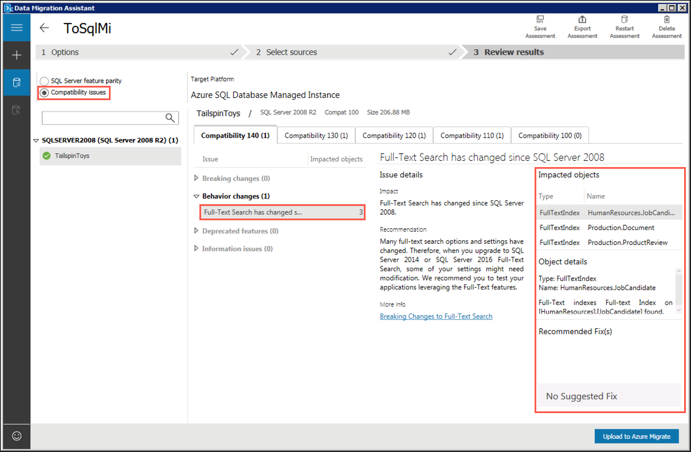

   > **Note**: The assessment report for a migrating WWI's `TailspinToys` database to a target platform of Azure SQL Managed Instance shows no feature parity and a note to validate full-text search functionality. The full text search changes do not impact the migration of the `TailspinToys` database to SQL MI.

10. The database, including the Service Broker feature, can be migrated as is, providing an opportunity for WWI to have a fully managed PaaS database running in Azure. Previously, their only option for migrating a database using features incompatible with Azure SQL Database, such as Service Broker, was to deploy the database to a virtual machine running in Azure (IaaS) or modify the database and associated applications to remove use of the unsupported features. The introduction of Azure SQL MI, however, provides the ability to migrate databases into a managed Azure SQL database service with _near 100% compatibility_, including the features that prevented them from using Azure SQL Database.

## Exercise 2: Migrate the database to SQL MI

Duration: 60 minutes

In this exercise, you use the [Azure Database Migration Service](https://azure.microsoft.com/services/database-migration/) (DMS) to migrate WWI's `TailspinToys` database from their on-premises SQL Server 2008 R2 database into SQL MI. WWI mentioned the importance of their gamer information web application in driving revenue, so for this migration, the online migration option is used to reduce downtime. The [Business Critical service tier](https://docs.microsoft.com/azure/azure-sql/managed-instance/sql-managed-instance-paas-overview#managed-instance-service-tiers) is targeted to meet the customer's high-availability requirements.

> The Business Critical service tier is designed for business applications with the highest performance and high-availability (HA) requirements. To learn more, read the [Managed Instance service tiers documentation](https://docs.microsoft.com/azure/azure-sql/managed-instance/sql-managed-instance-paas-overview#service-tiers).

### Task 1: Create an SMB network share on the SqlServer2008 VM

In this task, you create a new SMB network share on the SqlServer2008 VM. This is the folder used by DMS for retrieving backups of the WWI `TailspinToys` database during the database migration process.

1. On the SqlServer2008 VM, open **Windows Explorer** by selecting its icon on the Windows Taskbar.

   

2. In the Windows Explorer window, expand **Computer** in the tree view, select **Windows (C:)**, and then select **New folder** in the top menu.

   

3. Name the new folder **dms-backups**, then right-click the folder and select **Share with** and **Specific people** in the context menu.

   

4. In the File Sharing dialog, ensure the **sqlmiuser** is listed with a **Read/Write** permission level, and then select **Share**.

   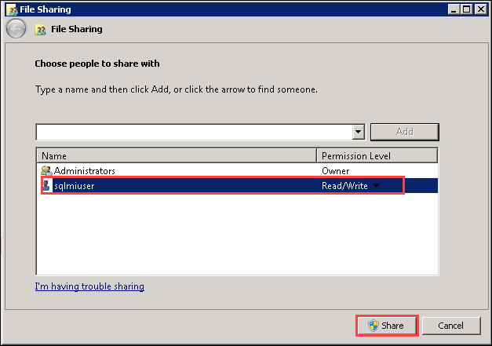

5. In the **Network discovery and file sharing** dialog, select the default value of **No, make the network that I am connected to a private network**.

   

6. Back on the File Sharing dialog, note the path of the shared folder, `\\SQLSERVER2008\dms-backups`, and select **Done** to complete the sharing process.

   

### Task 2: Change MSSQLSERVER service to run under sqlmiuser account

In this task, you use the SQL Server Configuration Manager to update the service account used by the SQL Server (MSSQLSERVER) to the `sqlmiuser` account. This is done to ensure the SQL Server service has the appropriate permissions to write backups to the shared folder.

1. On your SqlServer2008 VM, select the **Start menu**, enter "sql configuration" into the search bar, and then select **SQL Server Configuration Managed** from the search results.

   

   > **Note**: Be sure to choose **SQL Server Configuration Manager**, and not **SQL Server 2017 Configuration Manager**, which does not work for the installed SQL Server 2008 R2 database.

2. In the SQL Server Configuration Managed dialog, select **SQL Server Services** from the tree view on the left, then right-click **SQL Server (MSSQLSERVER)** in the list of services and select **Properties** from the context menu.

   

3. In the SQL Server (MSSQLSERVER) Properties dialog, select **This account** under Log on as, and enter the following:

   - **Account name**: `sqlmiuser`
   - **Password**: `Password.1234567890`

    Properties")

4. Select **OK**.

5. Select **Yes** in the Confirm Account Change dialog.

   

6. Observe that the **Log On As** value for the SQL Server (MSSQLSERVER) service changed to `./sqlmiuser`.

   

7. Close the SQL Server Configuration Manager.

### Task 3: Create a backup of WWI TailspinToys database

To perform online data migrations, DMS looks for backups and logs in the SMB shared backup folder on the source database server. In this task, you create a backup of the WWI `TailspinToys` database using SSMS and write it to the `\\SQLSERVER2008\dms-backups` SMB network share you created in a previous task. The backup file needs to include a checksum, so you add that during the backup steps.

1. On the SqlServer2008 VM, open **Microsoft SQL Server Management Studio 17** by entering "sql server" into the search bar in the Windows Start menu.

   

2. In the SSMS **Connect to Server** dialog, enter **SQLSERVER2008** into the Server name box, ensure **Windows Authentication** is selected, and then select **Connect**.

   

3. Once connected, expand **Databases** under SQLSERVER2008 in the Object Explorer, and then right-click the **TailspinToys** database. In the context menu, select **Tasks** and then **Back Up**.

   

4. In the Back Up Database dialog, you should see `C:\TailspinToys.bak` listed in the Destinations box. This is no longer needed, so select it and then select **Remove**.

   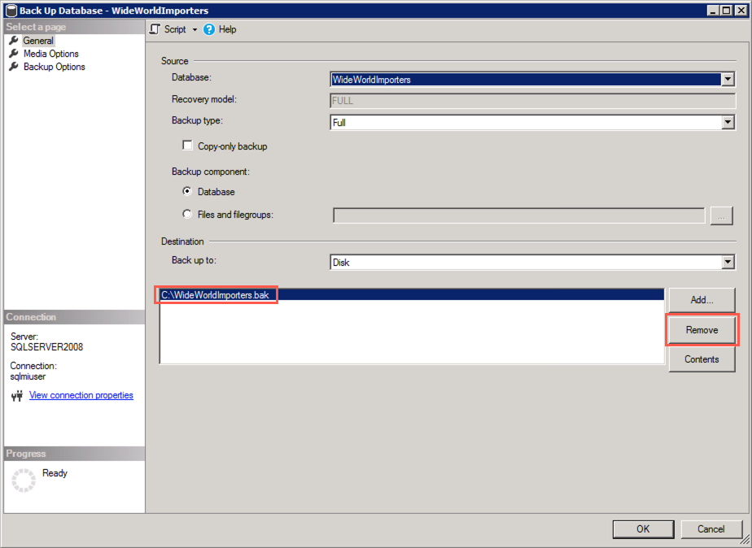

5. Next, select **Add** to add the SMB network share as a backup destination.

   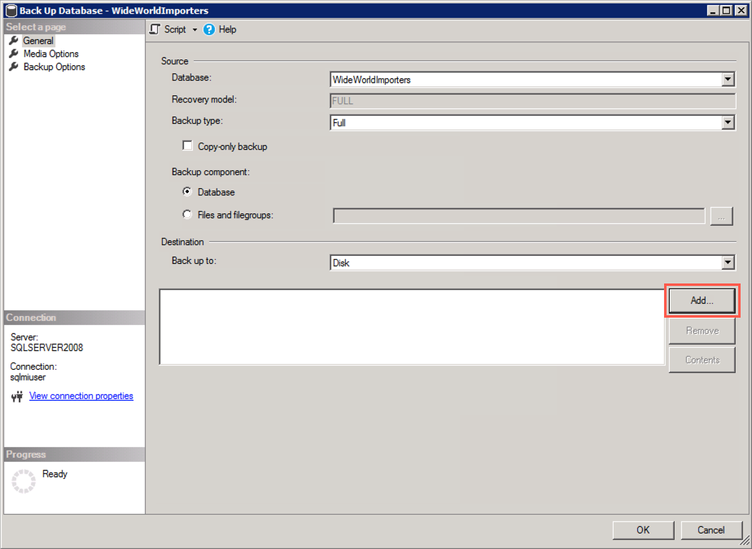

6. In the Select Backup Destination dialog, select the Browse (`...`) button.

   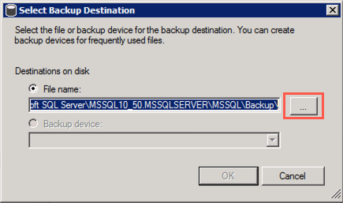

7. In the Location Database Files dialog, select the `C:\dms-backups` folder, enter `TailspinToys.bak` into the File name field, and then select **OK**.

   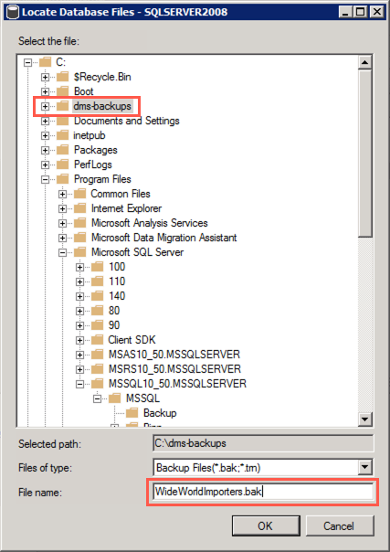

8. Select **OK** to close the Select Backup Destination dialog.

9. In the Back Up Database dialog, select **Media Options** in the Select a page pane, and then set the following:

   - Select **Back up to the existing media set** and then select **Overwrite all existing backup sets**.
   - Under Reliability, check the box for **Perform checksum before writing to media**. This is required by DMS when using the backup to restore the database to SQL MI.

   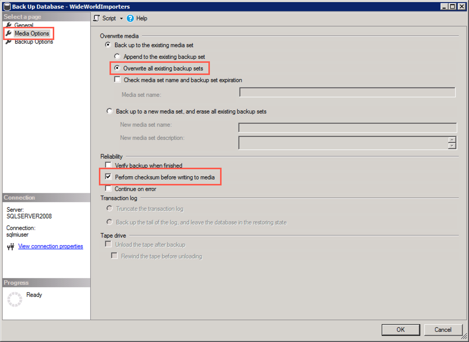

10. Select **OK** to perform the backup.

11. You will receive a message when the backup is complete. Select **OK**.

    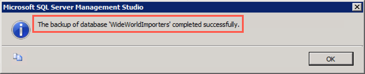

### Task 4: Retrieve SQL MI and SQL Server 2008 VM connection information

In this task, you use the Azure Cloud shell to retrieve the information necessary to connect to your SqlServer2008 VM from DMS.

1. In the [Azure portal](https://portal.azure.com), select the Azure Cloud Shell icon from the top menu.

   

2. In the Cloud Shell window that opens at the bottom of your browser window, select **PowerShell**.

   

3. If prompted that you have no storage mounted, select the subscription you are using for this hands-on lab and select **Create storage**.

   

   > **Note**: If the creation fails, you may need to select **Advanced settings** and specify the subscription, region, and resource group for the new storage account.

4. After a moment, a message is displayed that you have successfully requested a Cloud Shell, and be presented with a PS Azure prompt.

   

5. At the prompt, retrieve the public IP address of the SqlSerer2008 VM, which is used to connect to the database on that server. Enter the following PowerShell command, **replacing `<your-resource-group-name>`** in the resource group name variable with the name of your resource group:

   ```powershell
   $resourceGroup = "<your-resource-group-name>"
   az vm list-ip-addresses -g $resourceGroup -n SqlServer2008 --output table
   ```

   > **Note**: If you have multiple Azure subscriptions, and the account you are using for this hands-on lab is not your default account, you may need to run `az account list --output table` at the Azure Cloud Shell prompt to output a list of your subscriptions, then copy the Subscription Id of the account you are using for this lab, and then run `az account set --subscription <your-subscription-id>` to set the appropriate account for the Azure CLI commands.

6. Within the output, locate and copy the value of the `ipAddress` property below the `PublicIpAddresses` field. Paste the value into a text editor, such as Notepad.exe, for later reference.

   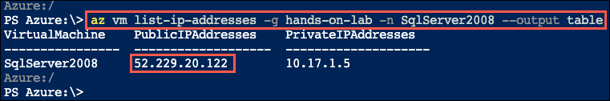

7. Leave the Azure Cloud Shell open for the next task.

### Task 5: Create a service principal

In this task, use the Azure Cloud Shell to create an Azure Active Directory (Azure AD) application and service principal (SP) that will provide DMS access to Azure SQL MI. You will grant the SP permissions to the hands-on-lab-SUFFIX resource group and your subscription.

> **Important**: You must have sufficient rights within your Azure AD tenant to create an Azure Active Directory application and service principal and assign roles on your subscription to complete this task.

1. Next at the Cloud Shell prompt, issue a command to create a service principal named **wide-world-importers** and assign it contributor permissions to your **hands-on-lab-SUFFIX** resource group.

2. First, you need to retrieve your subscription ID. Enter the following at the Cloud Shell prompt:

   ```powershell
   az account list --output table
   ```

3. In the output table, locate the subscription you are using for this hands-on lab. Copy the SubscriptionId value and use it to replace `<your-subscription-id>` in the command below. Run the completed command at the CLI command prompt.

   ```powershell
   $subscriptionId = "<your-subscription-id>"
   ```

4. Next, enter the following `az ad sp create-for-rbac` command at the Cloud Shell prompt and then press `Enter` to run the command.

   ```powershell
   az ad sp create-for-rbac -n "https://wide-world-importers" --role owner --scopes subscriptions/$subscriptionId/resourceGroups/$resourceGroup
   ```

5. Copy the output from the command into a text editor, as you need the `appId` and `password` in the next task. The output should be similar to:

   ```json
   {
     "appId": "aeab3b83-9080-426c-94a3-4828db8532e9",
     "displayName": "wide-world-importers",
     "name": "https://wide-world-importers",
     "password": "hd_42~OwuFk.mp1BQ8l6nKkzOLzg5vrQpC",
     "tenant": "d280491c-b27a-XXXX-XXXX-XXXXXXXXXXXX"
   }
   ```

6. To verify the role assignment, select **Access control (IAM)** from the left-hand menu of the **hands-on-lab-SUFFIX** resource group blade, and then select the **Role assignments** tab and locate **wide-world-importers** under the OWNER role.

   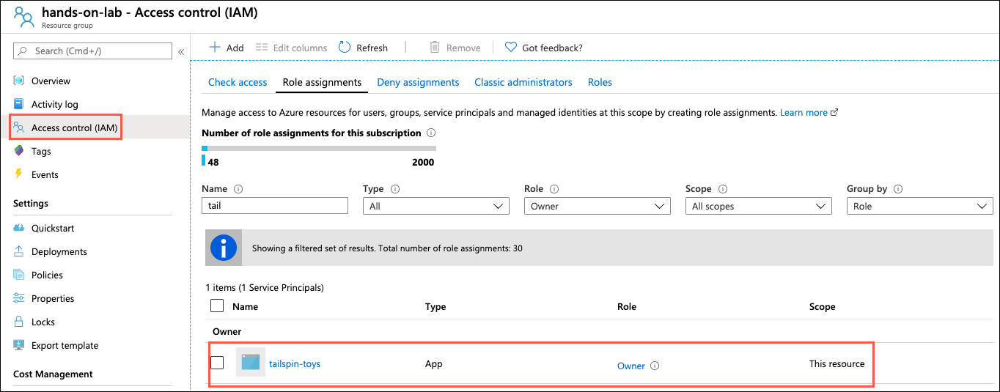

7. Next, issue another command to grant the CONTRIBUTOR role at the subscription level to the newly created service principal. At the Cloud Shell prompt, run the following command:

   ```powershell
   az role assignment create --assignee https://wide-world-importers --role contributor
   ```

### Task 6: Create and run an online data migration project

In this task, you create a new online data migration project in DMS for WWI's `TailspinToys` database.

1. In the [Azure portal](https://portal.azure.com), navigate to the Azure Database Migration Service by selecting **Resource groups** from the left-hand navigation menu, selecting the **hands-on-lab-SUFFIX** resource group, and then selecting the **wwi-dms** Azure Database Migration Service in the list of resources.

   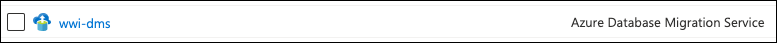

2. On the Azure Database Migration Service blade, select **+New Migration Project**.

   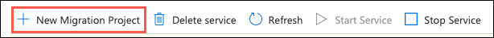

3. On the New migration project blade, enter the following:

   - **Project name**: Enter `OnPremToSqlMi`
   - **Source server type**: Select **SQL Server**.
   - **Target server type**: Select **Azure SQL Database Managed Instance**.
   - **Choose type of activity**: Select **Online data migration** and select **Save**.

   

4. Select **Create and run activity**.

5. On the Migration Wizard **Select source** blade, enter the following:

   - **Source SQL Server instance name**: Enter the IP address of your SqlServer2008 VM that you copied into a text editor in the previous task. For example, `13.66.228.107`.
   - **Authentication type**: Select SQL Authentication.
   - **Username**: Enter `WorkshopUser`
   - **Password**: Enter `Password.1234567890`
   - **Connection properties**: Check both Encrypt connection and Trust server certificate.

   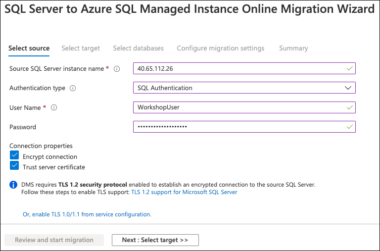

6. Select **Save**.

7. On the Migration Wizard **Select target** blade, enter the following:

   - **Application ID**: Enter the `appId` value from the output of the `az ad sp create-for-rbac' command you executed in the last task.
   - **Key**: Enter the `password` value from the output of the `az ad sp create-for-rbac' command you executed in the last task.
   - **Skip the Application ID Contributor level access check on the subscription**: Leave this unchecked.
   - **Subscription**: Select the subscription you are using for this hand-on lab.
   - **Target Azure SQL Managed Instance**: Select the sqlmi-UNIQUEID instance.
   - **SQL Username**: Enter `sqlmiuser`
   - **Password**: Enter `Password.1234567890`

   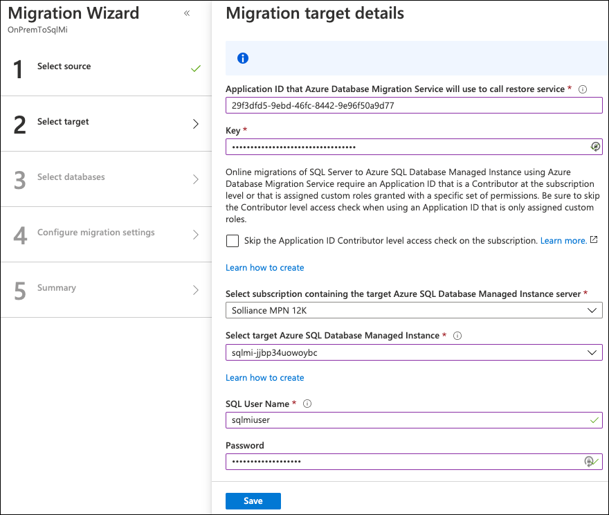

8. Select **Save**.

9. On the Migration Wizard **Select databases** blade, select `TailspinToys`.

   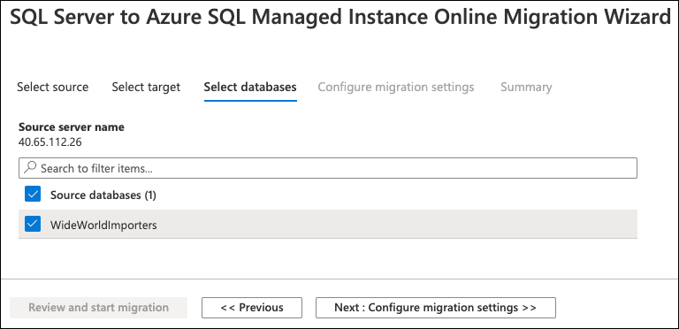

10. Select **Save**.

11. On the Migration Wizard **Configure migration settings** blade, enter the following configuration:

    - **Network share location**: Enter `\\SQLSERVER2008\dms-backups`. This is the path of the SMB network share you created previously.
    - **Windows User Azure Database Migration Service impersonates to upload files to Azure Storage**: Enter `SQLSERVER2008\sqlmiuser`
    - **Password**: Enter `Password.1234567890`
    - **Subscription containing storage account**: Select the subscription you are using for this hands-on lab.
    - **Storage account**: Select the **sqlmistoreUNIQUEID** storage account.

    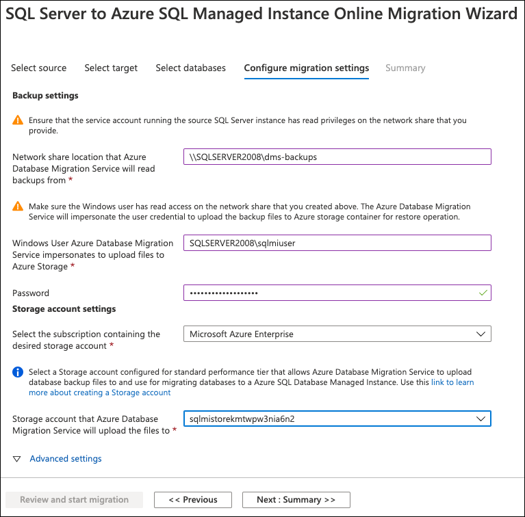

12. Select **Save** on the **Configure migration setting** blade.

13. On the Migration Wizard **Summary** blade, enter the following:

    - **Activity name**: Enter WwiMigration.

    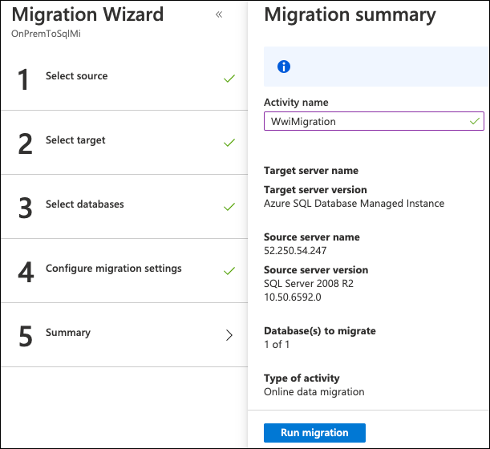

14. Select **Run migration**.

15. Monitor the migration on the status screen that appears. Select the refresh icon in the toolbar to retrieve the latest status.

    

16. Continue selecting **Refresh** every 5-10 seconds, until you see the status change to **Log shipping in progress**. When that status appears, move on to the next task.

    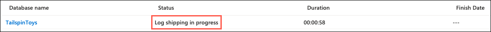

### Task 7: Perform migration cutover

Since you performed an "online data migration," the migration wizard continuously monitors the SMB network share for newly added log backup files. This allows for any updates that happen on the source database to be captured until you cut over to the SQL MI database. In this task, you add a record to one of the database tables, backup the logs, and complete the migration of the WWI `TailspinToys` database by cutting over to the SQL MI database.

1. In the migration status window in the Azure portal and select **TailspinToys** under database name to view further details about the database migration.

   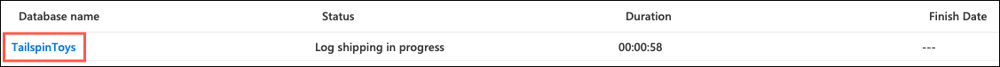

2. On the TailspinToys screen, note the status of **Restored** for the `TailspinToys.bak` file.

   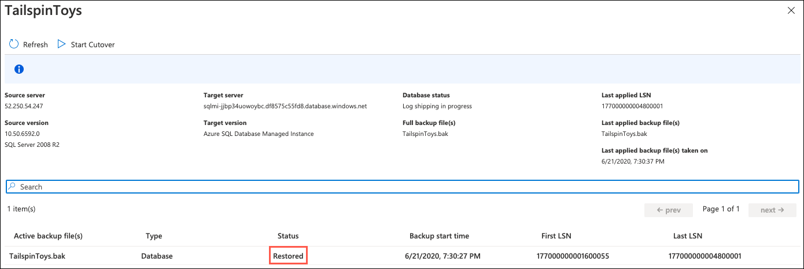

3. To demonstrate log shipping and how transactions made on the source database during the migration process are added to the target SQL MI database, you will add a record to one of the database tables.

4. Return to SSMS on your SqlServer2008 VM and select **New Query** from the toolbar.

   

5. Paste the following SQL script, which inserts a record into the `Game` table, into the new query window:

   ```sql
   USE TailspinToys;
   GO

   INSERT [dbo].[Game] (Title, Description, Rating, IsOnlineMultiplayer)
   VALUES ('Space Adventure', 'Explore the universe with are newest online multiplayer gaming experience. Build custom  rocket ships, and take off for the stars in an infinite open-world adventure.', 'T', 1)
   ```

6. Execute the query by selecting **Execute** in the SSMS toolbar.

   

7. After adding the new record to the `Games` table, back up the transaction logs. DMS detects any new backups and ships them to the migration service. Select **New Query** again in the toolbar, and paste the following script into the new query window:

   ```sql
   USE master;
   GO

   BACKUP LOG TailspinToys
   TO DISK = 'c:\dms-backups\TailspinToysLog.trn'
   WITH CHECKSUM
   GO
   ```

8. Execute the query by selecting **Execute** in the SSMS toolbar.

9. Return to the migration status page in the Azure portal. On the TailspinToys screen, select **Refresh** and you should see the **TailspinToysLog.trn** file appear with a status of **Uploaded**.

   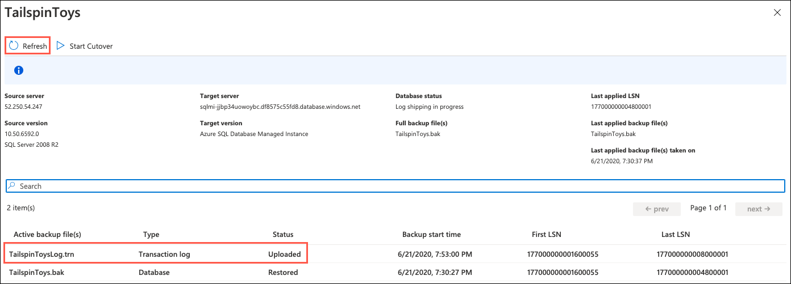

   > **Note**: If you don't see it the transaction logs entry, continue selecting refresh every few seconds until it appears.

10. Once the transaction logs are uploaded, they are restored to the database. Select **Refresh** every 10-15 seconds until you see the status change to **Restored**, which can take a minute or two.

    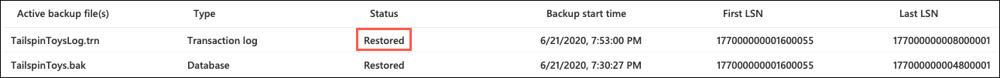

11. After verifying the transaction log status of **Restored**, select **Start Cutover**.

    

12. On the Complete cutover dialog, verify pending log backups is `0`, check **Confirm**, and then select **Apply**.

    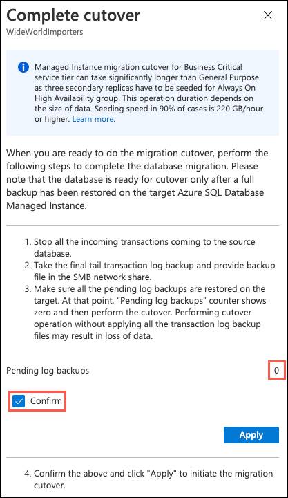

13. A progress bar below the Apply button in the Complete cutover dialog provides updates on the status of the cutover. When the migration finishes, the status changes to **Completed**.

    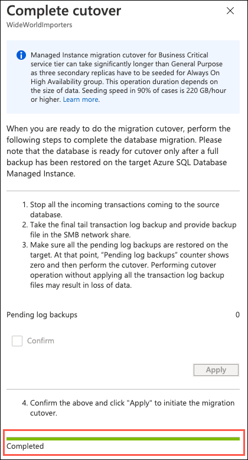

    > **Note**: If after a few minutes the progress bar has not moved, you can proceed to the next step, and monitor the cutover progress on the WwiMigration blade by selecting refresh.

14. Close the Complete cutover dialog by selecting the "X" in the upper right corner of the dialog, and do the same thing for the TailspinToys blade. This returns you to the WwiMigration blade. Select **Refresh**, and you should see a status of **Completed** from the TailspinToys database.

    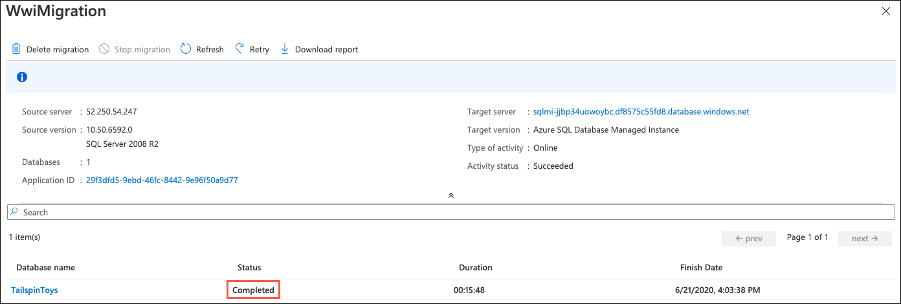

15. You have successfully migrated WWI's `TailspinToys` database to Azure SQL Managed Instance.

### Task 8: Verify database and transaction log migration

In this task, you connect to the SQL MI database using SSMS, and quickly verify the migration.

1. First, use the Azure Cloud Shell to retrieve the fully qualified domain name of your SQL MI database. In the [Azure portal](https://portal.azure.com), select the Azure Cloud Shell icon from the top menu.

   

2. In the Cloud Shell window that opens at the bottom of your browser window, select **PowerShell**.

   

3. After a moment, a message is displayed that you have successfully requested a Cloud Shell, and be presented with a PS Azure prompt.

   

4. At the prompt, retrieve information about SQL MI in the hands-on-lab-SUFFIX resource group by entering the following PowerShell command, **replacing `<your-resource-group-name>`** in the resource group name variable with the name of your resource group:

   ```powershell
   $resourceGroup = "<your-resource-group-name>"
   az sql mi list --resource-group $resourceGroup
   ```

   > **Note**: If you have multiple Azure subscriptions, and the account you are using for this hands-on lab is not your default account, you may need to run `az account list --output table` at the Azure Cloud Shell prompt to output a list of your subscriptions. Copy the Subscription Id of the account you are using for this lab and then run `az account set --subscription <your-subscription-id>` to set the appropriate account for the Azure CLI commands.

5. Within the output of the above command, locate and copy the value of the `fullyQualifiedDomainName` property. Paste the value into a text editor, such as Notepad.exe, for reference below.

   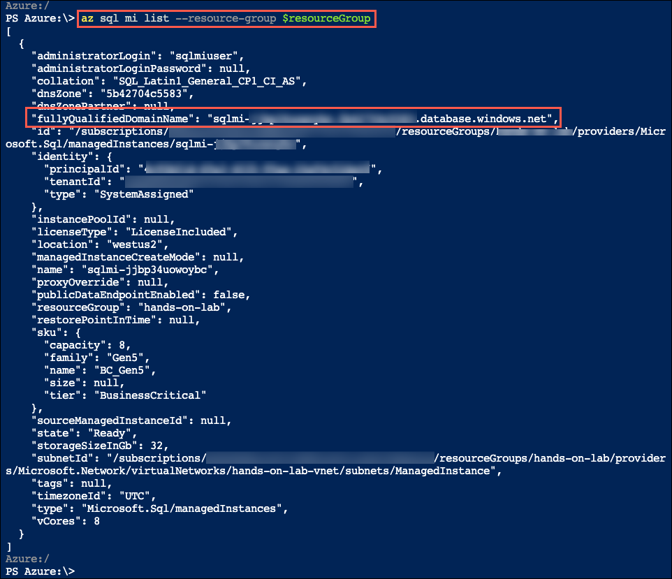

6. Return to SSMS on your SqlServer2008 VM, and then select **Connect** and **Database Engine** from the Object Explorer menu.

   

7. In the Connect to Server dialog, enter the following:

   - **Server name**: Enter the fully qualified domain name of your SQL managed instance, which you copied from the Azure Cloud Shell in the previous steps.
   - **Authentication**: Select **SQL Server Authentication**.
   - **Login**: Enter `sqlmiuser`
   - **Password**: Enter `Password.1234567890`
   - Check the **Remember password** box.

   

8. Select **Connect**.

9. The SQL MI connection appears below the SQLSERVER2008 connection. Expand Databases the SQL MI connection and select the `TailspinToys` database.

   

10. With the `TailspinToys` database selected, select **New Query** on the SSMS toolbar to open a new query window.

11. In the new query window, enter the following SQL script:

    ```sql
    USE TailspinToys;
    GO

    SELECT * FROM Game
    ```

12. Select **Execute** on the SSMS toolbar to run the query. Observe the records contained within the `Game` table, including the new `Space Adventure` game you added after initiating the migration process.

    

13. You are done using the SqlServer2008 VM. Close any open windows and log off of the VM. The JumpBox VM is used for the remaining tasks of this hands-on lab.

## Exercise 3: Update the web application to use the new SQL MI database

Duration: 30 minutes

With the WWI `TailspinToys` database now running on SQL MI in Azure, the next step is to make the required modifications to the WWI TailspinToys gamer information web application.

> **Note**: Azure SQL Managed Instance has a private IP address in a dedicated VNet, so to connect an application, you must configure access to the VNet where Managed Instance is deployed. To learn more, read [Connect your application to Azure SQL Managed Instance](https://docs.microsoft.com/azure/azure-sql/managed-instance/connect-application-instance).

### Task 1: Deploy the web app to Azure

In this task, you create an RDP connection to the JumpBox VM and then using Visual Studio on the JumpBox, deploy the `TailspinToysWeb` application into the App Service in Azure.

1. In the [Azure portal](https://portal.azure.com), select **Resource groups** in the Azure navigation pane and select the **hands-on-lab-SUFFIX** resource group from the list.

   

2. In the list of resources for your resource group, select the JumpBox VM.

   

3. On your JumpBox VM blade, select **Connect** and **RDP** from the top menu.

   

4. On the Connect with RDP blade, select **Download RDP File**, then open the downloaded RDP file.

5. Select **Connect** on the Remote Desktop Connection dialog.

   

6. Enter the following credentials when prompted, and then select **OK**:

   - **Username**: `sqlmiuser`
   - **Password**: `Password.1234567890`

   

7. Select **Yes** to connect, if prompted that the identity of the remote computer cannot be verified.

   

8. Once logged in, open File Explorer by selecting it in the Windows start bar.

   

9. In the File Explorer dialog, navigate to the `C:\hands-on-lab` folder and then drill down to `Migrating-SQL-databases-to-Azure-master\Hands-on lab\lab-files`. In the `lab-files` folder, double-click `TailspinToysWeb.sln` to open the solution in Visual Studio.

   

10. If prompted about how you want to open the file, select **Visual Studio 2019** and then select **OK**.

    

11. Select **Sign in** and enter your Azure account credentials when prompted.

    

12. At the security warning prompt, uncheck **Ask me for every project in this solution**, and then select **OK**.

    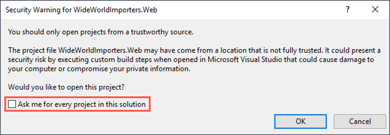

13. Once logged into Visual Studio, right-click the `TailspinToysWeb` project in the Solution Explorer, and then select **Publish**.

    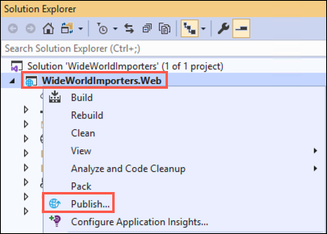

14. On the **Publish** dialog, select **Azure** in the Target box and select **Next**.

    

15. Next, in the **Specific target** box, select **Azure App Service (Windows)**.

    

16. Finally, in the **App Service** box, select your subscription, expand the hands-on-lab-SUFFIX resource group, and select the Web App.

    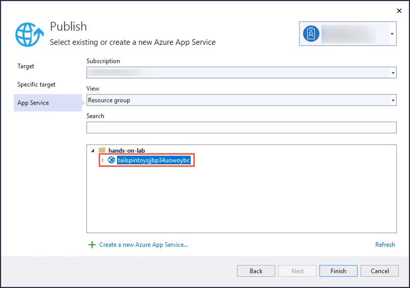

17. Select **Finish**.

18. Back on the Visual Studio Publish page for the `TailspinToysWeb` project, select **Publish** to start the process of publishing your Web API to your Azure API App.

    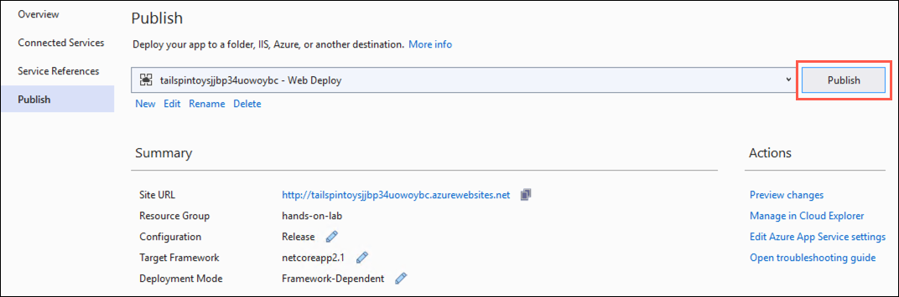

19. When the publish completes, you will see a message in the Visual Studio Output page that the publish succeeded.

    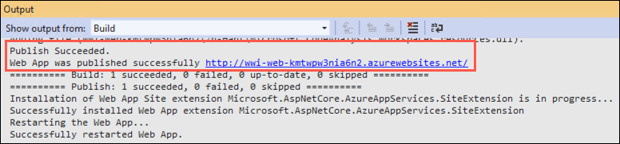

20. If you select the link of the published web app from the Visual Studio output window, an error page is returned because the database connection strings have not been updated to point to the SQL MI database. You address this in the next task.

    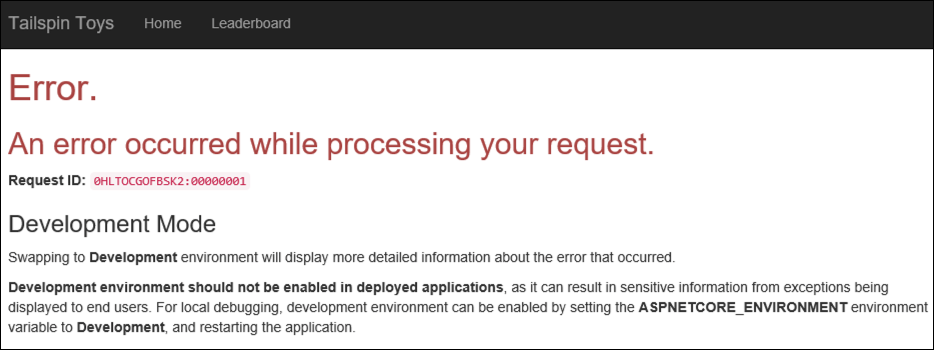

### Task 2: Update App Service configuration

In this task, you make updates to WWI's Tailspin Toys gamer info web application to enable it to connect to and utilize the SQL MI database.

1. In the [Azure portal](https://portal.azure.com), select **Resource groups** from the Azure services list.

   

2. Select the hands-on-lab-SUFFIX resource group from the list.

   

3. In the list of resources for your resource group, select the **hands-on-lab-SUFFIX** resource group and then select the **tailspintoysUNIQUEID** App Service from the list of resources.

   

4. On the App Service blade, select **Configuration** under Settings on the left-hand side.

   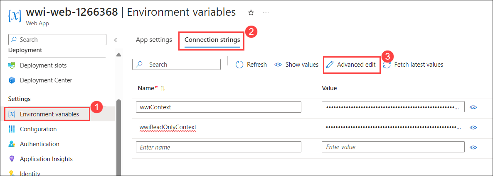

5. On the Configuration blade, locate the **Connection strings** section, and then select the Pencil (Edit) icon to the right of the `TailspinToysContext` connection string.

   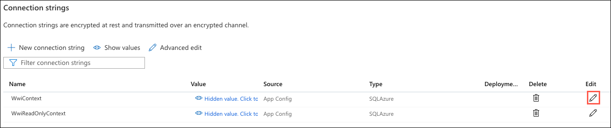

6. The value of the connection string should look like:

   ```sql
   Server=tcp:your-sqlmi-host-fqdn-value,1433;Database=TailspinToys;User ID=sqlmiuser;Password=Password.1234567890;Trusted_Connection=False;Encrypt=True;TrustServerCertificate=True;
   ```

7. In the Add/Edit connection string dialog, replace `your-sqlmi-host-fqdn-value` with the fully qualified domain name for your SQL MI that you copied to a text editor earlier from the Azure Cloud Shell.

   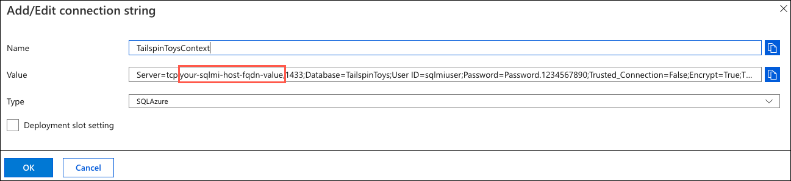

8. The updated value should look similar to the following screenshot.

   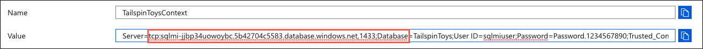

9. Select **OK**.

10. Repeat steps 3 - 7, this time for the `TailspinToysReadOnlyContext` connection string.

11. Select **Save** at the top of the Configuration blade.

    

12. When prompted that changes to application settings and connection strings will restart your application, select **Continue**.

    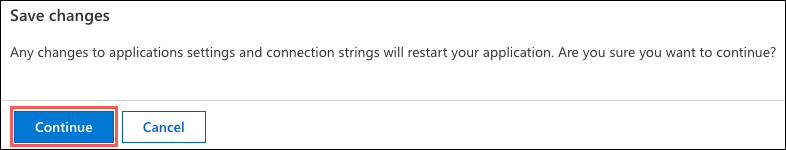

13. Select **Overview** to the left of the Configuration blade to return to the overview blade of your App Service.

    

14. At this point, selecting the **URL** for the App Service on the Overview blade still results in an error being return. This is because SQL Managed Instance has a private IP address in its VNet. To connect an application, you need to configure access to the VNet where Managed Instance is deployed, which you handle in the next exercise.

    

## Exercise 4: Integrate App Service with the virtual network

Duration: 15 minutes

In this exercise, you Integrate your App Service with the virtual network that was created during the Before the hands-on lab exercises. The ARM template created a Gateway subnet on the VNet, as well as a Virtual Network Gateway. Both of these resources are required to integrate App Service and connect to SQL MI.

### Task 1: Set point-to-site addresses

In this task, you configure the client address pool. This is a range of private IP addresses that you specify below. Clients that connect over a Point-to-Site VPN dynamically receive an IP address from this range. You use a private IP address range that does not overlap with the VNet.

1. Navigate to the **hands-on-lab-SUFFIX-vnet-gateway** Virtual network gateway in the [Azure portal](https://portal.azure.com) by selecting it from the list of resources in the hands-on-lab-SUFFIX resource group.

   

2. On the virtual network gateway blade, select **User VPN configuration** under Settings in the left-hand menu, and then select **Configure now**.

   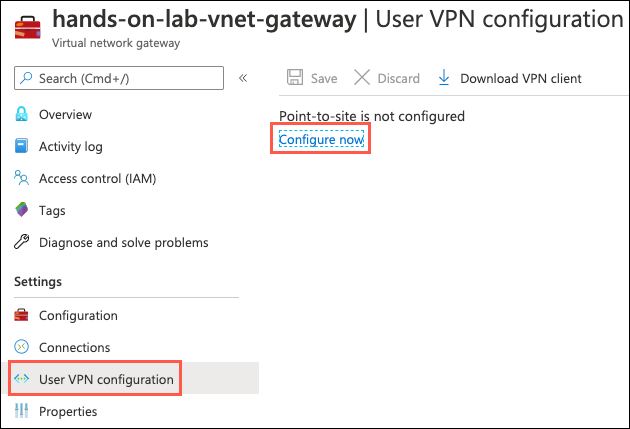

3. On the **Point-to-site** configuration page, set the following configuration:

   - **Address pool**: Add a private IP address range that you want to use. The address space must be in one of the following address blocks, but should not overlap the address space used by the VNet.
     - `10.0.0.0/8` - This means an IP address range from 10.0.0.0 to 10.255.255.255
     - `172.16.0.0/12` - This means an IP address range from 172.16.0.0 to 172.31.255.255
     - `192.168.0.0/16` - This means an IP address range from 192.168.0.0 to 192.168.255.255
   - **Tunnel type**: Select **SSTP (SSL)**.
   - **Authentication type**: Choose **Azure certificate**.

   

4. Select **Save** to validate and save the settings. It takes a few minutes for the save to finish.

### Task 2: Configure VNet integration with App Services

In this task, you add the networking configuration to your App Service to enable communication with resources in the VNet.

1. In the [Azure portal](https://portal.azure.com), select **Resource groups** from the left-hand menu, select the **hands-on-lab-SUFFIX** resource group and then select the **tailspintoysUNIQUEID** App Service from the list of resources.

   

2. On the App Service blade, select **Networking** from the left-hand menu and then select **Click here to configure** under **VNet Integration**.

   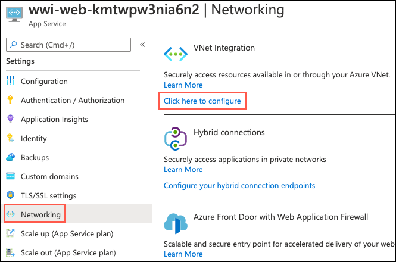

3. Select **Add VNet** on the VNet Configuration blade.

   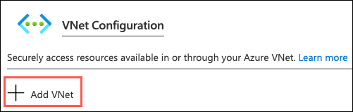

4. On the Network Feature Status dialog, enter the following:

   - **Virtual Network**: Select the hands-on-lab-SUFFIX-vnet.
   - **Subnet**: Select Create New Subnet.
   - **Subnet Name**: Enter WebAppSubnet.
   - **Virtual Network Address Block**: Select the only option under this dropdown, 10.x.0.0/16.
   - **Subnet Address Block**: Enter a subnet with a /24 block, such as 10.x.3.0/24.

   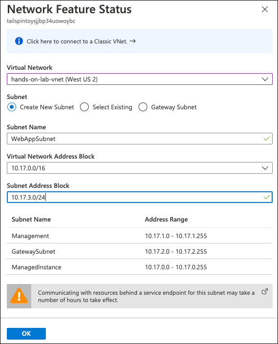

5. Within a few minutes, the VNet is added, and your App Service is restarted to apply the changes. Select **Refresh** to see the details. You should see that the certificate status is Certificates in sync. **Note**: If the certificate status is not in sync, try hitting refresh, as it can take a moment for that status to be reflected.

   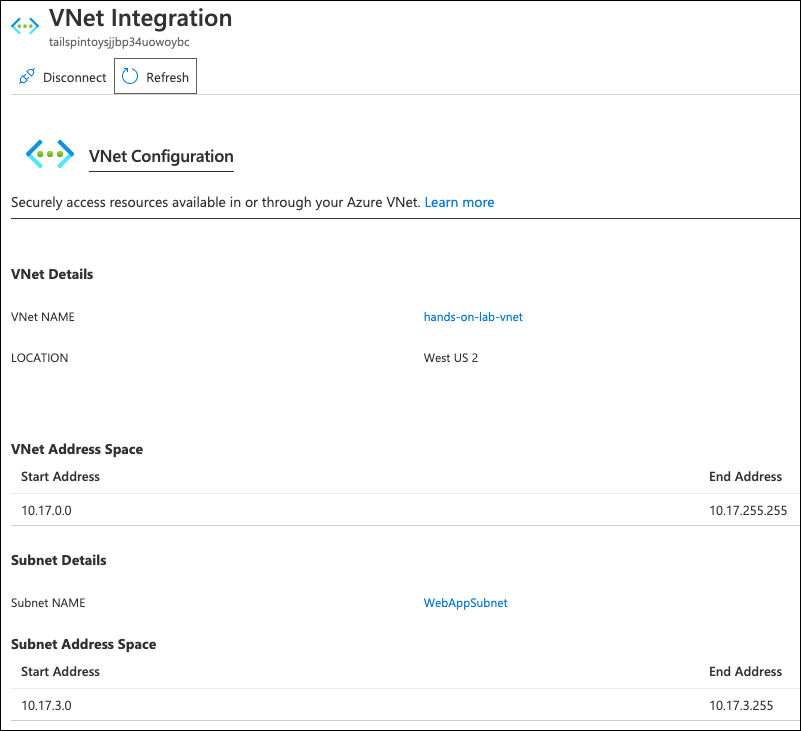

   > **Note**: In you receive a message adding the Virtual Network to Web App failed, select **Disconnect** on the VNet Configuration blade, and repeat steps 3 - 5 above.

### Task 3: Open the web application

In this task, you verify your web application now loads, and you can see the home page of the web app.

1. Select **Overview** in the left-hand menu of your App Service, and select the **URL** of your App service to launch the website. This opens the URL in a browser window.

   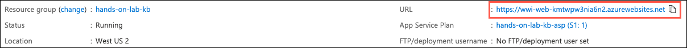

2. Verify that the web site and data are loaded correctly. The page should look similar to the following:

   

   > **Note**: If you get an error screen, try selecting Refresh in the browser window.

3. That's it. You successfully connected your application to the new SQL MI database.

## Exercise 5: Improve database security posture with Advanced Data Security

Duration: 30 minutes

In this exercise, you enable Advanced Data Security (ADS) on your SQL MI database and explore some of the security benefits that come with running your database in Azure. [SQL Database Advance Data Security](https://docs.microsoft.com/azure/sql-database/sql-database-advanced-data-security) (ADS) provides advanced SQL security capabilities, including functionality for discovering and classifying sensitive data, surfacing and mitigating potential database vulnerabilities, and detecting anomalous activities that could indicate a threat to your database.

### Task 1: Enable Advanced Data Security

In this task, you enable ADS for all databases on the Managed Instance.

1. In the [Azure portal](https://portal.azure.com), select **Resource groups** from the Azure services list.

   

2. Select the hands-on-lab-SUFFIX resource group from the list.

   

3. Select the **TailspinToys** Managed database resource from the list.

   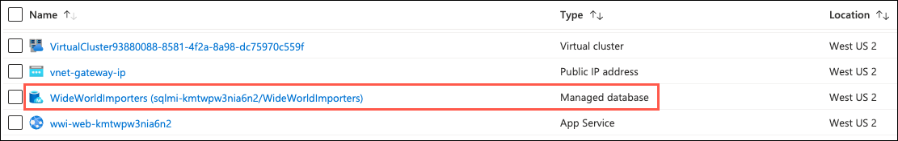

4. On the TailspinToys Managed database blade, select **Advanced Data Security** from the left-hand menu, under Security, and then select **Enable Advanced Data Security on the managed instance**.

   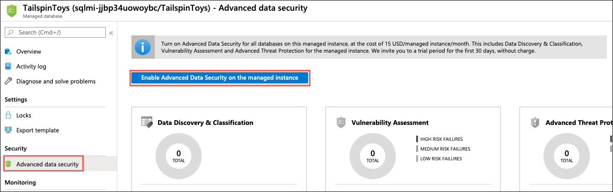

5. Within a few minutes, ADS is enabled for all databases on the Managed Instance. You will see the three tiles on the Advanced Data Security blade become enabled and populated with data when it has finished.

   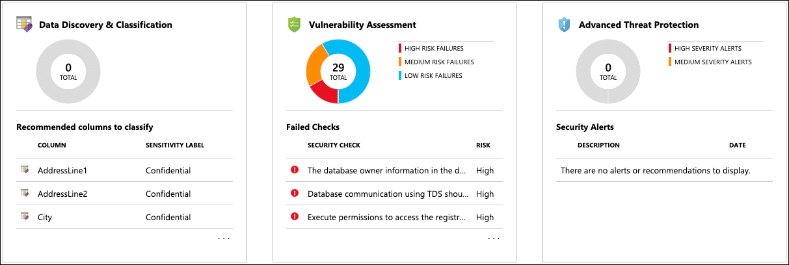

### Task 2: Configure SQL Data Discovery and Classification

In this task, you review the [SQL Data Discovery and Classification](https://docs.microsoft.com/sql/relational-databases/security/sql-data-discovery-and-classification?view=sql-server-2017) feature of Advanced Data Security. Data Discovery & Classification introduces a new tool for discovering, classifying, labeling, and reporting the sensitive data in your databases. It introduces a set of advanced services, forming a new SQL Information Protection paradigm aimed at protecting the data in your database, not just the database. Discovering and classifying your most sensitive data (e.g., business, financial, healthcare) can play a pivotal role in your organizational information protection stature.

1. On the Advanced Data Security blade, select the **Data Discovery & Classification** tile.

   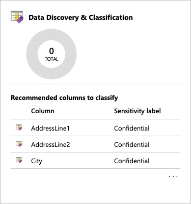

2. In the **Data Discovery & Classification** blade, select the info link with the message **We have found 35 columns with classification recommendations**.

   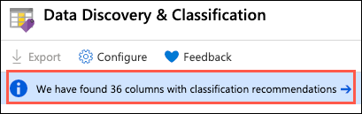

3. Look over the list of recommendations to get a better understanding of the types of data and classifications that can be assigned, based on the built-in classification settings. In the list of classification recommendations, select the recommendation for the **Sales - CreditCard - CardNumber** field.

   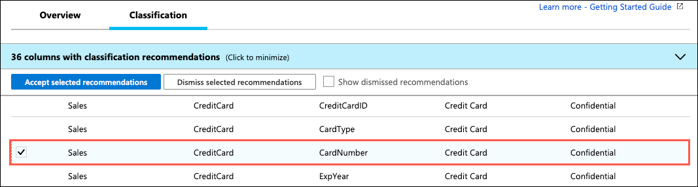

4. Due to the risk of exposing credit card information, WWI would like a way to classify it as highly confidential, not just **Confidential**, as the recommendation suggests. To correct this, select **+ Add classification** at the top of the Data Discovery & Classification blade.

   

5. Quickly expand the **Sensitivity label** field, and review the various built-in labels from which you can choose. You can also add custom labels, should you desire.

   

6. In the Add classification dialog, enter the following:

   - **Schema name**: Select **Sales**.
   - **Table name**: Select **CreditCard**.
   - **Column name**: Select **CardNumber (nvarchar)**.
   - **Information type**: Select **Credit Card**.
   - **Sensitivity level**: Select **Highly Confidential**.

   

7. Select **Add classification**.

8. Notice that the **Sales - CreditCard - CardNumber** field disappears from the recommendations list, and the number of recommendations drops by 1.

9. Select **Save** on the toolbar of the Data Classification window. It may take several minutes for the save to complete.

   

10. Other recommendations you can review are the **HumanResources - Employee** fields for **NationIDNumber** and **BirthDate**. Note that the recommendation service flagged these fields as **Confidential - GDPR**. WWI maintains data about gamers from around the world, including Europe, so having a tool that helps them discover data that may be relevant to GDPR compliance is very helpful.

    

11. Check the **Select all** checkbox at the top of the list to select all the remaining recommended classifications, and then select **Accept selected recommendations**.

    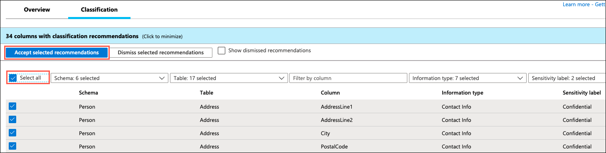

12. Select **Save** on the toolbar of the Data Classification window. It may take several minutes for the save to complete.

    

    > **Note**: If you receive an error when saving, try returning to the Advanced Data Security blade, and selecting the Data Discovery & Classification tile again to see the results.

13. When the save completes, select the **Overview** tab on the Data Discovery & Classification blade to view a report with a full summary of the database classification state.

    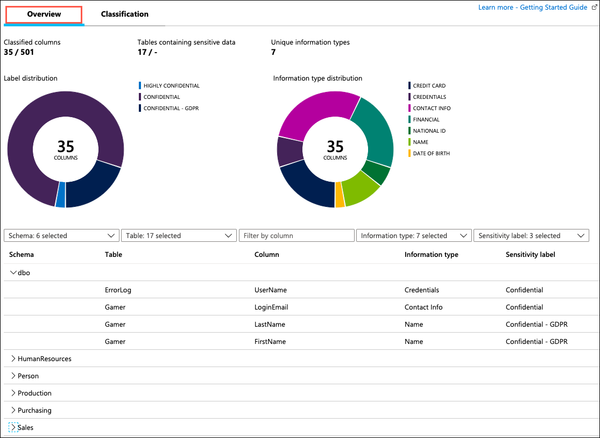

### Task 3: Review an Advanced Data Security Vulnerability Assessment

In this task, you review an assessment report generated by ADS for the `TailspinToys` database and take action to remediate one of the findings in the `TailspinToys` database. The [SQL Vulnerability Assessment service](https://docs.microsoft.com/azure/sql-database/sql-vulnerability-assessment) is a service that provides visibility into your security state and includes actionable steps to resolve security issues and enhance your database security.

1. Return to the **Advanced Data Security** blade for the `TailspinToys` Managed database and then select the **Vulnerability Assessment** tile.

   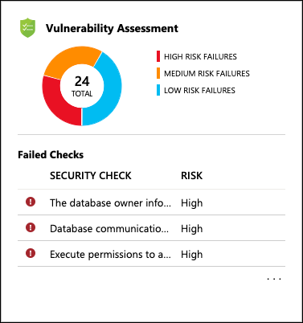

2. On the Vulnerability Assessment blade, select **Scan** on the toolbar.

   

3. When the scan completes, a dashboard displaying the number of failing and passing checks, along with a breakdown of the risk summary by severity level is displayed.

   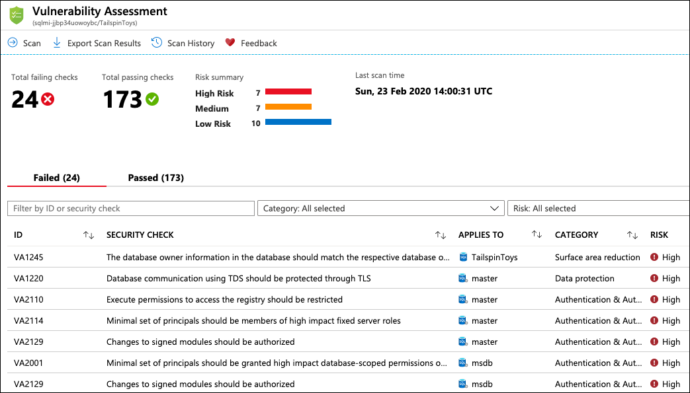

4. In the scan results, take a few minutes to browse both the Failed and Passed checks, and review the types of checks that are performed. In the **Failed** the list, locate the security check for **Transparent data encryption**. This check has an ID of **VA1219**.

   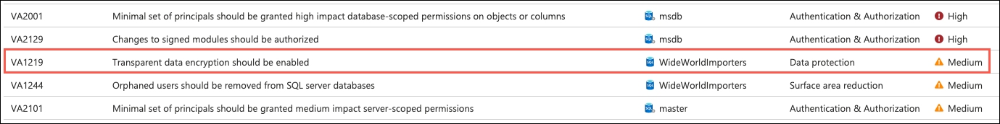

5. Select the **VA1219** finding to view the detailed description.

   

   > The details for each finding provide more insight into the reason for the finding. Of note are fields describing the finding, the impact of the recommended settings, and details on remediation for the finding.

6. You will now act on the recommended remediation steps for the finding and enable [Transparent Data Encryption](https://docs.microsoft.com/azure/azure-sql/database/transparent-data-encryption-tde-overview?tabs=azure-portal) for the `TailspinToys` database. To accomplish this, switch over to using SSMS on your JumpBox VM for the next few steps.

   > **Note**: Transparent data encryption (TDE) needs to be manually enabled for Azure SQL Managed Instance. TDE helps protect Azure SQL Database, Azure SQL Managed Instance, and Azure Data Warehouse against the threat of malicious activity. It performs real-time encryption and decryption of the database, associated backups, and transaction log files at rest without requiring changes to the application.

7. On your JumpBox VM, open Microsoft SQL Server Management Studio 18 from the Start menu, and enter the following information in the **Connect to Server** dialog.

   - **Server name**: Enter the fully qualified domain name of your SQL managed instance, which you copied from the Azure Cloud Shell in a previous task.
   - **Authentication**: Select **SQL Server Authentication**.
   - **Login**: Enter `sqlmiuser`
   - **Password**: Enter `Password.1234567890`
   - Check the **Remember password** box.

   

8. In SSMS, select **New Query** from the toolbar, paste the following SQL script into the new query window.

   ```sql
   USE TailspinToys;
   GO

   ALTER DATABASE [TailspinToys] SET ENCRYPTION ON
   ```

   > You turn transparent data encryption on and off on the database level. To enable transparent data encryption on a database in Azure SQL Managed Instance use must use T-SQL.

9. Select **Execute** from the SSMS toolbar. After a few seconds, you will see a message that the "Commands completed successfully."

10. You can verify the encryption state and view information the associated encryption keys by using the [sys.dm_database_encryption_keys view](https://docs.microsoft.com/sql/relational-databases/system-dynamic-management-views/sys-dm-database-encryption-keys-transact-sql). Select **New Query** on the SSMS toolbar again, and paste the following query into the new query window:

    ```sql
    SELECT * FROM sys.dm_database_encryption_keys
    ```

    

11. Select **Execute** from the SSMS toolbar. You will see two records in the Results window, which provide information about the encryption state and keys used for encryption.

    

    > By default, service-managed transparent data encryption is used. A transparent data encryption certificate is automatically generated for the server that contains the database.

12. Return to the Azure portal and the Advanced Data Security - Vulnerability Assessment blade of the `TailspinToys` managed database. On the toolbar, select **Scan** to start a new assessment of the database.

    

13. When the scan completes, select the **Failed** tab, enter **VA1219** into the search filter box, and observe that the previous failure is no longer in the Failed list.

    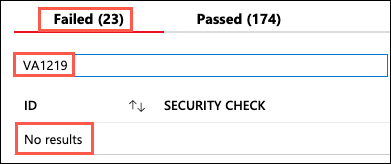

14. Now, select the **Passed** tab, and observe the **VA1219** check is listed with a status of **PASS**.

    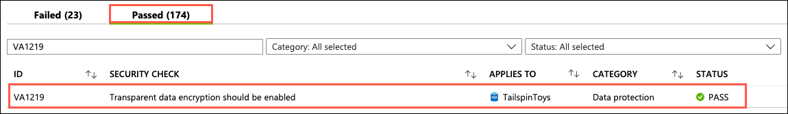

    > Using the SQL Vulnerability Assessment, it is simple to identify and remediate potential database vulnerabilities, allowing you to improve your database security proactively.

## Exercise 6: Enable Dynamic Data Masking

Duration: 15 minutes

In this exercise, you enable [Dynamic Data Masking](https://docs.microsoft.com/azure/sql-database/sql-database-dynamic-data-masking-get-started) (DDM) on credit card numbers in the `TailspinToys` database. DDM limits sensitive data exposure by masking it to non-privileged users. This feature helps prevent unauthorized access to sensitive data by enabling customers to designate how much of the sensitive data to reveal with minimal impact on the application layer. It is a policy-based security feature that hides the sensitive data in the result set of a query over designated database fields, while the data in the database is not changed.

> For example, a service representative at a call center may identify callers by several digits of their credit card number, but those data items should not be fully exposed to the service representative. A masking rule can be defined that masks all but the last four digits of any credit card number in the result set of any query. As another example, an appropriate data mask can be defined to protect personally identifiable information (PII) data, so that a developer can query production environments for troubleshooting purposes without violating compliance regulations.

### Task 1: Enable DDM on credit card numbers

When inspecting the data in the `TailspinToys` database using the ADS Data Discovery & Classification tool, you set the Sensitivity label for credit card numbers to Highly Confidential. In this task, you take another step to protect this information by enabling DDM on the `CardNumber` field in the `CreditCard` table. DDM prevents queries against that table from returning the full credit card number.

1. On your JumpBox VM, return to the SQL Server Management Studio (SSMS) window you opened previously.

2. Expand **Tables** under the **TailspinToys** database and locate the `Sales.CreditCard` table. Expand the table columns and observe that there is a column named `CardNumber`. Right-click the table, and choose **Select Top 1000 Rows** from the context menu.

   

3. In the query window that opens, review the Results, including the `CardNumber` field. Notice it is displayed in plain text, making the data available to anyone with access to query the database.

   

4. To be able to test the mask being applied to the `CardNumber` field, you first create a user in the database to use for testing the masked field. In SSMS, select **New Query** and paste the following SQL script into the new query window:

   ```sql
   USE [TailspinToys];
   GO

   CREATE USER DDMUser WITHOUT LOGIN;
   GRANT SELECT ON [Sales].[CreditCard] TO DDMUser;
   ```

   > The SQL script above creates a new user in the database named `DDMUser`, and grants that user `SELECT` rights on the `Sales.CreditCard` table.

5. Select **Execute** from the SSMS toolbar to run the query. You will get a message that the commands completed successfully in the Messages pane.

6. With the new user created, run a quick query to observe the results. Select **New Query** again, and paste the following into the new query window.

   ```sql
   USE [TailspinToys];
   GO

   EXECUTE AS USER = 'DDMUser';
   SELECT TOP 10 * FROM [Sales].[CreditCard];
   REVERT;
   ```

7. Select **Execute** from the toolbar and examine the Results pane. Notice the credit card number, as above, is visible in plain text.

   

8. You now apply DDM on the `CardNumber` field to prevent it from being viewed in query results. Select **New Query** from the SSMS toolbar and paste the following query into the query window to apply a mask to the `CardNumber` field, and select **Execute**.

   ```sql
   USE [TailspinToys];
   GO

   ALTER TABLE [Sales].[CreditCard]
   ALTER COLUMN [CardNumber] NVARCHAR(25) MASKED WITH (FUNCTION = 'partial(0,"xxx-xxx-xxx-",4)')
   ```

9. Run the `SELECT` query you opened in step 6 above again, and observe the results. Specifically, inspect the output in the `CardNumber` field. For reference, the query is below.

   ```sql
   USE [TailspinToys];
   GO

   EXECUTE AS USER = 'DDMUser';
   SELECT TOP 10 * FROM [Sales].[CreditCard];
   REVERT;
   ```

   

   > The `CardNumber` is now displayed using the mask applied to it, so only the last four digits of the card number are visible. Dynamic Data Masking is a powerful feature that enables you to prevent unauthorized users from viewing sensitive or restricted information. It's a policy-based security feature that hides the sensitive data in the result set of a query over designated database fields, while the data in the database is not changed.

### Task 2: Apply DDM to email addresses

From the findings of the Data Discovery & Classification report in ADS, you saw that email addresses are labeled Confidential. In this task, you use one of the built-in functions for making email addresses using DDM to help protect this information.

1. For this, you target the `LoginEmail` field in the `[dbo].[Gamer]` table. Open a new query window and execute the following script:

   ```sql
   USE [TailspinToys];
   GO

   SELECT TOP 10 * FROM [dbo].[Gamer]
   ```

   

2. Now, as you did above, grant the `DDMUser` `SELECT` rights on the [dbo].[Gamer]. In a new query window and enter the following script, and then select **Execute**:

   ```sql
   USE [TailspinToys];
   GO

   GRANT SELECT ON [dbo].[Gamer] to DDMUser;
   ```

3. Next, apply DDM on the `LoginEmail` field to prevent it from being viewed in full in query results. Select **New Query** from the SSMS toolbar and paste the following query into the query window to apply a mask to the `LoginEmail` field, and then select **Execute**.

   ```sql
   USE [TailspinToys];
   GO

   ALTER TABLE [dbo].[Gamer]
   ALTER COLUMN [LoginEmail] NVARCHAR(250) MASKED WITH (FUNCTION = 'Email()');
   ```

   > **Note**: Observe the use of the built-in `Email()` masking function above. This is one of several pre-defined masks available in SQL Server databases.

4. Run the `SELECT` query below, and observe the results. Specifically, inspect the output in the `LoginEmail` field. For reference, the query is below.

   ```sql
   USE [TailspinToys];
   GO

   EXECUTE AS USER = 'DDMUser';
   SELECT TOP 10 * FROM [dbo].[Gamer];
   REVERT;
   ```

   

## Exercise 7: Use online secondary for read-only queries

Duration: 15 minutes

In this exercise, you examine how you can use the automatically created online secondary for reporting, without feeling the impacts of a heavy transactional load on the primary database. Each database in the SQL MI Business Critical tier is automatically provisioned with several AlwaysON replicas to support the availability SLA. Using [**Read Scale-Out**](https://docs.microsoft.com/azure/sql-database/sql-database-read-scale-out) allows you to load balance Azure SQL Database read-only workloads using the capacity of one read-only replica.

### Task 1: View Leaderboard report in the WWI Tailspin Toys web application

In this task, you open a web report using the web application you deployed to your App Service.

1. In the [Azure portal](https://portal.azure.com), select **Resource groups** from the Azure services list.

   

2. Select the hands-on-lab-SUFFIX resource group from the list.

   

3. In the hands-on-lab-SUFFIX resource group, select the **tailspintoysUNIQUEID** App Service from the list of resources.

   

4. On the App Service overview blade, select the **URL** to open the web application in a browser window.

   

5. In the WWI Tailspin Toys web app, select **Leaderboard** from the menu.

   

   > Note the `READ_WRITE` string on the page. This is the output from reading the `Updateability` property associated with the `ApplicationIntent` option on the target database. This can be retrieved using the SQL query `SELECT DATABASEPROPERTYEX(DB_NAME(), "Updateability")`.

### Task 2: Update read-only connection string

In this task, you enable Read Scale-Out for the `TailspinToys`database, using the `ApplicationIntent` option in the connection string. This option dictates whether the connection is routed to the write replica or a read-only replica. Specifically, if the `ApplicationIntent` value is `ReadWrite` (the default value), the connection is directed to the database's read-write replica. If the `ApplicationIntent` value is `ReadOnly`, the connection is routed to a read-only replica.

1. Return to the App Service blade in the Azure portal and select **Configuration** under Settings on the left-hand side.

   

2. On the Configuration blade, scroll down and locate the connection string named `TailspinToysReadOnlyContext` within the **Connection strings** section, and select the Pencil (edit) icon on the right.

   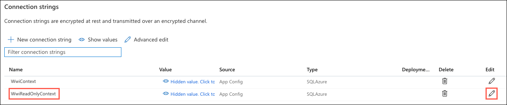

3. In the Add/Edit connection string dialog, select the **Value** for the `TailspinToysReadOnlyContext` and paste the following parameter to the end of the connection string.

   ```sql
   ApplicationIntent=ReadOnly;
   ```

4. The `TailspinToysReadOnlyContext` connection string should now look something like the following:

   ```sql
   Server=tcp:sqlmi-abcmxwzksiqoo.15b8611394c5.database.windows.net,1433;Database=TailspinToys;User ID=sqlmiuser;Password=Password.1234567890;Trusted_Connection=False;Encrypt=True;TrustServerCertificate=True;ApplicationIntent=ReadOnly;
   ```

5. Select **OK**.

6. Select **Save** at the top of the Configuration blade, and select **Continue** when prompted about the application being restarted.

   

### Task 3: Reload Leaderboard report in the Tailspin Toys web app

In this task, you refresh the Leaderboard report in WWI's Tailspin Toys web app, and observe the result.

1. Return to the Tailspin Toys gamer information website you opened previously, and refresh the **Leaderboard** page. The page should now look similar to the following:

   

   > Notice the `updateability` option is now displaying as `READ_ONLY`. With a simple addition to your database connection string, you can send read-only queries to the online secondary of your SQL MI Business-critical database, allowing you to load-balance read-only workloads using the capacity of one read-only replica. The SQL MI Business Critical cluster has built-in Read Scale-Out capability that provides free-of-charge built-in read-only node that can be used to run read-only queries that should not affect the performance of your primary workload.

## After the hands-on lab

Duration: 10 minutes

In this exercise, you de-provision all Azure resources that you created in support of this hands-on lab.

### Task 1: Delete Azure resource groups

1. In the Azure portal, select **Resource groups** from the left-hand menu, and locate and delete the **hands-on-lab-SUFFIX** following resource group.

   > **Note**: Deleting a resource group containing SQL MI does not always work the first time, resulting in a few networking components (route table, SQL MI NSG, and VNet) remaining in the resource group, along with the SQL MI instance, after the first delete attempt. In this case, wait for the first process to complete, and then attempt to delete the resource group a second time. You may need to allow several hours or more between delete attempts.

### Task 2: Delete the wide-world-importers service principal

1. In the Azure portal, select **Azure Active Directory** and then select **App registrations**.

2. Select the **wide-world-importers** application, and select **Delete** on the application blade.

You should follow all steps provided _after_ attending the Hands-on lab.
