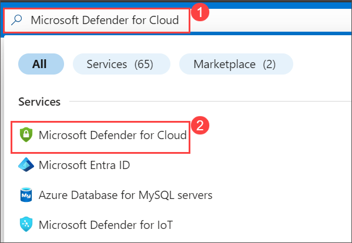
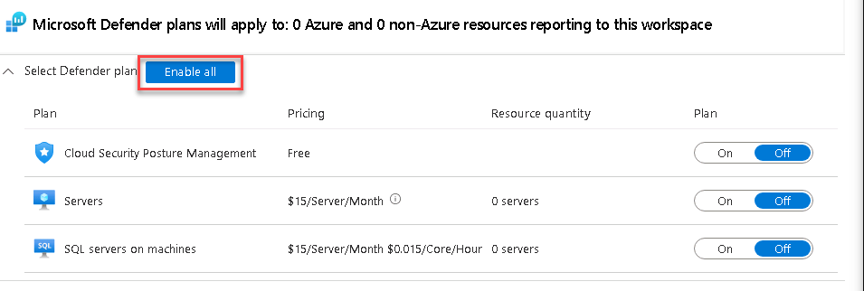

## Exercise 1 : Enable Microsoft Defender for Cloud (READ ONLY)

In this Exercise, you enable Microsoft Defender for Cloud by upgrading your Azure subscription and reviewing protected resources. You then configure the Defender plan for your Log Analytics workspace, enabling all available security features. After confirming monitoring extensions and Defender settings, the protection is applied to your environment. 

## Lab Objective

In this lab, you will perform the following:

Task 1 : Enable Microsoft Defender for Cloud

## Duration: 10 minutes

### Task 1: Enable Microsoft Defender for Cloud

In this task, you will enable and configure Microsoft Defender for Cloud.

1. In the Search bar of the Azure portal, type Defender, then select Microsoft Defender for Cloud.

      
     
1. Click the left menu and click on Getting started

1. On the Getting Started page, under the Upgrade tab, make sure your subscription is selected, and then select the Upgrade button at the bottom of the page. Wait for the Trial started notification to appear, it takes about 2 minutes. Hint: You can click the bell button on the top bar to review your Azure portal notifications.

1. In the left menu for Microsoft Defender for Cloud, under Management, select Environment settings.

1. Select the "Azure HOL XXXX" subscription (or equivalent name in your Language).

1. Review the Azure resources that are now protected with the Defender for Cloud plans.

1. Select the Settings & monitoring tab from the Settings area (next to Save).

1. Review the monitoring extensions. Confirm that Log Analytics agent/Azure Monitor agent is Off. Close the Settings & monitoring page by selecting the 'X' on the upper right of the page.

1. Close the settings page by selecting the 'X' on the upper right of the page to go back to the Environment settings and select the '>' to the left of your subscription.

1. Select the Log Analytics workspace you created earlier uniquenameDefender to review the available options and pricing.

1. Select Enable all (to the right of Select Defender plan) and then select Save. Wait for the "Microsoft Defender plan for workspace uniquenameDefender was saved successfully!" notification to appear.

    
   
   >**Note** : If the page is not being displayed, refresh your Edge browser and try again.

1. Close the Defender plans page by selecting the 'X' on the upper right of the page to go back to the Environment settings.

### Summary 
By the end of this task, Microsoft Defender for Cloud will be fully configured to protect your subscription and resources.

### Review

In this lab, you have completed:

- Enable Microsoft Defender for Cloud

### Proceed with the next lab by clicking on Next>>.
