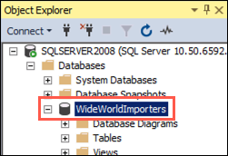

## Exercise 1: Perform database assessments

Duration: 20 minutes

In this exercise, you use the Microsoft Data Migration Assistant (DMA) to perform assessments on the `WideWorldImporters` database. You create two assessments: one for SQL DB and a second for SQL MI. These assessments provide reports about any feature parity and compatibility issues between the on-premises database and the Azure managed SQL database service options.

> DMA helps you upgrade to a modern data platform by detecting compatibility issues that can impact database functionality in your new version of SQL Server or Azure SQL Database. DMA recommends performance and reliability improvements for your target environment and allows you to move your schema, data, and uncontained objects from your source server to your target server. To learn more, read the [Data Migration Assistant documentation](https://docs.microsoft.com/sql/dma/dma-overview?view=azuresqldb-mi-current).

### Task 1: Connect to the WideWorldImporters database on the Sql2008-SUFFIX VM

In this task, you perform some configuration for the `WideWorldImporters` database on the SQL Server 2008 R2 instance to prepare it for migration.

### Task 1: Connect to the WideWorldImporters database on the SqlServer2008 VM

In this task, you perform some configuration for the `WideWorldImporters` database on the SQL Server 2008 R2 instance to prepare it for migration.


1. Navigate to the [Azure portal](https://portal.azure.com) and select **Resource groups** from the Azure services list.

   

1. Select the hands-on-lab-SUFFIX resource group from the list.

   

1. In the list of resources for your resource group, select the Sql2008-SUFFIX VM.

   

1. On the Sql2008-SUFFIX VM blade in the Azure portal, select **Overview** from the left-hand menu, and then select **Connect** and **RDP** on the top menu, as you've done previously.

   

1. On the Connect with RDP blade, select **Download RDP File**, then open the downloaded RDP file.

1. Select **Connect** on the Remote Desktop Connection dialog.

   

1. Enter the following credentials when prompted, and then select **OK**:

   - **Username**: `sqlmiuser`
   - **Password**: `Password.1234567890`

   

1. Select **Yes** to connect if prompted that the remote computer's identity cannot be verified.

   

1. Once logged in, open **Microsoft SQL Server Management Studio 17** (SSMS) by entering "sql server" into the search bar in the Windows Start menu and selecting **Microsoft SQL Server Management Studio 17** from the search results.

   

1. In the SSMS **Connect to Server** dialog, enter **SQL2008-SUFFIX** into the Server name box, ensure **Windows Authentication** is selected, and then select **Connect**.

    

1. Once connected, verify you see the `WideWorldImporters` database listed under databases.

    

    > **Important**
    >
    > If you do not see the `WideWorldImporters` database listed, the configuration script used by the ARM template may have failed during the VM setup. In this case, you should follow the steps under Task 12 of the [Manual-resource-setup guide](./Manual-resource-setup.md) to **manually restore and configure the database**.
    
1. Select **New Query** from the SSMS toolbar.

    

1. Next, copy and paste the SQL script below into the new query window. This script enables Service broker and changes the database recovery model to FULL.

    ```sql
    USE master;
    GO

    -- Update the recovery model of the database to FULL and enable Service Broker
    ALTER DATABASE WideWorldImporters SET
    RECOVERY FULL,
    ENABLE_BROKER WITH ROLLBACK IMMEDIATE;
    GO
    ```

1. To run the script, select **Execute** from the SSMS toolbar.

    

### Task 2: Perform assessment for migration to Azure SQL Database

In this task, you use the Microsoft Data Migration Assistant (DMA) to assess the `WideWorldImporters` database against Azure SQL Database (Azure SQL DB). The assessment provides a report about any feature parity and compatibility issues between the on-premises database and the Azure SQL DB service.

1. On the SqlSever2008 VM, launch DMA from the Windows Start menu by typing "data migration" into the search bar and then selecting **Microsoft Data Migration Assistant** in the search results.

   

2. In the DMA dialog, select **+** from the left-hand menu to create a new project.

   

3. In the New project pane, set the following:

   - **Project type**: Select **Assessment**.
   - **Project name**: Enter `ToAzureSqlDb`
   - **Assessment type**: Select **Database Engine**.
   - **Source server type**: Select **SQL Server**.
   - **Target server type**: Select **Azure SQL Database**.

   

4. Select **Create**.

5. On the **Options** screen, ensure **Check database compatibility** and **Check feature parity** are checked and then select **Next**.

   

6. On the **Sources** screen, enter the following into the **Connect to a server** dialog that appears on the right-hand side:

   - **Server name**: Select **SQL2008-SUFFIX**.
   - **Authentication type**: Select **SQL Server Authentication**.
   - **Username**: Enter `WorkshopUser`
   - **Password**: Enter `Password.1234567890`
   - **Encrypt connection**: Check this box.
   - **Trust server certificate**: Check this box.

   

7. Select **Connect**.

8. On the **Add sources** dialog that appears next, check the box for **WideWorldImporters** and select **Add**.

   

9. Select **Start Assessment**.

   

10. Review the migration assessment to determine the possibility of migrating to Azure SQL DB.

    

    > The DMA assessment for migrating the `WideWorldImporters` database to a target platform of Azure SQL DB reveals features in use that are not supported. These features, including Service broker, prevent WWI from migrating to the Azure SQL DB PaaS offering without making changes to their database.

### Task 3: Perform assessment for migration to Azure SQL Managed Instance

With one PaaS offering ruled out due to feature parity, perform a second DMA assessment against Azure SQL Managed Instance (SQL MI). The assessment provides a report about any feature parity and compatibility issues between the on-premises database and the SQL MI service.

1. To get started, select **+** on the left-hand menu in DMA to create another new project.

   

2. In the New project pane, set the following:

   - **Project type**: Select **Assessment**.
   - **Project name**: Enter `ToSqlMi`
   - **Assessment type**: Select **Database Engine**.
   - **Source server type**: Select **SQL Server**.
   - **Target server type**: Select **Azure SQL Database Managed Instance**.

   

3. Select **Create**.

4. On the **Options** screen, ensure **Check database compatibility** and **Check feature parity** are checked and then select **Next**.

   

5. On the **Sources** screen, enter the following into the **Connect to a server** dialog that appears on the right-hand side:

   - **Server name**: Select **SQL2008-SUFFIX**.
   - **Authentication type**: Select **SQL Server Authentication**.
   - **Username**: Enter `WorkshopUser`
   - **Password**: Enter `Password.1234567890`
   - **Encrypt connection**: Check this box.
   - **Trust server certificate**: Check this box.

   

6. Select **Connect**.

7. On the **Add sources** dialog that appears next, check the box for **WideWorldImporters** and select **Add**.

   

8. Select **Start Assessment**.

   

9. Review the SQL Server feature parity and Compatibility issues options of the migration assessment to determine the possibility of migrating to Azure SQL Managed Instance.

   

   

   > **Note**
   >
   > The assessment report for migrating the `WideWorldImporters` database to a target platform of Azure SQL Managed Instance shows no feature parity and a note to validate full-text search functionality. The full-text search changes do not impact the migration of the `WideWorldImporters` database to SQL MI.

10. The database, including the Service Broker feature, can be migrated as is, providing an opportunity for WWI to have a fully managed PaaS database running in Azure. Previously, their only option for migrating a database using features incompatible with Azure SQL Database, such as Service Broker, was to deploy the database to a virtual machine running in Azure (IaaS) or modify the database and associated applications to remove the use of the unsupported features. The introduction of Azure SQL MI, however, provides the ability to migrate databases into a managed Azure SQL database service with _near 100% compatibility_, including the features that prevented them from using Azure SQL Database.
