# Exercise 1: Perform database assessments

In this lab, you will connect to the WideWorldImporters database on the SqlServer2008 VM and perform assessments for migration to Azure SQL Database and Azure SQL Managed Instance. These assessments will help you understand the compatibility and readiness of your database for migration to Azure. You will evaluate the database schema, data, and performance to identify any potential issues and determine the best migration strategy. This process ensures a smooth transition to Azure’s cloud services, leveraging their scalability, security, and advanced features.

## Lab Objective

In this lab, you will complete the following tasks:

- Task 1: Connect to the WideWorldImporters database on the SqlServer2008 VM
- Task 2: Perform assessment for migration to Azure SQL Database
- Task 3: Perform assessment for migration to Azure SQL Managed Instance

### Task 1: Connect to the WideWorldImporters database on the SqlServer2008 VM

In this task, you perform some configuration for the `WideWorldImporters` database on the SQL Server 2008 R2 instance to prepare it for migration.

1. Navigate to the [Azure portal](https://portal.azure.com) and select **Resource groups** from the Azure services list.

   

1. Select the **hands-on-lab-<inject key="Resource Group Name" enableCopy="false"/>** resource group from the list.

   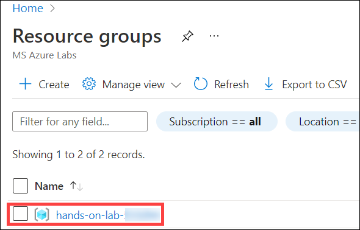

1. In the list of resources for your resource group, select the **<inject key="SQLVM Name" enableCopy="false"/>** VM.

   

1. From the overview page of  the **<inject key="SQLVM Name" enableCopy="false"/>** VM, select **Connect**.

    

1. On the **sql2008-<inject key="Suffix" enableCopy="false"/> | Connect** page, click on the **Select (1)** button in the **Native RDP** tile, on the **Native RDP** tab wait for **Configure prerequisites for Native RDP (2)** to validate, and then click on **Download RDP file (3)**. 
  
   

1. Click on **Keep**, on the Downloads pop-up. 

   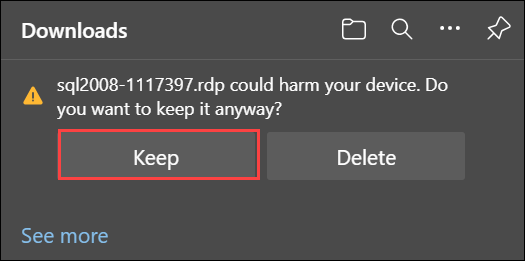

1. Click on **Open file**.

   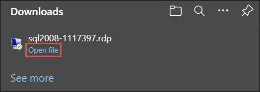

1. Next, on the RDP tab click on **Connect**.

   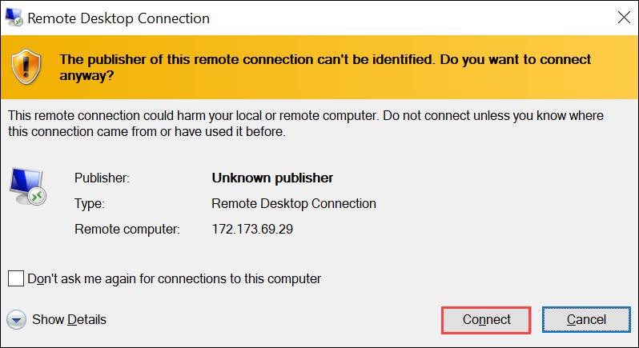

1. Enter the following credentials when prompted, and then select **OK**:

   - **Username**: `sqlmiuser`
   - **Password**: `Password.1234567890`

      

1. Select **Yes** to connect if prompted that the remote computer's identity cannot be verified.

   

1. Open file explorer on your **<inject key="SQLVM Name" enableCopy="false"/>** virtual machine, naviagate to C:\ drive and click on **IntegrationRuntime** installer.

   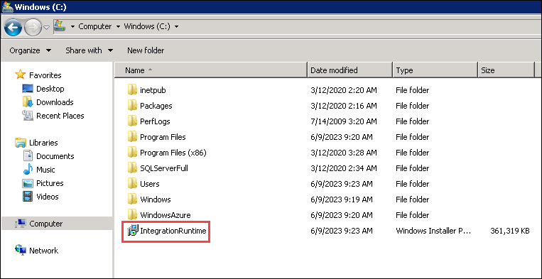

1. In **Welcome to the Microsoft Integration Runtime Setup Wizard**, click on **Next**.

   

1. In **End-User License Agreement**, select the checkbox **I accept the terms in the License Agreement**, and click on **Next**.

   

1. In **Destination Folder**, click on **Next**.

   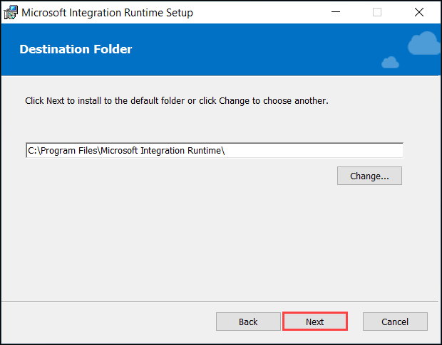

1. In **Ready to install Microsoft Integration Runtime**, click on **Install**.

   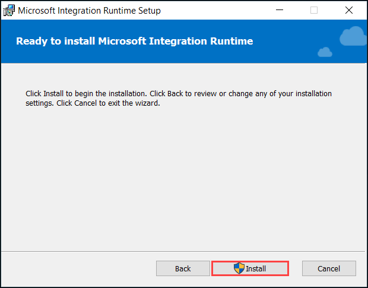

1. Once the deployment is completed click on **Finish** and minimize the application.

   

1. Next go back to LabVM, and open **Azure Data Studio** by entering "Azure Data Studio" into the search bar in the Windows Start menu and selecting **Azure Data Studio** from the search results.

   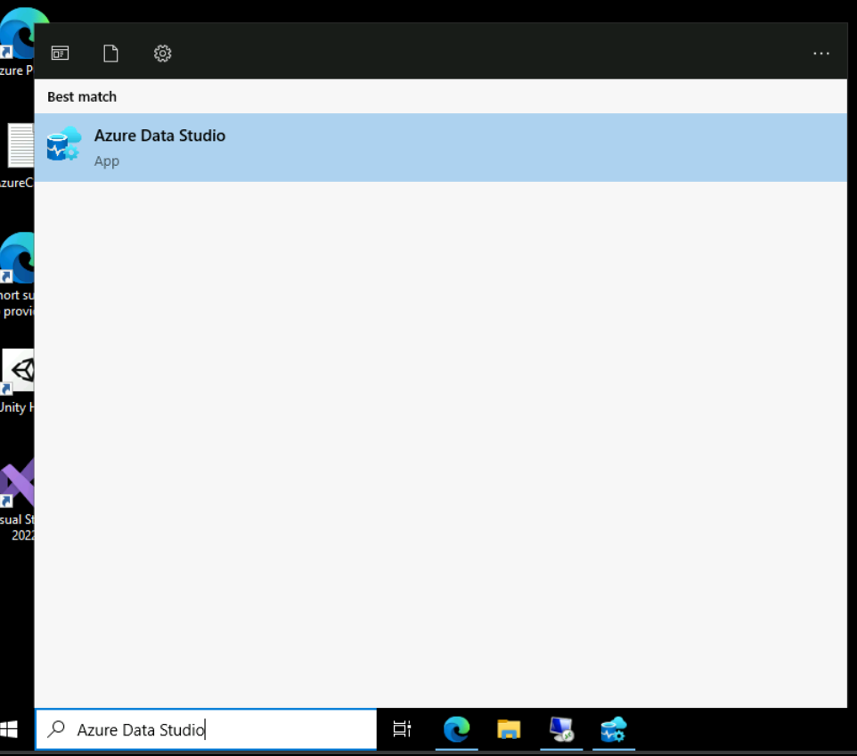
   
1. In the Azure Data Studio select **Extensions (1)** from the Activity Bar, enter **SQL Migration (2)** into the search bar, select **Azure SQL Migration (3)**, and click on **Install (4)**.  

   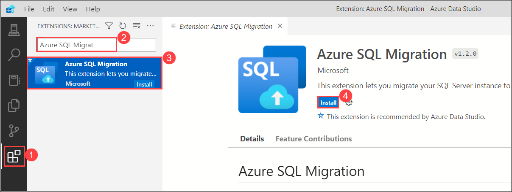

1. In the Azure Data Studio select **Connections (1)** from the Activity Bar, click on **New Connection (1)** dialog, enter **<inject key="SQLVM Name" /> (2)** into the Server name box, ensure **Windows Authentication** is selected, and then select **Connect (3)**.
  
    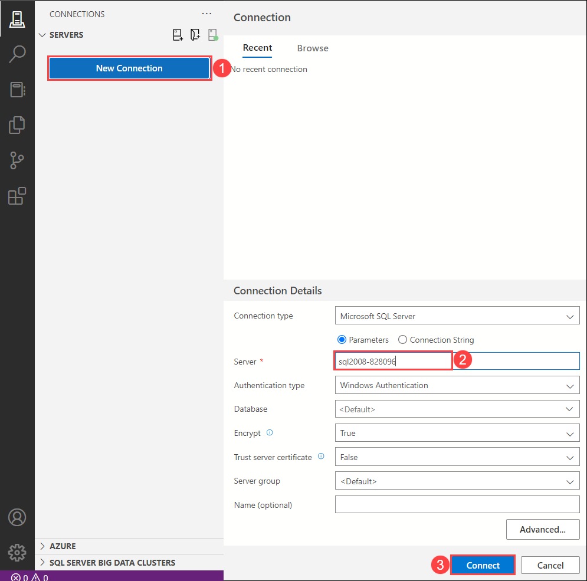
    
    > **Note**: If you see **Connection error** pop-up click on **Enable Trust server certificate**.

      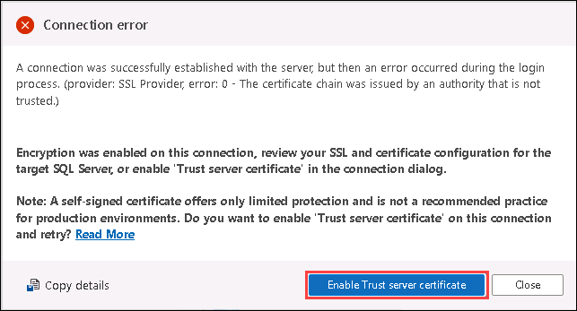

1. Once connected, verify you see the `WideWorldImporters` database listed under databases.

    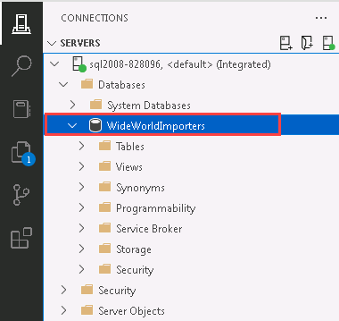

1. Right click on **<inject key="SQLVM Name" /> (1)**, click on **Manage (2)**, and select **New Query (3)** from the Azure Data Studio toolbar.

    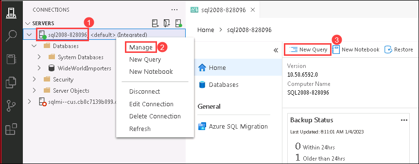

1. Next, copy and paste the SQL script below into the new query window. This script enables the Service broker and changes the database recovery model to FULL.

    ```sql
    USE master;
    GO

    -- Update the recovery model of the database to FULL and enable Service Broker
    ALTER DATABASE WideWorldImporters SET
    RECOVERY FULL,
    ENABLE_BROKER WITH ROLLBACK IMMEDIATE;
    GO
    ```

1. To run the script, select **Run** from the Azure Data Studio toolbar.

    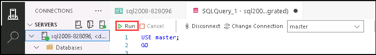

### Task 2: Perform assessment for migration to Azure SQL Database

In this task, you use the Microsoft Data Migration Assistant (DMA) to assess the `WideWorldImporters` database against the Azure SQL Database (Azure SQL DB). The assessment provides a report about any feature parity and compatibility issues between the on-premises database and the Azure SQL DB service.

1. In Azure Data Studio click on **Azure SQL migration** and click on **+ New migration**.

   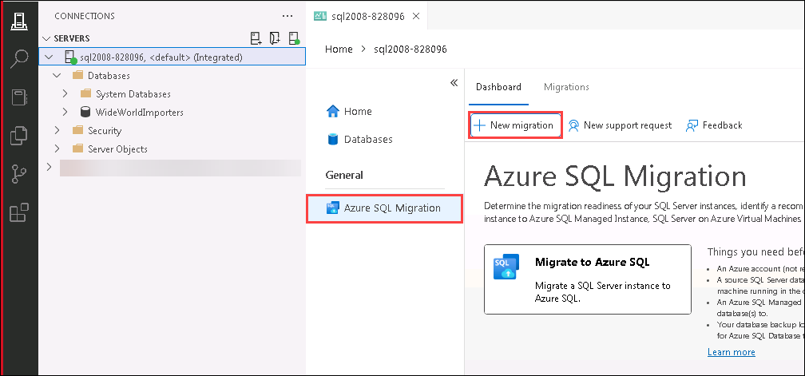

2. In **Step 1: Database for assessment**, select **widewordimplantation**, click on **Next**. 

   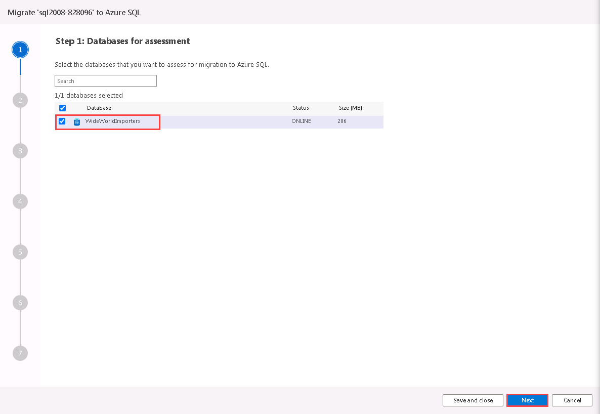

3. In **Step 2: Assessment summary and SKU recommendation (1)**, you will view the summary and SKU recommendations for your SQL server. Click on **Next (2)**. 

   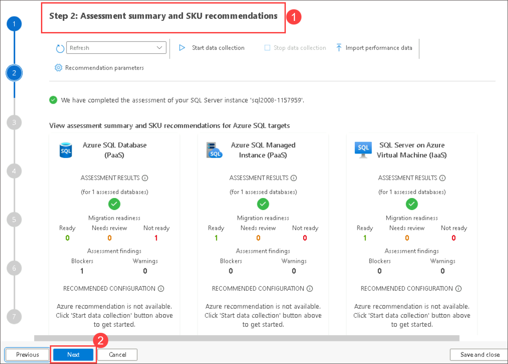

4. In **Step 3: Target Platform and Assessment Results**, Select **Azure SQL DataBase(1)** from the drop down. Then select **WideWorldImporters(2)** under the database, review the migration assessment to determine the possibility of migrating to Azure SQL DB, and Click on the **Cancel (3)** button.

   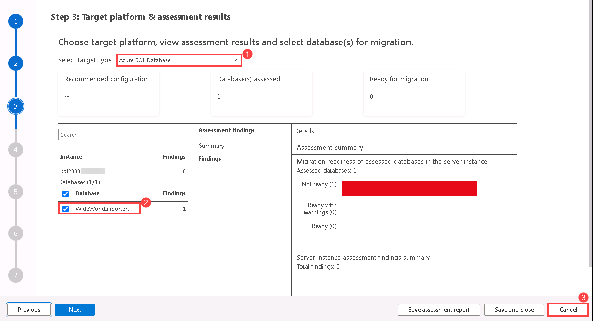

    > The DMA assessment for migrating the `WideWorldImporters` database to a target platform of Azure SQL DB reveals features in use that are not supported. These features, including Service broker, prevent WWI from migrating to the Azure SQL DB PaaS offering without making changes to their database.

### Task 3: Perform assessment for migration to Azure SQL Managed Instance

With one PaaS offering ruled out due to feature parity, perform a second DMA assessment against Azure SQL Managed Instance (SQL MI). The assessment provides a report about any feature parity and compatibility issues between the on-premises database and the SQL MI service.

1. In Azure Data Studio click on **Azure SQL migration** and click on **+ New migration**.

   

2. In **Step 1: Database for assessment**, select **widewordimplantation**, click on **Next**. 

   

3. In **Step 2: Assessment summary and SKU recommendation (1)**, you will view the summary and SKU recommendations for your SQL server. Click on **Next (2)**. 

   

4.  In **Step 3: Target Platform and Assessment Results**, Select **Azure SQL Managed Instance (1)** from the drop down. Then select **WideWorldImporters (2)** under the database, review the migration assessment to determine the possibility of migrating to Azure SQL DB, and Click on the **Cancel (3)** button.

   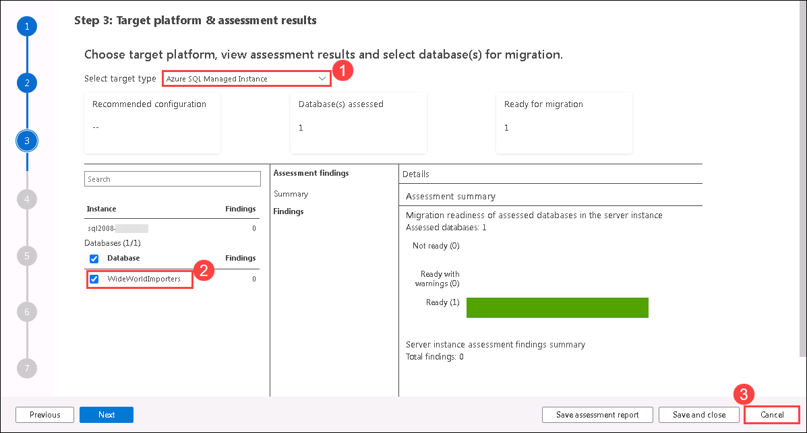

10. The database, including the Service Broker feature, can be migrated as is, providing an opportunity for WWI to have a fully managed PaaS database running in Azure. Previously, their only option for migrating a database using features incompatible with Azure SQL Database, such as Service Broker, was to deploy the database to a virtual machine running in Azure (IaaS) or modify the database and associated applications to remove the use of the unsupported features. The introduction of Azure SQL MI, however, provides the ability to migrate databases into a managed Azure SQL database service with _near 100% compatibility_, including the features that prevented them from using Azure SQL Database.
