# Exercise 3: Migrate the database to SQL MI

### Estimated Duration: 90 minutes

In this lab, you will migrate the WideWorldImporters database from a SQL Server 2022 VM to Azure SQL Managed Instance. You’ll start by setting up an SMB network share and configuring the MSSQLSERVER service to run under the sqlmiuser account. Then, you’ll back up the database, gather connection information, and create an online data migration project. Finally, you’ll perform the migration cutover and verify the database and transaction log migration. These steps ensure a smooth transition to Azure’s cloud services.

## Lab Objectives

In this lab, you will perform the following:

- Task 1: Create an SMB network share on the VM
- Task 2: Change MSSQLSERVER service to run under sqlmiuser account
- Task 3: Create a backup of the WideWorldImporters database
- Task 4: Retrieve SQL MI and SQL Server 2022 VM connection information
- Task 5: Create and run an online data migration project
- Task 6: Perform migration cutover
- Task 7: Verify database and transaction log migration

### Task 1: Create an SMB network share on the **sql2022-<inject key="Suffix" enableCopy="false"/>** VM

In this task, you create a new SMB network share on the **sql2022-<inject key="Suffix" enableCopy="false"/>** VM. DMS uses this shared folder for retrieving backups of the `WideWorldImporters` database during the database migration process.

1. On the **sql2022-<inject key="Suffix" enableCopy="false"/>** VM, open **Windows Explorer** by selecting its icon on the Windows Taskbar.

   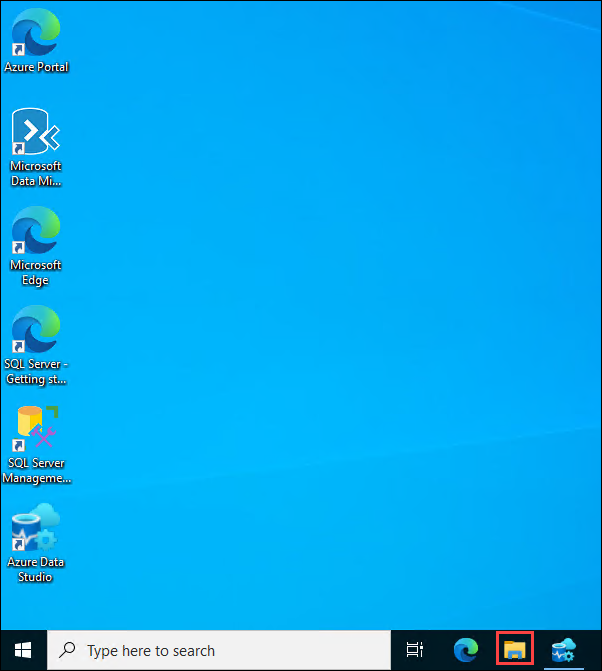

2. In the Windows Explorer window, expand **This PC** in the tree view, select **Windows (C:) (1)**, and then select **dms-backups (2)**. Right-click on the folder and select **Give access to (3)** and **Specific people... (4)** in the context menu.

      > **Note:** If the folder doesn't exist, please create a new folder with the name **dms-backups**.

   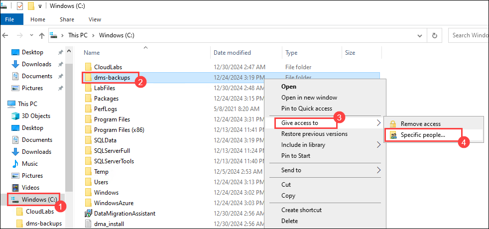

3. In the File Sharing dialog, ensure the **sqlmiuser** is listed with a **Read/Write** permission level, and then select **Share**.

   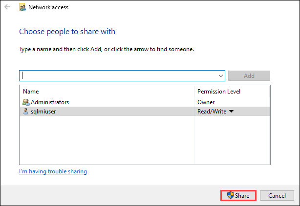

4. Back on the File Sharing dialog, note the shared folder's path, ```\\SQLVM2022\dms-backups```, and select **Done** to complete the sharing process.

   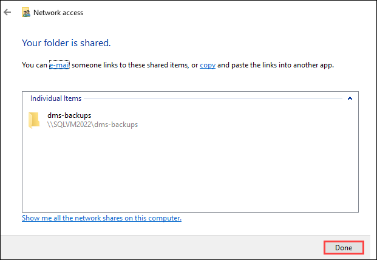

### Task 2: Change MSSQLSERVER service to run under sqlmiuser account

In this task, you use the SQL Server Configuration Manager to update the service account used by the SQL Server (MSSQLSERVER) service to the `sqlmiuser` account. Changing the account used for this service ensures it has the appropriate permissions to write backups to the shared folder.

1. On your **sql2022-<inject key="Suffix" enableCopy="false"/>** VM, select the **Start menu**, enter **SQL Server** into the search bar, and then select **SQL Server 2022 Configuration Manager** from the search results.

     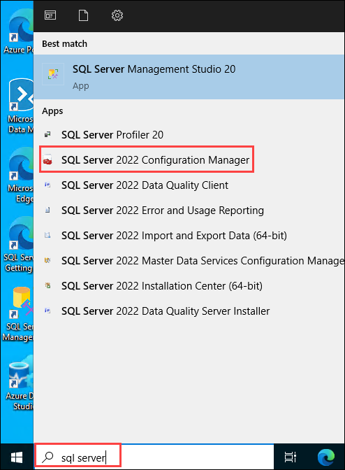

1. In the SQL Server Configuration Managed dialog, select **SQL Server Services (1)** from the tree view on the left, then right-click **SQL Server (MSSQLSERVER) (2)** in the list of services and select **Properties (3)** from the context menu.

     

1. In the SQL Server (MSSQLSERVER) Properties dialog, select **This account** under Log on as, and enter the following and click on **OK (4)**:

   - **Account name**: `sqlmiuser` **(1)**
   - **Password**: `Password.1234567890` **(2)**
   - **Confirm Password**: `Password.1234567890` **(3)**

     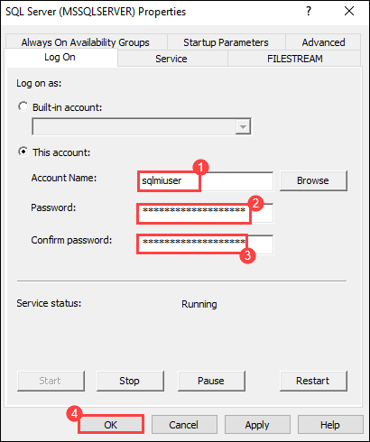

1. Select **Yes** in the Confirm Account Change dialog.

   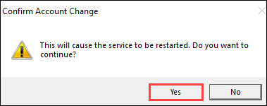
   
1. Click on **OK**.
 
1. Observe that the **Log On As** value for the SQL Server (MSSQLSERVER) service changed to `./sqlmiuser`.

   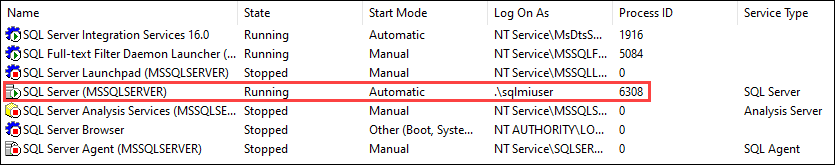

    >**Note**: If the change doesn't occur immediately, wait 1 to 2 minutes for the Log On As value for the SQL Server (MSSQLSERVER) service changed to `./sqlmiuser`.
    
1. Close the SQL Server Configuration Manager.

### Task 3: Create a backup of the WideWorldImporters database

To perform online data migrations, DMS looks for database and transaction log backups in the shared SMB backup folder on the source database server. In this task, you create a backup of the `WideWorldImporters` database using SSMS and write it to the ```\\SQL2022\dms-backups``` SMB network share you made in a previous task. The backup file needs to include a checksum, so you add that during the backup steps.

1. On the **sql2022-<inject key="Suffix" enableCopy="false"/>** VM, open **SQL Server Management Studio 20** by entering "sql server management" into the search bar in the Windows Start menu.

    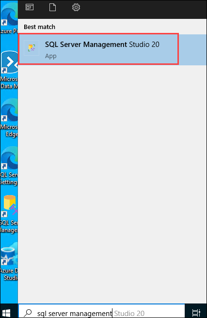

2. In the SSMS **Connect to Server** dialog, enter **SQLVM2022 (1)** into the Server name box, ensure **Windows Authentication (2)** is selected, check the box for **Trust server certificate (3)** and then select **Connect (4)**.

    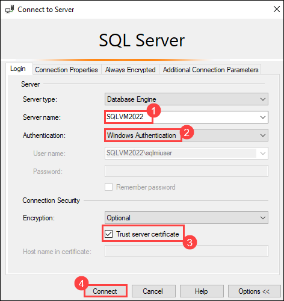

3. Once connected, expand **Databases** under **SQLVM2022** in the Object Explorer, and then right-click the **WideWorldImporters (1)** database. In the context menu, select **Tasks (2)** and then **Back Up... (3)**

    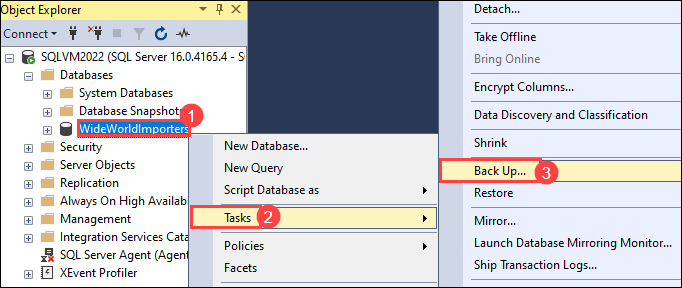

4. In the Back Up Database dialog, you should see `C:\WideWorldImporters.bak` listed in the Destinations box. This device is no longer needed, so select it and then select **Remove**.

    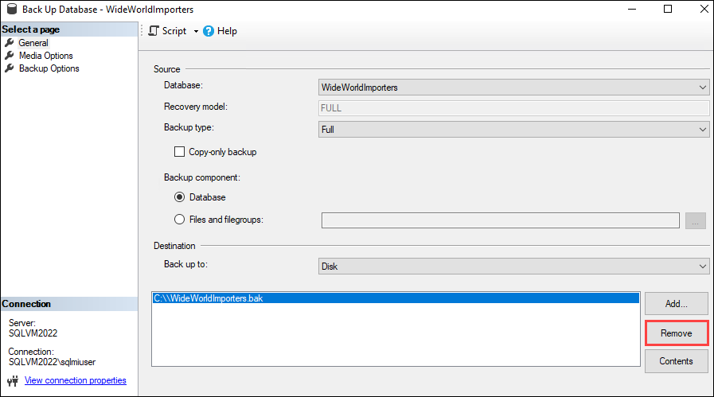

5. Next, select **Add** to add the SMB network share as a backup destination.

    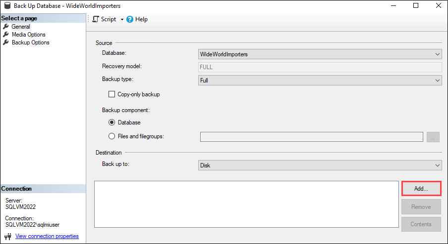

6. In the Select Backup Destination dialog, select the Browse (`...`) button.

    

7. In the Location Database Files dialog, select the **`C:\dms-backups` (1)** folder, enter **WideWorldImporters.bak (2)** into the File name field, and then select **OK (3)**.

    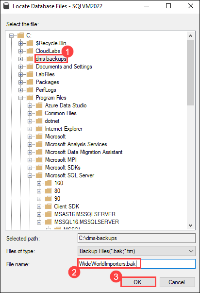

8. Select **OK** to close the Select Backup Destination dialog.

    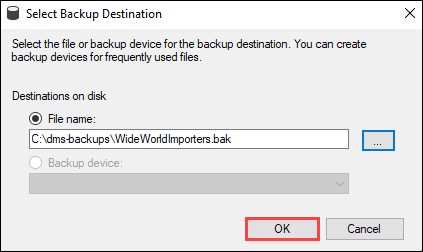

9. In the Back Up Database dialog box, select **Media Options (1)** in the Select a page pane, and then set the following:

   - Select **Back up to the existing media set** and then choose **Overwrite all existing backup sets (2)**.
   - Under **Reliability**, check the box for **Perform checksum before writing to media (3)**. A checksum is required by DMS when using the backup to restore the database to SQL MI. then Select **OK (4)** to perform the backup.

       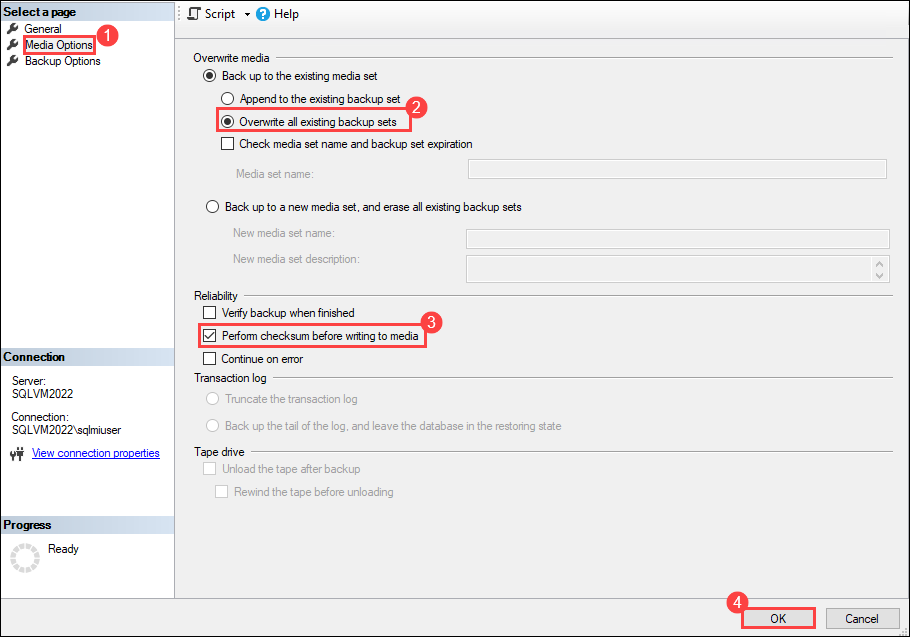

10. You will receive a message when the backup is complete. Select **OK**.

    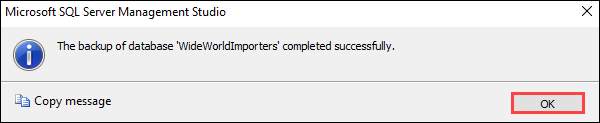

    > **Congratulations** on completing the task! Now, it's time to validate it. Here are the steps:
    - If you receive a success message, you can proceed to the next task.
    - If not, carefully read the error message and retry the step, following the instructions in the lab guide.
    - If you need any assistance, please contact us at cloudlabs-support@spektrasystems.com. We are available 24/7 to help you out.
    
      <validation step="050bb3d9-aedd-4284-89b9-9fbf3a0ee6bb" />

### Task 4: Retrieve SQL MI and SQL Server 2022 VM connection information

In this task, you use the Azure Cloud shell to retrieve the information necessary to connect to your sql2022-<inject key="Suffix" enableCopy="false"/> VM from DMS.

1. In the Azure portal `https://portal.azure.com`, select the Azure Cloud Shell icon from the top menu.

    

2. In the Cloud Shell window that opens at the bottom of your browser window, select **PowerShell**.

   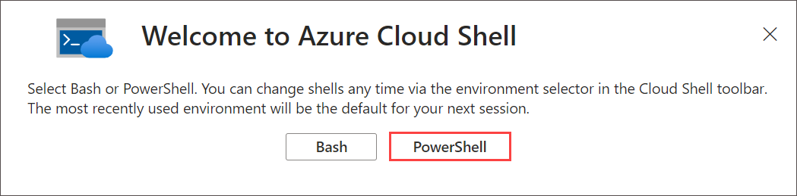

3. On the Getting Started , Choose **mount a storage account (1)** select the **exisitng subscription (2)** then click on **Apply (3)**.

   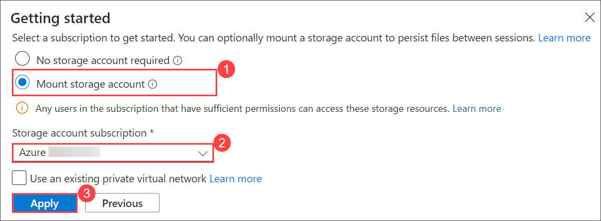

4. Choose **I want to create a storage account (1)** , Click on **Next (2)**.

   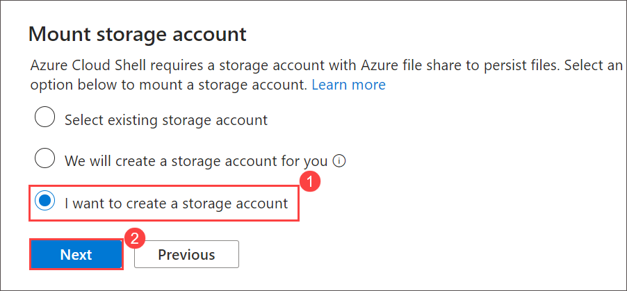

5. Specify the following values and click on **Create (6)** to create storage account: 
      - Subscription: Accept the **default (1)**
      - Resource Group: Select **<inject key="Resource Group Name" enableCopy="false"/>** **(2)**
      - Region: **Central US (3)**
      - Storage account: **storage<inject key="Suffix" enableCopy="false"/>** **(4)**
      - File Share: **blob (5)**
      
         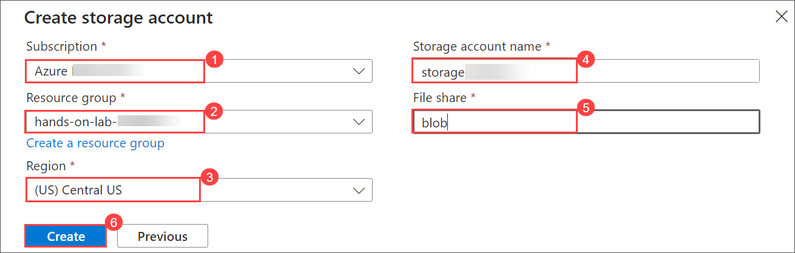

6. After a moment, a message is displayed that you have successfully requested a Cloud Shell, and you are presented with a PS Azure prompt.

   

7. At the prompt, run the below command to retrieve information about SQL MI in the SQLMI-Shared-RG resource group by entering the following PowerShell command.

   ```PowerShell
   $resourceGroup = "SQLMI-Shared-RG"
   az sql mi list --resource-group $resourceGroup
   ```

8. Within the above command's output, locate and copy the value of the **`fullyQualifiedDomainName`** property. Paste the value into a text editor such as Notepad.exe which will be used in later steps, for reference below.

   

### Task 5: Create and run an online data migration project

In this task, you create a new online data migration project in DMS for the `WideWorldImporters` database.

1. In Azure Data Studio click on >  **SQLVM2022 (1)** **Azure SQL migration (2)** and select **+ New migration (3)**.

    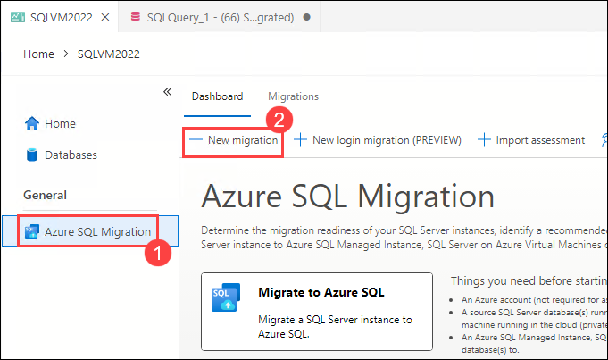

2. In **Step 1: Database for assessment** blade, select **widewordimporters**, click on **Next**. 

     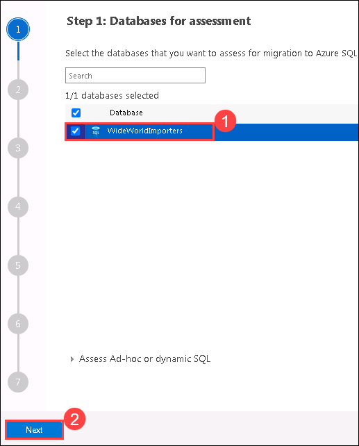

3. In **Step 2: Assessment summary and SKU recommendation (1)**, you will view the summary and SKU recommendations for your SQL server. Click on **Next (2)**. 

   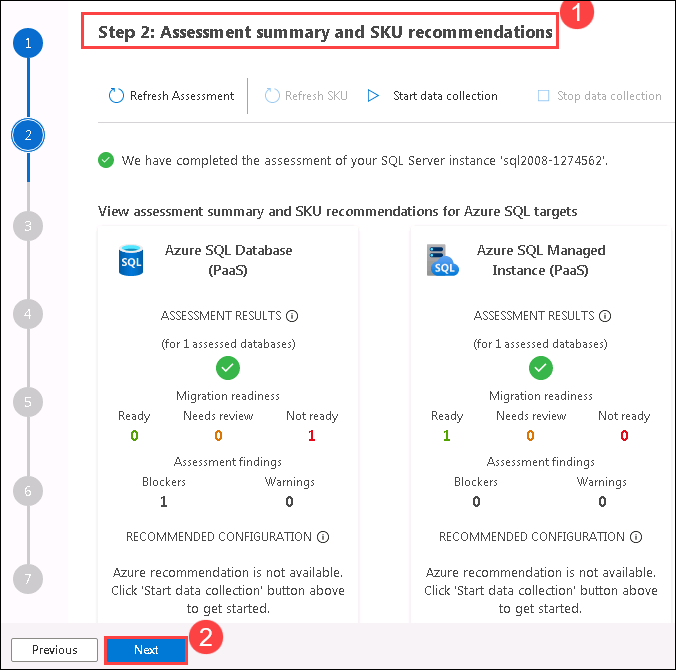

4. In **Step 3: Target Platform and Assessment Results**, Select **Azure SQL Managed Instance (1)** from the drop down. Ensure **WideWorldImporters (2)** is selected under the Database option and click on the **Next**.

   

5. In **Step 4: Azure SQL target** blade, click on **Link account (1)**, and click on **Add an account (2)**.

      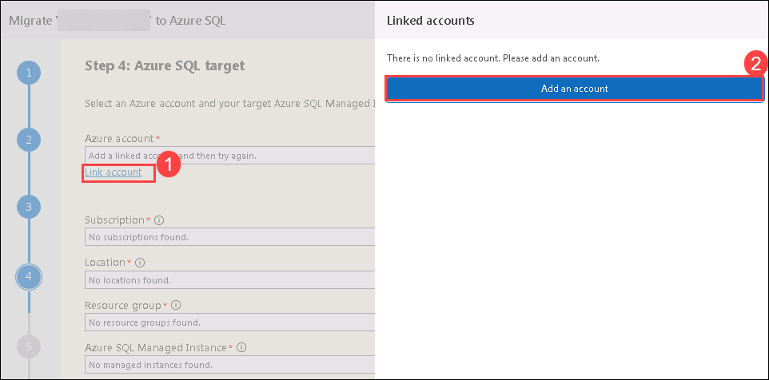
   
6. You'll be redirect to a web page, log in using your below **Azure credentials**. Once your account has been added successfully. go back to the Azure Data Studio, and click on **close**. 

   >**Note**: Click on **OK** on the **Internet Explorer** page to dismiss any pop-ups. Then, select the **Sign In** tab and enter the **Azure credentials** mentioned below.

   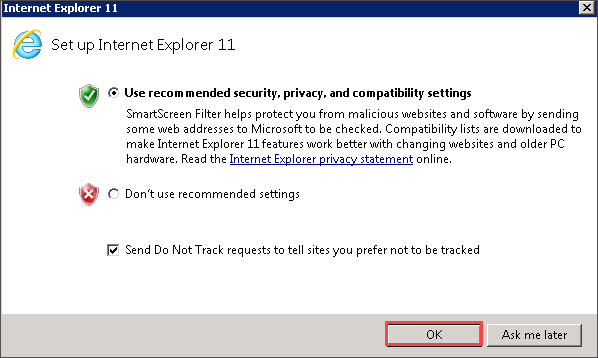

   - **Email/Username**: <inject key="AzureAdUserEmail"></inject>
   - **Password**: <inject key="AzureAdUserPassword"></inject>

7. The field will be populated with the details and click on **Next**. 

   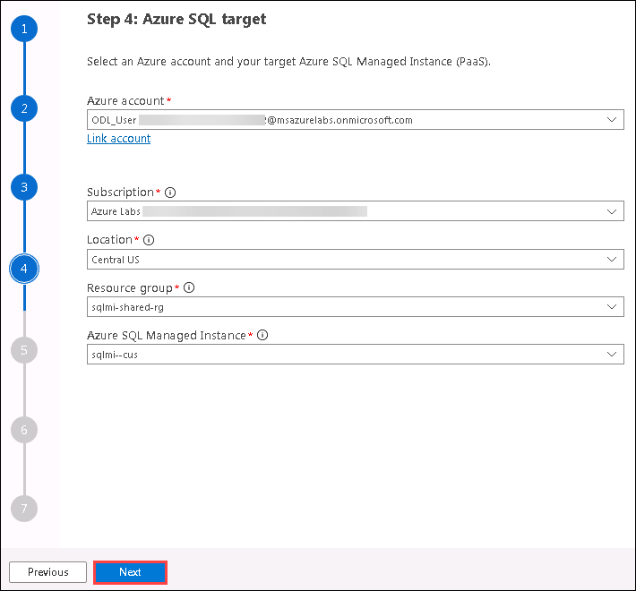

      > **Note**: If you encounter an error indicating that the **Azure SQL Managed Instance** is in a stopped state, please navigate to the Azure Portal, search for **Azure SQL Managed Instance**, and start the instance.
   
8. In **Step 5: Azure Database Migration Service** blade, select the following details and click on **ConfigurelntegrationRuntime**
   
   - **Online migration** **(1)**, 
   - Select the location of the database backups to use during migration: **My database backups are on a network share** **(2)**.
   - **Subscription**: Select the available Subscription **(3)**.
   - **Resource group**: From the drop-down search and select **hands-on-lab-<inject key="Suffix"  enableCopy="false"/>** **(4)**.
   - **Azure Database Migration Service**: Select **wwi-dms** **(5)**. 

       
   
9. In the **Configure integration Runtime** select **I want to set up self-hosted integration runtime on another Windows machine that is not my local machine** **(1)** scroll down till Configure manually expand **Configure manually** **(2)** Copy any of the **Authentication keys** **(3)** to the notepad as it will be used later in the task, and minimize the **Azure Data Studio**.  

   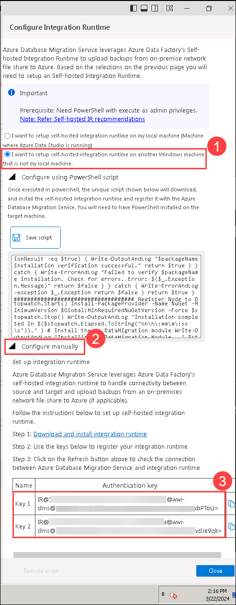
   
   > **Note**: Don't close/cancel Azure Data Studio.

10. On the **JumpBox-<inject key="Suffix"  enableCopy="false"/>** VM , in the search bar next to start search for `Microsoft Integration Runtime`
   
      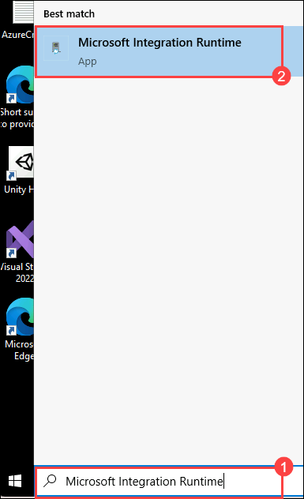
   
   > **Note**: If you do not find Integration Runtime in the Jumpbox VM, you can install it from **C:** drive location in the VM.
   
11. Paste the **Authentication key** in the box that you coped in earlier in the task and click on **Register**.

    

12. In the New Integration Runtime (Self-hosted) Node leave default and click on **Finish**.

    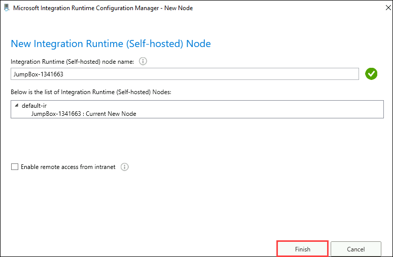

13. Wait for the Integration Runtime to be successful to continue further.

    

14. Navigate back to the **Azure Data Studio**, close **Configure integration Runtime**, in the **Step 5: Azure Database Migration Service** click on **Refresh** **(1)** button you can view the **connected nodes** **(2)** and click on **Next** **(3)**. 

    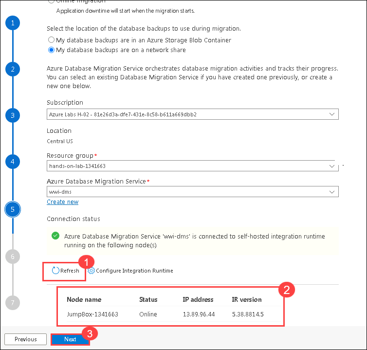
          
15. In **Step 6: Data source configuration** blade, enter the following details and click on **Run Validation** **(8)**:

      > **Note**: Make sure to replace the SUFFIX value with <inject key="Suffix" />   
 
      - **Password**: Enter **Password.1234567890** **(1)**
      - **Windows user account with read access to the network share location**: Enter **SQL2022-<inject key="Suffix"  enableCopy="false"/>\sqlmiuser** **(2)** 
      - **Password**: Enter **Password.1234567890** **(3)**
      - **Resource Group**: Select **hands-on-lab-<inject key="Suffix"  enableCopy="false"/>** **(4)**
      - **Storage account**: Select the **sqlmistore<inject key="Suffix"  enableCopy="false"/>** **(5)** storage account. 
      - **Target database name**: Enter **WideWorldImporters<inject key="Suffix"  enableCopy="false"/>** **(6)**.
      - **Network share path**: Enter **\\\SQLVM2022\dms-backups** **(7)**.

         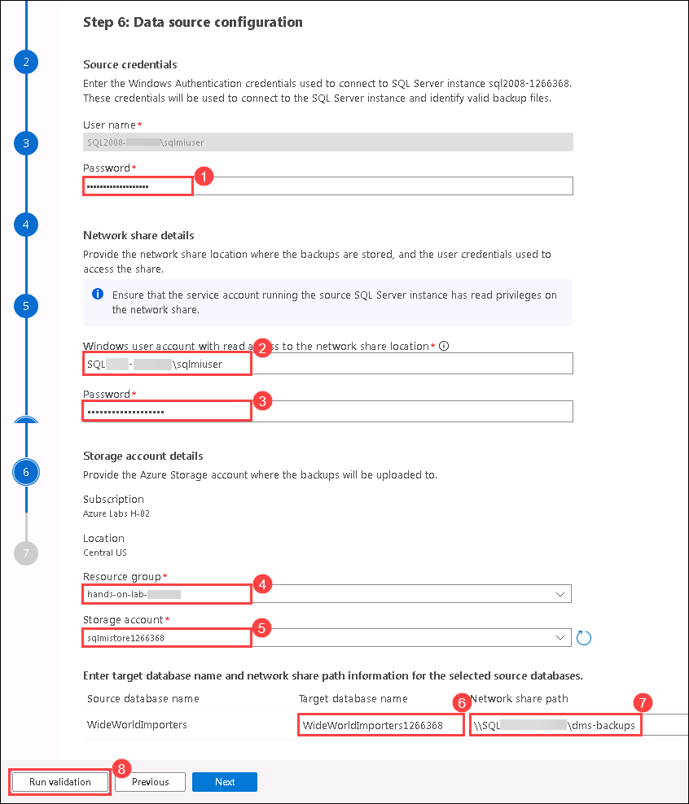

16. In the Run Validate page wait till all the validation steps are successful then click on **Done**.

      

17. Once you back to **Step 6: Data source configuration** blade, click on **Next**.

      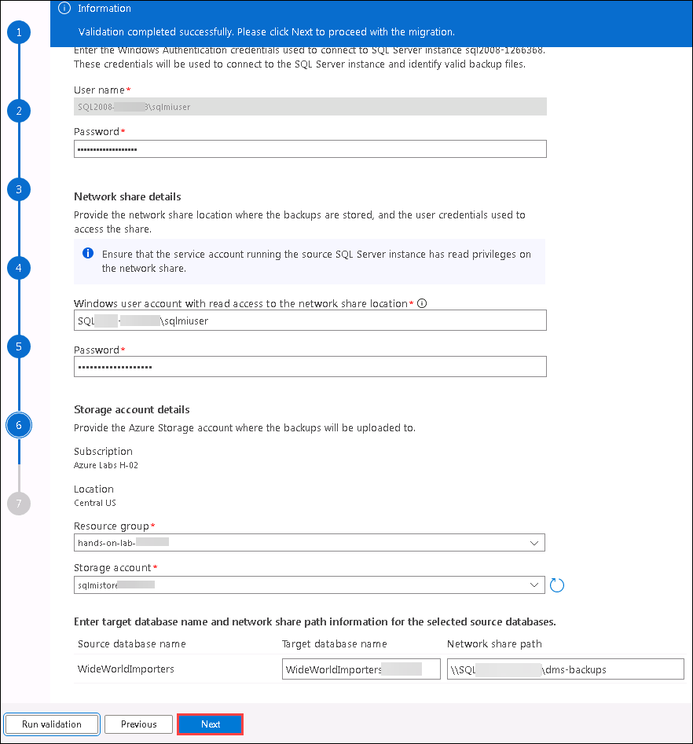

18. In **Step 7: Summary** blade, click on **Start migration** .

    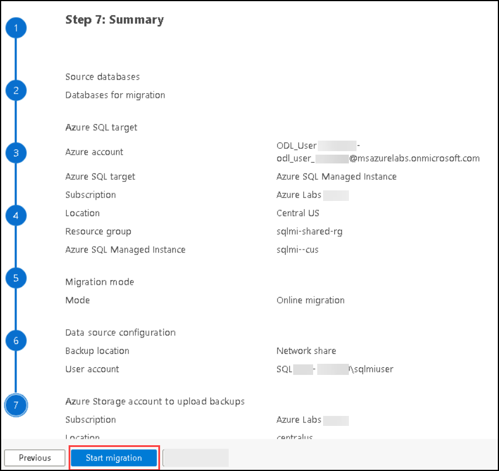

19. Click on **Migrations (1)**, from the dropdown menu set Status to **Status: All (2)**, feel free to **Refresh (3)** till the migration status is **Ready for cutover (4)**. 
    
    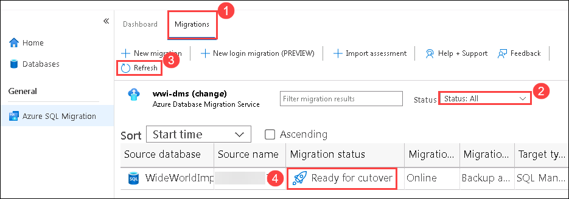

>**Note**: It may take a few minutes , please be patient.

### Task 6: Perform migration cutover

Since you performed an "online data migration," the migration wizard continuously monitors the SMB network share for newly added log backup files. Online migrations enable any updates on the source database to be captured until you initiate the cutover to the SQL MI database. In this task, you add a record to one of the database tables, backup the logs, and complete the migration of the `WideWorldImporters` database by cutting over to the SQL MI database.

1. From the **Azure portal**, navigate to **hands-on-lab-<inject key="Suffix" enableCopy="false"/>** resource group and search for **wwi-dms** Database Migration Services and select.

   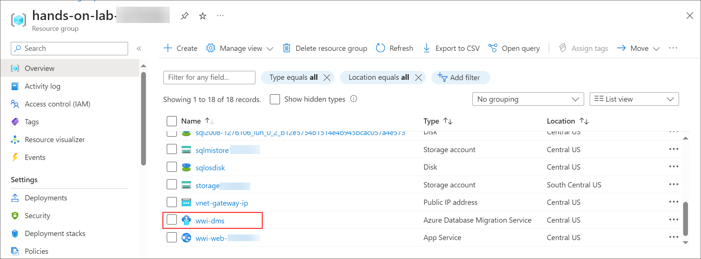

1. In **wwi-dms** balde, click on **Migrations**, and selct **sql2022-<inject key="Suffix" enableCopy="false"/>** under **Source name**.
  
   

1. On the WideWorldImporters screen, note the status of **Restored** for the `WideWorldImporters.bak` file.

    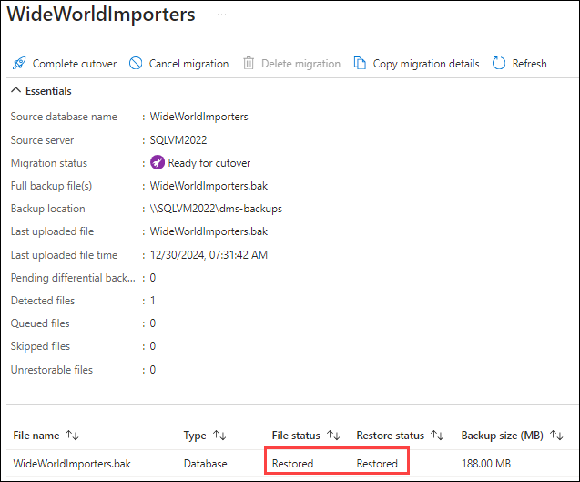
   
1. Navigate back to the **Azure Data studio**, right click on **SQLVM2022 (1)**, select **New Query (2)**.

    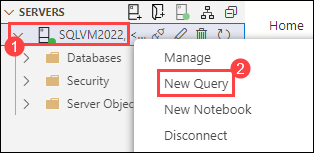

1. Paste the following SQL script, which inserts a record into the `Game` table, into the new query window:

   ```SQL
   USE WideWorldImporters;
   GO

   INSERT [dbo].[Game] (Title, Description, Rating, IsOnlineMultiplayer)
   VALUES ('Space Adventure', 'Explore the universe with our newest online multiplayer gaming experience. Build custom rocket ships and take off for the stars in an infinite open-world adventure.', 'T', 1)
   ```

1. To run the script, select **Run** from the Azure Data Studio toolbar.

1. Click on **SQLVM2022**, select **New Query (2)** again in the toolbar, and paste the following script into the new query window. It creates a backup of the 
   transaction logs for the WideWorldImporters database, verifies data integrity with a checksum, and stores the backup file at the specified location, while also allowing the Data 
   Migration Service (DMS) to detect the new backup for potential transfer and migration.

   ```SQL
   USE master;
   GO

   BACKUP LOG WideWorldImporters
   TO DISK = 'c:\dms-backups\WideWorldImportersLog.trn'
   WITH CHECKSUM
   GO
   ```

1. To run the script, select **Run** from the Azure Data Studio toolbar.

1. Return to the migration status page in the Azure portal. On the WideWorldImporters screen, select **Refresh**, and you should see the **WideWorldImportersLog.trn** file appear with a status of **Queued**.

      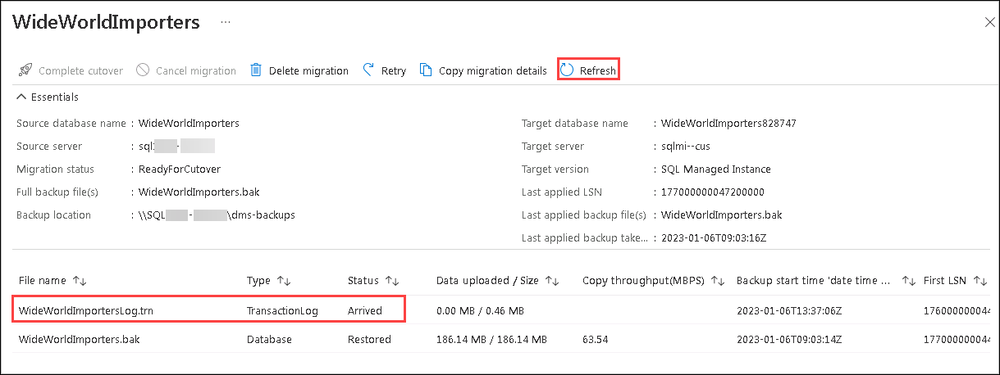

   > **Note**: If you don't see it in the transaction logs entry, continue selecting refresh every 10-15 seconds until it appears.

1. Continue selecting **Refresh**, and you should see the **WideWorldImportersLog.trn** status change to **Uploaded**.

     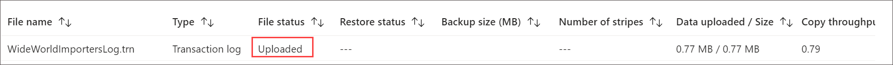
     
1. After the transaction logs are uploaded, they are restored to the database. Once again, continue selecting **Refresh** every 10-15 seconds until you see the status change to **Restored**, which can take a minute or two.

     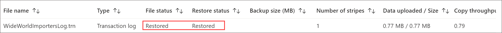
     
1. Navigate back to the **Azure Data studio**, click on **Azure SQL Migration**, click on **Migrations** and select **WideWorldImporters** under source database. 

      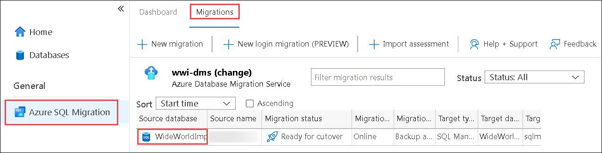

1. After verifying the transaction log status of **Restored**, select **Complete cutover**.

    -1.png)

1. On the Complete cutover dialog box, verify that log backups pending restore is `0`, check **I confirm there are no additional log backups to provide and want to complete cutover**, and then select **Complete cutover**.

    .png)

1. Move back to the Migration blade, and verify that the migration status of WideWorldImporters has to change to **Succeeded**. You should refresh a couple of times to see the status as Succeeded.

    -1.png)

1. You can also view the migration status in the Azure portal. Return to the wwi-sqldms blade of Azure Database Migration Service, click on **Migrations** ensure that Migration status is **Succeeded**. You might have to refresh to view the status.

    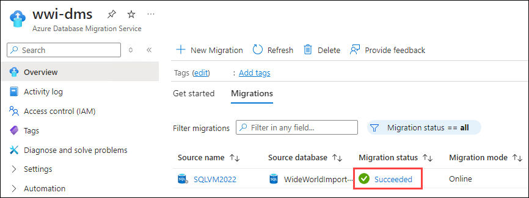

1. You have successfully migrated the `WideWorldImporters` database to Azure SQL Managed Instance.

### Task 7: Verify database and transaction log migration

In this task, you connect to the SQL MI database using SSMS and quickly verify the migration.

1. Return to SSMS on your **sql2022-<inject key="Suffix" enableCopy="false"/>** VM, and then select **Connect** and **Database Engine...** from the Object Explorer menu.

   

1. In the Connect to Server dialog, enter the following and click on **Connect** **(6)**:

   - **Server name** **(1)**: Enter the fully qualified domain name of your SQL-managed instance, which you copied from the Azure Cloud Shell in the previous Task 4.
   - **Authentication** **(2)**: Select **SQL Server Authentication**.
   - **Login** **(3)**: Enter `contosoadmin`
   -  **Password** **(4)**: Enter `IAE5fAijit0w^rDM`
   - Check the **Remember password** **(5)** box.

    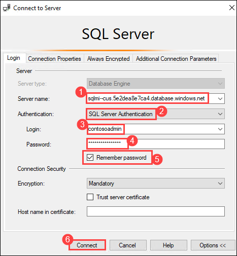
 
1. The SQL MI connection appears below the sql2022-<inject key="Suffix" enableCopy="false"/> connection. Expand Databases the SQL MI connection and select the <inject key="Database Name" /> database.

   

1. With the **<inject key="Database Name" enableCopy="false"/>** database selected, select **New Query** on the SSMS toolbar to open a new query window.

1. In the new query window, enter the following SQL script:

    > **Note**: Make sure to replace the SUFFIX value with **<inject key="Suffix" />**

      ```SQL
      USE WideWorldImportersSUFFIX;
         GO

         SELECT * FROM Game
      ```  

1. Select **Execute** on the SSMS toolbar to run the query. Observe the records contained within the `Game` table, including the new `Space Adventure` game you added after initiating the migration process.

    

    > **Congratulations** on completing the task! Now, it's time to validate it. Here are the steps:
    - If you receive a success message, you can proceed to the next task.
    - If not, carefully read the error message and retry the step, following the instructions in the lab guide.
    - If you need any assistance, please contact us at cloudlabs-support@spektrasystems.com. We are available 24/7 to help you out.
    
      <validation step="19094c70-fbca-4d58-87dd-3ff7d5a20eae" />

      <validation step="413d413d-17c5-4298-ada0-dc777f97d7ec" />

## Review

In this lab, you have created a SMB network share on the VM, changed MSSQLSERVER service to run under sqlmiuser account, created a backup of the WideWorldImporters database, retrieved SQL MI and SQL Server 2022 VM connection information, created and ran an online data migration project, performed migration cutover and verified database and transaction log migration.

### You have successfully completed the lab!
