# Exercise 2: Migrate the database to SQL MI

In this lab, you will migrate the WideWorldImporters database from a SQL Server 2008 VM to Azure SQL Managed Instance. You’ll start by setting up an SMB network share and configuring the MSSQLSERVER service to run under the sqlmiuser account. Then, you’ll back up the database, gather connection information, and create an online data migration project. Finally, you’ll perform the migration cutover and verify the database and transaction log migration. These steps ensure a smooth transition to Azure’s cloud services.

## Lab Objectives

Lab Objectives

In this lab, you will complete the following tasks:

- Task 1: Create an SMB network share on the VM
- Task 2: Change MSSQLSERVER service to run under sqlmiuser account
- Task 3: Create a backup of the WideWorldImporters database
- Task 4: Retrieve SQL MI and SQL Server 2008 VM connection information
- Task 5: Create and run an online data migration project
- Task 6: Perform migration cutover
- Task 7: Verify database and transaction log migration

### Task 1: Create an SMB network share on the **<inject key="SQLVM Name" enableCopy="false"/>** VM

In this task, you create a new SMB network share on the <inject key="SQLVM Name" enableCopy="false"/> VM. DMS uses this shared folder for retrieving backups of the `WideWorldImporters` database during the database migration process.

1. On the **<inject key="SQLVM Name" enableCopy="false"/>** VM, open **Windows Explorer** by selecting its icon on the Windows Taskbar.

   

2. In the Windows Explorer window, expand **Computer** in the tree view, select **Windows (C:)**, and then select **New folder** in the top menu.

   

3. Name the new folder **dms-backups**, then right-click the folder and select **Share with** and **Specific people...** in the context menu.

   

4. In the File Sharing dialog, ensure the **sqlmiuser** is listed with a **Read/Write** permission level, and then select **Share**.

   

5. In the **Network discovery and file sharing** dialog, select the default value of **No, make the network that I am connected to a private network**.

   

6. Back on the File Sharing dialog, note the shared folder's path, ```\\SQL2008-SUFFIX\dms-backups```, and select **Done** to complete the sharing process.

   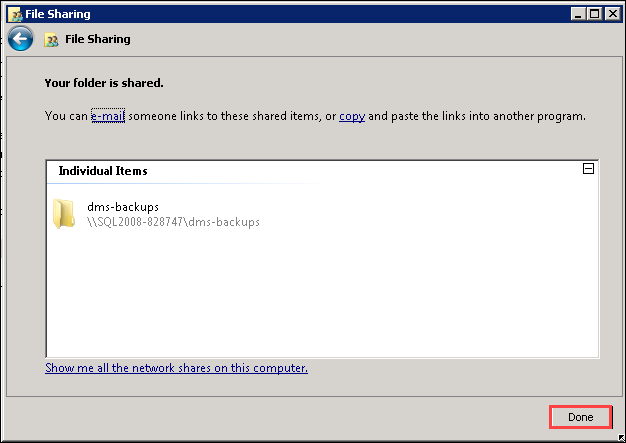

### Task 2: Change MSSQLSERVER service to run under sqlmiuser account

In this task, you use the SQL Server Configuration Manager to update the service account used by the SQL Server (MSSQLSERVER) service to the `sqlmiuser` account. Changing the account used for this service ensures it has the appropriate permissions to write backups to the shared folder.

1. On your **<inject key="SQLVM Name" enableCopy="false"/>** VM, select the **Start menu**, enter "SQL configuration" into the search bar, and then select **SQL Server Configuration Manager** from the search results.

   

   > **Note**: Be sure to choose **SQL Server Configuration Manager**, and not **SQL Server 2017 Configuration Manager**, which does not work for the installed SQL Server 2008 R2 database.

2. In the SQL Server Configuration Managed dialog, select **SQL Server Services** from the tree view on the left, then right-click **SQL Server (MSSQLSERVER)** in the list of services and select **Properties** from the context menu.

   

3. In the SQL Server (MSSQLSERVER) Properties dialog, select **This account** under Log on as, and enter the following:

   - **Account name**: `sqlmiuser`
   - **Password**: `Password.1234567890`

       Properties")

4. Select **OK**.

5. Select **Yes** in the Confirm Account Change dialog.

   

6. Observe that the **Log On As** value for the SQL Server (MSSQLSERVER) service changed to `./sqlmiuser`.

   

7. Close the SQL Server Configuration Manager.

### Task 3: Create a backup of the WideWorldImporters database

To perform online data migrations, DMS looks for database and transaction log backups in the shared SMB backup folder on the source database server. In this task, you create a backup of the `WideWorldImporters` database using SSMS and write it to the ```\\SQL2008-SUFFIX\dms-backups``` SMB network share you made in a previous task. The backup file needs to include a checksum, so you add that during the backup steps.

1. On the **<inject key="SQLVM Name" enableCopy="false"/>** VM, open **Microsoft SQL Server Management Studio 17** by entering "sql server" into the search bar in the Windows Start menu.

   

2. In the SSMS **Connect to Server** dialog, enter <inject key="SQLVM Name" /> into the Server name box, ensure **Windows Authentication** is selected, and then select **Connect**.

   

3. Once connected, expand **Databases** under **<inject key="SQLVM Name" enableCopy="false"/>** in the Object Explorer, and then right-click the **WideWorldImporters** database. In the context menu, select **Tasks** and then **Back Up...**

   

4. In the Back Up Database dialog, you should see `C:\WideWorldImporters.bak` listed in the Destinations box. This device is no longer needed, so select it and then select **Remove**.

   

5. Next, select **Add** to add the SMB network share as a backup destination.

   

6. In the Select Backup Destination dialog, select the Browse (`...`) button.

   

7. In the Location Database Files dialog, select the `C:\dms-backups` folder, enter **WideWorldImporters.bak** into the File name field, and then select **OK**.

   

8. Select **OK** to close the Select Backup Destination dialog.

   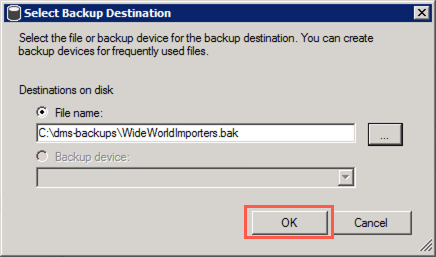

9. In the Back Up Database dialog, select **Media Options** in the Select a page pane, and then set the following:

   - Select **Back up to the existing media set** and then select **Overwrite all existing backup sets**.
   - Under Reliability, check the box for **Perform checksum before writing to media**. A checksum is required by DMS when using the backup to restore the database to SQL MI.

      

10. Select **OK** to perform the backup.

11. You will receive a message when the backup is complete. Select **OK**.

    

### Task 4: Retrieve SQL MI and SQL Server 2008 VM connection information

In this task, you use the Azure Cloud shell to retrieve the information necessary to connect to your <inject key="SQLVM Name" enableCopy="false"/> VM from DMS.

1. In the Azure portal `https://portal.azure.com`, select the Azure Cloud Shell icon from the top menu.

   

2. In the Cloud Shell window that opens at the bottom of your browser window, select **PowerShell**.

   

3. If prompted about not having a storage account mounted, click on **Show advanced settings**. Select Create New under Storage account and provide values as below: 
  
      - **Resource Group**: Select **Use existing** then <inject key="Resource Group Name" enableCopy="false"/>
      - **Storage account**: **storage<inject key="Suffix" enableCopy="false"/>**
      - **File Share**: **blob**

         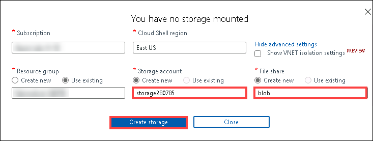

4. After a moment, a message is displayed that you have successfully requested a Cloud Shell, and you are presented with a PS Azure prompt.

   

5. At the prompt, retrieve the public IP address of the SqlSerer2008 VM. This IP address will be used to connect to the database on that server. Enter the following PowerShell command, **replacing `<your-resource-group-name>`** in the resource group name variable with the name of your resource group: <inject key="Resource Group Name" /> and vm name with <inject key="SQLVM Name" />. 


   ```PowerShell
   $resourceGroup = "<your-resource-group-name>"
   az vm list-ip-addresses -g $resourceGroup -n VMNAME --output table
   ```

   > **Note**
   >
   > If you have multiple Azure subscriptions, and the account you are using for this hands-on lab is not your default account, you may need to run `az account list --output table` at the Azure Cloud Shell prompt to output a list of your subscriptions, then copy the Subscription Id of the account you are using for this lab and then run `az account set --subscription <your-subscription-id>` to set the appropriate account for the Azure CLI commands.

6. Within the output, locate and copy the value of the `ipAddress` property below the `PublicIPAddresses` field. Paste the value into a text editor, such as Notepad.exe, for later reference.

   

7. Leave the Azure Cloud Shell open for the next task.

### Task 5: Create and run an online data migration project

In this task, you create a new online data migration project in DMS for the `WideWorldImporters` database.

1. In Azure Data Studio click on **Azure SQL Migration** and click on **+ New migration**.

   

2. In **Step 1: Database for assessment** blade, select **widewordimporters**, click on **Next**. 

   

3. In **Step 2: Assessment summary and SKU recommendation (1)**, you will view the summary and SKU recommendations for your SQL server. Click on **Next (2)**. 

   

4. In **Step 3: Target Platform and Assessment Results**, Select **Azure SQL Managed Instance (1)** from the drop down. Then select **WideWorldImporters** under database, checkbox the **WideWorldImporters** under database, and Click on the **Select** button.

   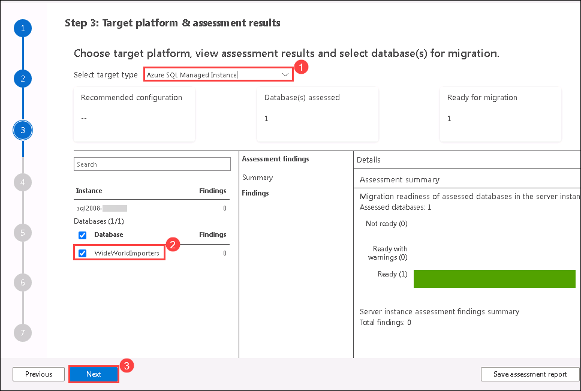

5. In **Step 4: Azure SQL target** blade, click on **Link account**, and click on **Add an account** it will redirect to a web page, login using your below **Azure credentials** once your account has been added successfully! Go back to the Azure Data Studio, and click on **close**. 
  
   - **Email/Username**: <inject key="AzureAdUserEmail"></inject>
   - **Password**: <inject key="AzureAdUserPassword"></inject>
  
6. The field will be populated with the details and click on **Next**. 

   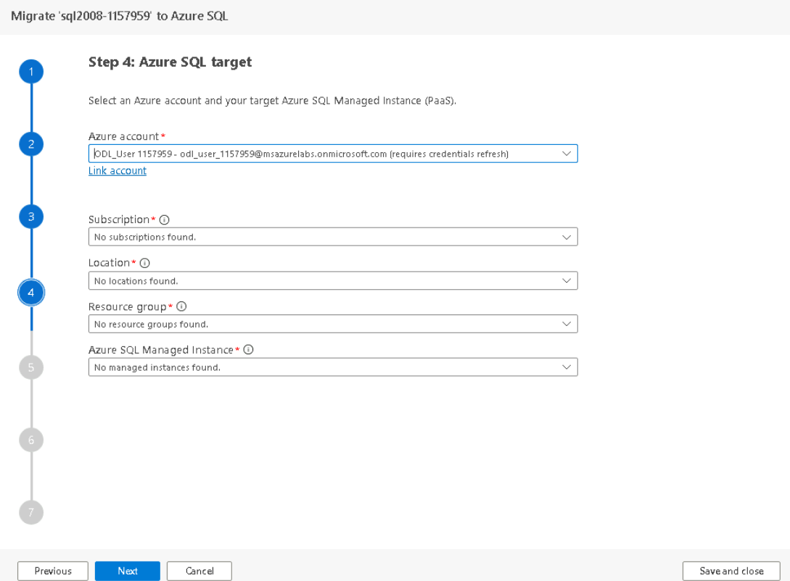
   
7. In **Step 4: Azure Database Migration Service** blade, select **Online migration**, select the location of the database backups to use during migration select **My database backups are on a network share** and Click on **Create new** under Azure Database Migration Service.

   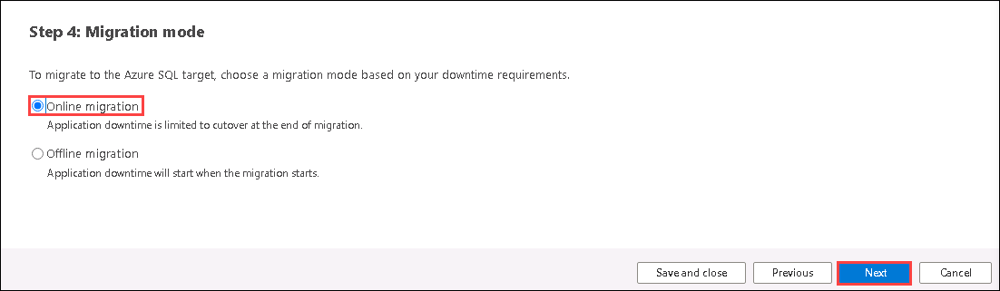 
   
8. Under **Create Azure Database Migration Service** page, select **hands-on-lab-<inject key="Suffix" />** from the drop-down menu, enter the name as **wwi-sqldms**, and click on **create**.
  
   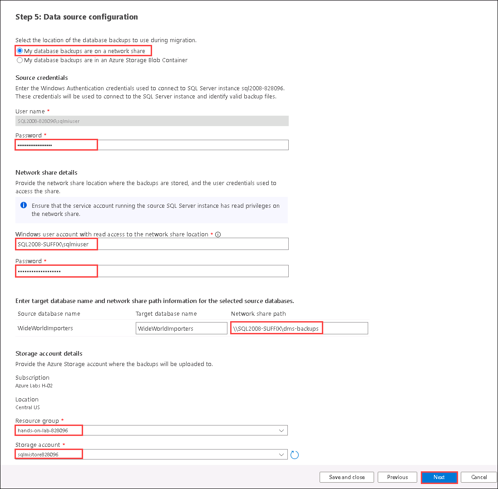 

9. After the resources have been created you can see similar output as shown in the below screenshot. Copy any of the **Authentication keys** to the notepad as it will be used later in the task, minimize the **Azure Data Studio**.  

   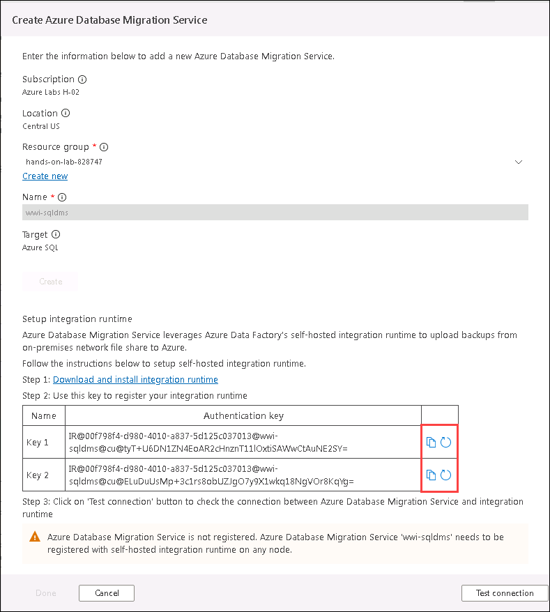
   
   > **Note**: Don't close/cancel Azure Data Studio.

10. On the **sql2008-<inject key="Suffix" />** VM, Select the **Start menu**, enter `Integration Runtime` into the search bar, and then select **Microsoft Integration Runtime** from the search results.
   
       
      
11. Paste the **Authentication key** in the box which you coped in earlier in the task and click on **Register**.

    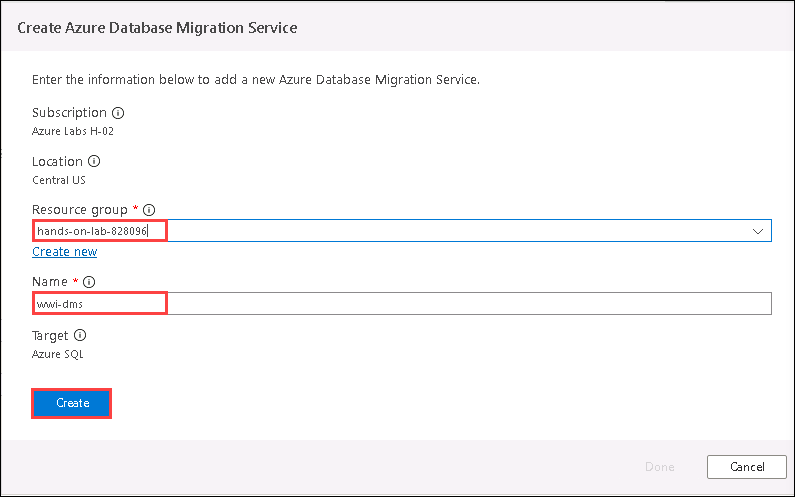

12. In New Integration Runtime (Self-hosted) Node leave default and click on **Finish**.

    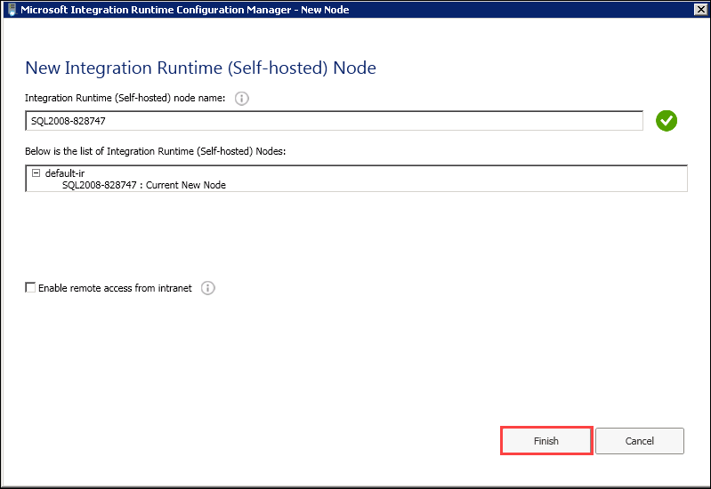

13. Wait for the Integration Runtime to be successful to continue further.

    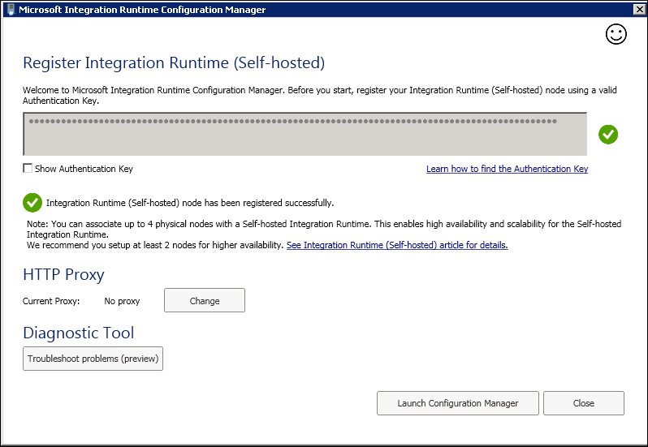

14. Navigate back to the **Azure Data Studio** click on **Test connection**. Once the test connection is completed successfully click on **Done**. 

    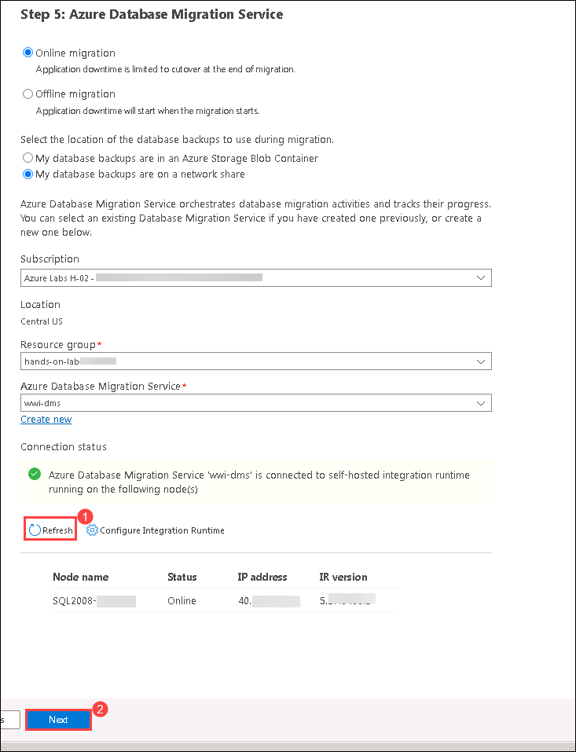
          
15. In **Step 6: Data source configuration** blade, enter the following details and click on **Run Validation**:

      > **Note**: Make sure to replace the SUFFIX value with <inject key="Suffix" />   
 
      - **Password**: Enter **Password.1234567890**
      - **Windows user account with read access to the network share location**: Enter **SQL2008-<inject key="Suffix" />\sqlmiuser** 
      - **Password**: Enter **Password.1234567890** 
      - **Resource Group**: Select **hands-on-lab-<inject key="Suffix" />** 
      - **Storage account**: Select the **sqlmistore<inject key="Suffix" />** storage account. 
      - **Target database name**: Enter **WideWorldImporters<inject key="Suffix" />**, make sure to Add **SUFFIX** at the end.
      - **Network share path**: Enter **\\\SQL2008-<inject key="Suffix" />\dms-backups**

         

16. In the Run Validate page wait till all the validation steps are successful then click on **Done**.

      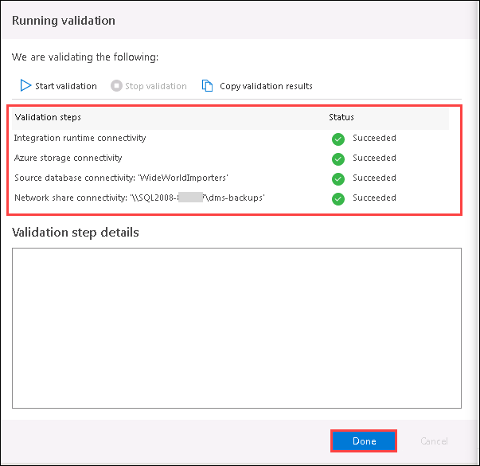

17. Once you back to **Step 6: Data source configuration** blade, click on **Next**.

      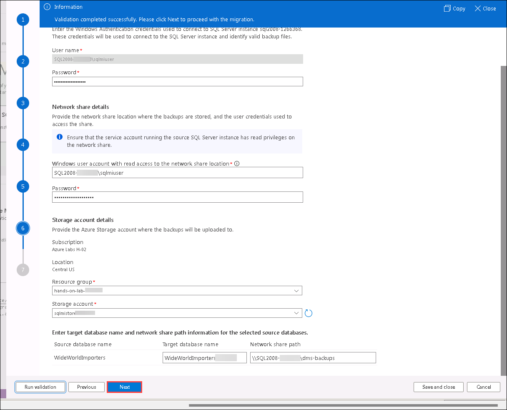

18. In **Step 7: Summary** blade, click on **Start migration** .

    

19. Click on **Migrations (1)**, from the dropdown menu set Status to **Status: All (2)**, feel free to **Refresh (3)** till the migration status is **Ready for cutover (4)**. 
    
    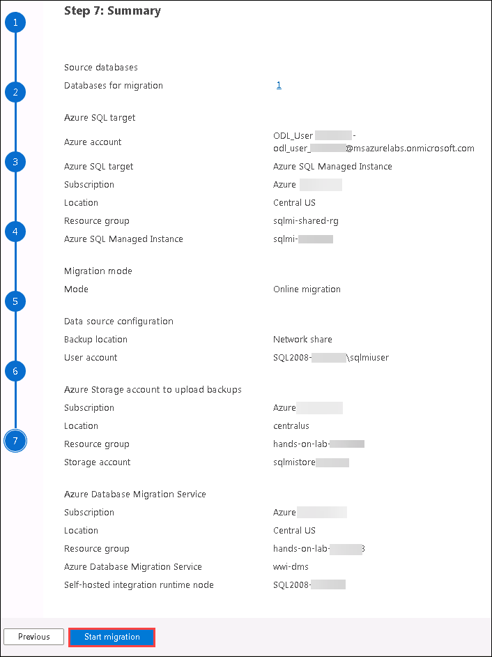

### Task 6: Perform migration cutover

Since you performed an "online data migration," the migration wizard continuously monitors the SMB network share for newly added log backup files. Online migrations enable any updates on the source database to be captured until you initiate the cutover to the SQL MI database. In this task, you add a record to one of the database tables, backup the logs, and complete the migration of the `WideWorldImporters` database by cutting over to the SQL MI database.

1. From the **Azure portal**, navigate to **hands-on-lab-<inject key="Suffix" />** resource group and search for **wwi-sqldms** Database Migration Services and select.

   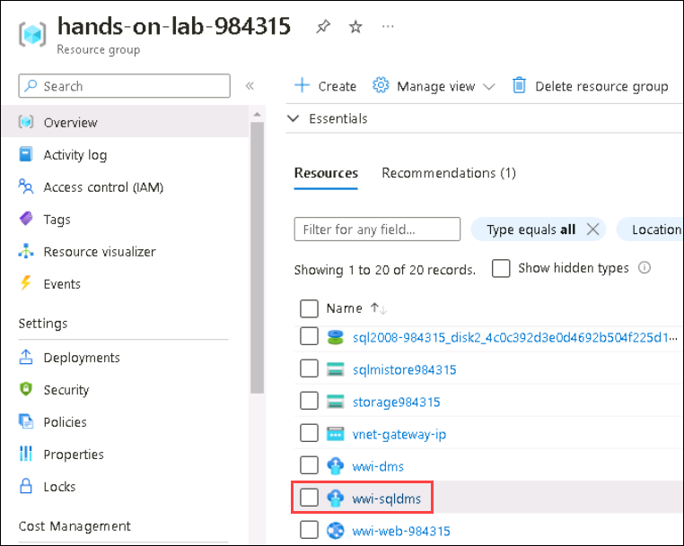

1. In **wwi-sqldms** balde, click on **Migrations**, and selct **sql2008-<inject key="Suffix" />** under **Source name**.
  
   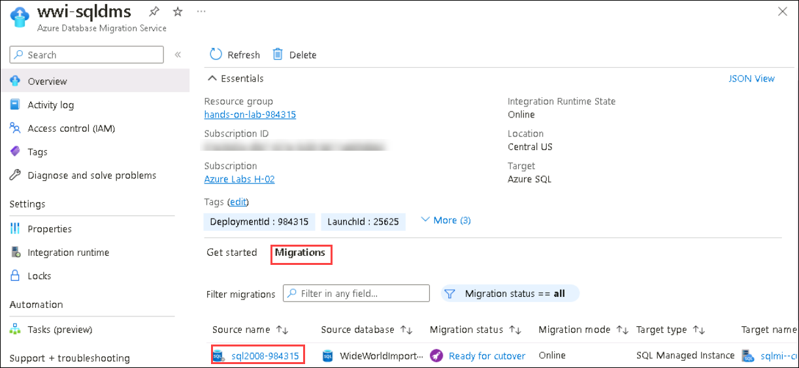

1. On the WideWorldImporters screen, note the status of **Restored** for the `WideWorldImporters.bak` file.

   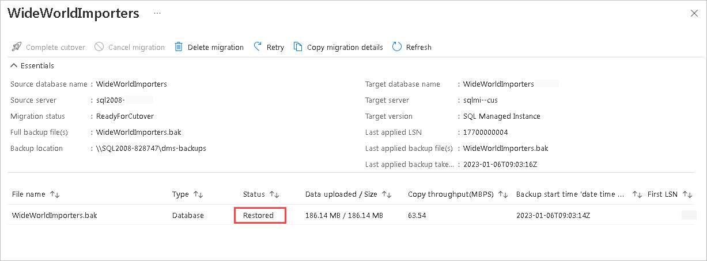
   
1. Navigate back to the **Azure Data studio**, right click on **<inject key="SQLVM Name" /> (1)**, click on **Manage (2)**, and select **New Query (3)**.

     

1. Paste the following SQL script, which inserts a record into the `Game` table, into the new query window:

   ```SQL
   USE WideWorldImporters;
   GO

   INSERT [dbo].[Game] (Title, Description, Rating, IsOnlineMultiplayer)
   VALUES ('Space Adventure', 'Explore the universe with our newest online multiplayer gaming experience. Build custom rocket ships and take off for the stars in an infinite open-world adventure.', 'T', 1)
   ```

1. To run the script, select **Run** from the Azure Data Studio toolbar.

    

1. After adding the new record to the `Games` table, back up the transaction logs. DMS detects any new backups and ships them to the migration service. Select **New Query** again in the toolbar, and paste the following script into the new query window:

   ```SQL
   USE master;
   GO

   BACKUP LOG WideWorldImporters
   TO DISK = 'c:\dms-backups\WideWorldImportersLog.trn'
   WITH CHECKSUM
   GO
   ```

1. To run the script, select **Run** from the Azure Data Studio toolbar.

    

1. Return to the migration status page in the Azure portal. On the WideWorldImporters screen, select **Refresh**, and you should see the **WideWorldImportersLog.trn** file appear with a status of **Queued**.

      

   > **Note**: If you don't see it in the transaction logs entry, continue selecting refresh every 10-15 seconds until it appears.

1. Continue selecting **Refresh**, and you should see the **WideWorldImportersLog.trn** status change to **Uploaded**.

1. After the transaction logs are uploaded, they are restored to the database. Once again, continue selecting **Refresh** every 10-15 seconds until you see the status change to **Restored**, which can take a minute or two.

    

1. Navigate back to the **Azure Data studio**, click on **Azure SQL Migration**, click on **Migrations** and select **WideWorldImporters** under source database. 

      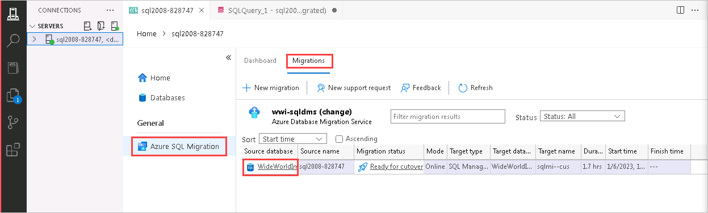

1. After verifying the transaction log status of **Restored**, select **Complete cutover**.

    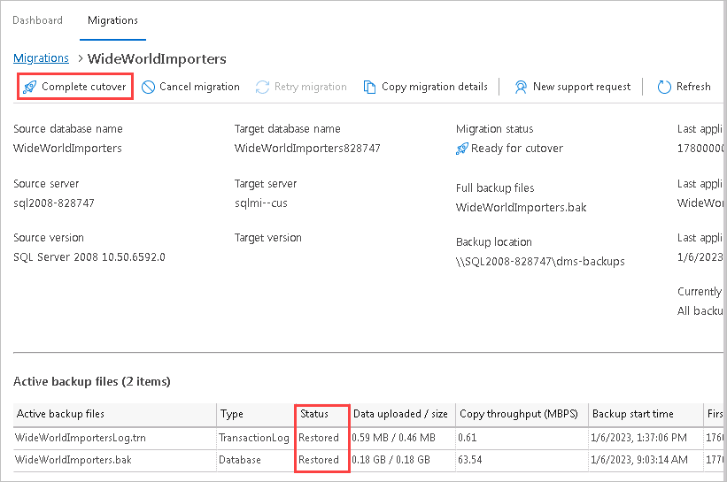

1. On the Complete cutover dialog, verify that log backups pending restore are `0`, check **I confirm there are no additional log backups to provide and want to complete cutover**, and then select **Complete cutover**.

    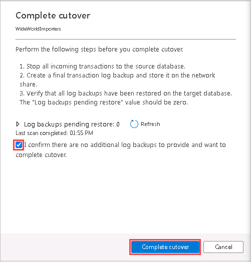

1. Move back to the Migration blade, and verify that the migration status of WideWorldImporters has to change to **Succeeded**. You might have to refresh a couple of times to see the status as Succeeded.

    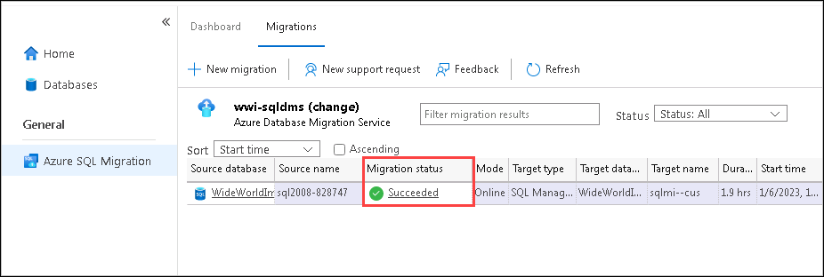

1. You can also view the migration status in the Azure portal. Return to the wwi-sqldms blade of Azure Database Migration Service, click on **Migrations** ensure that Migration status is **Succeeded**. You might have to refresh to view the status.

    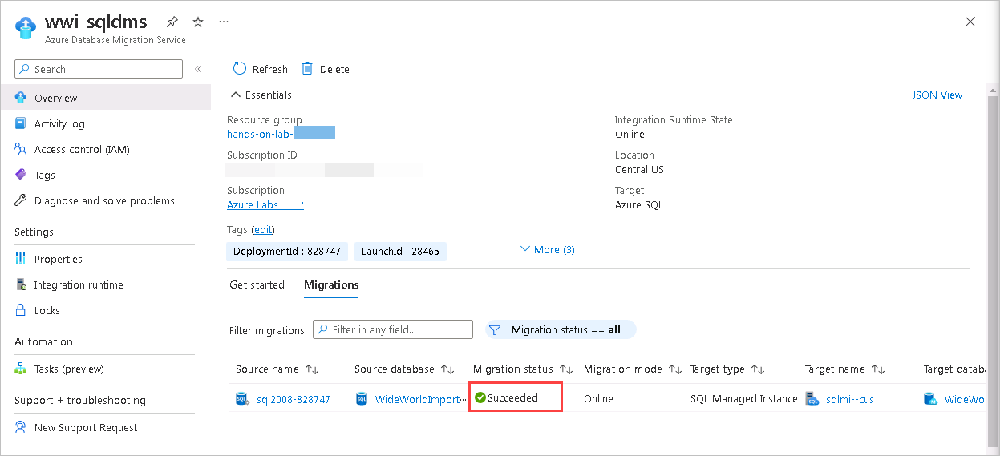

1. You have successfully migrated the `WideWorldImporters` database to Azure SQL Managed Instance.

### Task 7: Verify database and transaction log migration

In this task, you connect to the SQL MI database using SSMS and quickly verify the migration.

1. First, use the Azure Cloud Shell to retrieve the fully qualified domain name of your SQL MI database. In the Azure portal `https://portal.azure.com`, select the Azure Cloud Shell icon from the top menu.

   

2. In the Cloud Shell window that opens at the bottom of your browser window, select **PowerShell**.

   

3. After a moment, a message is displayed that you have successfully requested a Cloud Shell, and be presented with a PS Azure prompt.

   

4. At the prompt, retrieve information about SQL MI in the SQLMI-Shared-RG resource group by entering the following PowerShell command.

   ```PowerShell
   $resourceGroup = "SQLMI-Shared-RG"
   az sql mi list --resource-group $resourceGroup
   ```

   > **Note**: If you have multiple Azure subscriptions, and the account you are using for this hands-on lab is not your default account, you may need to run the `az account list --output table` at the Azure Cloud Shell prompt to output a list of your subscriptions. Copy the Subscription ID of the account you are using for this lab and then run `az account set --subscription <your-subscription-id>` to set the appropriate account for the Azure CLI commands.

5. Within the above command's output, locate and copy the value of the `fullyQualifiedDomainName` property. Paste the value into a text editor, such as Notepad.exe, for reference below.

   

6. Return to SSMS on your **<inject key="SQLVM Name" enableCopy="false"/>** VM, and then select **Connect** and **Database Engine...** from the Object Explorer menu.

   

7. In the Connect to Server dialog, enter the following:

   - **Server name**: Enter the fully qualified domain name of your SQL-managed instance, which you copied from the Azure Cloud Shell in the previous steps.
   - **Authentication**: Select **SQL Server Authentication**.
   - **Login**: Enter `contosoadmin`
   -  **Password**: Enter `IAE5fAijit0w^rDM`
   - Check the **Remember password** box.

      

8. Select **Connect**. 

9. The SQL MI connection appears below the <inject key="SQLVM Name" enableCopy="false"/> connection. Expand Databases the SQL MI connection and select the <inject key="Database Name" /> database.

   

10. With the **<inject key="Database Name" enableCopy="false"/>** database selected, select **New Query** on the SSMS toolbar to open a new query window.

11. In the new query window, enter the following SQL script:
    > **Note**: Make sure to replace the SUFFIX value with **<inject key="Suffix" />**

      ```SQL
      USE WideWorldImportersSUFFIX;
         GO

         SELECT * FROM Game
      ```  

12. Select **Execute** on the SSMS toolbar to run the query. Observe the records contained within the `Game` table, including the new `Space Adventure` game you added after initiating the migration process.

    

13. You are done using the **<inject key="SQLVM Name" enableCopy="false"/>** VM. Close any open windows and log off the VM. The JumpBox VM is used for the remaining tasks of this hands-on lab.

## Summary

In this hands-on lab, you will migrate the WideWorldImporters database from a SQL Server 2008 VM to Azure SQL Managed Instance.
