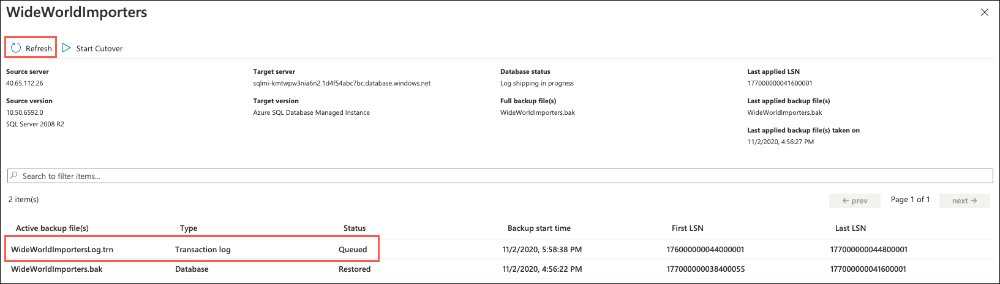

## Exercise 2: Migrate the database to SQL MI

Duration: 60 minutes

In this exercise, you use the **Azure Database Migration Service** here `https://azure.microsoft.com/services/database-migration/` (DMS) to migrate the `WideWorldImporters` database from an on-premises SQL Server 2008 R2 database into Azure SQL Managed Instance (SQL MI). WWI mentioned the importance of their gamer information web application in driving revenue, so for this migration, the online migration option is used to minimize downtime. Targeting the **Business Critical service tier** here `https://docs.microsoft.com/azure/azure-sql/managed-instance/sql-managed-instance-paas-overview#managed-instance-service-tiers` allows WWI to meet its customer's high-availability requirements.

> The Business Critical service tier is designed for business applications with the highest performance and high-availability (HA) requirements. To learn more, read the Managed Instance service tiers documentation.

### Task 1: Create an SMB network share on the Sql2008-SUFFIX VM

In this task, you create a new SMB network share on the Sql2008-SUFFIX VM. DMS uses this shared folder for retrieving backups of the `WideWorldImporters` database during the database migration process.

1. On the Sql2008-SUFFIX VM, open **Windows Explorer** by selecting its icon on the Windows Taskbar.

   

2. In the Windows Explorer window, expand **Computer** in the tree view, select **Windows (C:)**, and then select **New folder** in the top menu.

   

3. Name the new folder **dms-backups**, then right-click the folder and select **Share with** and **Specific people** in the context menu.

   

4. In the File Sharing dialog, ensure the **sqlmiuser** is listed with a **Read/Write** permission level, and then select **Share**.

   

5. In the **Network discovery and file sharing** dialog, select the default value of **No, make the network that I am connected to a private network**.

   

6. Back on the File Sharing dialog, note the shared folder's path, `\\SQL2008-SUFFIX\dms-backups`, and select **Done** to complete the sharing process.

   

### Task 2: Change MSSQLSERVER service to run under sqlmiuser account

In this task, you use the SQL Server Configuration Manager to update the service account used by the SQL Server (MSSQLSERVER) service to the `sqlmiuser` account. Changing the account used for this service ensures it has the appropriate permissions to write backups to the shared folder.

1. On your Sql2008-SUFFIX VM, select the **Start menu**, enter "sql configuration" into the search bar, and then select **SQL Server Configuration Managed** from the search results.

   

   > **Note**
   >
   > Be sure to choose **SQL Server Configuration Manager**, and not **SQL Server 2017 Configuration Manager**, which does not work for the installed SQL Server 2008 R2 database.

2. In the SQL Server Configuration Managed dialog, select **SQL Server Services** from the tree view on the left, then right-click **SQL Server (MSSQLSERVER)** in the list of services and select **Properties** from the context menu.

   

3. In the SQL Server (MSSQLSERVER) Properties dialog, select **This account** under Log on as, and enter the following:

   - **Account name**: `sqlmiuser`
   - **Password**: `Password.1234567890`

    Properties")

4. Select **OK**.

5. Select **Yes** in the Confirm Account Change dialog.

   

6. Observe that the **Log On As** value for the SQL Server (MSSQLSERVER) service changed to `./sqlmiuser`.

   

7. Close the SQL Server Configuration Manager.

### Task 3: Create a backup of the WideWorldImporters database

To perform online data migrations, DMS looks for database and transaction log backups in the shared SMB backup folder on the source database server. In this task, you create a backup of the `WideWorldImporters` database using SSMS and write it to the `\\SQL2008-SUFFIX\dms-backups` SMB network share you made in a previous task. The backup file needs to include a checksum, so you add that during the backup steps.

1. On the Sql2008-SUFFIX VM, open **Microsoft SQL Server Management Studio 17** by entering "sql server" into the search bar in the Windows Start menu.

   

2. In the SSMS **Connect to Server** dialog, enter **SQL2008-SUFFIX** into the Server name box, ensure **Windows Authentication** is selected, and then select **Connect**.

   

3. Once connected, expand **Databases** under SQL2008-SUFFIX in the Object Explorer, and then right-click the **WideWorldImporters** database. In the context menu, select **Tasks** and then **Back Up**.

   

4. In the Back Up Database dialog, you should see `C:\WideWorldImporters.bak` listed in the Destinations box. This device is no longer needed, so select it and then select **Remove**.

   

5. Next, select **Add** to add the SMB network share as a backup destination.

   

6. In the Select Backup Destination dialog, select the Browse (`...`) button.

   

7. In the Location Database Files dialog, select the `C:\dms-backups` folder, enter `WideWorldImporters.bak` into the File name field, and then select **OK**.

   

8. Select **OK** to close the Select Backup Destination dialog.

   

9. In the Back Up Database dialog, select **Media Options** in the Select a page pane, and then set the following:

   - Select **Back up to the existing media set** and then select **Overwrite all existing backup sets**.
   - Under Reliability, check the box for **Perform checksum before writing to media**. A checksum is required by DMS when using the backup to restore the database to SQL MI.

   

10. Select **OK** to perform the backup.

11. You will receive a message when the backup is complete. Select **OK**.

    

### Task 4: Retrieve SQL MI and SQL Server 2008 VM connection information

In this task, you use the Azure Cloud shell to retrieve the information necessary to connect to your Sql2008-SUFFIX VM from DMS.

1. In the Azure portal `https://portal.azure.com`, select the Azure Cloud Shell icon from the top menu.

   

2. In the Cloud Shell window that opens at the bottom of your browser window, select **PowerShell**.

   

3. If prompted about not having a storage account mounted, select the subscription you are using for this hands-on lab and select **Create storage**.

   

   > **Note**
   >
   > If the creation fails, you may need to select **Advanced settings** and specify the subscription, region, and resource group for the new storage account.

4. After a moment, a message is displayed that you have successfully requested a Cloud Shell, and you are presented with a PS Azure prompt.

   

5. At the prompt, retrieve the public IP address of the SqlSerer2008 VM. This IP address will be used to connect to the database on that server. Enter the following PowerShell command, **replacing `<your-resource-group-name>`** in the resource group name variable with the name of your resource group: **hands-on-lab-SUFFIX** and replace SUFFIX in the VM name. 

   ```powershell
   $resourceGroup = "<your-resource-group-name>"
   az vm list-ip-addresses -g $resourceGroup -n Sql2008-SUFFIX --output table
   ```

   > **Note**
   >
   > If you have multiple Azure subscriptions, and the account you are using for this hands-on lab is not your default account, you may need to run `az account list --output table` at the Azure Cloud Shell prompt to output a list of your subscriptions, then copy the Subscription Id of the account you are using for this lab and then run `az account set --subscription <your-subscription-id>` to set the appropriate account for the Azure CLI commands.

6. Within the output, locate and copy the value of the `ipAddress` property below the `PublicIPAddresses` field. Paste the value into a text editor, such as Notepad.exe, for later reference.

   

7. Leave the Azure Cloud Shell open for the next task.

### Task 5: Create and run an online data migration project

In this task, you create a new online data migration project in DMS for the `WideWorldImporters` database.

1. In the Azure portal `https://portal.azure.com`, navigate to the Azure Database Migration Service by selecting **Resource groups** from the left-hand navigation menu, selecting the **hands-on-lab-SUFFIX** resource group, and then selecting the **wwi-dms** Azure Database Migration Service in the list of resources.

   

2. On the Azure Database Migration Service blade, select **+New Migration Project**.

   

3. On the New migration project blade, enter the following:

   - **Project name**: Enter `OnPremToSqlMi`
   - **Source server type**: Select **SQL Server**.
   - **Target server type**: Select **Azure SQL Database Managed Instance**.
   - **Choose type of activity**: Select **Online data migration**

   

4. Select **Create and run activity**.

5. On the Migration Wizard **Select source** tab, enter the following:

   - **Source SQL Server instance name**: Enter the IP address of your Sql2008-SUFFIX VM that you copied into a text editor in the previous task. For example, `40.65.112.26`.
   - **Authentication type**: Select SQL Authentication.
   - **Username**: Enter `WorkshopUser`
   - **Password**: Enter `Password.1234567890`
   - **Connection properties**: Check both Encrypt connection and Trust server certificate.

   

6. Select **Next : Select target**.

7. On the Migration Wizard **Select target** tab, enter the following:

   - **Application ID**: Enter the `Application/Client ID` value from the lab details page..
   - **Key**: Enter the `Application Secret Key` value from the lab details page.
   - **Skip the Application ID Contributor level access check on the subscription**: Leave this unchecked.
   - **Subscription**: Select the subscription you are using for this hand-on lab.
   - **Target Azure SQL Managed Instance**: Select the sqlmi--cus instance.
   - **SQL Username**: Enter `contosoadmin`
   - **Password**: Enter `IAE5fAijit0w^rDM`

   

8. Select **Next : Select databases**.

9. On the Migration Wizard **Select databases** tab, select `WideWorldImporters`.

   

10. Select **Next : Configure migration settings**.

11. On the Migration Wizard **Configure migration settings** tab, enter the following configuration:

    - **Network share location**: Populate this field with the path to the SMB network share you created previously by entering `\\SQL2008-SUFFIX\dms-backups`.
    - **Windows User Azure Database Migration Service impersonates to upload files to Azure Storage**: Enter `SQL2008-SUFFIX\sqlmiuser.`
    - **Password**: Enter `Password.1234567890`
    - **Subscription containing storage account**: Select the subscription you are using for this hands-on lab.
    - **Storage account**: Select the **sqlmistoreUNIQUEID** storage account.

    
 
 - Click on **Advance Settings**. 
 - **WideWorldImporters**: Enter **Target Database name** WideWorldImportersSUFFIX. 

   Note: - You can get SUFFIX details from you Environment details page 

    

12. Select **Next : Summary**.

13. On the Migration Wizard **Summary** tab, enter `WwiMigration` as the **Activity name**.

    

14. Select **Start migration**.

15. Monitor the migration on the status screen that appears. You can select the refresh icon in the toolbar to retrieve the latest status. Continue selecting **Refresh** every 5-10 seconds until you see the status change to **Log shipping in progress**. When that status appears, move on to the next task.

    

### Task 6: Perform migration cutover

Since you performed an "online data migration," the migration wizard continuously monitors the SMB network share for newly added log backup files. Online migrations enable any updates on the source database to be captured until you initiate the cut over to the SQL MI database. In this task, you add a record to one of the database tables, backup the logs, and complete the migration of the `WideWorldImporters` database by cutting over to the SQL MI database.

1. In the Azure portal's migration status window and select **WideWorldImporters** under database name to view further details about the database migration.

   

2. On the WideWorldImporters screen, note the status of **Restored** for the `WideWorldImporters.bak` file.

   

3. To demonstrate log shipping and how transactions made on the source database during the migration process are added to the target SQL MI database, you will add a record to one of the database tables.

4. Return to SSMS on your Sql2008-SUFFIX VM and select **New Query** from the toolbar.

   

5. Paste the following SQL script, which inserts a record into the `Game` table, into the new query window:

   ```sql
   USE WideWorldImporters;
   GO

   INSERT [dbo].[Game] (Title, Description, Rating, IsOnlineMultiplayer)
   VALUES ('Space Adventure', 'Explore the universe with are newest online multiplayer gaming experience. Build custom  rocket ships, and take off for the stars in an infinite open-world adventure.', 'T', 1)
   ```

6. Execute the query by selecting **Execute** in the SSMS toolbar.

   

7. After adding the new record to the `Games` table, back up the transaction logs. DMS detects any new backups and ships them to the migration service. Select **New Query** again in the toolbar, and paste the following script into the new query window:

   ```sql
   USE master;
   GO

   BACKUP LOG WideWorldImporters
   TO DISK = 'c:\dms-backups\WideWorldImportersLog.trn'
   WITH CHECKSUM
   GO
   ```

8. Execute the query by selecting **Execute** in the SSMS toolbar.

9. Return to the migration status page in the Azure portal. On the WideWorldImporters screen, select **Refresh**, and you should see the **WideWorldImportersLog.trn** file appear with a status of **Queued**.

   

   > **Note**
   >
   > If you don't see it the transaction logs entry, continue selecting refresh every 10-15 seconds until it appears.

10. Continue selecting **Refresh**, and you should see the **WideWorldImportersLog.trn** status change to **Uploaded**.

11. After the transaction logs are uploaded, they are restored to the database. Once again, continue selecting **Refresh** every 10-15 seconds until you see the status change to **Restored**, which can take a minute or two.

    

12. After verifying the transaction log status of **Restored**, select **Start Cutover**.

    

13. On the Complete cutover dialog, verify pending log backups is `0`, check **Confirm**, and then select **Apply**.

    

14. A progress bar below the Apply button in the Complete cutover dialog provides updates on the cutover status. When the migration finishes, the status changes to **Completed**.

    

    > **Note**
    >
    > If the progress bar has not moved after a few minutes, you can proceed to the next step and monitor the cutover progress on the WwiMigration blade by selecting refresh.

15. To return to the WwiMigration blade, close the Complete cutover dialog by selecting the "X" in the upper right corner of the dialog, and do the same thing for the WideWorldImporters blade. Select **Refresh**, and you should see a status of **Completed** from the WideWorldImporters database.

    

16. You have successfully migrated the `WideWorldImporters` database to Azure SQL Managed Instance.

### Task 7: Verify database and transaction log migration

In this task, you connect to the SQL MI database using SSMS and quickly verify the migration.

1. First, use the Azure Cloud Shell to retrieve the fully qualified domain name of your SQL MI database. In the Azure portal `https://portal.azure.com`, select the Azure Cloud Shell icon from the top menu.

   

2. In the Cloud Shell window that opens at the bottom of your browser window, select **PowerShell**.

   

3. After a moment, a message is displayed that you have successfully requested a Cloud Shell, and be presented with a PS Azure prompt.

   

4. At the prompt, retrieve information about SQL MI in the SQLMI-Shared-RG resource group by entering the following PowerShell command, **replacing `<your-resource-group-name>`** in the resource group name variable with the name of your resource group: **SQLMI-Shared-RG**

   ```powershell
   $resourceGroup = "<your-resource-group-name>"
   az sql mi list --resource-group $resourceGroup
   ```

   > **Note**
   >
   > If you have multiple Azure subscriptions, and the account you are using for this hands-on lab is not your default account, you may need to run `az account list --output table` at the Azure Cloud Shell prompt to output a list of your subscriptions. Copy the Subscription Id of the account you are using for this lab and then run `az account set --subscription <your-subscription-id>` to set the appropriate account for the Azure CLI commands.

5. Within the above command's output, locate and copy the value of the `fullyQualifiedDomainName` property. Paste the value into a text editor, such as Notepad.exe, for reference below.

   

6. Return to SSMS on your Sql2008-SUFFIX VM, and then select **Connect** and **Database Engine** from the Object Explorer menu.

   

7. In the Connect to Server dialog, enter the following:

   - **Server name**: Enter the fully qualified domain name of your SQL managed instance, which you copied from the Azure Cloud Shell in the previous steps.
   - **Authentication**: Select **SQL Server Authentication**.
   - **Login**: Enter `contosoadmin`
   -  **Password:** Enter IAE5fAijit0w^rDM
   - Check the **Remember password** box.

   

8. Select **Connect**. 

9. The SQL MI connection appears below the SQL2008-SUFFIX connection. Expand Databases the SQL MI connection and select the `WideWorldImportersSUFFIX` database.

   

10. With the `WideWorldImportersSUFFIX` database selected, select **New Query** on the SSMS toolbar to open a new query window.

11. In the new query window, enter the following SQL script:

    ```sql
    USE WideWorldImportersSUFFIX;
    GO

    SELECT * FROM Game
    ```

12. Select **Execute** on the SSMS toolbar to run the query. Observe the records contained within the `Game` table, including the new `Space Adventure` game you added after initiating the migration process.

    

13. You are done using the Sql2008-SUFFIX VM. Close any open windows and log off the VM. The JumpBox VM is used for the remaining tasks of this hands-on lab.

