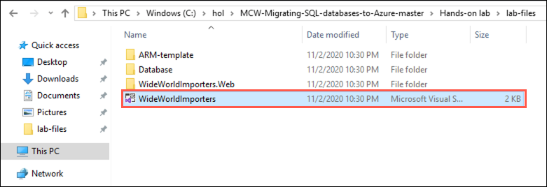
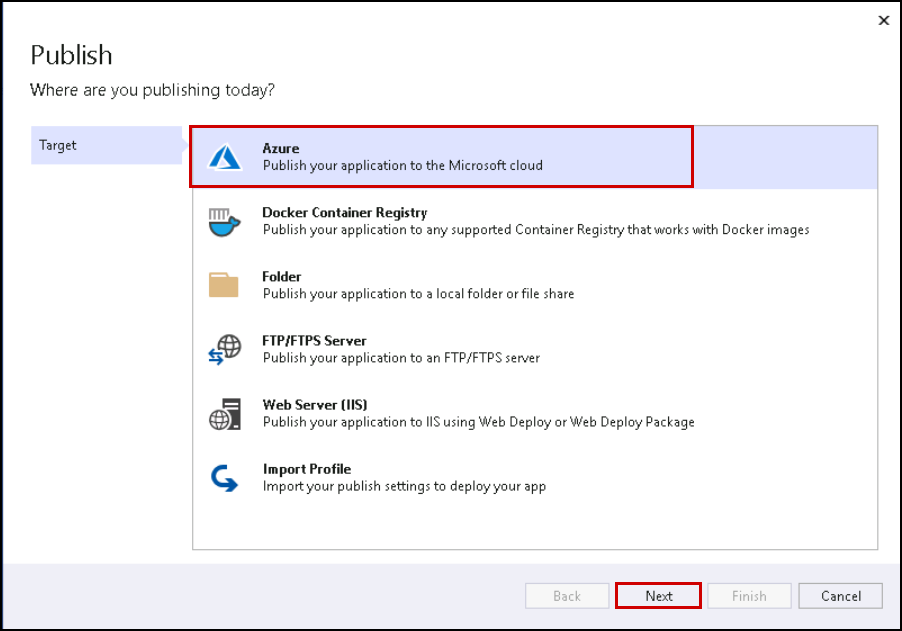
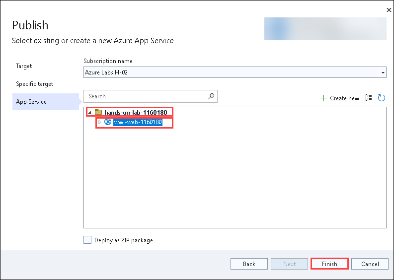
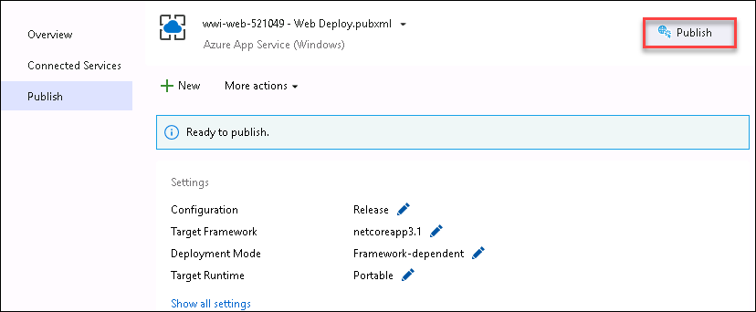

# Exercise 3: Update the web application to use the new SQL MI database

In this lab, you will deploy a web app to Azure and update its App Service configuration. This process involves setting up the web app in the Azure environment and configuring the necessary settings to ensure it runs smoothly. By the end of this lab, you will have a fully deployed and configured web app on Azure, ready for use.

## Lab Objectives

Lab Objectives

In this lab, you will complete the following tasks:

- Task 1: Deploy the web app to Azure
- Task 2: Update App Service configuration

> **Note**: Azure SQL Managed Instance has a private IP address in a dedicated VNet, so to connect an application, you must configure access to the VNet where the Managed Instance is deployed. To learn more, read Connect your application to Azure SQL Managed Instance `https://docs.microsoft.com/azure/azure-sql/managed-instance/connect-application-instance`.

### Task 1: Deploy the web app to Azure

In this task, you will use JumpBox VM and then, using Visual Studio on the JumpBox, deploy the `WideWorldImporters` web application into the App Service in Azure.

1. You have already logged in to JumpBox VM, use this VM to continue with the lab. 

1. In the File Explorer dialog, navigate to the `C:\hands-on-lab` folder and then drill down to `MCW-Migrating-SQL-databases-to-Azure-master\Hands-on lab\lab-files`. In the `lab-files` folder, double-click `WideWorldImporters.sln` to open the solution in Visual Studio.

   

1. If prompted about how you want to open the file, select **Visual Studio 2022**, and then select **OK**.

    

1. Select **Sign in** and enter the following Azure account credentials when prompted:
   
   * Email/Username: <inject key="AzureAdUserEmail"></inject>
   * Password: <inject key="AzureAdUserPassword"></inject>

        

1. Once you signed in, Click on **Start Visual Studio**.

    

1. At the security warning prompt, uncheck **Ask me for every project in this solution**, and then select **OK**.

    

1. Once logged into Visual Studio, right-click the `WideWorldImporters.Web` project in the Solution Explorer, and then select **Publish**.

    

1. On the **Publish** dialog, select **Azure** in the Target box, and select **Next**.

    

1. Next, in the **Specific target** box, select **Azure App Service (Windows)**.

    

1. Finally, in the **App Service** box, select your subscription, expand the **hands-on-lab-<inject key="Suffix" enableCopy="false"/>** resource group, and select the **wwi-web-<inject key="Suffix" enableCopy="false"/>** Web App.

    

1. Select **Close**.

    

1. Back on the Visual Studio Publish page for the `WideWorldImporters.Web` project, select **Publish** to start the process of publishing your Web API to your Azure API App.

    

1. When the publish completes, you will see a message on the Visual Studio Output page that the publish succeeded.

    

2. If you select the link of the published web app from the Visual Studio output window, an error page is returned because the database connection strings have not been updated to point to the SQL MI database. You address this in the next task.

    

### Task 2: Update App Service configuration

In this task, you update the WWI gamer info web application to connect to and utilize the SQL MI database.

1. In the Azure portal `https://portal.azure.com`, select **Resource groups** from the Azure services list.

   

2. Select the **hands-on-lab<inject key="Resource Group Name" enableCopy="false"/>** resource group from the list.

   

3. In the list of resources for your resource group, select the **<inject key="Resource Group Name" enableCopy="false"/>** resource group and then select the **wwi-web-<inject key="Suffix" enableCopy="false"/>** App Service from the list of resources.

   

4. On the App Service blade, select **Configuration** under Settings on the left-hand side.

   

5. On the Configuration blade, locate the **Connection strings** section and then select the Pencil (Edit) icon to the right of the `WwiContext` connection string.

   

6. The value of the connection string should look like this:
    
    ``
    Server=tcp:your-sqlmi-host-fqdn-value,1433;Database=WideWorldImportersSuffix;User ID=contosoadmin;Password=IAE5fAijit0w^rDM;Trusted_Connection=False;Encrypt=True;TrustServerCertificate=True;
    ``

8. In the Add/Edit connection string dialog, replace `your-sqlmi-host-fqdn-value` with the fully qualified domain name for your SQL MI that you copied to a text editor earlier from the Azure Cloud Shell and replace suffix with value: <inject key="suffix" />.

   

9. The updated value should look similar to the following screenshot.

   

10. Select **OK**.

11. Repeat steps 3 - 7, this time for the `WwiReadOnlyContext` connection string.

12. Select **Save** at the top of the Configuration blade.

    

13. When prompted that changes to application settings and connection strings will restart your application, select **Continue**.

    

14. Select **Overview** to the left of the Configuration blade to return to the overview blade of your App Service.

    

15. At this point, selecting the **URL** for the App Service on the Overview blade still results in an error being returned. The error occurs because the SQL Managed Instance has a private IP address in its VNet. To connect an application, you need to configure access to the VNet where the Managed Instance is deployed, which you handle in the next exercise.

    

## Summary

In this hands-on lab, you will deploy a web app to Azure and update its App Service configuration.
