## Exercise 4: Update the web application to use the new SQL MI database

## Duration: 30 minutes

In this lab, you will deploy a web app to Azure and update its App Service configuration. This process involves setting up the web app in the Azure environment and configuring the necessary settings to ensure it runs smoothly. By the end of this lab, you will have a fully deployed and configured web app on Azure, ready for use.

## Lab Objectives

In this lab, you will complete the following tasks:

- Task 1: Deploy the web app to Azure
- Task 2: Update App Service configuration

### Task 1: Deploy the web app to Azure

In this task, you will use JumpBox VM and then, using Visual Studio on the JumpBox, deploy the `WideWorldImporters` web application into the App Service in Azure.

1. You have already logged in to JumpBox VM, use this VM to continue with the lab. 

1. In the File Explorer dialog, navigate to the `C:\hands-on-lab\MCW-Migrating-SQL-databases-to-Azure-master\Hands-on lab\lab-files`. In the `lab-files` folder, double-click `WideWorldImporters.sln` to open the solution in Visual Studio.

   

1. If prompted about **How you want to open the file?**, select **Visual Studio 2022**, and then select **OK**.

    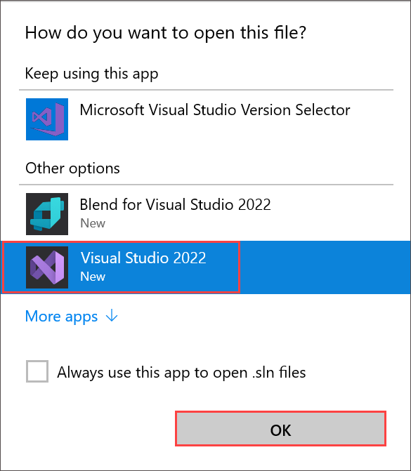

1. Select **Sign in** and choose **Work or school account** > **Continue** and enter the following **Azure account** credentials if prompted:
   
   * Email/Username: <inject key="AzureAdUserEmail"></inject>
   * Password: <inject key="AzureAdUserPassword"></inject>

     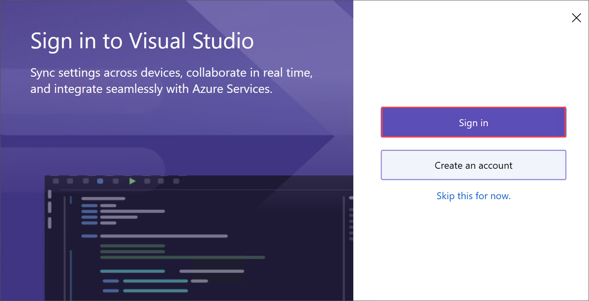

     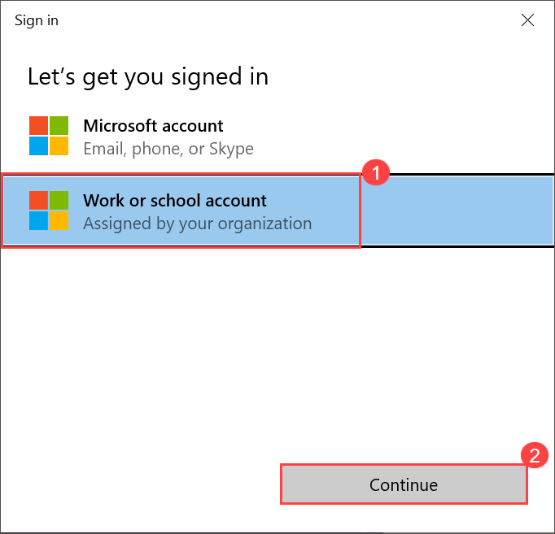

1. Once you signed in, Click on **Start Visual Studio**.

    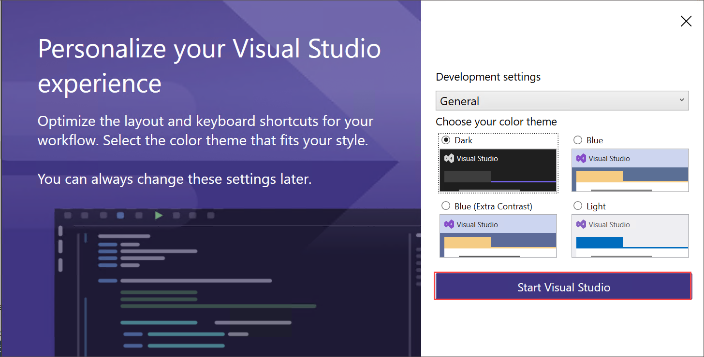

1. On **Stay signed in to all your apps** click on **OK**. Then on **You're all set** page select **Done**. 

1. If prompted at the security warning, uncheck **Ask me for every project in this solution**, and then select **OK**.

    

1. Once logged into **Visual Studio**, right-click the **`WideWorldImporters.Web`** project in the **Solution Explorer**, and then select **Publish**.

    

1. On the **Publish** dialog, select **Azure** in the **Target** box, and click **Next**.

    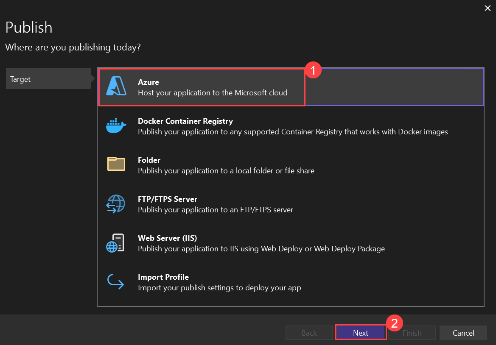

1. Next, in the **Specific target** box, select **Azure App Service (Windows)** and click **Next**.

    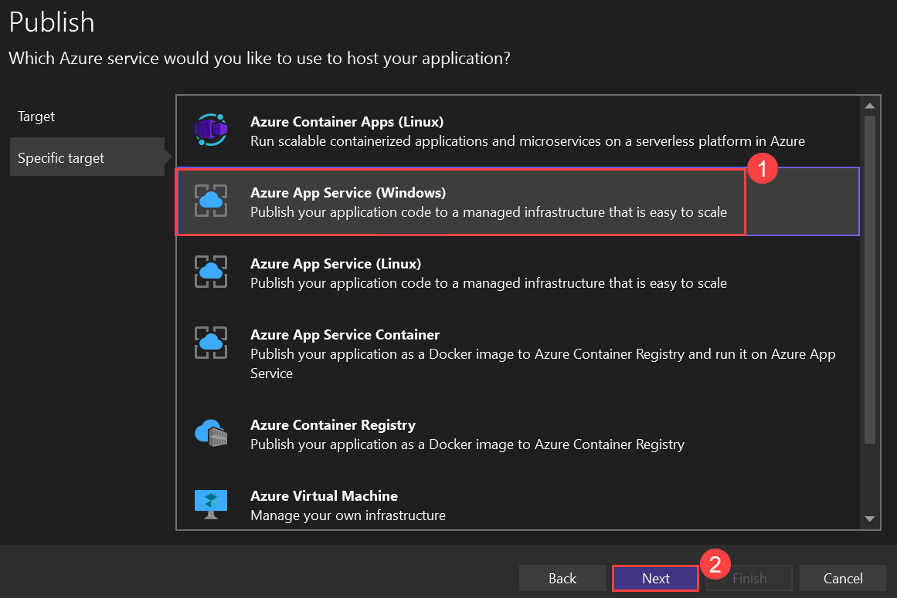

1. Finally, in the **App Service** box, select your subscription, expand the **hands-on-lab-<inject key="Suffix" enableCopy="false"/>** resource group, and select the **wwi-web-<inject key="Suffix" enableCopy="false"/>** Web App then click on **Finish**

    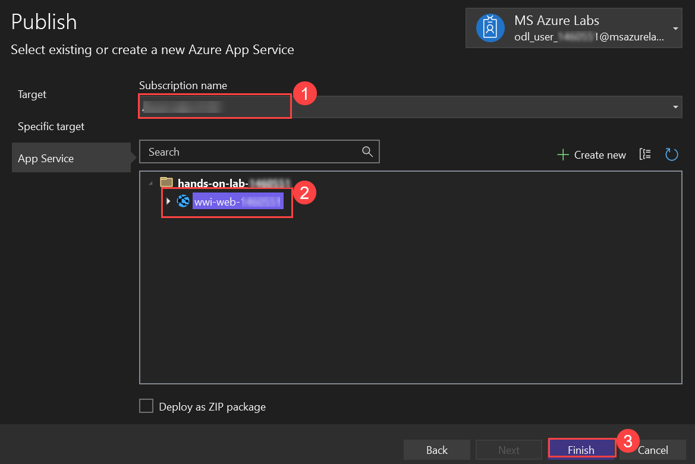

1. Select **Close**.

    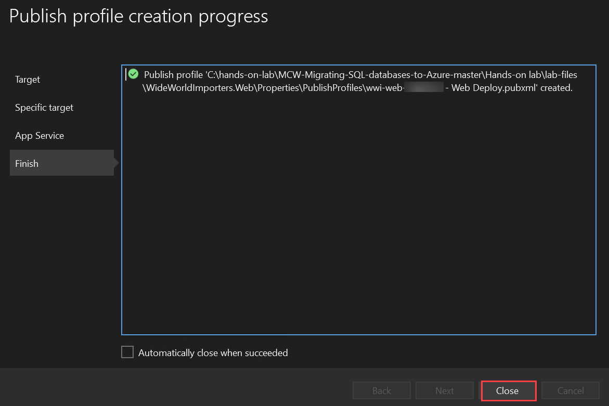

1. Back on the Visual Studio Publish page for the `WideWorldImporters.Web` project, select **Publish** to start the process of publishing your Web API to your Azure API App.

    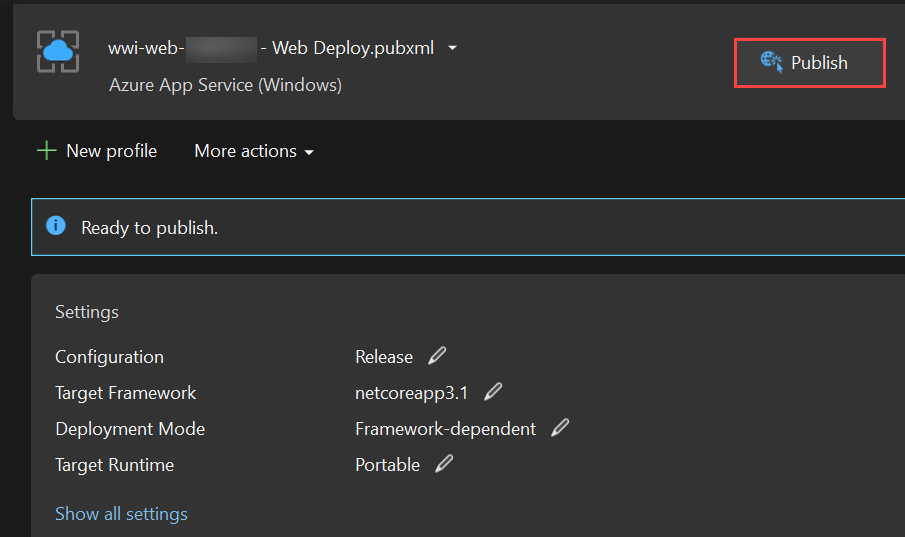

1. When the publish completes, you will see a message on the Visual Studio Output page that the publish succeeded.

    

2. If you select the link of the published web app from the Visual Studio output window, an error page is returned because the database connection strings have not been updated to point to the SQL MI database. You address this in the next task.

    

### Task 2: Update App Service configuration

In this task, you update the WWI gamer info web application to connect to and utilize the SQL MI database.

1. Navigate back to Azure portal, search and select **Resource groups** from the Azure services list.

   

2. Select the **<inject key="Resource Group Name" enableCopy="false"/>** resource group from the list.

     .png)
 
3. In the list of resources for your resource group, select the **<inject key="Resource Group Name" enableCopy="false"/>** resource group and then select the **wwi-web-<inject key="Suffix" enableCopy="false"/>** App Service from the list of resources.

   

4. On the App Service blade, select **Environment variables** **(1)** under Settings on the left-hand side, select **Connection strings** **(2)** and click on **Advanced edit** **(3)**.

   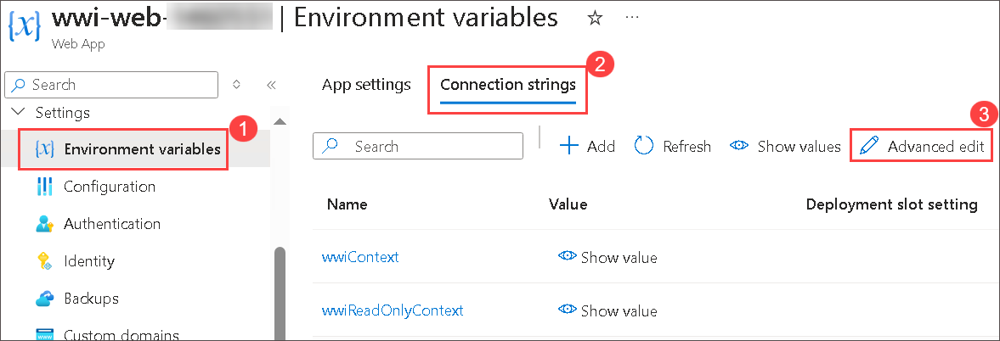

6. Replace the **value** of the connection string of `WwiContext` with the below and replace **`your-sqlmi-host-fqdn-value`** with the fully qualified domain name for your SQL MI that you copied to a text editor earlier from the Azure Cloud Shell and replace the suffix with value: <inject key="suffix" />.
    
    ``
    Server=tcp:your-sqlmi-host-fqdn-value,1433;Database=WideWorldImportersSuffix;User ID=contosoadmin;Password=IAE5fAijit0w^rDM;Trusted_Connection=False;Encrypt=True;TrustServerCertificate=True;
    ``

   >**Note**: Copy the name and value of **`WwiContext`** and paste them into a text editor they will be used in a later step.

7. Repeat **steps 5**, this time for the **`WwiReadOnlyContext`** connection string.

    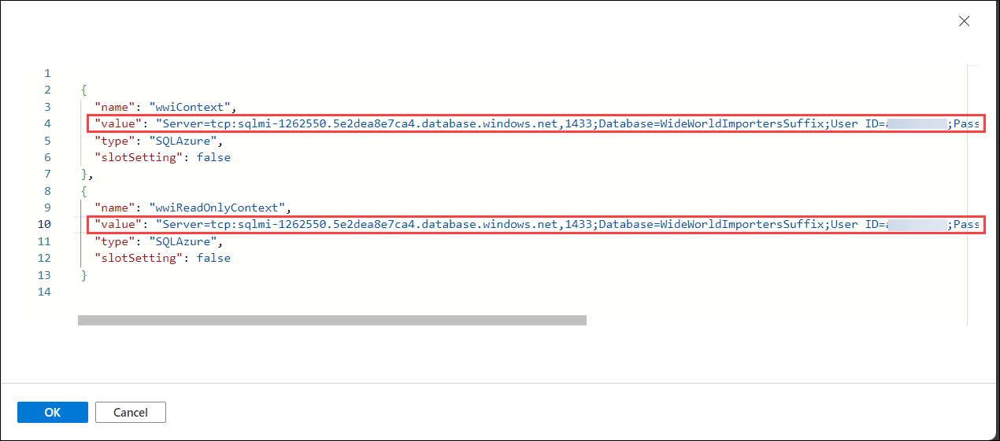

    >**Note**: Copy the name and value of **`WwiReadOnlyContext`** and paste them into a text editor they will be used in a later step.
   
8. Select **OK**.

9. Select **Apply** at the top of the Environment variables blade then click on **confirm**. 

    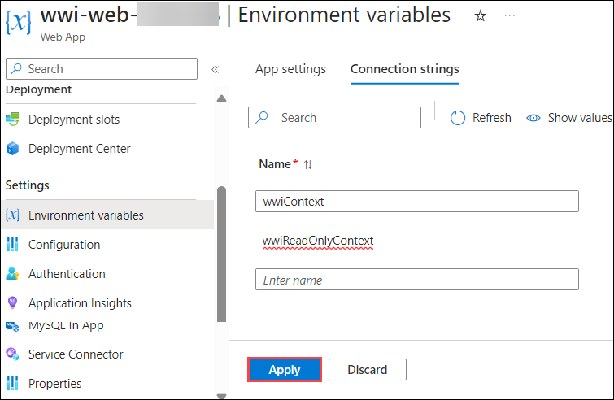

   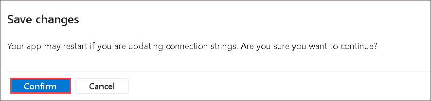
     
10. Back on **wwi-web-<inject key="Suffix" enableCopy="false"/> | Environment variables**, Click on **Add** from the **App settings**.
     
      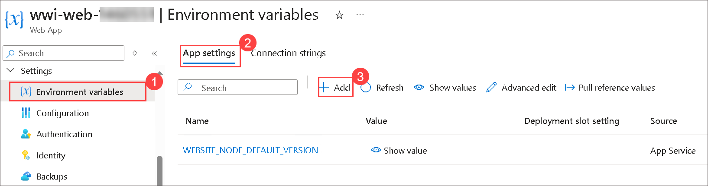
    
11. Add the **Name** and **Value** of `WwiContext` which you recorded in notepade and click on **Apply**

    

12. Repeat above step for **`WwiReadOnlyContext`** and paste the **Name** and **Value** which you recorded in notepad and click on **Apply**

      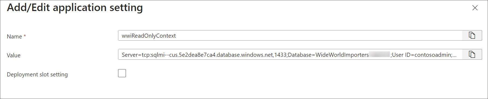

13. Click on **Apply**.

14. When prompted that Your app may restart if you are updating connection strings. Are you sure you want to continue?, select **Confirm**.

     

15. From the left menu, select **Overview** to return to the **Overview** blade of your **App Service**. Then, click on **Default Domain** in the Overview blade. still results in an error being returned. The error occurs because the SQL Managed Instance has a private IP address in its VNet. To connect an application, you need to configure access to the VNet where the Managed Instance is deployed, which you handle in the next exercise.

    
    
    

    > **Congratulations** on completing the task! Now, it's time to validate it. Here are the steps:
    - If you receive a success message, you can proceed to the next task.
    - If not, carefully read the error message and retry the step, following the instructions in the lab guide.
    - If you need any assistance, please contact us at cloudlabs-support@spektrasystems.com. We are available 24/7 to help you out.
    
<validation step="aee6215e-2948-4239-a9f7-12907b6d0e08" />

## Summary:

In this exercise you successfully deployed the WideWorldImporters web application to an Azure App Service and updated the connection strings to point to the SQL Managed Instance (SQL MI) database. The next step involves configuring the App Service to connect to the SQL MI database by ensuring proper network access, as SQL MI uses a private IP address within its own VNet.

## Review

In this lab, you have completed:

- Deploy the web app to Azure
- Update App Service configuration

### Proceed with the next lab by clicking on Next>>.
