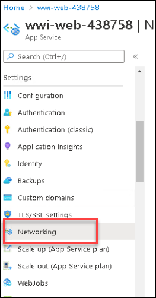
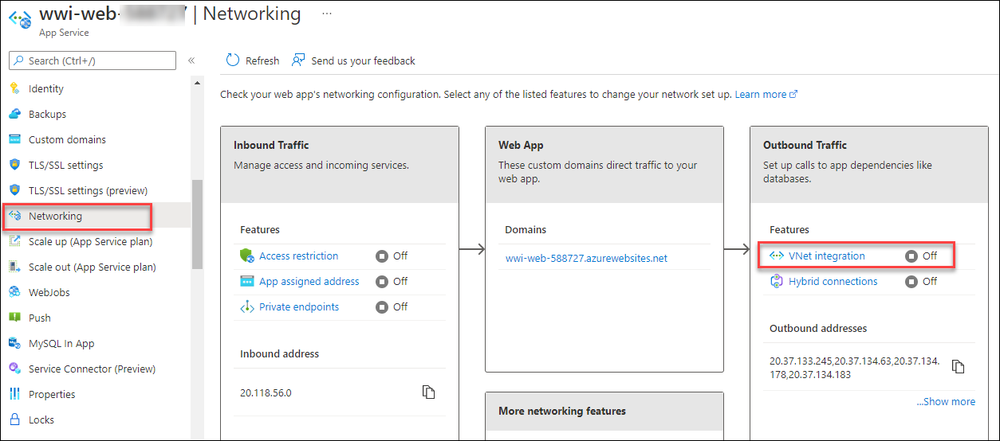
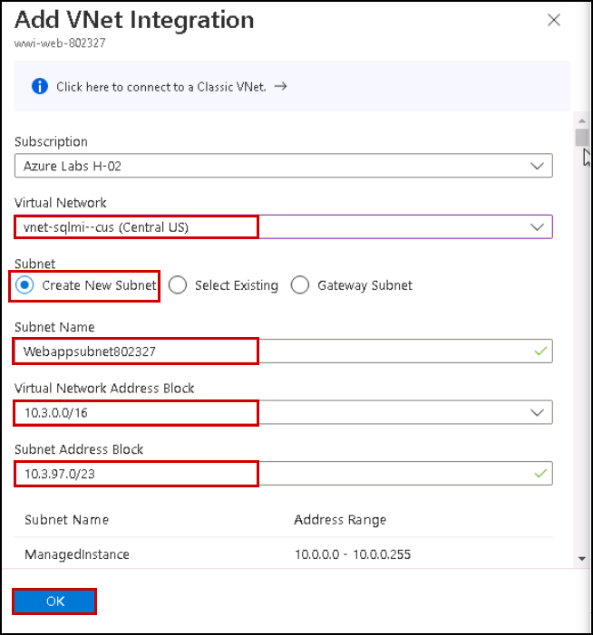

## Exercise 4: Integrate App Service with the virtual network

Duration: 15 minutes

In this exercise, you integrate the WWI App Service with the virtual network created during the Before the hands-on lab exercises. The ARM template created a Gateway subnet on the VNet, as well as a Virtual Network Gateway. Both resources are required to integrate App Service and connect to SQL MI.

### Task 1: Configure VNet integration with App Services

In this task, you add the networking configuration to your App Service to enable communication with resources in the VNet.

1. In the Azure portal `https://portal.azure.com`, select **Resource groups** from the left-hand menu, select the **<inject key="Resource Group Name" enableCopy="false"/>** resource group and then select the **wwi-web-<inject key="Suffix" />** App Service from the list of resources.

   

2. On the App Service blade, select **Networking** from the left-hand menu.

   

3. On the **Networking** page, click on the **VNet integration** under **Outbound Traffic**.

   

3. Now click on **Add virtual network integration** under **Virtual Network Integration**.

   

1. On the Network Feature Status dialog, enter the following and click **Connect**.

   - **Virtual Network**: Select the `vnet-sqlmi--cus`.
   - **Subnet**: Select any existing subnet from the drop-down menu.

      

  > **Note**: If you see **Failed to add delegation to existing subnet** please select any other available subnet from the list of dropdowns.

  > **Note**: If you are not able to select any existing subnet, Select the create new subnet option and enter the name as Webappsubnet<inject key="Suffix" />. Select the Virtual Network address block i.e., 10.0.0.0/16 from the drop-down list. In the subnet address block enter new address block 10.0.xx.0/24 for the subnet, make sure it is not overlapping other subnet's address.

  > **Note**: If the address space is overlapping with other subnets, change the virtual network address block by selecting a different virtual network address block i.e., 10.1.0.0/16 or 10.2.0.0/16 from the drop-down. In the subnet address block, enter 10.1.xx.0/24 or 10.2.xx.0/24 according to the virtual network address block you have selected and make sure it is not overlapping the other subnet's address.

   

5. Within a few minutes, the VNet is added, and your App Service is restarted to apply the changes. Select Refresh to confirm whether the Vnet is connected or not.

   

   > **Note**: If you receive a message adding the Virtual Network to the Web App fails, select **Disconnect** on the VNet Configuration blade, and repeat steps 3 - 5 above.

### Task 2: Open the web application

In this task, you verify your web application now loads, and you can see the home page of the web app.

1. Select **Overview** in the left-hand menu of your App Service and select the **URL** of your App service to launch the website. This link opens the URL in a browser window.

   

2. Verify that the website and data are loaded correctly. The page should look similar to the following:

   

   > **Note**: It can often take several minutes for the network configuration to be reflected in the web app. If you get an error screen, try selecting Refresh a few times in the browser window. If that does not work, try selecting **Restart** on the Azure Web App's toolbar.

3. Congratulations, you successfully connected your application to the new SQL MI database.
