## Exercise 5: Improve database security posture with Data Discovery and Classification and Azure Defender for SQL

## Duration: 30 minutes

In this exercise, you are able to set up some of the advanced security features of SQL MI and explore some of the security benefits that come with running your database in Azure. [Azure Defender for SQL](https://docs.microsoft.com/azure/azure-sql/database/azure-defender-for-sql) provides advanced SQL security capabilities, including functionality for surfacing and mitigating potential database vulnerabilities and detecting anomalous activities that could indicate a threat to your database. Also, [Data Discovery and Classification](https://docs.microsoft.com/azure/azure-sql/database/data-discovery-and-classification-overview) allows you to discover and classify sensitive data within the database.

## Lab objectives

In this lab, you will perform the following:

- Task 1: Configure Data Discovery and Classification
- Task 2: Review an Azure Defender for SQL Vulnerability Assessment

### Task 1: Configure Data Discovery and Classification

In this task, you review the [Data Discovery and Classification](https://docs.microsoft.com/azure/azure-sql/database/data-discovery-and-classification-overview) feature of Azure SQL. Data Discovery & Classification introduces a new tool for discovering, classifying, labelling, and reporting the sensitive data in your databases. It introduces a set of advanced services, forming a new SQL Information Protection paradigm aimed at protecting the data in your database, not just the database. Discovering and classifying your most sensitive data (e.g., business, financial, healthcare) can play a pivotal role in your organizational information protection stature.

1. Navigate to **SQLMI-Shared-RG** resource group and select the SQL Managed instance named **sqlmi--cus**. Now, from the **Overview** tab select the Managed database named which you note down in Lab 1 Data Modernization: Migrate SQL DB to Azure SQL MI name start like **WideWorldImporters{suffix}**.

1. On the **WideWorldImporters{suffix}** Managed database blade, select **Data Discovery & Classification** from the left-hand menu.

   

1. In the **Data Discovery & Classification** blade, select the info link with the message **Currently database is using SQL Information Protection policy. Found 35 columns with classification recommendations**.

   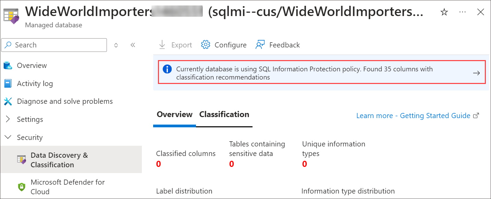

1. Look over the list of recommendations to get a better understanding of the types of data and classifications that can be assigned, based on the built-in classification settings. In the list of classification recommendations, select the recommendation for the **Sales - CreditCard - CardNumber** field.

   

1. Due to the risk of exposing credit card information, WWI would like a way to classify it as highly confidential, not just **Confidential**, as the recommendation suggests. To correct this, select **+ Add classification** at the top of the Data Discovery & Classification blade.

   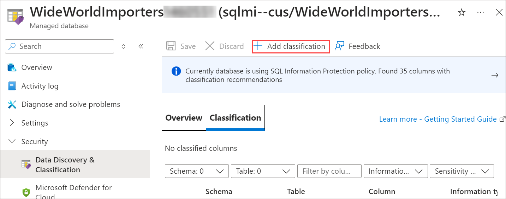

1. Quickly expand the **Sensitivity label** field and review the various built-in labels from which you can choose. You can also add custom labels, should you desire.

   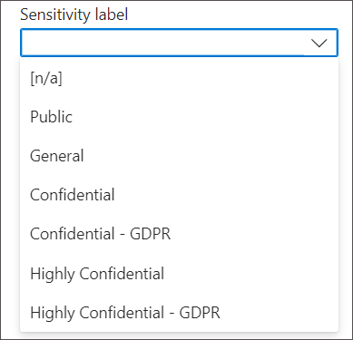

1. In the Add classification dialog, enter the following then select **Add classification**.

   - **Schema name**: Select **Sales**.
   - **Table name**: Select **CreditCard**.
   - **Column name**: Select **CardNumber (nvarchar)**.
   - **Information type**: Select **Credit Card**.
   - **Sensitivity level**: Select **Highly Confidential**.

      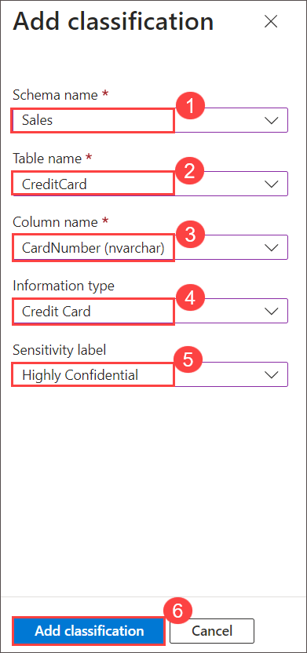

1. Select **Add classification**.

1. Notice that the **Sales - CreditCard - CardNumber** field disappears from the recommendations list, and the number of recommendations drops by 1.

1. Select **Save** on the toolbar of the Data Classification window. It may take several minutes for the save to complete.

   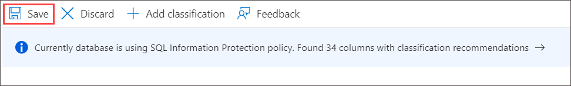

1. Other recommendations you can review are the **HumanResources - Employee** fields for **NationIDNumber** and **BirthDate**. Note that the recommendation service flagged these fields as **Confidential - GDPR**. WWI maintains data about gamers from around the world, including Europe, so having a tool that helps them discover data that may be relevant to GDPR compliance is very helpful.

    

1. Check the **Select all** checkbox at the top of the list to select all the remaining recommended classifications, and then select **Accept selected recommendations**.

    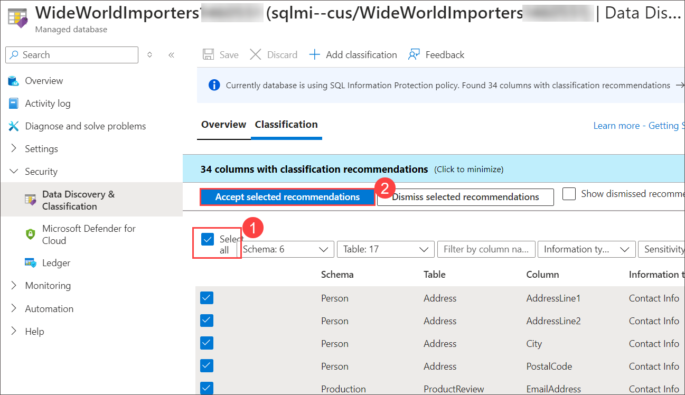

1. Select **Save** on the toolbar of the Data Classification window. It may take several minutes for the save to complete.

    

1. When the save completes, select the **Overview** tab on the Data Discovery & Classification blade to view a report with a full summary of the database classification state.

    

>**Congratulations** on completing the Task! Now, it's time to validate it. Here are the steps:
> - Navigate to the Lab Validation tab, from the upper right corner in the lab guide section.
> - Hit the Validate button for the corresponding task. If you receive a success message, you have successfully validated the lab. 
> - If not, carefully read the error message and retry the step, following the instructions in the lab guide.
> - If you need any assistance, please contact us at labs-support@spektrasystems.com.

### Task 2: Review an Azure Defender for SQL Vulnerability Assessment

In this task, you review an assessment report generated by Azure Defender for the `WideWorldImporters` database and take action to remediate one of the findings in the `WideWorldImporters` database. The [SQL Vulnerability Assessment service](https://docs.microsoft.com/azure/sql-database/sql-vulnerability-assessment) is a service that provides visibility into your security state and includes actionable steps to resolve security issues and enhance your database security.

1. Select **Microsoft Defender for Cloud** from the left hand navigation menu of the **WideWorldImporters<inject key="Suffix" />** Managed database.

    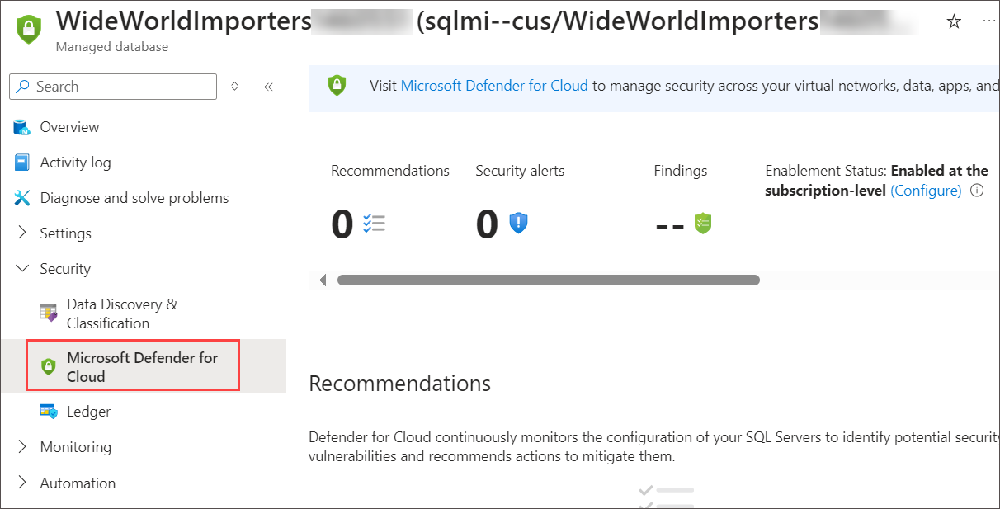
   
1. On the **Microsoft Defender for Cloud** blade for the **WideWorldImporters<inject key="Suffix" />** Managed database, Scroll down and click on **View additional findings in Vulnerability Assessment** to open the Vulnerability Assessment blade.

   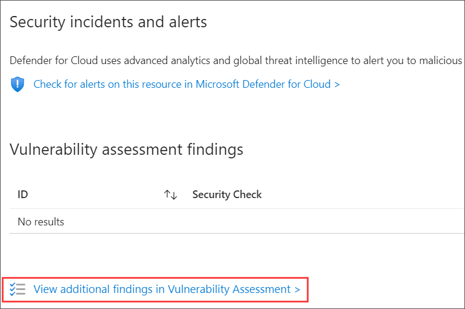

   > **Note**: If you see Microsoft Defender for SQL is not enabled click on the **Enable** button, wait till it gets Succeeded and perform the step 2.

      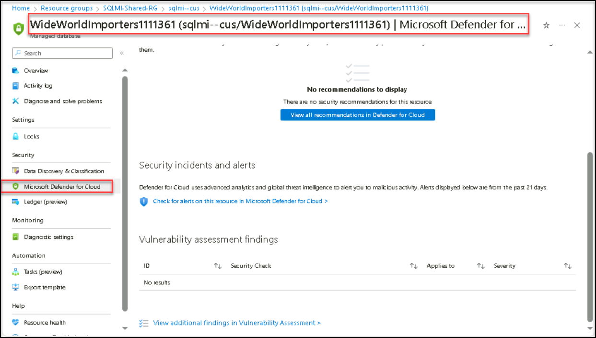
      
1. On the Vulnerability Assessment blade, select **Scan** on the toolbar.

    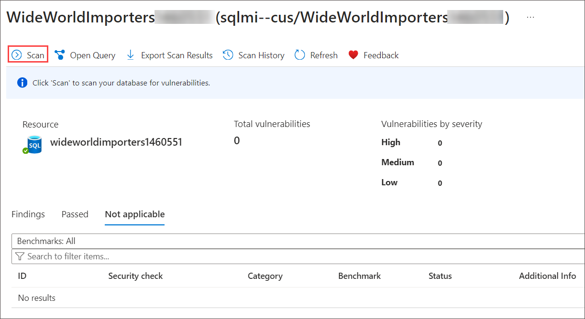

    > **Note**: If you encounter an error "Failed to execute Vulnerability Assessment scan for **WideWorldImporters{suffix}**. Error message: The configured storage account was not found in the subscriptions", perform the following steps.

    - Move back to the **Microsoft Defender for Cloud** blade.

    -  Once you are in the **Microsoft Defender for Cloud** blade, click on **Configure** of the Enablement Status: Enabled at the subscription level.

        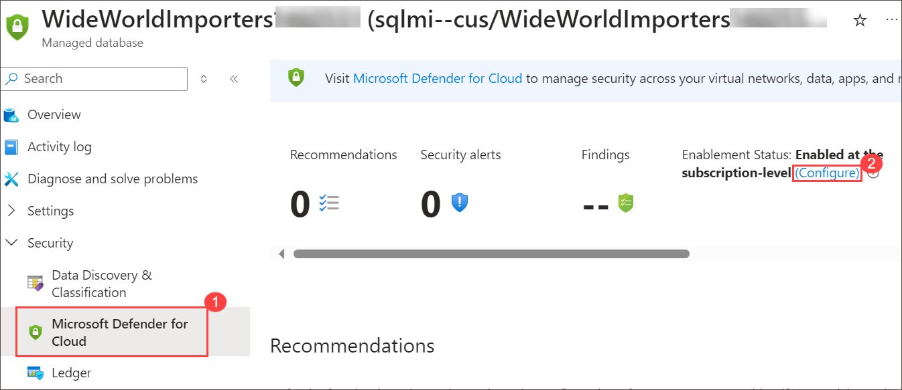

    - On the **Server Settings** blade, click on **Select Storage acount** under Storage account.

       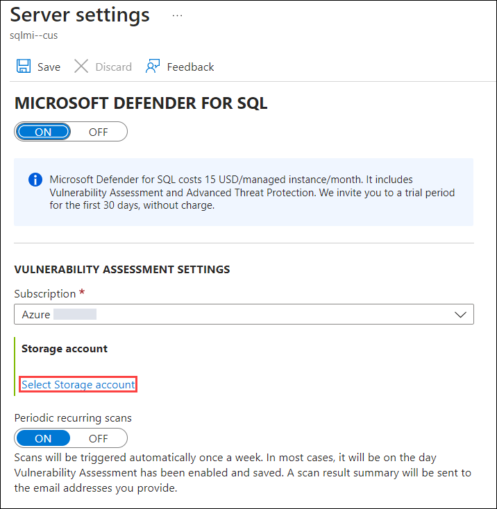

    - On **Choose storage account** blade, select the storage account **sqlmistore<inject key="SUFFIX" enableCopy="false"/>**.

       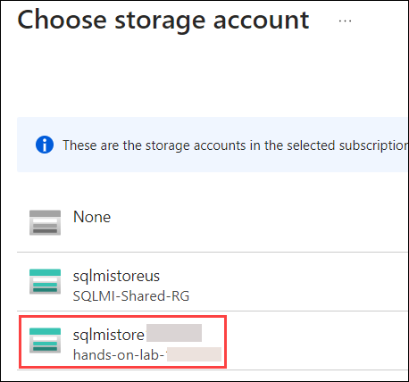
      
    - On the **Server Settings** blade, click on **Save**.

       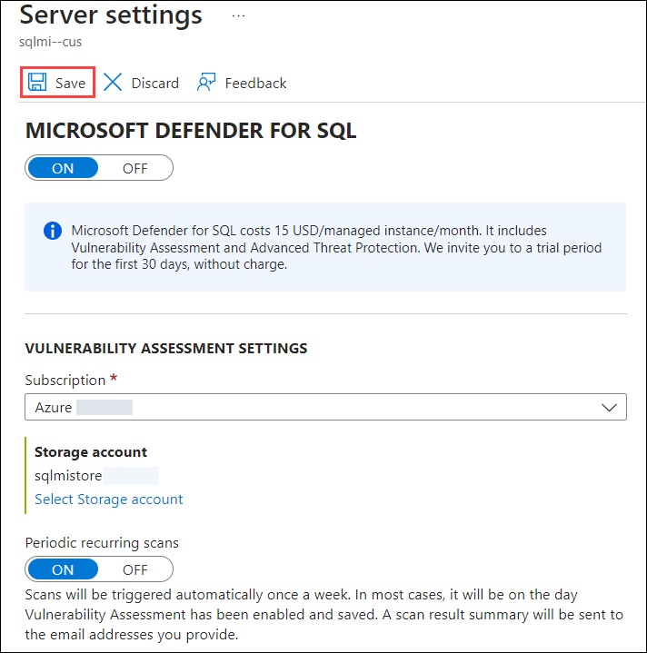

   - Re-perform the steps 2 and 3.
 
1. When the scan completes, a dashboard displaying the number of failing and passing checks, along with a breakdown of the risk summary by severity level is displayed.

   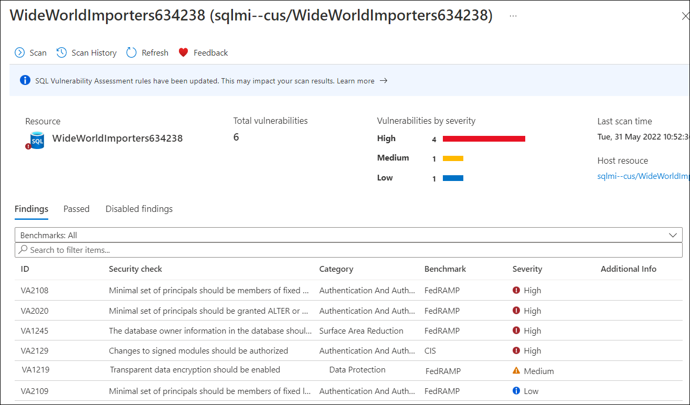

1. In the scan results, take a few minutes to browse both the Failed and Passed checks, and review the types of checks that are performed. In the **Unhealthy** list, locate the security check for **Transparent data encryption**. This check has an ID of **VA1219**.

   

1. Select the **VA1219** finding to view the detailed description.

   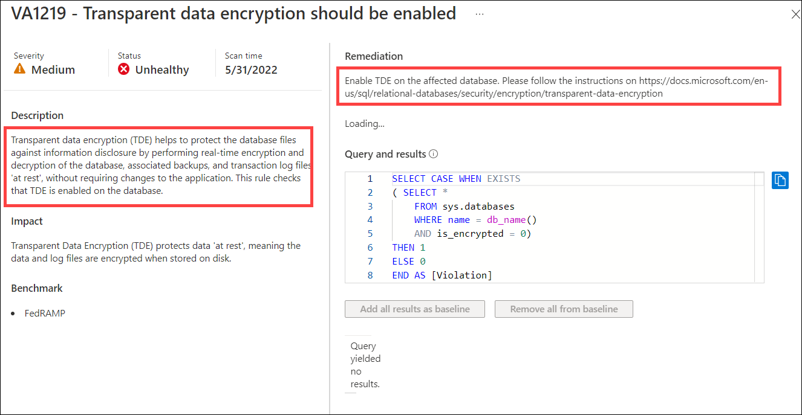

   > The details for each finding provide more insight into the reason for the finding. Of note are fields describing the finding, the impact of the recommended settings, and details on remediation for the finding.

1. You will now act on the recommended remediation steps for the finding and enable [Transparent Data Encryption](https://docs.microsoft.com/azure/azure-sql/database/transparent-data-encryption-tde-overview?tabs=azure-portal) for the `WideWorldImporters` database. To accomplish this, switch over to using SSMS on your JumpBox VM for the next few steps.

   > **Note**: Transparent data encryption (TDE) needs to be manually enabled for Azure SQL Managed Instance. TDE helps protect Azure SQL Database, Azure SQL Managed Instance, and Azure Data Warehouse against the threat of malicious activity. It performs real-time encryption and decryption of the database, associated backups, and transaction log files at rest without requiring changes to the application.

1. In the Azure portal, select the Azure Cloud Shell icon from the top menu.

   


1. At the prompt, retrieve information about SQL MI in the SQLMI-Shared-RG resource group by entering the following PowerShell command.

   ```PowerShell
   $resourceGroup = "SQLMI-Shared-RG"
   az sql mi list --resource-group $resourceGroup
   ```

1. Within the above command's output, locate and copy the value of the **`fullyQualifiedDomainName`** property. Paste the value into a text editor, such as Notepad.exe, for reference below.

   

1. Navigate to the Azure portal and select **Resource groups** from the Azure services list.

   

1. Select the **<inject key="Resource Group Name" enableCopy="false"/>** resource group from the list.

    .png)

1. In the list of resources for your resource group, select the **<inject key="SQLVM Name" enableCopy="false"/>** VM.

    

1. From the overview page of  the **<inject key="SQLVM Name" enableCopy="false"/>** VM, select **Connect > Connect**.

    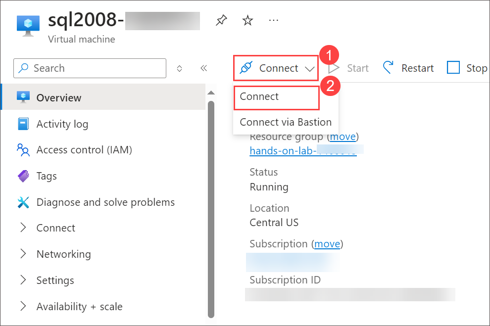

1. On the **sql2008-<inject key="Suffix" enableCopy="false"/> | Connect** page, click on **Download RDP file (2)**. 
  
   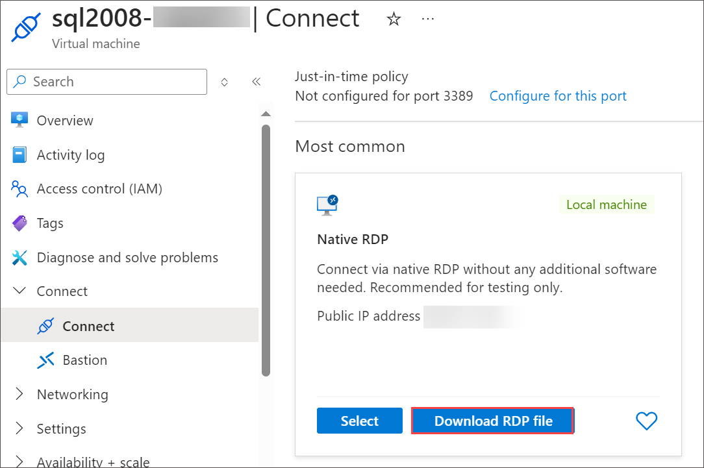

1. Click on **Keep**, on the Downloads pop-up. 

   

1. Click on **Open file**.

   

1. Next, on the RDP tab click on **Connect**.

   

1. Enter the following credentials when prompted, and then select **OK**:

   - **Username**: `sqlmiuser`
   - **Password**: `Password.1234567890`

      

1. Select **Yes** to connect if prompted that the remote computer's identity cannot be verified.

   

1. On your **sql2008-<inject key="Suffix" enableCopy="false"/>**, open Microsoft SQL Server Management Studio 17 from the Start menu, enter the following information in the **Connect to Server** dialogue and click on **Connect** **(6)**.

   - **Server name** **(1)**: Enter the fully qualified domain name of your SQL-managed instance, which you copied from the Azure Cloud Shell in a previous task.
   - **Authentication** **(2)**: Select **SQL Server Authentication**.
   - **Login** **(3)**: Enter `contosoadmin`
   - **Password** **(4)**: Enter `IAE5fAijit0w^rDM`
   - Check the **Remember password** **(5)** box.

      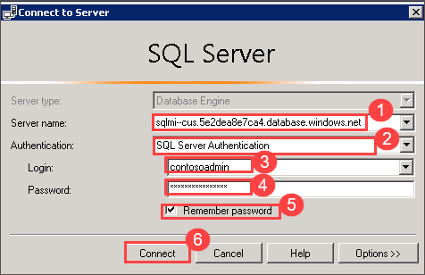

1. In SSMS, select **New Query** from the toolbar and paste the following SQL script into the new query window.
   > **Note**: Make sure to replace the **{Managed-database-Name}** with **WideWorldImporters<inject key="Suffix" />**.

   ```SQL
   USE {Managed-database-Name};
   GO

   ALTER DATABASE [{Managed-database-Name}] SET ENCRYPTION ON
   ```

   > You turn transparent data encryption on and off on the database level. To enable transparent data encryption on a database in Azure SQL Managed Instance use must use T-SQL.

      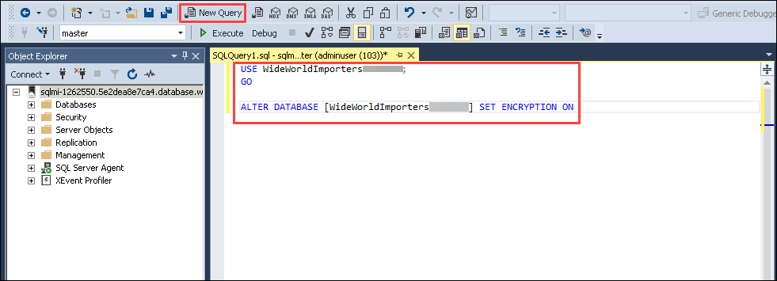

1. Select **Execute** from the SSMS toolbar. After a few seconds, you will see a message that **Commands completed successfully**. 

    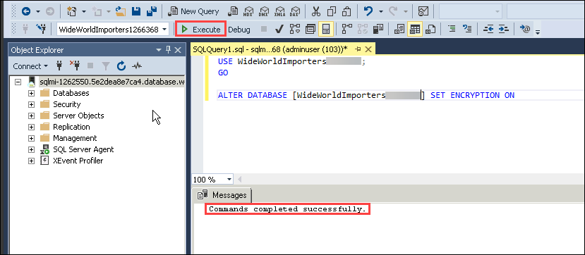

10. You can verify the encryption state and view information on the associated encryption keys by using the [sys.dm_database_encryption_keys view](https://docs.microsoft.com/sql/relational-databases/system-dynamic-management-views/sys-dm-database-encryption-keys-transact-sql). Select **New Query** on the SSMS toolbar again, and paste the following query into the new query window:

    ```SQL
    SELECT * FROM sys.dm_database_encryption_keys
    ```

    

1. Select **Execute** from the SSMS toolbar. You will see two records in the Results window, which provide information about the encryption state and keys used for encryption.

    

    > By default, service-managed transparent data encryption is used. A transparent data encryption certificate is automatically generated for the server that contains the database.

1. Return to the Azure portal and the Azure Defender for SQL's Vulnerability Assessment blade of the `WideWorldImportersSUFFIX` managed database. On the toolbar, select **Scan** to start a new assessment of the database.

    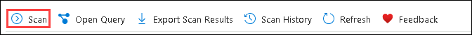

1. When the scan completes, select the **Findings** tab, enter **VA1219** into the search filter box, and observe that the previous failure is no longer in the findings list.

    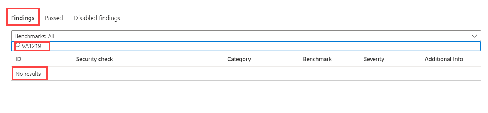

1. Now, select the **Passed** tab, and observe the **VA1219** check is listed with a status of **PASS**.

    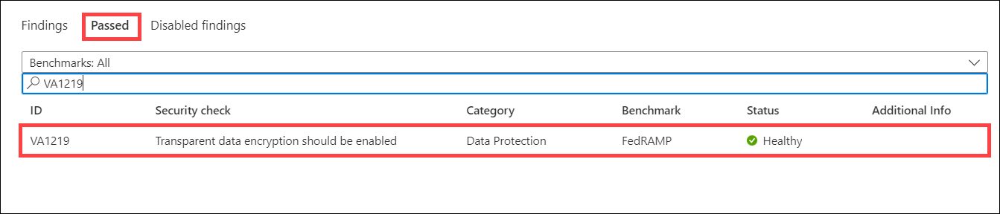

    > Using the SQL Vulnerability Assessment, it is simple to identify and remediate potential database vulnerabilities, allowing you to improve your database security proactively.

>**Congratulations** on completing the Task! Now, it's time to validate it. Here are the steps:
> - Navigate to the Lab Validation tab, from the upper right corner in the lab guide section.
> - Hit the Validate button for the corresponding task. If you receive a success message, you have successfully validated the lab. 
> - If not, carefully read the error message and retry the step, following the instructions in the lab guide.
> - If you need any assistance, please contact us at labs-support@spektrasystems.com.

## Summary:

By completing this lab, you have successfully enhanced the security posture of your SQL Managed Instance by classifying sensitive data and identifying/remediating potential vulnerabilities. These steps are crucial for protecting data and ensuring compliance with regulations like GDPR.

## Review

In this lab, you have completed:

- Configure Data Discovery and Classification
- Review an Azure Defender for SQL Vulnerability Assessment

### You have successfully completed this lab.
