# Manual resource deployment and setup guide

This guide provides step-by-step instructions to manually provision and configure the resources created by the ARM template referenced in the before the hands-on lab guide.

February 2020

**Contents**:

- [Manual resource deployment and setup guide](#manual-resource-deployment-and-setup-guide)
  - [Task 1: Create virtual network](#task-1-create-virtual-network)
  - [Task 2: Create VPN gateway](#task-2-create-vpn-gateway)
  - [Task 3: Provision SQL MI](#task-3-provision-sql-mi)
  - [Task 4: Create the JumpBox VM](#task-4-create-the-jumpbox-vm)
  - [Task 5: Create SQL Server 2008 R2 virtual machine](#task-5-create-sql-server-2008-r2-virtual-machine)
  - [Task 6: Create Azure Database Migration Service](#task-6-create-azure-database-migration-service)
  - [Task 7: Provision a Web App](#task-7-provision-a-web-app)
  - [Task 8: Create an Azure Blob Storage account](#task-8-create-an-azure-blob-storage-account)
  - [Task 9: Connect to the JumpBox](#task-9-connect-to-the-jumpbox)
  - [Task 10: Install required software on the JumpBox](#task-10-install-required-software-on-the-jumpbox)
  - [Task 11: Connect to SqlServer2008 VM](#task-11-connect-to-sqlserver2008-vm)
    - [Task 12: Configure the TailspinToys database on the SqlServer2008 VM](#task-12-configure-the-tailspintoys-database-on-the-sqlserver2008-vm)

> **Important**: Many Azure resources require unique names. Throughout these steps you will see the word "SUFFIX" as part of resource names. You should replace this with your Microsoft alias, initials, or another value to ensure resources are uniquely named.

## Task 1: Create virtual network

In this task, you will create and configure a virtual network (VNet) which will contain your SQL managed instance, JumpBox VM, and a few other resources use throughout this hands-on lab. Once provisioned, you will associated the route table with the ManagedInstance subnet, and add a Management subnet to the VNet.

1. In the [Azure portal](https://portal.azure.com/), select the **Show portal menu** icon and then select **+Create a resource** from the menu.

    

2. Enter "virtual network" into the Search the Marketplace box, and then select **Virtual Network** from the results.

    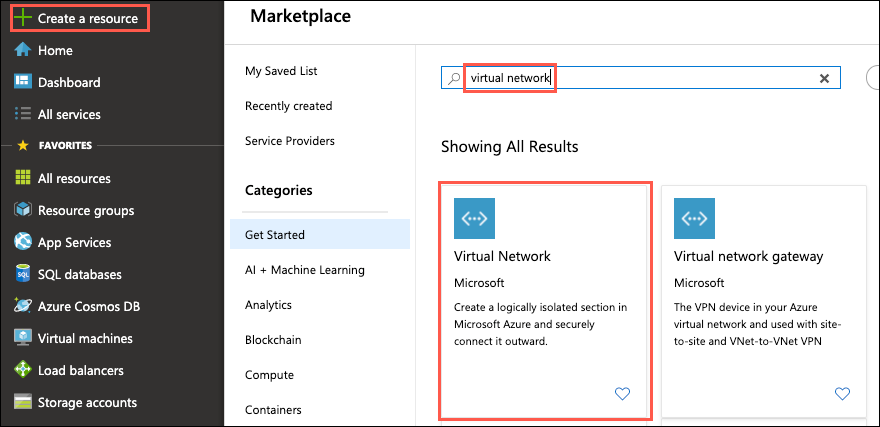

3. Select **Create** on the Virtual Network blade.

    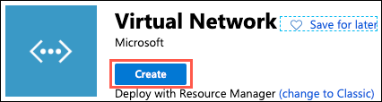

4. On the Create virtual network blade, enter the following:

    - **Name**: Enter **hands-on-lab-SUFFIX-vnet**.
    - **Address space**: Accept the default value here. This should be /16 block, in the format 10.X.0.0/16.
    - **Subscription**: Select the subscription you are using for this hands-on lab.
    - **Resource group**: Select the hands-on-lab-SUFFIX resource group from the list.
    - **Location**: Select the region you are using for resources in this hands-on lab.
    - **Subnet Name**: Enter **ManagedInstance**.
    - **Subnet Address range**: Accept the default value. This should have a subnet mask of /24, and be within the address space indicated above, in the format 10.X.0.0/24.
    - **DDOS protection**: Choose **Basic**.
    - **Service endpoints**: Select **Disabled**.
    - **Firewall**: Select **Disabled**.

    

5. Select **Create**. It will take a few seconds for the virtual network to provision.

6. When it completes, you will get a notification in the Azure portal that the deployment succeeded. Select **Go to resource** within the notification.

    

7. On the Virtual network blade, select **Subnets** under Settings in the left-hand menu, and then select **+ Subnet** from the top menu.

    

8. On the Add subnet blade, enter the following:

    - **Name**: Enter **Management**.
    - **Address range**: Accept the default value, which should be a subnet mask of /24, within the address range of your VNet.
    - **Network security group***: Leave set to none.
    - **Route table**: Leave set to none.
    - **Service endpoints**: Leave set to 0 selected.
    - **Subnet delegation**: Leave set to none.

    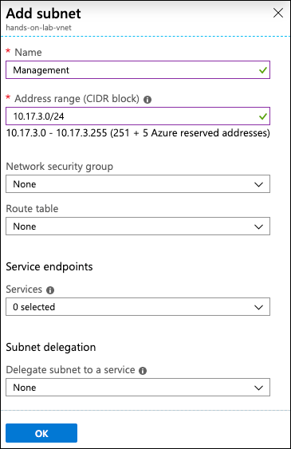

9. Select **OK**.

10. Back on the **Subnets** blade, select **+ Gateway Subnet**.

    

11. The **Name** for gateway subnet is automatically filled in with the value `GatewaySubnet`. This value is required in order for Azure to recognize the subnet as the gateway subnet. Accept the auto-filled Address range value, and leave Route table, Service endpoints and Subnet delegation set to their default values.

    

    > **Note**: The default address range creates a gateway subnet with a CIDR block of /24. This provide enough IP addresses to accommodate additional future configuration requirements.

12. Select **OK**.

## Task 2: Create VPN gateway

In this task, you set up a Virtual Network Gateway.

1. In the [Azure portal](https://portal.azure.com/), select the **Show portal menu** icon and then select **+Create a resource** from the menu.

    

2. Enter "virtual network gateway" into the Search the Marketplace box, and select **Virtual network gateway** from the results.

    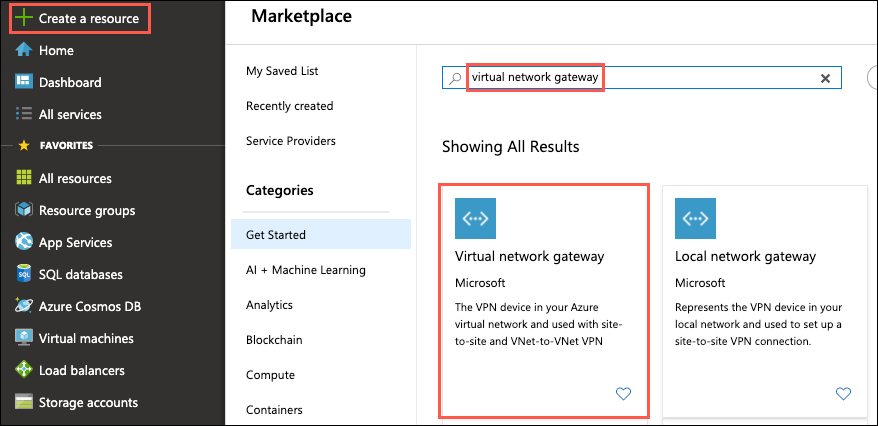

3. Select **Create** on the Virtual network gateway blade.

    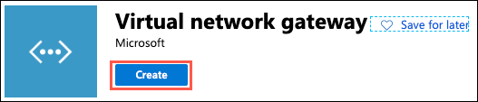

4. On the Create virtual network gateway **Basics** tab, enter the following:

    - Project details:

        - **Subscription**: Select the subscription you are using for this hands-on lab.
        - **Resource group**: This will be derived from the virtual network's resource group.

    - Instance details:

        - **Name**: Enter hands-on-lab-SUFFIX-vnet-gateway.
        - **Region**: Select the location you are using for resources in this hands-on lab.
        - **Gateway type**: Choose **VPN**.
        - **VPN type**: Choose **Route-based**.
        - **SKU**: Select **VpnGw1**.
        - **Virtual network**: Select the **hands-on-lab-SUFFIX-vnet**.

    - Public IP address:

        - **Public IP address**: Choose **Create new**.
        - **Public IP address name**: Enter **vnet-gateway-ip**.
        - **Enable active-active mode**: Choose **Disabled**.
        - **Configure BGP ASN**: Choose **Disabled**.

    

5. Select **Review + create**.

6. On the **Review + create** tab, ensure the *Validation passed* message is displayed and then select **Create**.

    

7. It can take up to 45 minutes for the Virtual network gateway to provision.

## Task 3: Provision SQL MI

In this task, you will create an Azure SQL Managed Instance.

1. In the [Azure portal](https://portal.azure.com/), select the **Show portal menu** icon and then select **+Create a resource** from the menu.

    

2. Enter "sql managed instance" into the Search the Marketplace box, and then select **Azure SQL Managed Instance** from the results.

    

3. Select **Create** on the Azure SQL Managed Instance blade.

    

4. On the Create Azure SQL Database Managed Instance Basics tab, enter the following:

    - Project details:

        - **Subscription**: Select the subscription you are using for this hands-on lab.
        - **Resource group**: Select **hands-on-lab-SUFFIX** from the list.

    - Managed Instance details:

        - **Managed instance name**: Enter **sqlmi-SUFFIX**
        - **Region**: Select the region you are using for resources in this hands-on lab.
        - **Compute + storage**: Select **Configure Managed Instance**, and on the Configure performance blade, select **Business Critical**, **Gen5**, and set the vCores to **16** and the Storage to **32**, and then select **Apply**.

        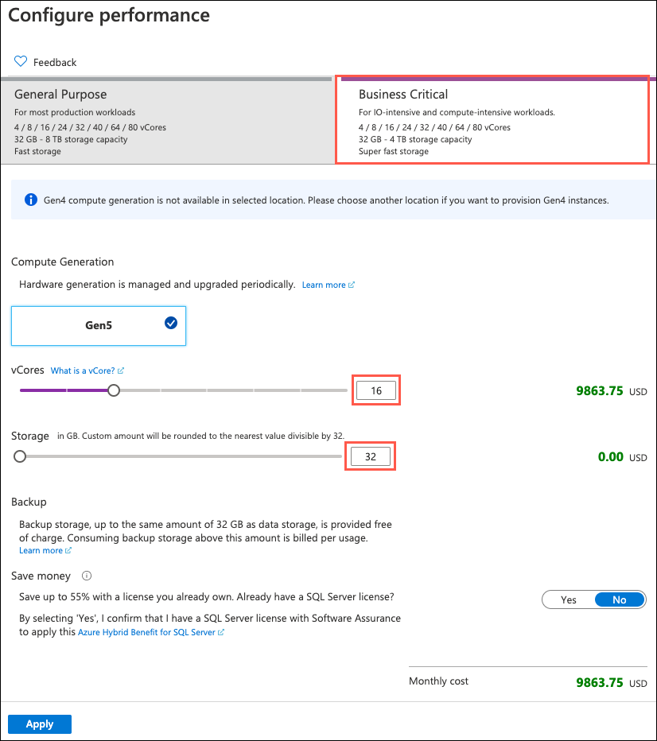

    - Administrator account:

        - **Managed instance admin login**: Enter **sqlmiuser**
        - **Password**: Enter **Password.1234567890**

    

    > **Note**: If you see a message stating that Managed Instance creation is not available for the chosen subscription type, follow the instructions for [obtaining a larger quota for SQL Managed Instance](https://docs.microsoft.com/azure/sql-database/sql-database-managed-instance-resource-limits#obtaining-a-larger-quota-for-sql-managed-instance).

    

5. Select **Next: Networking**, and on the **Networking** tab set the following configuration:

    - **Virtual network**: Select **hands-on-lab-SUFFIX-vnet/ManagedInstance** from the dropdown list.
    - **Prepare subnet for Managed Instance**: Select **Automatic**.
    - **Connection type**: Leave **Proxy (Default)** selected.
    - **Enable public endpoint**: Select **Disable**.

    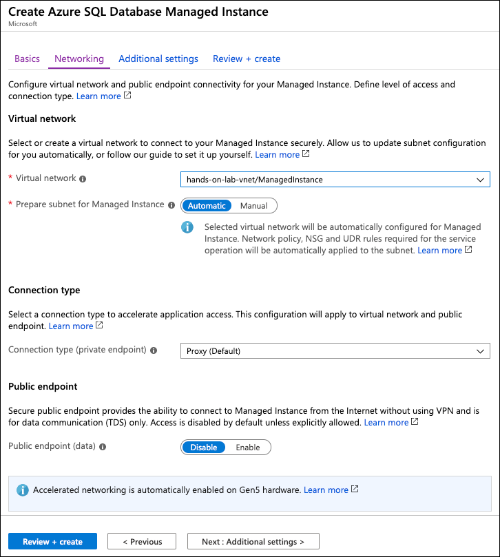

6. Select **Next: Additional settings**, and on the **Additional settings** tab enter the following:

    - **Collation**: Accept the default value, **SQL_Latin1_General_CP1_CI_AS**.
    - **Time zone**: Select **(UTC) Coordinated Universal Time**.
    - **Use this instance as a Failover Group secondary**: Select **No**.

    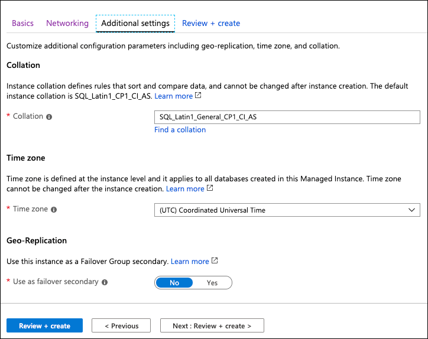

7. Select **Next: Review + create**, and on the **Review + create** tab, review the configuration and then select **Create**.

    > **Note**: Provisioning of SQL Managed Instance can take 6+ hours, if this is the first instance being deployed into a subnet. You can move on to the remaining tasks while the provisioning is in process. If the deployment process goes beyond 7 hours, you may need to submit a support ticket to request assistance in completing the setup.

## Task 4: Create the JumpBox VM

In this task, you will provision a virtual machine (VM) in Azure. The VM image used will have Visual Studio Community 2019 installed.

1. In the [Azure portal](https://portal.azure.com/), select the **Show portal menu** icon and then select **+Create a resource** from the menu.

    

2. Enter "visual studio 2019" into the Search the Marketplace box, and then select **Visual Studio 2019 Latest** from the results.

    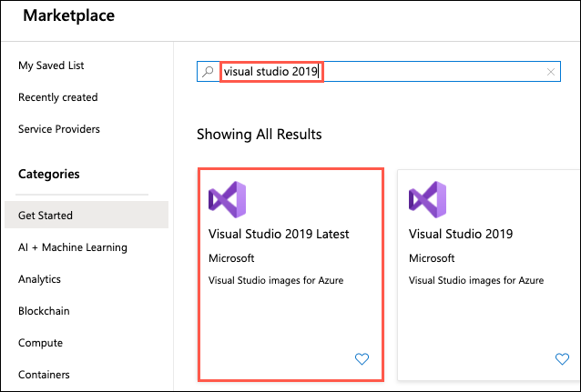

3. On the Visual Studio 2019 blade, select **Visual Studio 2019 Community (latest release) on Windows Server 2019 (x64)** from the Select a software plan drop down list and then select **Create**.

    

4. On the Create a virtual machine **Basics** tab, set the following configuration:

    - Project details:

        - **Subscription**: Select the subscription you are using for this hands-on lab.
        - **Resource Group**: Select the hands-on-lab-SUFFIX resource group from the list of existing resource groups.

    - Instance details:

        - **Virtual machine name**: Enter JumpBox.
        - **Region**: Select the region you are using for resources in this hands-on lab.
        - **Availability options**: Select no infrastructure redundancy required.
        - **Image**: Leave Visual Studio 2019 Community (latest release) on Windows Server 2019 (x64) selected.
        - **Azure Spot instance**: Choose No.
        - **Size**: Select **Change size**, and select Standard D2s v3 from the list and then select **Accept**.

    - Administrator account:

        - **Username**: Enter **sqlmiuser**
        - **Password**: Enter **Password.1234567890**

    - Inbound port rules:

        - **Public inbound ports**: Choose Allow selected ports.
        - **Select inbound ports**: Select RDP (3389) in the list.

    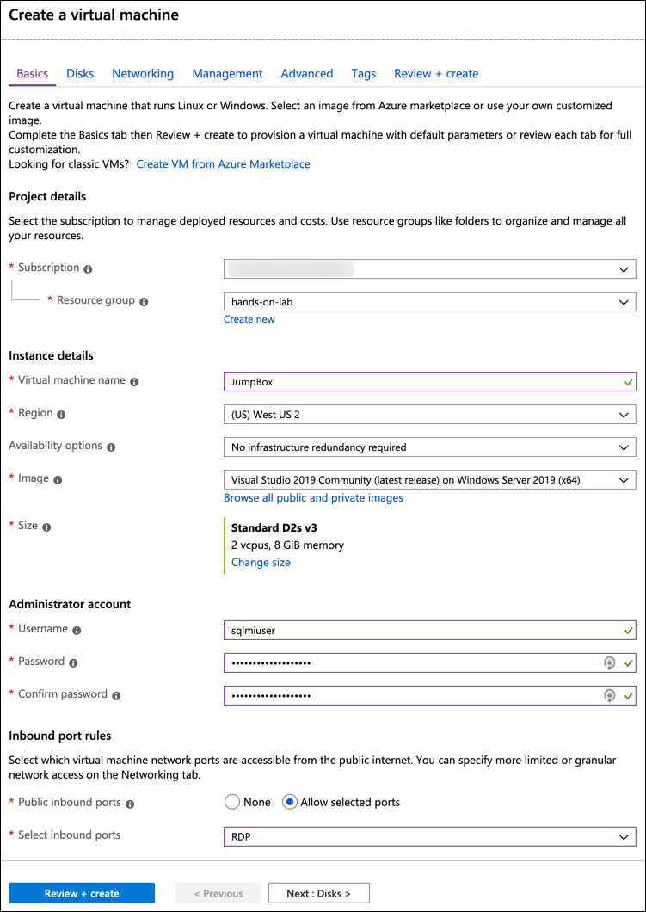

5. Select **Next: Disks** to move to the next step.

6. On the **Disks** tab, set OS disk type to **Premium SSD**, and then select **Next: Networking**.

    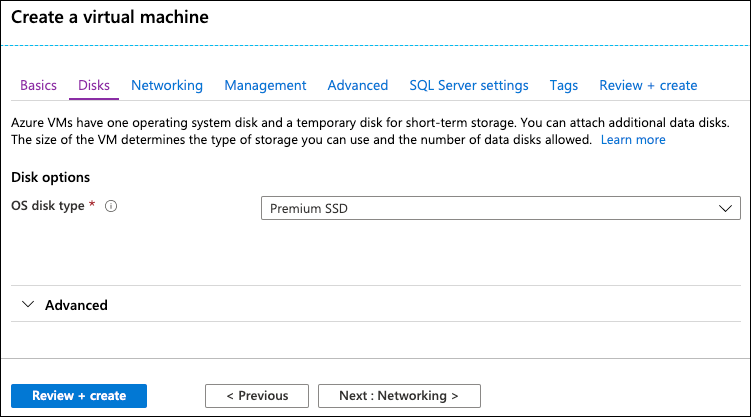

7. On the **Networking** tab, set the following configuration:

    - **Virtual network**: Select the **hands-on-lab-SUFFIX-vnet**.
    - **Subnet**: Select the **Management** subnet.
    - **Public IP**: Leave **(new) JumpBox-ip** selected.
    - **NIC network security group**: Select **Basic**.
    - **Public inbound ports**: Leave **Allow selected ports** selected.
    - **Select inbound ports**: Leave **RDP** selected.

    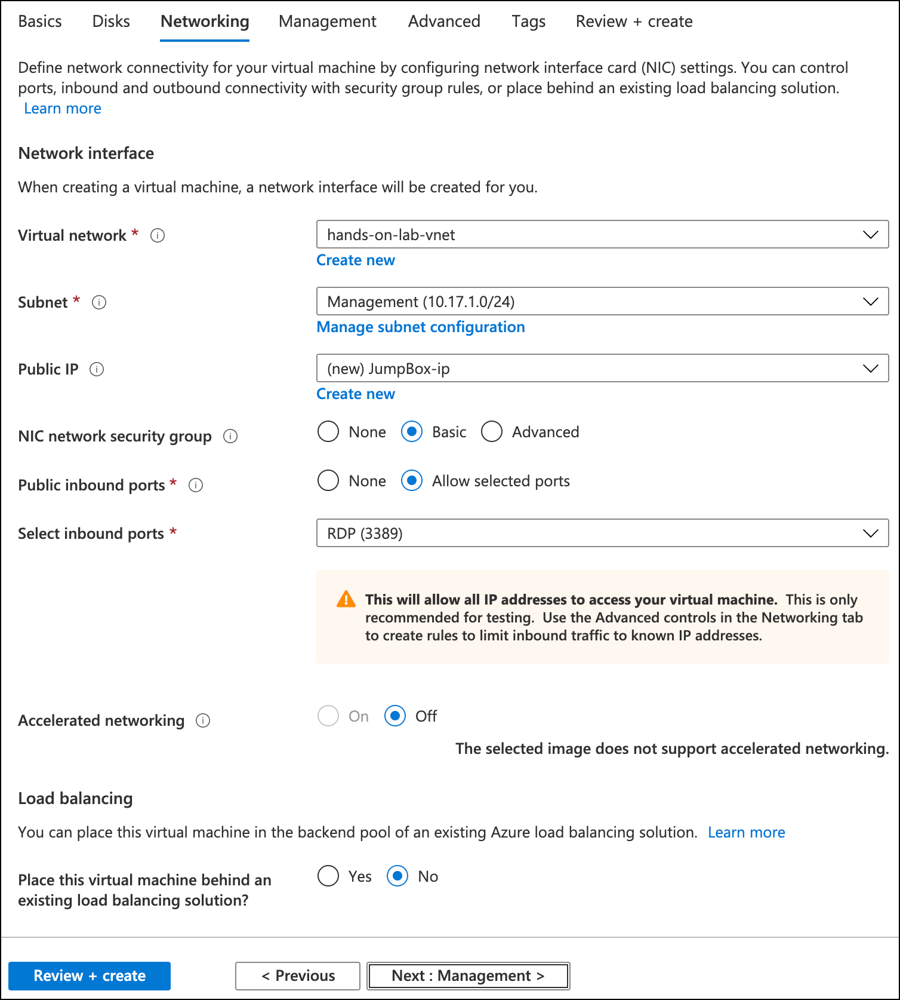

    > **Note**: The remaining tabs can be skipped, and default values will be used.

8. Select **Review + create** to validate the configuration.

9. On the **Review + create** tab, ensure the Validation passed message is displayed, and then select **Create** to provision the virtual machine.

    

10. It will take approximately 15 minutes for the VM to finish provisioning. You can move on to the next task while you wait.

## Task 5: Create SQL Server 2008 R2 virtual machine

In this task, you will provision another virtual machine (VM) in Azure which will host your "on-premises" instance of SQL Server 2008 R2. The VM will use the SQL Server 2008 R2 SP3 Standard on Windows Server 2008 R2 image.

> **Note**: An older version of Windows Server is being used because SQL Server 2008 R2 is not supported on Windows Server 2016.

1. In the [Azure portal](https://portal.azure.com/), select the **Show portal menu** icon and then select **+Create a resource** from the menu.

    

2. Enter "SQL Server 2008 R2 SP3 on Windows Server 2008 R2" into the Search the Marketplace box.

3. On the **SQL Server 2008 R2 SP3 on Windows Server 2008 R2** blade, select **SQL Server R2 SP3 Standard on Windows Server 2008 R2** for the software plan and then select **Create**.

    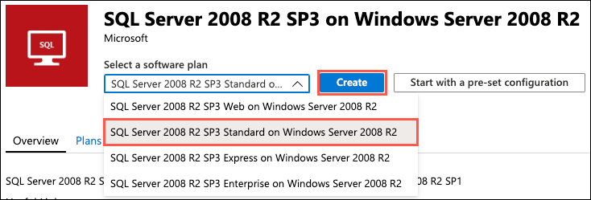

4. On the Create a virtual machine **Basics** tab, set the following configuration:

   - Project Details:

        - **Subscription**: Select the subscription you are using for this hands-on lab.
        - **Resource Group**: Select the hands-on-lab-SUFFIX resource group from the list of existing resource groups.

   - Instance Details:

        - **Virtual machine name**: Enter SqlServer2008.
        - **Region**: Select the region you are using for resources in this hands-on lab.
        - **Availability options**: Select no infrastructure redundancy required.
        - **Image**: Leave SQL Server 2008 R2 SP3 Standard on Windows Server 2008 R2 selected.
        - **Size**: Accept the default size, Standard DS12 v2.

   - Administrator Account:

        - **Username**: Enter **sqlmiuser**
        - **Password**: Enter **Password.1234567890**

   - Inbound Port Rules:

        - **Public inbound ports**: Choose Allow selected ports.
        - **Select inbound ports**: Select RDP (3389) in the list.

    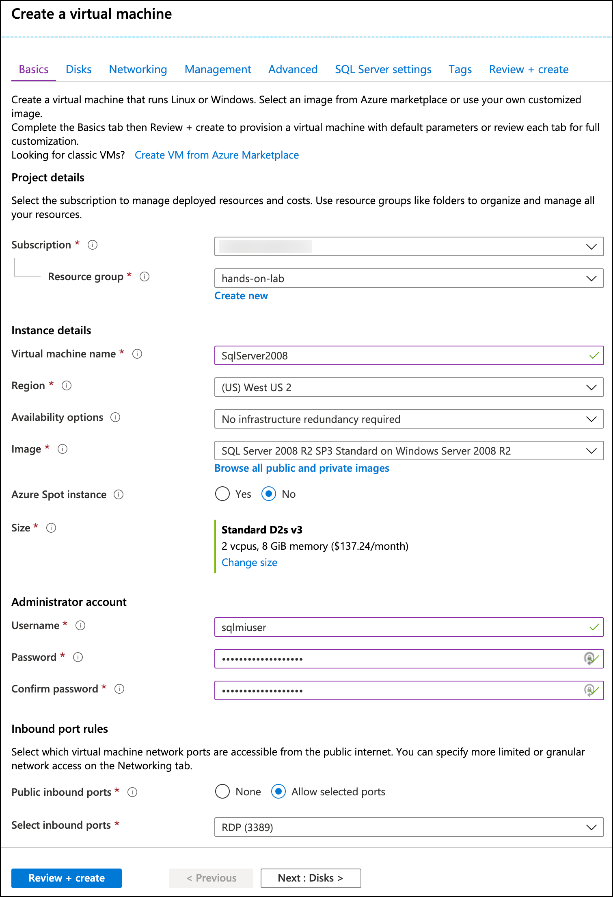

5. Select **Next: Disks** to move to the next step.

6. On the **Disks** tab, set OS disk type to **Premium SSD**, and then select **Next: Networking**.

    

7. On the **Networking** tab, set the following configuration:

    - **Virtual network**: Select the **hands-on-lab-vnet**.
    - **Subnet**: Select the **Management** subnet.
    - **Public IP**: Leave **(new) SqlServer2008-ip** selected.
    - **NIC network security group**: Select **Basic**.
    - **Public inbound ports**: Leave **Allow selected ports** selected.
    - **Select inbound ports**: Leave **RDP (3389)** selected.

    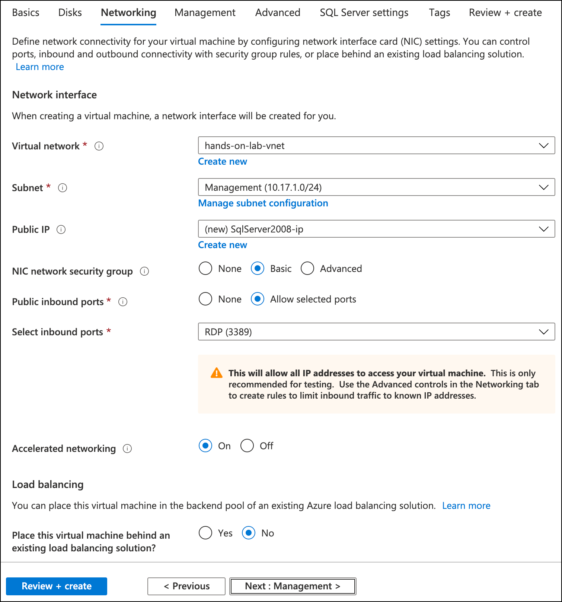

8. Select the **SQL Server settings** tab from the top menu.

    

    > **Note**: The Management and Advanced tabs can be skipped, and default values will be used.

9. On the **SQL Server settings** tab, set the following:

    - Security & Networking:

        - **SQL connectivity**: Select Public (Internet)
        - **Port**: Set to 1433.

    - SQL Authentication:

        - **SQL Authentication**: Select Enable.
        - **Login name**: Enter **sqlmiuser**
        - **Password**: Enter **Password.1234567890**

    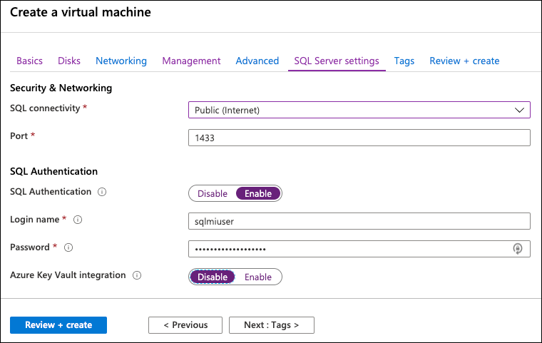

10. Select **Review + create** to validate the configuration.

11. On the **Review + create** tab, ensure the Validation passed message is displayed, and then select **Create** to provision the virtual machine.

    

12. It will take approximately 10 minutes for the SQL VM to finish provisioning. You can move on to the next task while you wait.

## Task 6: Create Azure Database Migration Service

In this task, you will provision an instance of the Azure Database Migration Service (DMS).

> **Important**: This service requires that you have registered the `Microsoft.DataMigration` resource provider within your subscription in Azure. You can find the steps to complete this in the Before the HOL guide.

1. In the [Azure portal](https://portal.azure.com/), select the **Show portal menu** icon and then select **+Create a resource** from the menu.

    

2. Enter "database migration" into the Search the Marketplace box, select **Azure Database Migration Service** from the results, and select **Create** on the Azure Database Migration Service blade.

    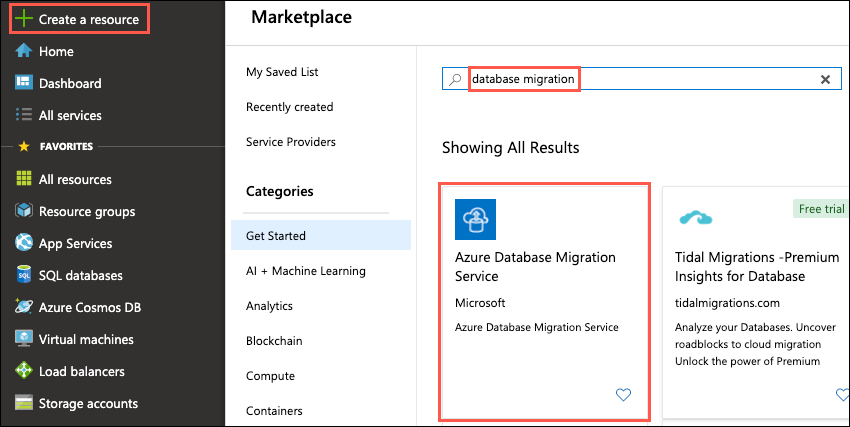

3. On the Create Migration Service **Basics** tab, enter the following:

    - Project details:

        - **Subscription**: Select the subscription you are using for this hands-on lab.
        - **Resource Group**: Select the hands-on-lab-SUFFIX resource group from the list of existing resource groups.

    - Instance details:

        - **Migration service Name**: Enter tailspin-dms.
        - **Location**: Select the location you are using for resources in this hands-on lab.
        - **Service mode**: Select Azure.
        - **Pricing tier**: Select Configure tier, choose **Premium**, and select **Apply**.

    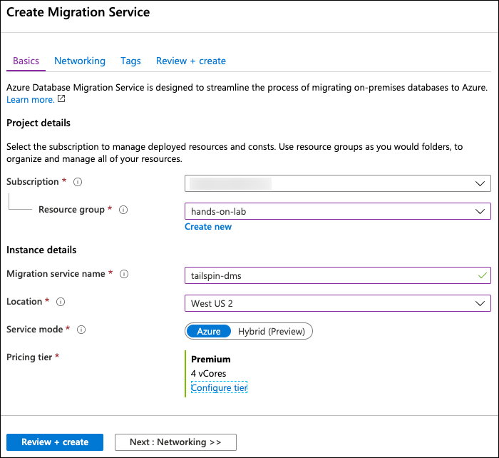

4. Select **Next: Networking**.

5. On the **Networking** tab, select the **hands-on-lab-SUFFIX-vnet/default** virtual network by checking the box next to it in the list of existing virtual networks. This places the DMS instance into the same VNet as your LabVM and SqlServer2008 virtual machines.

    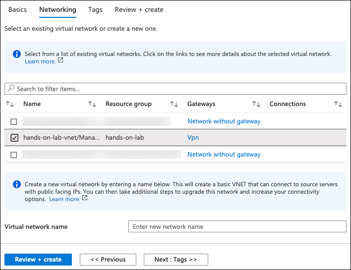

6. Select **Review + create**.

7. Select **Create**.

8. It can take 15 minutes to deploy the Azure Data Migration Service. You can move on to the next task while you wait.

## Task 7: Provision a Web App

In this task, you will provision an App Service (Web app), which will be used for hosting the Tailspin Toys web application.

1. In the [Azure portal](https://portal.azure.com/), select the **Show portal menu** icon and then select **+Create a resource** from the menu.

    

2. In the [Azure portal](https://portal.azure.com/), select **+Create a resource**, enter "web app" into the Search the Marketplace box, select **Web App** from the results.

    

3. On the Web App blade, select **Create**.

    

4. On the Create Web App **Basics** tab, set the following configuration:

    - Project Details:

        - **Subscription**: Select the subscription you are using for this hands-on lab.
        - **Resource Group**: Select the hands-on-lab-SUFFIX resource group from the list of existing resource groups.

    - Instance Details:

        - **Name**: Enter tailspintoysSUFFIX.
        - **Publish**: Select Code.
        - **Runtime stack**: Select .NET Core 3.0 (Current).
        - **Operating System**: Select Windows.
        - **Region**: Select the region you are using for resources in this hands-on lab.

    - App Service Plan:

        - **Plan**: Accept the default value for creating a new App Service Plan.
        - **Sku and size**: Accept the default value of Standard S1.

    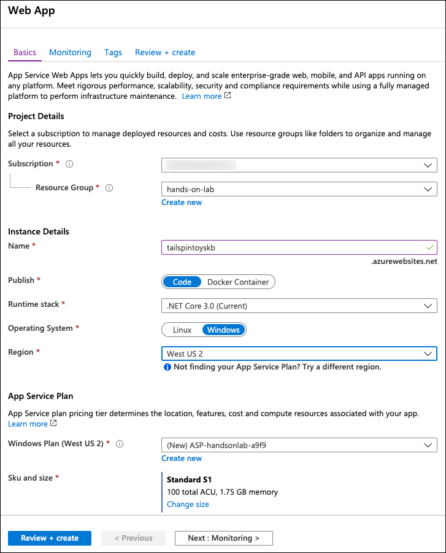

5. Select **Review + create**.

6. On the **Review + create** tab, select **Create**.

    

7. It will take a few minutes for the Web App creation to complete. You can move on to the next task while you wait.

## Task 8: Create an Azure Blob Storage account

1. In the [Azure portal](https://portal.azure.com/), select the **Show portal menu** icon and then select **+Create a resource** from the menu.

    

2. Enter "storage account" into the Search the Marketplace box, select **Storage account - blob, file, table, queue** from the results, and then select **Create** on the Storage account blade.

    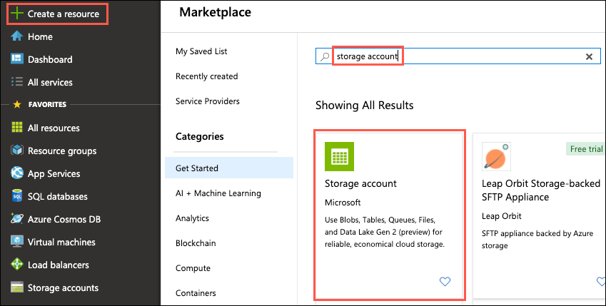

3. On the Create storage account blade, enter the following:

    - Project details:

        - **Subscription**: Select the subscription you are using for this hands-on lab.
        - **Resource Group**: Select the hands-on-lab-SUFFIX resource group from the list of existing resource groups.

    - Instance details:

        - **Storage account name**: Enter sqlmistoreSUFFIX.
        - **Location**: Select the location you are using for resources in this hands-on lab.
        - **Performance**: Choose **Standard**.
        - **Account kind**: Select **StorageV2 (general purpose v2)**.
        - **Replication**: Select **Locally-redundant storage (LRS)**.
        - **Access tier**: Choose **Hot**.

    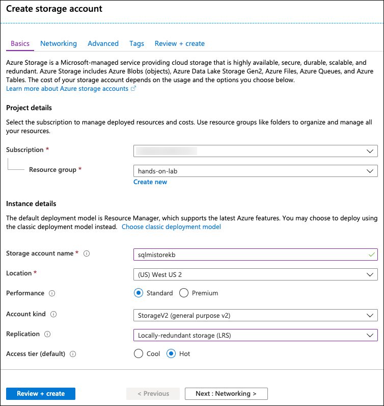

4. Select **Review + create**.

5. On the **Review + create** blade, ensure the Validate passed message is displayed and then select **Create**.

    

## Task 9: Connect to the JumpBox

In this task, you will create an RDP connection to your JumpBox virtual machine (VM), and disable Internet Explorer Enhanced Security Configuration.

> **Note**: You do not need to wait for SQL MI to finish provisioning to complete the remaining tasks.

1. When your JumpBox VM provisioning completes, navigate to the [Azure portal](https://portal.azure.com) and select **Resource groups** from the Azure services list.

    

2. Select the hands-on-lab-SUFFIX resource group from the list.

    

3. In the list of resources for your resource group, select the JumpBox VM.

    

4. On your JumpBox VM blade, select **Connect** from the top menu.

    

5. On the Connect to virtual machine blade, select **Download RDP File**, then open the downloaded RDP file.

    

6. Select **Connect** on the Remote Desktop Connection dialog.

    

7. Enter the following credentials when prompted, and then select **OK**:

    - **User name**: sqlmiuser
    - **Password**: Password.1234567890

    

8. Select **Yes** to connect, if prompted that the identity of the remote computer cannot be verified.

    

9. Once logged in, launch the **Server Manager**. This should start automatically, but you can access it via the Start menu if it does not.

10. Select **Local Server**, then select **On** next to **IE Enhanced Security Configuration**.

    

11. In the Internet Explorer Enhanced Security Configuration dialog, select **Off** under both Administrators and Users, and then select **OK**.

    

12. Close the Server Manager, but leave the connection to the JumpBox open for the next task.

## Task 10: Install required software on the JumpBox

In this task, you will install SQL Server Management Studio (SSMS) on the JumpBox.

1. First, you will install SSMS on the JumpBox. Open a web browser on your JumpBox, navigate to <https://docs.microsoft.com/en-us/sql/ssms/download-sql-server-management-studio-ssms> and then select the **Download SQL Server Management Studio (SSMS).x** link to download the latest version of SSMS.

    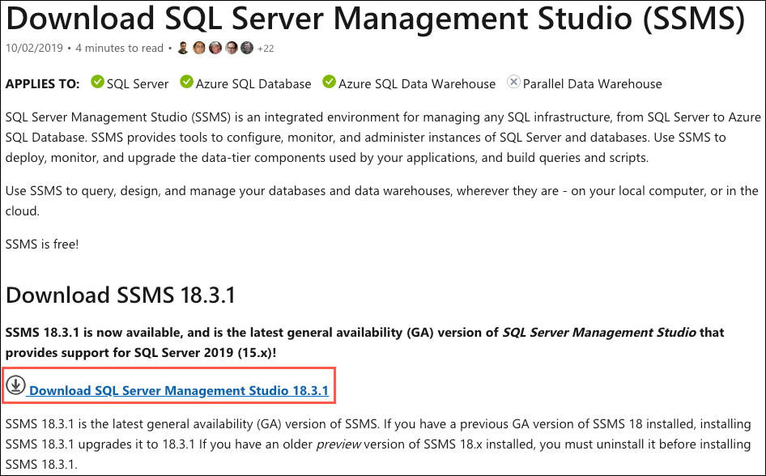

    > **Note**: Versions change frequently, so if the version number you see does not match the screenshot, download and install the most recent version.

2. Run the downloaded installer.

3. On the Welcome screen, select **Install** to begin the installation.

    

4. Select **Close** when the installation completes.

    

## Task 11: Connect to SqlServer2008 VM

In this task, you will open an RDP connection to the SqlServer2008 VM, disable Internet Explorer Enhanced Security Configuration, and add a firewall rule to open port 1433 to inbound TCP traffic. You will also install Data Migration Assistant (DMA).

1. As you did for the JumpBox, navigate to the SqlServer2008 VM blade in the Azure portal, select **Overview** from the left-hand menu, and then select **Connect** on the top menu.

    

2. On the Connect to virtual machine blade, select **Download RDP File**, then open the downloaded RDP file.

3. Select **Connect** on the Remote Desktop Connection dialog.

    

4. Enter the following credentials when prompted, and then select **OK**:

    - **User name**: sqlmiuser
    - **Password**: Password.1234567890

    

5. Select **Yes** to connect, if prompted that the identity of the remote computer cannot be verified.

    

6. Once logged in, launch the **Server Manager**. This should start automatically, but you can access it via the Start menu if it does not.

7. On the **Server Manager** view, select **Configure IE ESC** under Security Information.

    

8. In the Internet Explorer Enhanced Security Configuration dialog, select **Off** under both Administrators and Users, and then select **OK**.

    

9. Back in the Server Manager, expand **Configuration** and **Windows Firewall with Advanced Security**, and then select **Inbound Rules**.

    

10. Right-click on **Inbound Rules** and then select **New Rule** from the context menu.

    

11. In the New Inbound Rule Wizard, under Rule Type, select **Port**, then select **Next**.

    

12. In the Protocol and Ports dialog, use the default **TCP**, and enter **1433** in the Specific local ports text box, and then select **Next**.

    

13. In the Action dialog, select **Allow the connection**, and then select **Next**.

    

14. In the Profile step, check **Domain**, **Private**, and **Public**, then select **Next**.

    

15. On the Name screen, enter **SqlServer** for the name, and select **Finish**.

    

16. Close the Server Manager.

17. Next, you will install the Microsoft Data Migration Assistant v5.x by navigating to <https://www.microsoft.com/en-us/download/details.aspx?id=53595> in a web browser on the SqlServer2008 VM, and then selecting the **Download** button.

    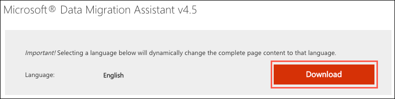

    > **Note**: Versions change frequently, so if the version number you see does not match the screenshot, download and install the most recent version.

18. Run the downloaded installer.

19. Select **Next** on each of the screens, accepting to the license terms and privacy policy in the process.

20. Select **Install** on the Privacy Policy screen to begin the installation.

21. On the final screen, select **Finish** to close the installer.

    

### Task 12: Configure the TailspinToys database on the SqlServer2008 VM

In this task, you restore and configure the `TailspinToys` database on the SQL Server 2008 R2 instance.

1. On the SqlServer2008 VM, download a [backup of the TailspinToys database](https://raw.githubusercontent.com/microsoft/Migrating-SQL-databases-to-Azure/master/Hands-on%20lab/lab-files/Database/TailspinToys.bak), and save it to the `C:\` of the VM.

2. Next, open **Microsoft SQL Server Management Studio 17** (SSMS) by entering "sql server" into the search bar in the Windows Start menu and selecting **Microsoft SQL Server Management Studio 17** from the search results.

    

3. In the SSMS **Connect to Server** dialog, enter **SQLSERVER2008** into the Server name box, ensure **Windows Authentication** is selected, and then select **Connect**.

    

4. Once connected, right-click **Databases** under SQLSERVER2008 in the Object Explorer, and then select **Restore Database** from the context menu.

    

5. You will now restore the `TailspinToys` database using the downloaded `TailspinToys.bak` file. On the **General** page of the Restore Database dialog, select **Device** under Source, and then select the Browse (...) button to the right of the Device box.

    

6. In the **Select backup devices** dialog that appears, select **Add**.

    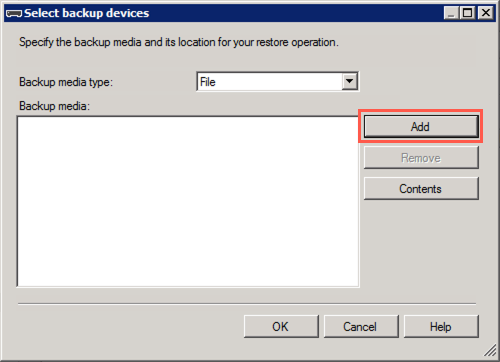

7. In the **Locate Backup File** dialog, browse to the location you saved the downloaded `TailspinToys.bak` file, select that file, and then select **OK**.

    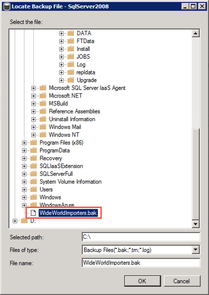

8. Select **OK** on the **Select backup devices** dialog. This returns you to the Restore Database dialog. The dialog now contains the information required to restore the `TailspinToys` database.

    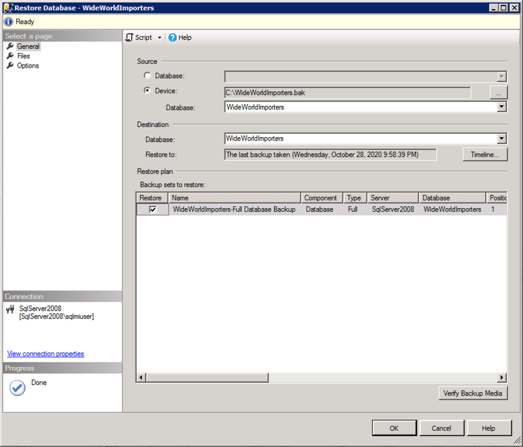

9. Select **OK** to start the restore.

10. Select **OK** in the dialog when the database restore is complete.

    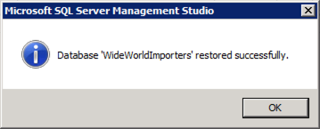

11. Next, you execute a script in SSMS, which enables Service broker, creates the `WorkshopUser` account, and changes the database recovery model to FULL. To create the script, open a new query window in SSMS by selecting **New Query** in the SSMS toolbar.

    

12. Copy and paste the SQL script below into the new query window:

    ```sql
    USE master;
    GO

    -- Update the recovery model of the database to FULL and enable Service Broker
    ALTER DATABASE TailspinToys SET
    RECOVERY FULL,
    ENABLE_BROKER WITH ROLLBACK IMMEDIATE;
    GO

    -- Create a login and user named WorkshopUser
    CREATE LOGIN WorkshopUser WITH PASSWORD = N'Password.1234567890';
    GO

    EXEC sp_addsrvrolemember
        @loginame = N'WorkshopUser',
        @rolename = N'sysadmin';
    GO

    -- Assign the user to the TailspinToys database
    USE TailspinToys;
    GO

    IF NOT EXISTS (SELECT * FROM sys.database_principals WHERE name = N'WorkshopUser')
    BEGIN
        CREATE USER [WorkshopUser] FOR LOGIN [WorkshopUser]
        EXEC sp_addrolemember N'db_datareader', N'WorkshopUser'
    END;
    GO
    ```

13. To run the script, select **Execute** from the SSMS toolbar.

    
