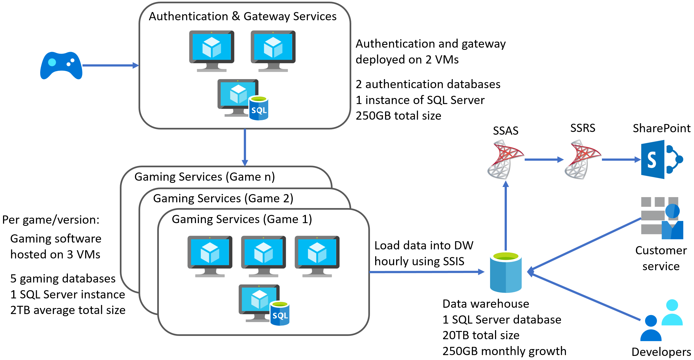
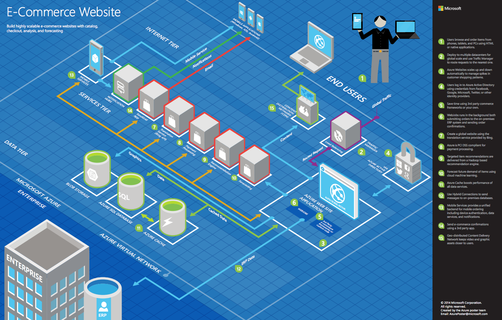

Migrating SQL databases to Azure

Whiteboard design session student guide

October 2019

Information in this document, including URL and other Internet Web site references, is subject to change without notice. Unless otherwise noted, the example companies, organizations, products, domain names, e-mail addresses, logos, people, places, and events depicted herein are fictitious, and no association with any real company, organization, product, domain name, e-mail address, logo, person, place or event is intended or should be inferred. Complying with all applicable copyright laws is the responsibility of the user. Without limiting the rights under copyright, no part of this document may be reproduced, stored in or introduced into a retrieval system, or transmitted in any form or by any means (electronic, mechanical, photocopying, recording, or otherwise), or for any purpose, without the express written permission of Microsoft Corporation.

Microsoft may have patents, patent applications, trademarks, copyrights, or other intellectual property rights covering subject matter in this document. Except as expressly provided in any written license agreement from Microsoft, the furnishing of this document does not give you any license to these patents, trademarks, copyrights, or other intellectual property.

The names of manufacturers, products, or URLs are provided for informational purposes only and Microsoft makes no representations and warranties, either expressed, implied, or statutory, regarding these manufacturers or the use of the products with any Microsoft technologies. The inclusion of a manufacturer or product does not imply endorsement of Microsoft of the manufacturer or product. Links may be provided to third party sites. Such sites are not under the control of Microsoft and Microsoft is not responsible for the contents of any linked site or any link contained in a linked site, or any changes or updates to such sites. Microsoft is not responsible for webcasting or any other form of transmission received from any linked site. Microsoft is providing these links to you only as a convenience, and the inclusion of any link does not imply endorsement of Microsoft of the site or the products contained therein.

© 2019 Microsoft Corporation. All rights reserved.

Microsoft and the trademarks listed at <https://www.microsoft.com/en-us/legal/intellectualproperty/Trademarks/Usage/General.aspx> are trademarks of the Microsoft group of companies. All other trademarks are property of their respective owners.

## Contents

- [Migrating SQL databases to Azure whiteboard design session student guide](#migrating-sql-databases-to-azure-whiteboard-design-session-student-guide)
  - [Abstract and learning objectives](#abstract-and-learning-objectives)
  - [Step 1: Review the customer case study](#step-1-review-the-customer-case-study)
    - [Customer situation](#customer-situation)
    - [Customer needs](#customer-needs)
    - [Customer objections](#customer-objections)
    - [Infographic for common scenarios](#infographic-for-common-scenarios)
  - [Step 2: Design a proof of concept solution](#step-2-design-a-proof-of-concept-solution)
  - [Step 3: Present the solution](#step-3-present-the-solution)
  - [Wrap-up](#wrap-up)
  - [Additional references](#additional-references)

# Migrating SQL databases to Azure whiteboard design session student guide

## Abstract and learning objectives

In this whiteboard design session, you work in a group to develop a plan for migrating on-premises VMs and SQL Server 2008 R2 databases into a combination of IaaS and PaaS services in Azure. You provide guidance on performing assessments to reveal any feature parity and compatibility issues between the customer's SQL Server 2008 R2 databases and the managed database offerings in Azure. You then design a solution for migrating their on-premises services, including VMs and databases, into Azure, with minimal or no down-time. Finally, you provide guidance on how to enable some of the advanced SQL features available in Azure to improve security and performance in the customer's applications.

At the end of this whiteboard design session, you will be better able to design a cloud migration solution for business-critical applications and databases.

## Step 1: Review the customer case study

**Outcome**

Analyze your customer's needs.

Timeframe: 15 minutes

Directions:  With all participants in the session, the facilitator/SME presents an overview of the customer case study along with technical tips.

1. Meet your table participants and trainer.

2. Read all of the directions for steps 1-3 in the student guide.

3. As a table team, review the following customer case study.

### Customer situation

Tailspin Toys is the developer of several popular online video games. Founded in 2010, the company has experienced exponential growth since releasing the first installment of their most popular game franchise to include online multiplayer gameplay. They have since built upon this success by adding online capabilities to the majority of their game portfolio.

To facilitate online gameplay, they decided to take a conservative approach, hosting the gaming services on-premises using rented hardware. This approach allowed them to enter the online gaming market with a minimal upfront investment and lower risk. For each game, their gaming services setup consists of three virtual machines running the gaming software and five game databases hosted on a single SQL Server 2008 R2 Enterprise instance. They are using the Service Broker feature of SQL Server for sending messages between gaming databases. In addition to the dedicated gaming VMs and databases, their gaming services include authentication and gateway VMs and databases, which are shared across all their games.

Molly Fischer, the CIO of Tailspin Toys, stated that the response to adding online gameplay has far exceeded their initial estimates. While the increased popularity of their games has been good for profitability, the rapid increase in demand for their services has made supporting the current setup problematic. At its foundation, Tailspin Toys is a game development company, made up primarily of software developers. The few dedicated database and infrastructure resources they do have are struggling to keep up with an ever-expanding workload. Increasingly, game developers have had to step in to assist in supporting the infrastructure, which is taking time away from game development and has resulted in several missed release timelines. Molly has expressed concerns over adding additional non-developer resources, as she feels this is outside of their core business. She is hoping that migrating their services from on-premises to the cloud can help to alleviate some of their infrastructure management issues, while simultaneously helping them to refocus their efforts on delivering business value by releasing new and improved games.

Compounding this problem is the release schedule for new versions of their most popular games. They have a target schedule of releasing a new version every 12 - 18 months, which means adding new VMs and a database server for each new version they release, while also maintaining the services for all previous game versions. Each new release results in increased rental equipment costs, as well as a steadily increasing workload on their already overburdened staff. Internally, they have discussed end-of-life scenarios for older game versions, but the number of players remains high for many of their older games, so no decisions have been made about when to end support for those games.

Tailspin Toys indicated that their current hardware rental agreement ends in three months, and they're hoping to avoid signing another contract by migrating their existing VMs into Azure. They understand three months is a short timeframe, but believe a lift-and-shift approach of their gaming service VMs might be possible if they dedicate the appropriate resources. They already have VM images for each of their games that could be used in the process. They would like to know more about what a lift-and-shift might involve so they can plan resource allocation accordingly. They are also interested in learning more if this approach could be used to allow them to better scale the VM and database deployments on a per-game basis. Currently, they use the same number of VMs and databases for each game and version but have frequently run into issues hosting more gamers for popular games. They would like the ability to scale up to meet demand on new releases and more popular games, while also being able to scale down for older and less popular games. They would also like to investigate the possibility of globally distributing their gaming services to address latency issues reported by gamers accessing their services from other locations around the world.

Of great concern to the leadership team at Tailspin Toys is the rapidly approaching end of support date for SQL Server 2008 R2. For their databases, they are interested in hearing more about fully-managed platform-as-a-service (PaaS) options in Azure. They lack any employees with actual database administration skills, so they feel this would be an excellent first step towards reducing their infrastructure workload. They have requested assistance in assessing any compatibility issues between their current databases and PaaS options in Azure. They have read that the Service Broker feature of SQL Server is not available in Azure. They are using this functionality for several critical gaming processes, and cannot afford to lose this capability when migrating their gaming databases to the cloud. They have also stated that, at this time, they do not have the resources to rearchitect the gaming services to use an alternative message broker.

In addition to their gaming services, Tailspin Toys is also interested in migrating their data warehouse and its associated services to the cloud. They currently host their data warehouse on a dedicated SQL Server 2008 R2 instance. The data warehouse is currently around 20TB in size and is growing at a rate of about 250GB per month. They collect numerous game telemetry data points, including remote monitoring and analysis of game servers and user telemetry (i.e., data on the behavior of players, such as their interaction with games and with other players). Code embedded in the gaming software transmits data to the gaming databases. That telemetry data is loaded hourly using SQL Server Integration Services (SSIS) packages. Using the data in their data warehouse, they build SQL Server Analysis Services (SSAS) cubes and create reports using SQL Server Reporting Services (SSRS). The SSRS reports are deployed to sites in their SharePoint environment. They also noted that their customer service personnel and developers connect to the data warehouse for various activities.

They also mentioned that they have some reports that are run directly against the gaming databases so that they can analyze real-time user telemetry and gaming metrics. While there are not many of these reports, they are important to the developers and business users. They have noticed that at times of peak gaming activity, running these reports can be very slow, and they have occasionally seen impacts on gaming performance. They are interested to learn if there is any way they can continue to run these reports, but do it in a way that will alleviate the performance impact they've experienced.

Tailspin Toys is excited to learn more about how migrating to the cloud can help them improve their overall processes, as well as address the concerns and issues they have with their on-premises setup. They are looking for a proof-of-concept (PoC) for migrating their gaming VMs and databases into the cloud. Their end goal is to migrate their whole service to the cloud, so they would also like to understand better what their overall architecture might look after migrating to the cloud.

To assist you in better understanding their current environment, Tailspin Toys has provided the following architecture diagram of their on-premises gaming services implementation.

### Customer needs

1. We want to migrate all our gaming services infrastructure into the cloud, using PaaS services where possible. We would like to know if this can be accomplished in three months to avoid renewing our equipment rental contract.

2. In addition to our gaming services, we would like to migrate our existing data warehouse to Azure to take advantage of the ability to scale out along with some new SQL features available there. As part of this request, we would like to know more about:

   - Adding the ability to scale out the data warehouse to serve more requests
   - The upgrade path for our SSIS packages, SSAS cubes, and SSRS reports

3. We want recommendations for how to minimize migration costs as much as possible.

4. We want to improve the security posture of our databases and learn more about potential vulnerabilities and compliance issues.

5. We have had complaints of high latency from gamers in other regions throughout the world, along with reports that gamers are unable to join games during peaks of high usage. By migrating our gaming services to the cloud, we are looking to improve the overall gaming experience, including:

   - Reducing latency for gamers accessing our services from various places around the world
   - Improving our ability to host more gamers during peak times or when new game releases
   - Adding redundancy to ensure high-availability for our gaming services.

6. In the event of a regional outage, we would like to be able to resume gaming services within minutes and recover the data warehouse within 48 hours.

### Customer objections

1. It appears that there are multiple options for hosting SQL databases in Azure. What are all the different options, and how do they differ? Do they all support the same features as an on-premises SQL Server instance, or are there unsupported features we should be aware of before migrating? Will we be able to continue using Service Broker with a PaaS database in Azure?

2. Are there tools that allow us to evaluate which of the various SQL Database hosting options in Azure will work with our current SQL Server 2008 R2 databases? Is there a way we can test targeted workloads against other versions of SQL? Are there tools that can help us identify potential issues and incompatibilities before we attempt a migration?

3. In moving to the cloud, will we retain the ability to connect to and troubleshoot from our on-premises dev environment, while keeping our back-end networking fully isolated and only enabling talking to the front-end through a secured channel?

4. We do not want to be locked into a specific cloud vendor. Is it possible to use PaaS services for hosting our databases, and still have a valid exit strategy, or will this mean we should stick to using VMs in Azure for hosting our databases?

### Infographic for common scenarios

## Step 2: Design a proof of concept solution

**Outcome**

Design a solution and prepare to present the solution to the target customer audience in a 15-minute chalk-talk format.

Timeframe: 60 minutes

**Business needs**

Directions: With all participants at your table, answer the following questions and list the answers on a flip chart:

1. Who should you present this solution to? Who is your target customer audience? Who are the decision makers?

2. What customer business needs do you need to address with your solution?

**Design**

Directions: With all participants at your table, respond to the following questions on a flip chart:

*High-level architecture*

1. Without getting into the details (the following sections address the particular details), diagram your initial vision for handling the top-level requirements for the game databases, gaming services VMs, data warehouse, and associated services. You will refine this diagram as you proceed.

2. How can migration costs be minimized?

3. Is it possible to migrate Tailspin's gaming services within three months?

4. What functionality should you include in the PoC?

*Game databases*

1. What are the factors that Tailspin Toys should consider when deciding between PaaS or IaaS options for hosting their SQL databases in Azure?

2. From the options for hosting SQL databases in Azure, which would you recommend for hosting their gaming databases, and why do you think that the best choice? What pricing tier would you recommend?

3. How would you handle the data migration? Provide step-by-step instructions from assessment to data migration.

4. What are some of the features available in Azure SQL Database Managed Instance that can help improve the security posture of Tailspin Toys?

5. Are there features of a PaaS database service that could help to reduce the impact of read-only reports running directly against their gaming databases?

*Gaming services*

1. How should Tailspin Toys handle migrating their gaming services VMs into Azure?

2. What would you recommend for addressing the latency issues experienced by gamers from other regions of the world?

3. How should the ability to scale gaming services up or down be handled?

4. How can the gaming services be made highly-available?

*Data warehouse and reporting*

1. What would you recommend as the target platform for their data warehouse in Azure?

2. How could they read-scale out their data warehouse to serve more requests?

3. What is the upgrade path for their SSIS packages, SSAS cubes, and SSRS reports?

*Regional outages*

1. How can their gaming services be recovered within the specified RTO/RPO?

**Prepare**

Directions: With all participants at your table:

1. Identify any customer needs that are not addressed with the proposed solution.

2. Identify the benefits of your solution.

3. Determine how you will respond to the customer's objections.

Prepare a 15-minute chalk-talk style presentation to the customer.

## Step 3: Present the solution

**Outcome**

Present a solution to the target customer audience in a 15-minute chalk-talk format.

Timeframe: 30 minutes

**Presentation**

Directions:

1. Pair with another table.

2. One table is the Microsoft team and the other table is the customer.

3. The Microsoft team presents their proposed solution to the customer.

4. The customer makes one of the objections from the list of objections.

5. The Microsoft team responds to the objection.

6. The customer team gives feedback to the Microsoft team.

7. Tables switch roles and repeat Steps 2-6.

## Wrap-up

Timeframe: 15 minutes

Directions: Tables reconvene with the larger group to hear the facilitator/SME share the preferred solution for the case study.

## Additional references

|          |             |
|----------|-------------|
| **Description** | **Link** |
| Choosing the right SQL Server option in Azure | <https://docs.microsoft.com/azure/sql-database/sql-database-paas-vs-sql-server-iaas> |
| SQL Database Platform as a Service | <https://docs.microsoft.com/azure/sql-database/sql-database-paas> |
| Business continuity | <https://docs.microsoft.com/en-us/azure/sql-database/sql-database-business-continuity> |
| High availability | <https://docs.microsoft.com/en-us/azure/sql-database/sql-database-high-availability> |
| Automated backups | <https://docs.microsoft.com/en-us/azure/sql-database/sql-database-automated-backups> |
| Long-term back retention | <https://docs.microsoft.com/en-us/azure/sql-database/sql-database-long-term-retention> |
| Geo-replication | <https://docs.microsoft.com/en-us/azure/sql-database/sql-database-auto-failover-group> |
| Scale resources | <https://docs.microsoft.com/en-us/azure/sql-database/sql-database-scale-resources> |
| Feature comparison: Azure SQL Database versus SQL Server | <https://docs.microsoft.com/azure/sql-database/sql-database-features> |
| Azure SQL Database managed instance | <https://docs.microsoft.com/azure/sql-database/sql-database-managed-instance-index> |
| Connectivity architecture for SQL MI | <https://docs.microsoft.com/azure/sql-database/sql-database-managed-instance-connectivity-architecture> |
| Connecting an app to SQL MI | <https://docs.microsoft.com/en-us/azure/sql-database/sql-database-managed-instance-connect-app> |
| Azure SQL Database service tiers  | <https://docs.microsoft.com/azure/sql-database/sql-database-service-tiers-general-purpose-business-critical> |
| Getting started with Azure SQL MI | <https://docs.microsoft.com/azure/sql-database/sql-database-managed-instance-quickstart-guide> |
| Database Migration Guide | <https://datamigration.microsoft.com/> |
| Database Migration Assistant | <https://docs.microsoft.com/sql/dma/dma-overview?view=azuresqldb-mi-current> |
| Azure Database Migration Service | <https://docs.microsoft.com/azure/dms/dms-overview> |
| Migrate SQL Server to an Azure SQL Database Managed Instance | <https://datamigration.microsoft.com/scenario/sql-to-azuresqldbmi> |
| Migrate to Azure SQL Database Managed Instance | <https://docs.microsoft.com/azure/dms/tutorial-sql-server-to-managed-instance?toc=/azure/sql-database/toc.json> |
| Migrate SQL Server to an Azure SQL Database managed instance using DMS | <https://docs.microsoft.com/azure/dms/tutorial-sql-server-managed-instance-online?view=sql-server-2017> |
| Azure SQL Database pricing | <https://azure.microsoft.com/en-us/pricing/details/sql-database/managed/> |
| Overview of Azure SQL Database security capabilities | <https://docs.microsoft.com/azure/sql-database/sql-database-security-overview> |
| Advanced data security | <https://docs.microsoft.com/azure/sql-database/sql-database-advanced-data-security> |
| Data discovery and classification | <https://docs.microsoft.com/azure/sql-database/sql-database-data-discovery-and-classification> |
| SQL Vulnerability Assessment service | <https://docs.microsoft.com/azure/sql-database/sql-vulnerability-assessment> |
| Threat detection | <https://docs.microsoft.com/en-us/azure/sql-database/sql-database-threat-detection-overview> |
| SQL Database Read Scale-Out | <https://docs.microsoft.com/azure/sql-database/sql-database-read-scale-out> |
