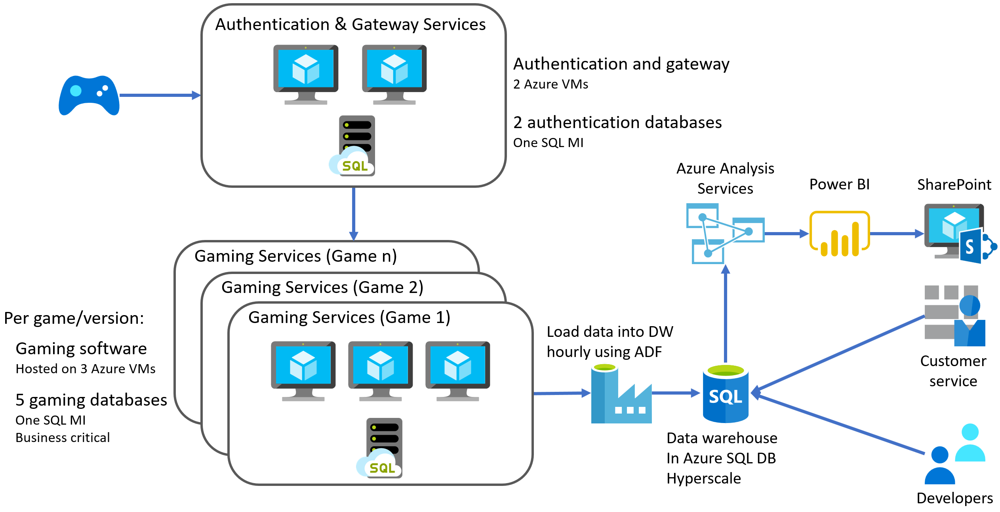
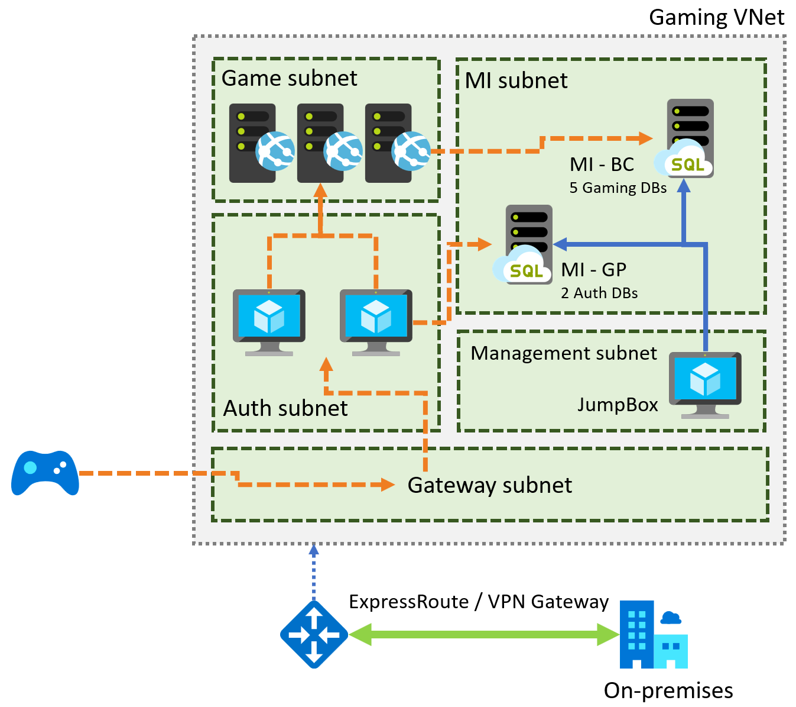

Migrating SQL databases to Azure

Whiteboard design session trainer guide

November 2020

Information in this document, including URL and other Internet Web site references, is subject to change without notice. Unless otherwise noted, the example companies, organizations, products, domain names, e-mail addresses, logos, people, places, and events depicted herein are fictitious, and no association with any real company, organization, product, domain name, e-mail address, logo, person, place or event is intended or should be inferred. Complying with all applicable copyright laws is the responsibility of the user. Without limiting the rights under copyright, no part of this document may be reproduced, stored in or introduced into a retrieval system, or transmitted in any form or by any means (electronic, mechanical, photocopying, recording, or otherwise), or for any purpose, without the express written permission of Microsoft Corporation.

Microsoft may have patents, patent applications, trademarks, copyrights, or other intellectual property rights covering subject matter in this document. Except as expressly provided in any written license agreement from Microsoft, the furnishing of this document does not give you any license to these patents, trademarks, copyrights, or other intellectual property.

The names of manufacturers, products, or URLs are provided for informational purposes only and Microsoft makes no representations and warranties, either expressed, implied, or statutory, regarding these manufacturers or the use of the products with any Microsoft technologies. The inclusion of a manufacturer or product does not imply endorsement of Microsoft of the manufacturer or product. Links may be provided to third party sites. Such sites are not under the control of Microsoft and Microsoft is not responsible for the contents of any linked site or any link contained in a linked site, or any changes or updates to such sites. Microsoft is not responsible for webcasting or any other form of transmission received from any linked site. Microsoft is providing these links to you only as a convenience, and the inclusion of any link does not imply endorsement of Microsoft of the site or the products contained therein.

© 2020 Microsoft Corporation. All rights reserved.

Microsoft and the trademarks listed at <https://www.microsoft.com/en-us/legal/intellectualproperty/Trademarks/Usage/General.aspx> are trademarks of the Microsoft group of companies. All other trademarks are property of their respective owners.

**Contents**

- [Trainer information](#trainer-information)
  - [Role of the trainer](#role-of-the-trainer)
  - [Whiteboard design session flow](#whiteboard-design-session-flow)
  - [Before the whiteboard design session: How to prepare](#before-the-whiteboard-design-session-how-to-prepare)
  - [During the whiteboard design session: Tips for an effective whiteboard design session](#during-the-whiteboard-design-session-tips-for-an-effective-whiteboard-design-session)
- [Migrating SQL databases to Azure whiteboard design session student guide](#migrating-sql-databases-to-azure-whiteboard-design-session-student-guide)
  - [Abstract and learning objectives](#abstract-and-learning-objectives)
  - [Step 1: Review the customer case study](#step-1-review-the-customer-case-study)
    - [Customer situation](#customer-situation)
    - [Customer needs](#customer-needs)
    - [Customer objections](#customer-objections)
    - [Infographic for common scenarios](#infographic-for-common-scenarios)
  - [Step 2: Design a proof of concept solution](#step-2-design-a-proof-of-concept-solution)
  - [Step 3: Present the solution](#step-3-present-the-solution)
  - [Wrap-up](#wrap-up)
  - [Additional references](#additional-references)
- [Migrating SQL databases to Azure whiteboard design session trainer guide](#migrating-sql-databases-to-azure-whiteboard-design-session-trainer-guide)
  - [Step 1: Review the customer case study](#step-1-review-the-customer-case-study-1)
  - [Step 2: Design a proof of concept solution](#step-2-design-a-proof-of-concept-solution-1)
  - [Step 3: Present the solution](#step-3-present-the-solution-1)
  - [Wrap-up](#wrap-up-1)
  - [Preferred target audience](#preferred-target-audience)
  - [Preferred solution](#preferred-solution)
  - [Checklist of preferred objection handling](#checklist-of-preferred-objection-handling)
  - [Customer quote (to be read back to the attendees at the end)](#customer-quote-to-be-read-back-to-the-attendees-at-the-end)

# Trainer information

Thank you for taking time to support the whiteboard design sessions as a trainer!

## Role of the trainer

An amazing trainer:

- Creates a safe environment in which learning can take place.

- Stimulates the participant's thinking.

- Involves the participant in the learning process.

- Manages the learning process (on time, on topic, and adjusting to benefit participants).

- Ensures individual participant accountability.

- Ties it all together for the participant.

- Provides insight and experience to the learning process.

- Effectively leads the whiteboard design session discussion.

- Monitors quality and appropriateness of participant deliverables.

- Effectively leads the feedback process.

## Whiteboard design session flow

Each whiteboard design session uses the following flow:

**Step 1: Review the customer case study (15 minutes)**

**Outcome**

Analyze your customer's needs.

- Customer's background, situation, needs and technical requirements

- Current customer infrastructure and architecture

- Potential issues, objectives and blockers

**Step 2: Design a proof of concept solution (60 minutes)**

**Outcome**

Design a solution and prepare to present the solution to the target customer audience in a 15-minute chalk-talk format.

- Determine your target customer audience.

- Determine customer's business needs to address your solution.

- Design and diagram your solution.

- Prepare to present your solution.

**Step 3: Present the solution (30 minutes)**

**Outcome**

Present solution to your customer:

- Present solution

- Respond to customer objections

- Receive feedback

**Wrap-up (15 minutes)**

- Review preferred solution

## Before the whiteboard design session: How to prepare

Before conducting your first whiteboard design session:

- Read the Student guide (including the case study) and Trainer guide.

- Become familiar with all key points and activities.

- Plan the point you want to stress, which questions you want to drive, transitions, and be ready to answer questions.

- Prior to the whiteboard design session, discuss the case study to pick up more ideas.

- Make notes for later.

## During the whiteboard design session: Tips for an effective whiteboard design session

**Refer to the Trainer guide** to stay on track and observe the timings.

**Do not expect to memorize every detail** of the whiteboard design session.

When participants are doing activities, you can **look ahead to refresh your memory**.

- **Adjust activity and whiteboard design session pace** as needed to allow time for presenting, feedback, and sharing.

- **Add examples, points, and stories** from your own experience. Think about stories you can share that help you make your points clearly and effectively.

- **Consider creating a "parking lot"** to record issues or questions raised that are outside the scope of the whiteboard design session or can be answered later. Decide how you will address these issues, so you can acknowledge them without being derailed by them.

***Have fun**! Encourage participants to have fun and share!*

**Involve your participants.** Talk and share your knowledge but always involve your participants, even while you are the one speaking.

**Ask questions** and get them to share to fully involve your group in the learning process.

**Ask first**, whenever possible. Before launching into a topic, learn your audience's opinions about it and experiences with it. Asking first enables you to assess their level of knowledge and experience, and leaves them more open to what you are presenting.

**Wait for responses**. If you ask a question such as, "What's your experience with (fill in the blank)?" then wait. Do not be afraid of a little silence. If you leap into the silence, your participants will feel you are not serious about involving them and will become passive. Give participants a chance to think, and if no one answers, patiently ask again. You will usually get a response.

# Migrating SQL databases to Azure whiteboard design session student guide

## Abstract and learning objectives

In this whiteboard design session, you work in a group to develop a plan for migrating on-premises VMs and SQL Server databases into a combination of IaaS and PaaS services in Azure. You provide guidance on performing assessments to reveal any feature parity and compatibility issues between the customer's SQL Server 2008 R2 databases and Azure's managed database offerings. You then design a solution for migrating their on-premises services, including VMs and databases, into Azure, with minimal down-time. Finally, you provide guidance on enabling some of the advanced SQL features available in Azure to improve security and performance in the customer's applications.

At the end of this whiteboard design session, you will be better able to design a cloud migration solution for business-critical applications and databases.

## Step 1: Review the customer case study

**Outcome**

Analyze your customer's needs.

Timeframe: 15 minutes

Directions: With all participants in the session, the facilitator/SME presents an overview of the customer case study along with technical tips.

1. Meet your table participants and trainer.

2. Read all of the directions for steps 1-3 in the student guide.

3. As a table team, review the following customer case study.

### Customer situation

Wide World Importers (WWI) is the developer of the popular Tailspin Toys brand of online video games. Founded in 2010, the company has experienced exponential growth since releasing the first installment of their most popular game franchise to include online multiplayer gameplay. They have since built upon this success by adding online capabilities to the majority of their game portfolio.

They decided to take a conservative approach while introducing online gameplay, hosting the gaming services on-premises using rented hardware. This approach allowed them to enter the online gaming market with a minimal upfront investment and lower risk. For each game, their gaming services setup consists of three virtual machines running the gaming software and five game databases hosted on a single SQL Server 2008 R2 Enterprise instance. They are using the Service Broker feature of SQL Server for sending messages between gaming databases. In addition to the dedicated gaming VMs and databases, their gaming services include authentication and gateway VMs and databases shared across all their games.

Molly Fischer, the CIO of WWI, stated that the response to adding online gameplay has far exceeded their initial estimates. While their games' increased popularity has been good for profitability, the rapid increase in demand for their services has made supporting the current setup problematic. Compounding this problem is the release schedule for new versions of their most popular games. They have a target schedule of releasing a new version every 12 - 18 months, which means adding new VMs and a database server for each new version they release, while also maintaining the services for all previous game versions. Each new release results in increased rental equipment costs, as well as a steadily growing workload on their already overburdened staff. Internally, they have discussed end-of-life scenarios for older game versions, but the number of players remains high for many of these games, so no decisions have been made about when to terminate support for those games.

At its foundation, WWI is a game development company, made up primarily of software developers. The few dedicated database and infrastructure resources they do have are struggling to keep up with an ever-expanding workload. Increasingly, game developers have had to step in to support the infrastructure, which is taking time away from game development and has resulted in several missed release timelines. Molly has expressed concerns over adding additional non-developer resources, as she feels this is outside of their core business. She hopes that migrating their services from on-premises to the cloud can alleviate some of their infrastructure management issues while simultaneously helping them refocus their efforts on delivering business value by releasing new and improved games.

WWI indicated that their current hardware rental agreement ends in three months, and they're hoping to avoid signing another contract by migrating their existing VMs into Azure. They understand three months is a short timeframe, but believe a lift-and-shift approach of their gaming service VMs might be possible if they dedicate the appropriate resources. They already have VM images for each of their games that could be used in the process. They would like to know more about what a lift-and-shift migration might involve so they can plan resource allocation accordingly. They are also interested in learning more about whether this approach will provide better scaling options for the VM and database deployments on a per-game basis. Currently, they use the same number of VMs and databases for each game and version but have frequently run into issues hosting more gamers for popular games. They would like the ability to scale up to meet demand on new releases and more popular games, while also being able to scale down for older and less popular games. They would also like to investigate the possibility of globally distributing their gaming services to address latency issues reported by gamers accessing their services from other locations worldwide.

Of great concern to the WWI leadership team is that SQL Server 2008 R2 is now beyond the end of support. They are interested in hearing more about fully-managed platform-as-a-service (PaaS) options in Azure for their databases. They lack employees with any real database administration skills, so they feel this would be an excellent first step towards reducing their infrastructure workload. They have requested assistance in assessing any compatibility issues between their current databases and PaaS options in Azure. They have read that the Service Broker feature of SQL Server is partially supported in Azure and would like clarification on whether they can continue to use this with the PaaS database offerings. They are using this functionality for several critical gaming processes, and cannot afford to lose this capability when migrating their gaming databases to the cloud. They have also stated that, at this time, they do not have the resources to rearchitect the gaming services to use an alternative message broker.

In addition to their gaming services, WWI is also interested in migrating their data warehouse and its associated services to the cloud. The data warehouse uses a Symmetric Multi-Processing (SMP) based architecture and is hosted on a dedicated SQL Server 2008 R2 instance. The data warehouse is presently around 20TB in size and is growing at a rate of about 250GB per month. They use the data warehouse to build SQL Server Analysis Services (SSAS) cubes and create reports using SQL Server Reporting Services (SSRS). The SSRS reports are deployed to sites in their SharePoint environment. They feel the data warehouse's performance is adequate for meeting the requirement of presenting data to business users via BI components, such as SSAS cubes, so they indicated a desire to stick with the current architecture, if possible. They do not believe the existing data warehouse requires a Massively Parallel Processing (MPP) architecture at this time. They collect numerous game telemetry data points, including remote monitoring and analysis of game servers and user telemetry (i.e., data on players' behavior, such as their interaction with games and other players). Code embedded in the gaming software transmits data to the gaming databases. Telemetry data is then loaded into the data warehouse hourly using SQL Server Integration Services (SSIS) packages. They also noted that their customer service personnel and developers frequently connect to the data warehouse for various activities.

They also mentioned some reports that are run directly against the gaming databases to analyze user telemetry and gaming metrics in near real-time. While there are not many of these reports, they are essential to the developers and business users. They have noticed that at times of peak gaming activity, running these reports can be very slow, and they have occasionally seen impacts on gaming performance. They are interested to learn if there is any way they can continue to run these reports, but do it in a way that will alleviate the performance impact they've experienced.

WWI is excited to learn more about how migrating to the cloud can improve its overall processes and address the concerns and issues with its on-premises setup. They are looking for a proof-of-concept (PoC) for migrating their gaming VMs and databases into the cloud. With an end goal of migrating their entire service to Azure, the WWI engineering team is also interested in understanding better what their overall architecture will look like in the cloud.

To help you better understand their current environment, WWI has provided the following architecture diagram of their on-premises gaming services implementation.

### Customer needs

1. We want to migrate all our gaming services infrastructure into the cloud, using PaaS services where possible. We would like to know if this can be accomplished in three months to avoid renewing our equipment rental contract.

2. In addition to our gaming services, we would like to migrate our existing data warehouse to Azure to take advantage of the ability to scale out along with some new SQL features available there. The current data warehouse performs well with an SMP-based architecture, so we would like to keep that, if possible. As part of this request, we would like to know more about:

   - Adding the ability to scale out the data warehouse to serve more requests.
   - The migration or upgrade path for our SSIS packages, SSAS cubes, and SSRS reports.

3. We want recommendations on how to minimize migration costs as much as possible.

4. We want to improve our databases' security posture and learn more about potential vulnerabilities and compliance issues.

5. We have had complaints of high latency from gamers in other regions throughout the world, along with reports that players cannot join games during peaks of high usage. By migrating our gaming services to the cloud, we are looking to improve the overall gaming experience, including:

   - Reducing latency for gamers accessing our services from various places around the world.
   - Improving our ability to host more players during peak times or when new game releases.
   - Adding redundancy to ensure high-availability for our gaming services.

6. In the event of a regional outage, we would like to resume gaming services within minutes and recover the data warehouse within 48 hours.

### Customer objections

1. It appears that there are multiple options for hosting SQL databases in Azure. What are all the different options, and how do they differ? Do they all support the same features as an on-premises SQL Server instance, or are there unsupported features we should be aware of before migrating? Will we be able to continue using Service Broker with a PaaS database in Azure?

2. Are there tools that allow us to evaluate which of the various SQL Database hosting options in Azure will work with our current SQL Server 2008 R2 databases? Is there a way we can test targeted workloads against other versions of SQL? Are there tools that can help us identify potential issues and incompatibilities before we attempt a migration?

3. In moving to the cloud, will we retain the ability to connect to and troubleshoot from our on-premises dev environment, while keeping our back-end networking fully isolated and only enabling talking to the front-end through a secured channel?

4. We want to avoid "vendor lock-in" when moving to the cloud. Will using PaaS services for hosting our databases allow us to have a valid exit strategy? Or should we stick to using VMs in Azure for hosting our databases?

5. Migrating to the cloud represents a significant change in how our organization operates. We are looking for guidance that can help us succeed in making this transition. Does Microsoft have any resources for this?

### Infographic for common scenarios

## Step 2: Design a proof of concept solution

**Outcome**

Design a solution and prepare to present the solution to the target customer audience in a 15-minute chalk-talk format.

Timeframe: 60 minutes

**Business needs**

Directions: With all participants at your table, answer the following questions and list the answers on a flip chart:

1. Who should you present this solution to? Who is your target customer audience? Who are the decision makers?

2. What customer business needs do you need to address with your solution?

**Design**

Directions: With all participants at your table, respond to the following questions on a flip chart:

_High-level architecture_

1. Without getting into the details (the following sections address the particulars), diagram your initial vision for handling the top-level requirements for the game databases, gaming services VMs, data warehouse, and associated services. You will refine this diagram as you proceed.

2. How can migration costs be minimized?

3. Is it possible to migrate WWI's gaming services within three months?

4. What functionality should you include in the PoC?

_Game databases_

1. What are the factors that WWI should consider when deciding between PaaS or IaaS options for hosting their SQL databases in Azure?

2. From the options for hosting SQL databases in Azure, which would you recommend for hosting their gaming databases, and why do you think that the best choice? What pricing tier would you recommend?

3. How would you handle the data migration? Provide step-by-step instructions from assessment to data migration.

4. What are some of the features available in Azure SQL Managed Instance that can help improve WWI's security posture?

5. Are there features of a PaaS database service that could help to reduce the impact of read-only reports running directly against their gaming databases?

_Gaming services_

1. How should WWI handle migrating their gaming services VMs into Azure?

2. What would you recommend for addressing the latency issues experienced by gamers from other regions of the world?

3. How should the ability to scale gaming services up or down be handled?

4. How can the gaming services be made highly-available?

_Data warehouse and reporting_

1. What would you recommend as the target platform for their data warehouse in Azure?

2. How could they read-scale out their data warehouse to serve more requests?

3. What is the upgrade path for their SSIS packages, SSAS cubes, and SSRS reports?

_Regional outages_

1. How can their gaming services be recovered within the specified RTO/RPO?

**Prepare**

Directions: With all participants at your table:

1. Identify any customer needs that are not addressed with the proposed solution.

2. Identify the benefits of your solution.

3. Determine how you will respond to the customer's objections.

Prepare a 15-minute chalk-talk style presentation to the customer.

## Step 3: Present the solution

**Outcome**

Present a solution to the target customer audience in a 15-minute chalk-talk format.

Timeframe: 30 minutes

**Presentation**

Directions:

1. Pair with another table.

2. One table is the Microsoft team and the other table is the customer.

3. The Microsoft team presents their proposed solution to the customer.

4. The customer makes one of the objections from the list of objections.

5. The Microsoft team responds to the objection.

6. The customer team gives feedback to the Microsoft team.

7. Tables switch roles and repeat Steps 2-6.

## Wrap-up

Timeframe: 15 minutes

Directions: Tables reconvene with the larger group to hear the facilitator/SME share the preferred solution for the case study.

## Additional references

||                                                                                                                            |
| ------------------------------------------------------------- | -------------------------------------------------------------------------------------------------------------------------- |
| **Description**                                               | **Link**                                                                                                                   |
| Choosing the right Azure SQL                 | <https://docs.microsoft.com/azure/azure-sql/azure-sql-iaas-vs-paas-what-is-overview>                                       |
| SQL Database Platform as a Service                            | <https://docs.microsoft.com/azure/azure-sql/database/sql-database-paas-overview>                                           |
| Business continuity                                           | <https://docs.microsoft.com/azure/azure-sql/database/business-continuity-high-availability-disaster-recover-hadr-overview> |
| High availability                                             | <https://docs.microsoft.com/azure/azure-sql/database/high-availability-sla>                                                |
| Automated backups                                             | <https://docs.microsoft.com/azure/azure-sql/database/automated-backups-overview>                                           |
| Long-term back retention                                      | <https://docs.microsoft.com/azure/azure-sql/database/long-term-retention-overview>                                         |
| Auto-failover                                                 | <https://docs.microsoft.com/azure/azure-sql/database/auto-failover-group-overview>                                         |
| Scale resources                                               | <https://docs.microsoft.com/azure/azure-sql/database/scale-resources>                                                      |
| Feature comparison: Azure SQL Database versus SQL Server      | <https://docs.microsoft.com/azure/azure-sql/database/features-comparison>                                                  |
| Service broker support in Azure SQL Managed Instance | <https://docs.microsoft.com/sql/database-engine/configure-windows/sql-server-service-broker?toc=%2Fazure%2Fazure-sql%2Ftoc.json&view=sql-server-ver15#service-broker-and-azure-sql-managed-instance> |
| Azure SQL Managed Instance                                    | <https://docs.microsoft.com/azure/azure-sql/managed-instance/sql-managed-instance-paas-overview>                           |
| Connectivity architecture for SQL MI                          | <https://docs.microsoft.com/azure/azure-sql/managed-instance/connectivity-architecture-overview>                           |
| Connecting an app to SQL MI                                   | <https://docs.microsoft.com/azure/azure-sql/managed-instance/connect-application-instance>                                 |
| Azure SQL Database service tiers                              | <https://docs.microsoft.com/azure/azure-sql/database/service-tiers-general-purpose-business-critical>                      |
| Getting started with Azure SQL MI                             | <https://docs.microsoft.com/azure/azure-sql/managed-instance/quickstart-content-reference-guide>                           |
| Database Migration Guide                                      | <https://aka.ms/sqlmigrationguide>                                                                                      |
| Database Migration Assistant                                  | <https://docs.microsoft.com/sql/dma/dma-overview?view=azuresqldb-mi-current>                                               |
| Azure Database Migration Service                              | <https://docs.microsoft.com/azure/dms/dms-overview>                                                                        |
| Migrate SQL Server to an Azure SQL Managed Instance  - Overview         | <https://docs.microsoft.com/azure/azure-sql/migration-guides/managed-instance/sql-server-to-managed-instance-overview>                                                         |
Migrate SQL Server to an Azure SQL Managed Instance  - Guide         | <https://docs.microsoft.com/azure/azure-sql/migration-guides/managed-instance/sql-server-to-managed-instance-guide>                                                         |
| Migrate SQL Server to an Azure SQL Managed Instance using DMS | <https://docs.microsoft.com/azure/dms/tutorial-sql-server-managed-instance-online?view=sql-server-2017>                    |
| Azure SQL Database pricing                                    | <https://azure.microsoft.com/pricing/details/sql-database/managed>                                                         |
| Overview of Azure SQL Database security capabilities          | <https://docs.microsoft.com/azure/azure-sql/database/security-overview>                                                    |
| Azure Defender for SQL                                       | <https://docs.microsoft.com/azure/azure-sql/database/azure-defender-for-sql>                                               |
| Data discovery and classification                             | <https://docs.microsoft.com/azure/azure-sql/database/data-discovery-and-classification-overview>                           |
| SQL Vulnerability Assessment service                          | <https://docs.microsoft.com/azure/azure-sql/database/sql-vulnerability-assessment>                                         |
| Threat detection                                              | <https://docs.microsoft.com/azure/azure-sql/database/threat-detection-overview>                                            |
| SQL Database Read Scale-Out                                   | <https://docs.microsoft.com/azure/azure-sql/database/read-scale-out>                                                       |
| RDL Migration Tool for migrating SSRS reports to Power BI | <https://github.com/microsoft/RdlMigration> |
| Cloud Adoption Framework for Azure | <https://docs.microsoft.com/azure/cloud-adoption-framework/overview> |
| Azure Migrate | <https://docs.microsoft.com/azure/migrate/migrate-services-overview> |

# Migrating SQL databases to Azure whiteboard design session trainer guide

## Step 1: Review the customer case study

- Check in with your table participants to introduce yourself as the trainer.

- Ask, "What questions do you have about the customer case study?"

- Briefly review the steps and timeframes of the whiteboard design session.

- Ready, set, go! Let the table participants begin.

## Step 2: Design a proof of concept solution

- Check in with your tables to ensure that they are transitioning from step to step on time.

- Provide some feedback on their responses to the business needs and design.

  - Try asking questions first that will lead the participants to discover the answers on their own.

- Provide feedback for their responses to the customer's objections.

  - Try asking questions first that will lead the participants to discover the answers on their own.

## Step 3: Present the solution

- Determine which table will be paired with your table before Step 3 begins.

- For the first round, assign one table as the presenting team and the other table as the customer.

- Have the presenting team present their solution to the customer team.

  - Have the customer team provide one objection for the presenting team to respond to.

  - The presentation, objections, and feedback should take no longer than 15 minutes.

  - If needed, the trainer may also provide feedback.

## Wrap-up

- Have the table participants reconvene with the larger session group to hear the facilitator/SME share the following preferred solution.

## Preferred target audience

Molly Fischer, Chief Information Officer (CIO), Wide World Importers

The primary audience is business and technology decision-makers. From the case study scenario, it would include the Director of Analytics. Usually, we talk to the infrastructure managers who report to the chief information officer (CIO), or to application sponsors, such as a line of business (LOB) vice president (VP), chief marketing officer (CMO), or to those who represent the business unit IT or developers who report to application sponsors.

## Preferred solution

_High-level architecture_

1. Without getting into the details (the following sections address the particulars), diagram your initial vision for handling the top-level requirements for the game databases, gaming services VMs, data warehouse, and associated services. You will refine this diagram as you proceed.

   After running the Microsoft Data Migration Assistant assessments against their gaming databases, WWI found that Azure SQL Managed Instance would allow them to host their databases in a fully-managed Azure PaaS service. SQL MI will enable them to accomplish this without making changes to their databases, allowing them to shift their focus back to game development and not spend as much time worrying about administering databases. To minimize downtime, they decided to use the Azure Database Migration Service's online data migration capabilities.

   

   From a high level, their authentication and gateway services VMs will be migrated into Azure VMs using Azure Migrate. The two back-end authentication databases will be moved to a single Azure SQL MI General purpose service tier. Authentication services will be shared among games within the same region. Their gaming software VMs will be migrated to Azure VMs, again using Azure Migrate, and associated with a single SQL MI instance running the five gaming databases. This setup will be repeated for each game. The game and authentication databases will be migrated using the Azure Database Migration Service's online migration option for minimal downtime.

   In more detail, for each game, an isolated VNet will be created, with subnets for the game service, managed instances, authorization services, management, and a Gateway subnet, as displayed in the diagram below.

   

   Their data warehouse will be migrated using the Database Migration Service (DMS) offline migration option. The target platform will be Azure SQL Database (Hyperscale) to accommodate the large amount of data they currently have and facilitate serving more requests. Movement of telemetry data from the gaming databases into the data warehouse will be handled using the Azure-SSIS Integration Runtime in Azure Data Factory (ADF). Data can be scheduled to run hourly in ADF, just as with their existing SSIS packages. Azure Analysis Services (Azure AS) will be used for data modeling in the cloud from the data warehouse.

   Because SSRS currently has no direct cloud-based equivalent, the customer's reports will be rewritten into paginated reports using Microsoft Power BI. Reports will be sent to SharePoint running on an Azure VM, backed by another SQL MI General-purpose instance.

   On-premises users, developers, and customer service personnel will connect to Azure resources using an ExpressRoute connection or VNet peering for troubleshooting and accessing reports.

   _The preferred solution is just one of many viable options._

2. How can migration costs be minimized?

   _Azure Hybrid Benefit_

   The [Azure Hybrid Benefit](https://azure.microsoft.com/pricing/hybrid-benefit/) for SQL Server will provide a cost-effective path for migrating their SQL Server databases to Azure. It allows them to use their existing SQL Server licenses with Software Assurance to pay a reduced rate when migrating to the cloud. WWI could save up to 55 percent by taking advantage of the Azure Hybrid Benefit.

   _Prepay for reserved capacity_

   It is also recommended that the customer prepay for compute resources with [reserved capacity](https://docs.microsoft.com/azure/azure-sql/database/reserved-capacity-overview) to save compared to pay-as-you-go prices. With Azure SQL Database reserved capacity, they would make an upfront commitment on SQL Database for one or three years to get a significant discount on the compute costs, saving them up to 80 percent.

   _Azure Database Migration Service_

   [Azure Database Migration Service](https://docs.microsoft.com/azure/dms/dms-overview) can be used to reduce the cost and complexity of their cloud migration by providing a single comprehensive service instead of multiple tools.

   _Azure Migrate_

   [Azure Migrate](https://docs.microsoft.com/azure/migrate/migrate-services-overview) provides a centralized hub for assessment and migration to Azure. There are no tool usage charges for migration for 180 days, from the time replication is started for a VM. Using Azure Migrate would provide WWI time to complete their migration, while only paying for the storage and network resources used in replication, and for compute charges consumed during test migrations.

3. Is it possible to migrate WWI's gaming services within three months?

   While there are no guarantees that they could complete the migration in a three-month window, there are steps WWI could take and tools they could use to improve their chances of success.

   First, the WWI team would need to have dedicated resources assigned to the migration project. They could also benefit from bringing in a Microsoft partner with experience in performing large cloud migrations to help speed up the process and improve their chances of meeting such a tight timeline.

   To migrate their on-premises gaming, authentication, and gateway VMs, WWI could use [Azure Migrate](https://docs.microsoft.com/azure/migrate/migrate-services-overview). Azure Migrate provides a central hub to track discovery, assessment, and migration of on-premises apps and workloads and private and public cloud VMs to Azure. [Azure Site Recovery](https://docs.microsoft.com/azure/site-recovery/site-recovery-overview) (ASR) could also be used to replicate their on-premises VMs into Azure VMs, but is not the recommended approach, as it is designed for business continuity and disaster recovery. It can be used, however, to manage replication for on-premises VMs into Azure.

   Using the [Azure Database Migration Service](https://docs.microsoft.com/azure/dms/dms-overview) (DMS) can help simplify the process of database migration. For their gaming and authentication databases, DMS provides a simple tool for migrating a large number of databases into Azure SQL Managed Instance, with minimal time and effort. DMS could be used to migrate their database while remaining online, which will cut down on time required to prepare and manage the cutover to online services. Using SQL MI will also help to minimize the amount of application and database changes needed to get up and running the cloud quickly.

   DMS could also be used to handle the migration of the data warehouse into Azure SQL DB Hyperscale. However, given the considerable data size (20TB), it would not be able to handle online migration. The recommended approaches for migrating to Hyperscale are using DMS in offline mode or using the [Smart Bulk Copy tool](https://github.com/yorek/smartbulkcopy) to achieve better throughput.

4. What functionality should you include in the PoC?

   For the PoC, we should include the following:

   - All assets required for a hosting a single game in Azure:

     - Authentication and gateway services:
       - VMs should be hosted on Azure virtual machines.
       - The two authentication databases should be hosted on a single SQL MI General Purpose tier instance.
     - The five gaming databases hosted on a single SQL MI Business Critical tier instance.
     - The three gaming services virtual machines migrated to Azure VMs.

   - An upgraded data warehouse:

     Hosted on Azure SQL DB Hyperscale to accommodate the database's size and the number of users connecting.
     - Upgraded SSIS, SSAS, and SSRS.
     - Implement new features in Azure SQL DB, such as table compression, Transparent Data Encryption, and Clustered ColumnStore Indexing.

   - VNet isolation:

     - Inherent with SQL MI.
     - Management subnet for managing the databases.
     - Gaming services VNet for hosting gaming services VMs, with VNet peering back to SQL MI VNet.
     - Secure channel for connecting to the databases from on-premises development machines for troubleshooting.

_Game databases_

1. What are the factors that WWI should consider when deciding between PaaS or IaaS options for hosting their SQL databases in Azure?

   Several factors should help drive their decision to choose PaaS or IaaS for hosting their SQL databases in Azure:

   - **Cost**: Both PaaS and IaaS options include a base price that covers underlying infrastructure and licensing. However, with the IaaS option, they would need to invest additional time and resources for the management of databases, some of which can be simplified by using the [SQL VM resource provider (RP)](https://docs.microsoft.com/azure/azure-sql/virtual-machines/windows/sql-vm-resource-provider-register?tabs=azure-cli%2Cbash). With PaaS, many administration features are included in the price.

   - **Administration**: PaaS options will reduce the amount of time they need to spend administering databases. However, it also limits the range of custom administration tasks and scripts they will be able to perform or run. An important option to note for helping to simplify the administration of IaaS installations is the ability to register SQL Server VMs in Azure with the [SQL VM resource provider (RP)](https://docs.microsoft.com/azure/azure-sql/virtual-machines/windows/sql-vm-resource-provider-register?tabs=azure-cli%2Cbash). The SQL VM RP unlocks automated patching, automated backups, as well as monitoring and manageability capabilities. For a customer such as WWI who have multiple SQL VMs, there is also an option for [bulk registering SQL virtual machines](https://docs.microsoft.com/azure/azure-sql/virtual-machines/windows/sql-vm-resource-provider-bulk-register).

   - **Service-Level Agreement**: Both IaaS and PaaS provide high, industry-standard SLAs. The PaaS option guarantees a 99.99% SLA. IaaS guarantees a 99.95% SLA for infrastructure, meaning they may need to implement additional mechanisms to ensure their databases' availability.

   - **Time to move to Azure**: SQL Server on an Azure VM will be an exact match of their environment, so migration from on-premises to Azure SQL VMs would be no different than moving their on-premises databases to another on-premises database server. SQL Managed Instance also enables straightforward migration. However, there might be some changes that they would need to apply before they can migrate to a managed instance. SQL DB can be a good target, but there are more feature and compatibility concerns, so this could be the slowest option, depending on the on-premises databases.

2. From the options for hosting SQL databases in Azure, which would you recommend for hosting their gaming databases, and why do you think that the best choice? What pricing tier would you recommend?

   The recommended option for hosting their gaming databases in Azure is to use Azure SQL Managed Instance in the Business Critical service tier.

   The customer expressed the desire to use a PaaS offering, if possible, and SQL MI provides a fully-managed platform, with the PaaS database service's benefits. In combination with the Database Migration Service, it provides a simple way to migrate their databases into Azure, with minimal downtime. Given the customer's large number of databases and the use of the Service broker feature, SQL MI provides an optimal solution, while also reducing the cost and management overhead associated with using SQL Server on VMs. The use of Service broker will prevent them from using SQL DB without first making changes to the database architecture. Also, SQL MI provides the VNet isolation and added security the customer has requested.

   The customer has stated that they do not have the infrastructure or database resources required to support their existing structure and do not wish to add more resources to the team. Their desire to reduce the amount of infrastructure they are managing and reduce costs moves the decision away from SQL on VMs.

   The Business Critical service tier is designed for applications that require the highest performance and HA requirements. Given the nature of the gaming applications and databases, the customer should use the service tier that provides them with the lowest IO latency, highest availability, and best performance possible. The inclusion of a built-in read-only replica could also help take some workload off the primary databases for reporting and read-only workloads, at no additional cost.

3. How would you handle the data migration? Provide step-by-step instructions from assessment to data migration.

   Data migration should be handled using the Azure Database Migration Service's online data migration capabilities, which meets the customer's minimal downtime requirement. Data platform migrations should be approached with the same rigor and processes as a full software or hardware project, meaning a robust methodology is required for success.

   In planning their migration project, they should consider the process similar to that shown in the following graphic:

   

   _Pre-migration_:

   - **Discover**: Inventory your source database assets and perform an application stack discovery.
   - **Assess**: Assess source workloads and fix recommendations.
   - **Convert**: Convert the source schema to work in the target environment. This is only relevant for heterogeneous migrations.

   _Migration_:

   - **Migrate schema, data, and objects**: Migrate the source schema and then migrate the source data to the target.
   - **Sync data**: Sync your target schema and data with the source. This is only relevant for minimal-downtime migrations.
   - **Cutover**: Cutover from the source to the target environment. This is only relevant for minimal-downtime migrations.

   _Post-migration_:

   - **Remediate applications**: Iteratively make any necessary changes to your applications.
   - **Perform Tests**: Iteratively run functional and performance tests.
   - **Optimize**: Based on the tests you performed, address any performance issues, and then retest to confirm the performance improvements.

4. What are some of the features available in Azure SQL Managed Instance that can help improve WWI's security posture?

   SQL MI includes numerous security tools that could be leveraged by WWI, including:

   - [SQL Database Advance Data Security](https://docs.microsoft.com/azure/azure-sql/database/advanced-data-security) (ADS) provides advanced SQL security capabilities, including functionality for discovering and classifying sensitive data, surfacing and mitigating potential database vulnerabilities, and detecting anomalous activities that could indicate threats to databases.

   - The [SQL Data Discovery and Classification](https://docs.microsoft.com/sql/relational-databases/security/sql-data-discovery-and-classification?view=azuresqldb-mi-current&tabs=t-sql) feature of ADS is a new tool for discovering, classifying, labeling & reporting the sensitive data in databases. It introduces a set of advanced services, forming a new SQL Information Protection paradigm aimed at protecting the data in databases, not just the database.

   - The [SQL Vulnerability Assessment service](https://docs.microsoft.com/azure/azure-sql/database/sql-vulnerability-assessment) provides visibility into the security state of a database and includes actionable steps to resolve security issues and enhance database security.

   - [Advanced Threat Detection](https://docs.microsoft.com/azure/azure-sql/database/threat-detection-overview) for Azure SQL Managed Instance detects anomalous activities indicating unusual and potentially harmful attempts to access or exploit databases.

   - [Transparent Data Encryption](https://docs.microsoft.com/azure/azure-sql/database/transparent-data-encryption-tde-overview?tabs=azure-portal) encrypts data at rest. This encryption will help protect them from the potential of malicious parties obtaining data from physical media, such as drives or backup tapes.

   - [Dynamic Data Masking](https://docs.microsoft.com/azure/azure-sql/database/dynamic-data-masking-overview) (DDM) limits sensitive data exposure by masking it to non-privileged users. This feature helps prevent unauthorized access to sensitive data by enabling customers to designate how much of the sensitive data to reveal with minimal impact on the application layer. It is a policy-based security feature that hides the sensitive data in the result set of a query over designated database fields, while the data in the database is not changed.

   - [Row-level security](https://docs.microsoft.com/sql/relational-databases/security/row-level-security?view=azuresqldb-mi-current) enables you to control access to rows in a database table based on the characteristics of the user executing a query (such as by group membership or execution context). Row-level security (RLS) simplifies the design and coding of security in your application. RLS enables you to implement restrictions on data row access. For example, it can ensure that workers can access only the data rows pertinent to their department or restrict data access to only the relevant data.

5. Are there features of a PaaS database service that could reduce the impact of read-only reports running directly against their gaming databases?

   Each database in the SQL MI Business Critical tier is automatically provisioned with several AlwaysON replicas to support the availability SLA. These replicates enable a capability called [**Read Scale-Out**](https://docs.microsoft.com/azure/azure-sql/database/read-scale-out), which provides the load balancing of read-only workloads using the capacity of one read-only replica. Using Read Scale-Out means read-only workloads can be isolated from the primary read-write workload without affecting its performance.

   The feature is intended for applications that include logically separated read-only workloads, such as analytics. Therefore, they could gain performance benefits using this additional capacity at no extra cost.

_Gaming services_

1. How should WWI handle migrating their gaming services VMs into Azure?

   WWI should use [Azure Migrate](https://docs.microsoft.com/azure/migrate/migrate-services-overview) to lift-and-shift their gaming service VMs into Azure. Azure Migrate provides a central hub to track discovery, assessment, and migration of on-premises apps and workloads and VMs to Azure. The [Azure Migrate: Server Migration tool](https://docs.microsoft.com/azure/migrate/common-questions-server-migration) is an optimized, purpose-built for server migrations to Azure. It provides a mechanism for which users don't need to learn about concepts and scenarios that are not directly relevant to conducting migrations.

   They could also consider using [Azure Site Recovery](https://docs.microsoft.com/azure/site-recovery/site-recovery-overview) (ASR) to replicate their on-premises VMs into Azure VMs, but is not the recommended approach, as it is designed specifically for business continuity and disaster recovery. It could be used, however, to manage replication for on-premises VMs into Azure.

   > Note: The Azure Migrate: Server Migration tool uses some back-end Site Recovery functionality for performing lift-and-shift migrations of some on-premises machines.

2. What would you recommend for addressing the latency issues experienced by gamers from other regions of the world?

   To address the latency issues reported by gamers, they should look at using multiple regions worldwide. By deploying their services closer to where players are, they can reduce the latency they experience when accessing the online gaming services.

3. How should the ability to scale gaming services up or down be handled?

   Scaling occurs on two levels for the gaming services, one for VMs and another for databases.

   First, for the gaming software virtual machines, they should consider using VM scale sets for each game. Scale sets will allow them to create and manage a group of identical, load-balanced VMs, the number of which can be automatically increased or decreased in response to demand or a defined schedule.

   For the databases, the number of vCores assigned to the managed instance can be increased or decreased. However, this is not an automatic process and can be slow and potentially cause downtime. Another option is to add another managed instance and distribute the workload among more instances.

4. How can the gaming services be made highly-available?

   Virtual machine scale sets can be used to provide high-availability for the gaming software and authentication VMs. To protect against data center failures, they could also create scale sets that use Availability Zones.

   Azure SQL Managed Instance comes with built-in high-availability. Transactional replication could be used to keep data in sync between multiple regions.

_Data warehouse and reporting_

1. What would you recommend as the target platform for their data warehouse in Azure?

   For their data warehouse, they could use either Azure Synapse Analytics or Azure SQL Database ([Hyperscale service tier](https://docs.microsoft.com/azure/azure-sql/database/service-tier-hyperscale)). The Hyperscale service tier is required due to the large size of its existing data warehouse.

   Given the customer's requirements and desire to retain their existing SMP-based architecture, migrating to Azure SQL Database (Hyperscale service tier) is recommended. They also stated that moving to an MPP-based system was unnecessary at this time. Migrating to Azure SQL DB Hyperscale would provide maximum compatibility with their existing SQL Server 2008 R2 data warehouse without making significant architectural changes. With the customer's lack of employees with DBA skills, this would simplify the migration. Migrating to Azure Synapse Analytics, on the other hand, could require some re-architecting. The customer also stated that their developers and customer service personnel connect directly to the data warehouse for reporting, troubleshooting, and other activities. Azure Synapse Analytics allows a maximum of four to 128 concurrent queries, depending on the service level selected. The maximum concurrent queries limit could cause issues if many users are hitting the data warehouse concurrently.

2. How could they read-scale out their data warehouse to serve more requests?

   The Hyperscale service tier is a highly scalable storage and compute performance tier that leverages the Azure architecture to scale out the storage and compute resources for an Azure SQL Database substantially beyond the limits available for the General Purpose and Business Critical service tiers.

   SQL DB Hyperscale provides the ability to scale both out and up rapidly. Scaling out involves provisioning one or more read-only nodes for offloading read-only workloads and for use as hot-standbys. Read Scale-Out uses the `ApplicationIntent` argument in the connection string to direct requests to a read-only secondary replica of the Hyperscale database. Scaling up involves scaling up compute resources to accommodate heavy workloads, and then scaling back down when the additional resources are not needed.

3. What is the upgrade path for their SSIS packages, SSAS cubes, and SSRS reports?

    upgrade paths")

   _SSIS_

   SSIS will be replaced with the Azure-SSIS Integration Runtime in Azure Data Factory. Typically, SSIS packages can be moved into ADF using a simple lift-and-shift approach using SQL Server Data Tools (SSDT) or SQL Server Management Studio (SSMS) to deploy and run the SSIS packages.

   Alternatively, SSIS could be deployed using SQL Server on an Azure VM.

   _SSAS cubes_

   Azure Analysis Services (Azure AS) is a PaaS version of SSAS on-premises. Tabular models can be migrated from SSAS to Azure AS using Visual Studio.

   Alternatively, SSAS could be deployed using SQL Server on an Azure VM.

   _SSRS_

   There is no direct PaaS equivalent of SSRS. However, there are several options available for continuing to use the SSRS reports. The most straightforward, and possibly easiest, option is for WWI to migrate their SSRS server to run on an Azure VM (IaaS). Another approach is to rewrite their reports as paginated reports in Microsoft Power BI. If opting to move their reports into Power BI, customers should be aware of the [RDL Migration Tool](https://github.com/microsoft/RdlMigration), which can be used to assist with migrating existing SSRS reports from local servers to a Power BI workspace.

_Regional outages_

1. How can their gaming services be recovered within the specified RTO/RPO?

   To protect against data center failures and regional outages, they should use [Availability Zones](https://docs.microsoft.com/azure/availability-zones/az-overview) for their virtual machines. Availability Zones are unique physical locations within an Azure region, each comprised of one or more datacenters equipped with independent power, cooling, and networking. The physical separation of Availability Zones within a region protects applications and data from datacenter failures. Zone-redundant services replicate your applications and data across Availability Zones to protect from single-points-of-failure. With Availability Zones, Azure offers an industry best 99.99% VM uptime SLA.

   For their gaming databases, they should configure [auto-failover groups](https://docs.microsoft.com/azure/azure-sql/database/auto-failover-group-overview) for the Azure SQL Managed Instances. Using auto-failover groups with an automatic failover policy, any outage that impacts one or several of the group's databases results in automatic failover. Also, auto-failover groups provide read-write and read-only listener endpoints that remain unchanged during fail-overs. Whether you use manual or automatic failover activation, failover switches all secondary databases in the group to the primary. After the database failover completes, the DNS record is automatically updated to redirect the new region's endpoints.

   They should use the geo-restore recovery pattern to achieve the lowest possible RTO and RPO for their data warehouse. They would use geo-restore to recover the catalog and tenant databases from automatically maintained geo-redundant backups into an alternate recovery region. After the outage is resolved, they would use geo-replication to repatriate changed databases to their original region.

## Checklist of preferred objection handling

1. It appears that there are multiple options for hosting SQL databases in Azure. What are all the different options, and how do they differ? Do they all support the same features as an on-premises SQL Server instance, or are there unsupported features we should be aware of before migrating? Will we be able to continue using Service Broker with a PaaS database in Azure?

   There are indeed multiple options for hosting SQL databases in Azure. [Azure SQL](https://docs.microsoft.com/azure/azure-sql/azure-sql-iaas-vs-paas-what-is-overview) refers to a family of managed, secure, and intelligent products that use the SQL Server database engine in the Azure cloud. The options have some overlap, but each is geared towards specific use cases, scenarios, and [business motivations](https://docs.microsoft.com/azure/azure-sql/azure-sql-iaas-vs-paas-what-is-overview#business-motivations). Below, brief descriptions are provided describing the three Azure SQL options and general recommendations about when to use each.

   Azure documentation provides a [comparison table](https://docs.microsoft.com//azure/azure-sql/azure-sql-iaas-vs-paas-what-is-overview#comparison-table) that can be used to help drive the decision about which option to use. The docs also offer a [feature comparison between Azure SQL Database and Azure SQL Managed Instance](https://docs.microsoft.com/azure/azure-sql/database/features-comparison) to help in the decision-making process.

   _[Azure SQL Database (SQL DB)](https://docs.microsoft.com/azure/azure-sql/database/)_

   [SQL DB](https://docs.microsoft.com/azure/azure-sql/database/) is a fully-managed general-purpose relational database-as-a-service (DBaaS) platform in Azure. Built on the latest stable version of the Microsoft SQL Server Database Engine, it provides a high-performance, easy-to-use, reliable, and secure database that you can use without needing to manage infrastructure. It is available as a single database or an elastic pool, which is a collection of databases with a shared set of resources.

   SQL DB has additional features that are not available in on-premises SQL Server, such as built-in high-availability, intelligence, and management. It also provides options to quickly and easily scale up or out for greater power with no interruption.

   Architecturally, Azure SQL DB uses an isolated multi-tenant model and needs to share physical resources among all service clients. As such, server-level functionality is generally restricted or unsupported. Tools such as SQL Server Utility, SQL Trace, Profiler, and many `system` tables no longer apply and are not available. In their place, several views are available to provide diagnostic and health monitoring.

   Due to the architectural differences, some SQL Server features are different or unsupported in SQL DB. Differences include [Transact SQL (T-SQL) differences](https://docs.microsoft.com/azure/azure-sql/database/transact-sql-tsql-differences-sql-server), such as data types, functions, operators, statements, procedures, and system tables and views that are not supported. Unsupported features include distributed transactions, SQL Agent jobs, .NET CLR integration, Filestream, extended stored procedures, and Service broker.

   Azure SQL DB is best for new cloud-native applications or existing applications that want to use the latest stable SQL Server features. It is also recommended for teams that do not wish to employ configuration and database infrastructure management resources.

   _[Azure SQL Managed Instance (SQL MI)](https://docs.microsoft.com/azure/azure-sql/managed-instance/)_

   [SQL MI](https://docs.microsoft.com/azure/azure-sql/managed-instance/) is a fully-managed PaaS SQL Server Database Engine Instance hosted in Azure that provides _near_ 100% compatibility with on-premises SQL Server database instances. Unlike SQL DB, it does not use an isolated multi-tenant model. Instead, it supplies a native virtual network (VNet) implementation that addresses many common isolation and security concerns of on-premises SQL Server customers. As such, it is the best PaaS option for migrating existing SQL Server databases to the cloud.

   The managed instance model allows existing SQL Server customers to lift-and-shift their on-premises applications to the cloud with minimal application and database changes. As a deployment option of Azure SQL Database, it preserves all the PaaS capabilities that drastically reduce management overhead and TCO. While the majority of on-premises SQL features are supported, there are some features, like Filestream, that are not available. Unlike SQL DB, SQL MI does support distributed transactions, SQL Agent jobs, .NET CLR integration, and [Service broker](https://docs.microsoft.com/sql/database-engine/configure-windows/sql-server-service-broker?toc=%2Fazure%2Fazure-sql%2Ftoc.json&view=sql-server-ver15).

   Azure SQL MI is best for new cloud-native applications or existing applications that want to use the latest stable SQL Server features and need to be migrated to the cloud with minimal changes. It is also recommended for teams that do not want to employ resources for configuration and management of database infrastructure.

   _[SQL Server on an Azure VM](https://docs.microsoft.com/azure/azure-sql/virtual-machines/)_

   Running [SQL Server on Azure VMs](https://docs.microsoft.com/azure/azure-sql/virtual-machines/) is an IaaS approach that would allow a 100% compatible transition of existing databases to the cloud, without any need for application changes. It works with any SQL Server version and edition on any machine size on Windows and Linux. SQL Server on an Azure VM provides a seamless, no-hassle method for moving SQL Server workloads from on-premises to the cloud. Teams will be freed from needing to manage on-premises hardware, but it does require teams to continue to manage the underlying infrastructure, including OS, database, and application patching. This option can also be more expensive with multiple databases and is more challenging to scale. High availability would come from using SQL Server Availability Groups.

   SQL Server on Azure VMs is a good choice when full control over the database is required, or when the source database uses features unsupported in Azure SQL DB and SQL MI, such as Filestream and file groups. SQL Server on Azure VMs is the recommended approach for teams that need to choose maintenance and patching schedules that work best for their business operations. Another benefit for customers running SQL Server 2008 R2 is that migrating their database to Azure VMs provides [free extended security updates](https://docs.microsoft.com/sql/sql-server/end-of-support/sql-server-end-of-life-overview?WT.mc_id=akamseos&view=sql-server-ver15#benefits-2) for up to three years of support beyond the July 2019 end of support cutoff.

2. Are there tools that allow us to evaluate which of the various SQL Database hosting options in Azure will work with our current SQL Server 2008 R2 databases? Is there a way we can test targeted workloads against other versions of SQL? Are there tools that can help us identify potential issues and incompatibilities before we attempt a migration?

   Microsoft provides multiple tools for assisting with cloud migrations and upgrades of databases.

   _[Database Experimentation Assistant (DEA)](https://docs.microsoft.com/sql/dea/database-experimentation-assistant-overview?view=sqlallproducts-allversions)_

   The [Database Experimentation Assistant](https://docs.microsoft.com/sql/dea/database-experimentation-assistant-overview?view=sqlallproducts-allversions) (DEA) is an A/B testing solution for SQL Server upgrades. It will assist in evaluating specific workloads against a targeted version of SQL Server or Azure SQL. DEA is not a migration tool but can help determine the appropriate target version of SQL Server or Azure SQL for migrations.

   DEA guides you through running A/B testing by completing three steps:

   - **Capture**: The first step of SQL Server A/B testing is to capture a trace on your source server. Trace files capture the entire query workload on that server.
   - **Replay**: The second step of SQL Server A/B testing is to replay the trace file captured on your target servers, and then collect extensive traces from the replay for analysis.
   - **Analysis**: The final step is to generate an analysis report using the replay traces. The analysis report can help you gain insight into the implications of the proposed change.

   Using the DEA analysis metrics, customers who are upgrading from an earlier version of SQL Server (starting with 2005) to a more recent version can identify compatibility errors, degraded queries and query plans, and other workload comparison data. The comparison data can lead to higher confidence and more successful upgrade experience.

   _[Database Migration Assistant (DMA)](https://docs.microsoft.com/sql/dma/dma-overview?view=sqlallproducts-allversions)_

   The [Data Migration Assistant](https://docs.microsoft.com/sql/dma/dma-overview?view=sqlallproducts-allversions) (DMA) enables you to upgrade to a modern data platform by detecting compatibility and feature parity issues that can impact an upgrade or migration to your target version of SQL Server or Azure SQL Database. DMA also provides recommendations on performance and reliability improvements you can make once your databases have been migrated to your target environment. It allows you to move your schema, data, and uncontained objects (SQL Agent jobs, SSIS packages, roles, users, and logins) from your source server to your target server.

   _[Azure Database Migration Service (DMS)](https://docs.microsoft.com/azure/dms/dms-overview?view=sqlallproducts-allversions)_

   The [Azure Database Migration Service](https://docs.microsoft.com/azure/dms/dms-overview?view=sqlallproducts-allversions) (DMS) is a fully managed service designed to enable seamless migrations from multiple database sources to Azure Data platforms with minimal downtime. It provides customers with a comprehensive, highly available migration solution.

   > When you migrate databases to Azure by using Azure Database Migration Service, you have the option of using an offline or online migration. With an offline migration, application downtime starts when the migration starts. With an online migration, downtime is limited to the time to cut over at the end of migration. Online migrations involve a cutover phase where the final transaction set needs to be applied to the target database. The application must also be configured to point to the new database. As a result, the process involves a minimal amount of downtime.

   The service uses the Data Migration Assistant to generate assessment reports that provide recommendations to guide you through the changes required before performing a migration. When you're ready to begin the migration process, the Azure Database Migration Service conducts all of the steps necessary, following best practices as determined by Microsoft.

   In addition to SQL database migrations, DMS can also be used for migrating other database types, such as MongoDB to Cosmos DB and MySQL and PostgreSQL migrations to the Azure Data Platform.

   _[SQL Server Migration Assistant (SSMA)](https://docs.microsoft.com/sql/ssma/sql-server-migration-assistant?view=sqlallproducts-allversions)_

   While not specifically applicable to this scenario, another tool to be aware of is the [SQL Server Migration Assistant](https://docs.microsoft.com/sql/ssma/sql-server-migration-assistant?view=sqlallproducts-allversions) (SSMA). SSMA is a tool designed to automate database migrations to SQL Server or SQL Database from Microsoft Access, DB2, MySQL, Oracle, and SAP ASE.

    For more information on specific tools corresponding to the different Azure SQL deployment models, refer to the [Azure SQL migration guides](https://aka.ms/sqlmigrationguide).

3. In moving to the cloud, will we retain the ability to connect to and troubleshoot from our on-premises dev environment, while keeping our back-end networking fully isolated and only enabling talking to the front-end through a secured channel?

   Yes, this is still possible after migrating your databases and applications to the cloud.

   With Azure SQL DB, the database can be added to an Azure VNet and configured with [Azure Private Link](https://docs.microsoft.com/azure/azure-sql/database/private-endpoint-overview).

   Azure SQL Managed Instance [natively provides full VNet isolation](https://docs.microsoft.com/azure/azure-sql/managed-instance/connectivity-architecture-overview). It is placed inside an Azure virtual network and in a subnet that is dedicated to managed instances. It is accessible via a secure private IP address to allow connectivity from inside its virtual network.

   Management and deployment services connect to a managed instance using a management endpoint that maps to an external load balancer. Traffic is routed to the nodes only if received on a predefined set of ports that only the managed instance's management components use. A built-in firewall on the nodes is set up to allow traffic only from Microsoft IP ranges. Certificates mutually authenticate all communication between management components and the management plane.

   Customer applications can connect to managed instances and query and update databases inside the virtual network, peered virtual network, or network connected by VPN or Azure ExpressRoute. This network must use an endpoint and a private IP address.

   To reduce some of the complexity of connecting to SQL MI, it is also possible to access SQL MI through a [secure public endpoint](https://docs.microsoft.com/azure/azure-sql/managed-instance/public-endpoint-overview). SQL MI has a dedicated public endpoint address, which is disabled by default. If enabled, the client-side outbound firewall and network security group rules limit outbound connectivity to this endpoint. It is recommended that the traffic be allowed to connect to limited to well-known IP addresses.

4. We want to avoid "vendor lock-in" when moving to the cloud. Will using PaaS services for hosting our databases allow us to have a valid exit strategy? Or should we stick to using VMs in Azure for hosting our databases?

   Yes, it is possible to use a PaaS database service and still avoid vendor lock-in. They could use [Transactional replication](https://docs.microsoft.com/azure/azure-sql/managed-instance/replication-between-two-instances-configure-tutorial) to replicate data into remote SQL Server databases, including those in another cloud vendor's cloud.

5. Migrating to the cloud represents a significant change in how our organization operates. We are looking for guidance that can help us succeed in making this transition. Does Microsoft have any resources for this?

   The Microsoft [Cloud Adoption Framework](https://docs.microsoft.com/azure/cloud-adoption-framework/overview) (CAF) for Azure contains proven guidance designed to help customers create and implement the business and technology strategies necessary to succeed in the cloud. It provides a set of tools, advice, and narratives that help shape technology, business, and people strategies for driving desired business outcomes during cloud adoption efforts.

   Using the Microsoft Cloud Adoption Framework for Azure best practices, organizations can better align their business and technical strategies to ensure success.

## Customer quote (to be read back to the attendees at the end)

"With Azure SQL Managed Instance and the Azure Database Migration Service, we were able to migrate our database workloads into the cloud with minimal downtime. With SQL MI, we have found a reliable, fully-managed cloud database that allows us to focus our efforts on adding business value, without having to worry about maintaining the underlying server hardware and operating systems."

Molly Fischer, CIO of Wide World Importers
